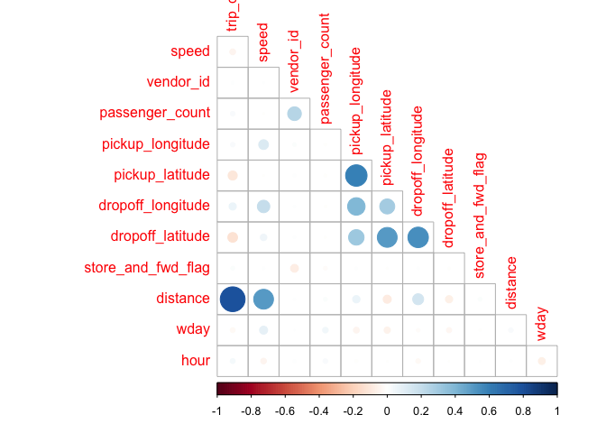
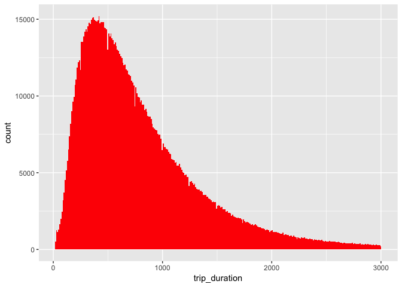
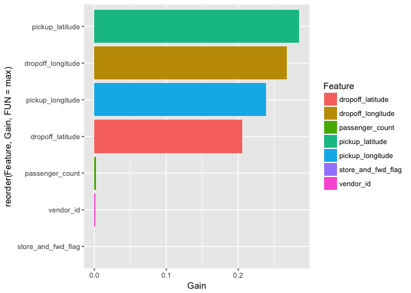

NYC analysis
================

This is an [R Markdown](http://rmarkdown.rstudio.com) Notebook. When you execute code within the notebook, the results appear beneath the code.

Try executing this chunk by clicking the *Run* button within the chunk or by placing your cursor inside it and pressing *Cmd+Shift+Enter*.

Loading libraries
-----------------

``` r
library('ggplot2')
library('tibble')
library('dplyr')
```

    ## 
    ## Attaching package: 'dplyr'

    ## The following objects are masked from 'package:stats':
    ## 
    ##     filter, lag

    ## The following objects are masked from 'package:base':
    ## 
    ##     intersect, setdiff, setequal, union

``` r
library('data.table')
```

    ## 
    ## Attaching package: 'data.table'

    ## The following objects are masked from 'package:dplyr':
    ## 
    ##     between, first, last

``` r
library('lubridate')
```

    ## 
    ## Attaching package: 'lubridate'

    ## The following objects are masked from 'package:data.table':
    ## 
    ##     hour, isoweek, mday, minute, month, quarter, second, wday,
    ##     week, yday, year

    ## The following object is masked from 'package:base':
    ## 
    ##     date

``` r
library('leaflet')
```

Input data
----------

``` r
train<-as_tibble(fread('nyc_data/train.csv'))
```

    ## 
    Read 12.3% of 1458644 rows
    Read 20.6% of 1458644 rows
    Read 29.5% of 1458644 rows
    Read 37.7% of 1458644 rows
    Read 49.4% of 1458644 rows
    Read 63.1% of 1458644 rows
    Read 71.3% of 1458644 rows
    Read 80.9% of 1458644 rows
    Read 98.0% of 1458644 rows
    Read 1458644 rows and 11 (of 11) columns from 0.187 GB file in 00:00:14

``` r
test<-as_tibble(fread('nyc_data/test.csv'))
```

    ## 
    Read 12.8% of 625134 rows
    Read 60.8% of 625134 rows
    Read 94.4% of 625134 rows
    Read 625134 rows and 9 (of 9) columns from 0.066 GB file in 00:00:06

``` r
summary(train)
```

    ##       id              vendor_id     pickup_datetime    dropoff_datetime  
    ##  Length:1458644     Min.   :1.000   Length:1458644     Length:1458644    
    ##  Class :character   1st Qu.:1.000   Class :character   Class :character  
    ##  Mode  :character   Median :2.000   Mode  :character   Mode  :character  
    ##                     Mean   :1.535                                        
    ##                     3rd Qu.:2.000                                        
    ##                     Max.   :2.000                                        
    ##  passenger_count pickup_longitude  pickup_latitude dropoff_longitude
    ##  Min.   :0.000   Min.   :-121.93   Min.   :34.36   Min.   :-121.93  
    ##  1st Qu.:1.000   1st Qu.: -73.99   1st Qu.:40.74   1st Qu.: -73.99  
    ##  Median :1.000   Median : -73.98   Median :40.75   Median : -73.98  
    ##  Mean   :1.665   Mean   : -73.97   Mean   :40.75   Mean   : -73.97  
    ##  3rd Qu.:2.000   3rd Qu.: -73.97   3rd Qu.:40.77   3rd Qu.: -73.96  
    ##  Max.   :9.000   Max.   : -61.34   Max.   :51.88   Max.   : -61.34  
    ##  dropoff_latitude store_and_fwd_flag trip_duration    
    ##  Min.   :32.18    Length:1458644     Min.   :      1  
    ##  1st Qu.:40.74    Class :character   1st Qu.:    397  
    ##  Median :40.75    Mode  :character   Median :    662  
    ##  Mean   :40.75                       Mean   :    959  
    ##  3rd Qu.:40.77                       3rd Qu.:   1075  
    ##  Max.   :43.92                       Max.   :3526282

Changing some features into factor form and making consistent date time formats
-------------------------------------------------------------------------------

``` r
train<-train %>% mutate(pickup_datetime=ymd_hms(pickup_datetime), dropoff_datetime=ymd_hms(dropoff_datetime), vendor_id=factor(vendor_id), passenger_count=factor(passenger_count))
```

    ## Warning in as.POSIXlt.POSIXct(x, tz): unknown timezone 'zone/tz/2017c.1.0/
    ## zoneinfo/America/Denver'

Subset of pickup points on map
------------------------------

``` r
#train$pickup_latitude=as.numeric(as.character(train$pickup_latitude))
#train$pickup_longitude=as.numeric(as.character(train$pickup_longitude))
mymap<-leaflet(data=sample_n(train,5000))
mymap<-addTiles(mymap)
mymap<- addCircleMarkers(mymap, ~ pickup_longitude, ~ pickup_latitude, radius=1, color='red')
mymap
```

<!--html_preserve-->

<script type="application/json" data-for="htmlwidget-dfa124aa919acaf4f5c2">{"x":{"options":{"crs":{"crsClass":"L.CRS.EPSG3857","code":null,"proj4def":null,"projectedBounds":null,"options":{}}},"calls":[{"method":"addTiles","args":["//{s}.tile.openstreetmap.org/{z}/{x}/{y}.png",null,null,{"minZoom":0,"maxZoom":18,"maxNativeZoom":null,"tileSize":256,"subdomains":"abc","errorTileUrl":"","tms":false,"continuousWorld":false,"noWrap":false,"zoomOffset":0,"zoomReverse":false,"opacity":1,"zIndex":null,"unloadInvisibleTiles":null,"updateWhenIdle":null,"detectRetina":false,"reuseTiles":false,"attribution":"&copy; <a href=\"http://openstreetmap.org\">OpenStreetMap\u003c/a> contributors, <a href=\"http://creativecommons.org/licenses/by-sa/2.0/\">CC-BY-SA\u003c/a>"}]},{"method":"addCircleMarkers","args":[[40.7786483764648,40.7517433166504,40.7448616027832,40.7472534179688,40.7932357788086,40.8161125183105,40.7452812194824,40.7781944274902,40.760311126709,40.742618560791,40.7565689086914,40.7525596618652,40.7138786315918,40.7736282348633,40.7672424316406,40.7594223022461,40.7737426757812,40.7558937072754,40.7496070861816,40.761474609375,40.7400207519531,40.7566833496094,40.646068572998,40.7225303649902,40.6515464782715,40.7458305358887,40.7458801269531,40.7489242553711,40.7792663574219,40.7421188354492,40.7496681213379,40.7322006225586,40.7565269470215,40.7566413879395,40.677059173584,40.762378692627,40.7512435913086,40.7509117126465,40.768424987793,40.7592086791992,40.7449760437012,40.7188873291016,40.7586441040039,40.7507705688477,40.7441215515137,40.7053871154785,40.8007736206055,40.669490814209,40.7657508850098,40.7517585754395,40.691333770752,40.7392463684082,40.7633323669434,40.7660064697266,40.70751953125,40.7802581787109,40.7653656005859,40.7394523620605,40.7375450134277,40.7634429931641,40.763542175293,40.7563705444336,40.7686500549316,40.7665596008301,40.7560768127441,40.716968536377,40.7343215942383,40.7576904296875,40.6446495056152,40.7089805603027,40.7520790100098,40.7819213867188,40.753101348877,40.7681083679199,40.7704315185547,40.7520713806152,40.7583312988281,40.7189178466797,40.7597198486328,40.8237190246582,40.6467208862305,40.7790832519531,40.7518882751465,40.7658462524414,40.757438659668,40.7743911743164,40.757999420166,40.7850151062012,40.7788505554199,40.7634315490723,40.7387351989746,40.7604293823242,40.7818412780762,40.737174987793,40.774055480957,40.778736114502,40.7701950073242,40.7692451477051,40.7654800415039,40.7473907470703,40.7802047729492,40.7515716552734,40.7581176757812,40.7754783630371,40.7654304504395,40.740421295166,40.7687759399414,40.7590217590332,40.752010345459,40.7519035339355,40.7602348327637,40.8023567199707,40.7428092956543,40.7575187683105,40.7326126098633,40.6464385986328,40.6887969970703,40.7338981628418,40.7845420837402,40.760929107666,40.7409553527832,40.7542152404785,40.7552490234375,40.760555267334,40.7485504150391,40.7338333129883,40.7419357299805,40.7377128601074,40.7496070861816,40.7638282775879,40.7244338989258,40.7806015014648,40.7866516113281,40.7584037780762,40.7444000244141,40.7426681518555,40.7738342285156,40.7563018798828,40.7383689880371,40.7647132873535,40.7741203308105,40.7776947021484,40.7509269714355,40.7410316467285,40.7489013671875,40.7933731079102,40.7657051086426,40.7541580200195,40.7987480163574,40.7545852661133,40.6449127197266,40.7575645446777,40.7740783691406,40.7213134765625,40.747859954834,40.7468719482422,40.7734832763672,40.7695388793945,40.7580604553223,40.7371444702148,40.7510681152344,40.7627868652344,40.7494506835938,40.7677764892578,40.7330055236816,40.770679473877,40.7404518127441,40.7826309204102,40.7141914367676,40.7509994506836,40.7529487609863,40.7480392456055,40.7053298950195,40.7587776184082,40.7628288269043,40.7334403991699,40.749683380127,40.7559204101562,40.7285614013672,40.6469879150391,40.7467308044434,40.732006072998,40.7217102050781,40.7515754699707,40.7209892272949,40.7550659179688,40.7739028930664,40.8207397460938,40.7033195495605,40.7520217895508,40.7268829345703,40.7642364501953,40.7610740661621,40.7400093078613,40.6432228088379,40.7617835998535,40.7398796081543,40.754768371582,40.7509536743164,40.7515411376953,40.7594299316406,40.7726058959961,40.7451324462891,40.7792739868164,40.7308082580566,40.7107772827148,40.7684593200684,40.779125213623,40.737232208252,40.7948799133301,40.7333984375,40.7643775939941,40.7811698913574,40.7500686645508,40.7189865112305,40.7607765197754,40.756160736084,40.7535209655762,40.731861114502,40.7693977355957,40.7975769042969,40.7436943054199,40.7508316040039,40.7422828674316,40.7789497375488,40.744384765625,40.7512054443359,40.7690582275391,40.7686996459961,40.7020034790039,40.7806816101074,40.7663192749023,40.7500305175781,40.7626876831055,40.7742156982422,40.7739868164062,40.7338523864746,40.736572265625,40.7705001831055,40.7189559936523,40.7892417907715,40.7329216003418,40.7597579956055,40.7691688537598,40.7194633483887,40.7552223205566,40.7893257141113,40.7385559082031,40.7317543029785,40.7211227416992,40.7174301147461,40.7685356140137,40.7625999450684,40.7546157836914,40.7668495178223,40.7795448303223,40.7741088867188,40.7677383422852,40.7397003173828,40.7612991333008,40.7559089660645,40.7388153076172,40.7977104187012,40.7635612487793,40.7606964111328,40.7290191650391,40.7679252624512,40.7472801208496,40.7866096496582,40.7805595397949,40.7406730651855,40.7277145385742,40.721004486084,40.7542419433594,40.7740783691406,40.7405967712402,40.7648811340332,40.7640380859375,40.7418403625488,40.7318115234375,40.7628364562988,40.769214630127,40.7460327148438,40.7637252807617,40.7077217102051,40.6415061950684,40.7588157653809,40.7695503234863,40.7686882019043,40.7749938964844,40.7024040222168,40.7403030395508,40.7397003173828,40.7696571350098,40.7550392150879,40.7892837524414,40.7797927856445,40.7565498352051,40.7022705078125,40.7691307067871,40.7665939331055,40.787281036377,40.7196006774902,40.7506332397461,40.7510108947754,40.7100028991699,40.7448883056641,40.7185935974121,40.7630157470703,40.7132835388184,40.7801475524902,40.7597885131836,40.7739601135254,40.755313873291,40.7151870727539,40.7788276672363,40.7217903137207,40.73193359375,40.7694931030273,40.7561111450195,40.7723388671875,40.7772674560547,40.6435279846191,40.7506103515625,40.7300491333008,40.7774810791016,40.7400436401367,40.7827682495117,40.7533683776855,40.8009910583496,40.8006973266602,40.7500457763672,40.7188682556152,40.7507553100586,40.7701148986816,40.7888870239258,40.7694931030273,40.8035011291504,40.6456108093262,40.7389221191406,40.7511558532715,40.748233795166,40.7387008666992,40.733772277832,40.7523460388184,40.7142372131348,40.7939796447754,40.7769050598145,40.7500991821289,40.7477798461914,40.8040008544922,40.7700881958008,40.763599395752,40.7582206726074,40.7597045898438,40.7443695068359,40.7582588195801,40.7754135131836,40.7334022521973,40.7788963317871,40.7488403320312,40.7334480285645,40.7398071289062,40.7489776611328,40.7466888427734,40.758472442627,40.6835441589355,40.7619743347168,40.7286109924316,40.7206916809082,40.7510108947754,40.7349395751953,40.7673110961914,40.7587051391602,40.7334861755371,40.7570953369141,40.7187614440918,40.7151260375977,40.7472534179688,40.7496032714844,40.7436637878418,40.7394256591797,40.747932434082,40.756591796875,40.7428436279297,40.7305221557617,40.7776908874512,40.7370567321777,40.7235946655273,40.7508316040039,40.643497467041,40.7664337158203,40.7502212524414,40.7245788574219,40.7407264709473,40.7438201904297,40.7196083068848,40.6948890686035,40.7804412841797,40.7334403991699,40.7990989685059,40.7804145812988,40.669750213623,40.7491912841797,40.7446823120117,40.7598037719727,40.7769927978516,40.7258186340332,40.6895751953125,40.7653198242188,40.7695617675781,40.768123626709,40.7649803161621,40.7675628662109,40.7449150085449,40.7721748352051,40.7410049438477,40.7547225952148,40.7098693847656,40.7708892822266,40.759895324707,40.7494010925293,40.7541389465332,40.7512741088867,40.7290191650391,40.7139053344727,40.767463684082,40.8018112182617,40.7188491821289,40.7454109191895,40.7188110351562,40.7606658935547,40.7434387207031,40.7615356445312,40.7742576599121,40.7879486083984,40.7388458251953,40.7336769104004,40.7552261352539,40.8035507202148,40.7501525878906,40.7223243713379,40.7511177062988,40.7633361816406,40.7218055725098,40.7380142211914,40.7504501342773,40.7033576965332,40.7723922729492,40.7763290405273,40.7692794799805,40.6416282653809,40.7052841186523,40.7503700256348,40.7631645202637,40.7401466369629,40.7927055358887,40.7436447143555,40.7558517456055,40.7542152404785,40.742919921875,40.7573738098145,40.7068405151367,40.753791809082,40.7201271057129,40.746696472168,40.765495300293,40.7523918151855,40.755485534668,40.7584571838379,40.7500610351562,40.7835922241211,40.7569313049316,40.7665596008301,40.7153587341309,40.7500381469727,40.7447319030762,40.7848205566406,40.7498741149902,40.7710380554199,40.7325477600098,40.7292709350586,40.7419929504395,40.7518005371094,40.7190628051758,40.7824363708496,40.7281875610352,40.786060333252,40.763542175293,40.751579284668,40.7396697998047,40.7341766357422,40.7314567565918,40.739990234375,40.7420806884766,40.6465034484863,40.7803688049316,40.7728004455566,40.7757797241211,40.7521057128906,40.7102317810059,40.78662109375,40.7637023925781,40.7557487487793,40.7536773681641,40.7344512939453,40.7604904174805,40.646053314209,40.7795333862305,40.7557601928711,40.7565612792969,40.8010177612305,40.7740745544434,40.7365493774414,40.8272743225098,40.7472038269043,40.7381782531738,40.7698059082031,40.7506256103516,40.7783737182617,40.7615928649902,40.7406272888184,40.7502861022949,40.7159385681152,40.7783508300781,40.7700386047363,40.735408782959,40.7495002746582,40.7164192199707,40.7630920410156,40.7741851806641,40.766300201416,40.7502326965332,40.7583885192871,40.7597007751465,40.7222023010254,40.736701965332,40.7419853210449,40.7200927734375,40.7386894226074,40.7338180541992,40.758056640625,40.7439994812012,40.7335739135742,40.76513671875,40.7975845336914,40.7095718383789,40.7389488220215,40.7212333679199,40.7639961242676,40.7239761352539,40.7226219177246,40.7708549499512,40.7653656005859,40.7520599365234,40.7429084777832,40.7316818237305,40.7791061401367,40.7380256652832,40.7593307495117,40.7153091430664,40.7642250061035,40.7243118286133,40.7588081359863,40.7387084960938,40.7736854553223,40.7399215698242,40.7672348022461,40.7729682922363,40.7514801025391,40.8075561523438,40.7649803161621,40.7217483520508,40.7897758483887,40.7514610290527,40.7181282043457,40.744800567627,40.7582550048828,40.7771682739258,40.7548713684082,40.7328186035156,40.7598114013672,40.7747116088867,40.7640991210938,40.7041015625,40.6872863769531,40.7838363647461,40.7217483520508,40.7612800598145,40.7763023376465,40.7847442626953,40.6551933288574,40.7452087402344,40.6933975219727,40.7730903625488,40.7717514038086,40.7448387145996,40.7950286865234,40.7676696777344,40.7614707946777,40.7650489807129,40.7743606567383,40.711368560791,40.757251739502,40.7560348510742,40.7791061401367,40.7605781555176,40.7558784484863,40.7617683410645,40.7289695739746,40.7247200012207,40.7887535095215,40.7689208984375,40.7743530273438,40.7637977600098,40.7508773803711,40.7026214599609,40.741756439209,40.8028030395508,40.8157157897949,40.7549285888672,40.7639694213867,40.7495918273926,40.7558403015137,40.7402305603027,40.7217216491699,40.7492980957031,40.7524604797363,40.7575798034668,40.7412643432617,40.7590103149414,40.7637062072754,40.6926383972168,40.7811279296875,40.6453590393066,40.7294731140137,40.7391319274902,40.7555618286133,40.7557716369629,40.7712783813477,40.7541236877441,40.7359008789062,40.7157363891602,40.7719802856445,40.7418556213379,40.7250862121582,40.7934799194336,40.7670059204102,40.7564086914062,40.7801399230957,40.7703514099121,40.7807998657227,40.7522735595703,40.7408142089844,40.8006057739258,40.7864189147949,40.8013687133789,40.7246704101562,40.7610130310059,40.734432220459,40.7379302978516,40.752269744873,40.7272644042969,40.7770156860352,40.7656135559082,40.7052574157715,40.7430305480957,40.7405967712402,40.769229888916,40.7142219543457,40.7556838989258,40.7254104614258,40.7249908447266,40.7428092956543,40.7728500366211,40.7191047668457,40.7721862792969,40.7932472229004,40.8251037597656,40.7738304138184,40.7333717346191,40.7638206481934,40.7201614379883,40.7302932739258,40.792911529541,40.7554740905762,40.7521896362305,40.786922454834,40.7361679077148,40.7303199768066,40.7805709838867,40.7437705993652,40.7353591918945,40.7642517089844,40.7888793945312,40.7348709106445,40.7395782470703,40.7553787231445,40.7754592895508,40.7807731628418,40.7697410583496,40.7820129394531,40.7576637268066,40.76416015625,40.7595062255859,40.7438049316406,40.7315406799316,40.7854270935059,40.7215194702148,40.7546691894531,40.7533378601074,40.7489547729492,40.7740783691406,40.7649078369141,40.7373695373535,40.7645683288574,40.761344909668,40.7821998596191,40.7461318969727,40.7492980957031,40.7695808410645,40.7923393249512,40.7411918640137,40.7668037414551,40.6864967346191,40.7799301147461,40.7101364135742,40.7672843933105,40.7534561157227,40.7690086364746,40.7422294616699,40.7793159484863,40.7450256347656,40.7685203552246,40.7491302490234,40.742015838623,40.6453704833984,40.751708984375,40.7455139160156,40.751895904541,40.7575988769531,40.8020706176758,40.7426109313965,40.7774887084961,40.7164688110352,40.7607002258301,40.7806587219238,40.7386360168457,40.7373733520508,40.773796081543,40.7515182495117,40.6448402404785,40.7563095092773,40.7727813720703,40.7451515197754,40.6469917297363,40.7621879577637,40.7217826843262,40.7688407897949,40.7620086669922,40.7429275512695,40.7557334899902,40.7575302124023,40.7730140686035,40.765941619873,40.6419563293457,40.7399215698242,40.7411460876465,40.7735824584961,40.7735557556152,40.7656059265137,40.7691078186035,40.749584197998,40.7801055908203,40.7568130493164,40.7583885192871,40.7626419067383,40.7512969970703,40.7498397827148,40.7872085571289,40.7436981201172,40.7719306945801,40.6437377929688,40.7388572692871,40.7873992919922,40.767448425293,40.7190322875977,40.7331848144531,40.7342643737793,40.7585144042969,40.7760238647461,40.7506980895996,40.756046295166,40.6468391418457,40.7958717346191,40.7371559143066,40.7773818969727,40.7731819152832,40.7739601135254,40.7625350952148,40.7208824157715,40.7270660400391,40.7225608825684,40.7830505371094,40.7099151611328,40.7791213989258,40.7319564819336,40.7718200683594,40.7485198974609,40.7110252380371,40.7348480224609,40.8049812316895,40.7267723083496,40.7499313354492,40.760440826416,40.7060203552246,40.763988494873,40.7749824523926,40.7608604431152,40.7413902282715,40.7696723937988,40.7588195800781,40.7095260620117,40.7925682067871,40.7261581420898,40.738597869873,40.7618713378906,40.7500038146973,40.756721496582,40.7885818481445,40.7485542297363,40.7519798278809,40.7972450256348,40.7166328430176,40.7527084350586,40.7670402526855,40.8201484680176,40.7812690734863,40.7665252685547,40.7508392333984,40.7332305908203,40.7113189697266,40.7448501586914,40.7705764770508,40.7718276977539,40.7550468444824,40.7276382446289,40.7480545043945,40.7497596740723,40.7255744934082,40.7435417175293,40.7325630187988,40.7365188598633,40.7188262939453,40.7168121337891,40.7629623413086,40.7811012268066,40.7479095458984,40.7810516357422,40.7351455688477,40.7747001647949,40.7472534179688,40.7511367797852,40.7329521179199,40.748950958252,40.7326202392578,40.7696685791016,40.7513999938965,40.7181625366211,40.7837829589844,40.7260398864746,40.6443786621094,40.7441139221191,40.7666358947754,40.7790679931641,40.6448783874512,40.7341690063477,40.7372627258301,40.7775802612305,40.755989074707,40.7329597473145,40.7699203491211,40.7761497497559,40.779655456543,40.7610015869141,40.7483787536621,40.7551116943359,40.7504577636719,40.7112007141113,40.6969413757324,40.778621673584,40.7605018615723,40.7718658447266,40.7247695922852,40.7599906921387,40.764591217041,40.7763023376465,40.7620887756348,40.7678184509277,40.7382392883301,40.7546615600586,40.7611236572266,40.7384948730469,40.7638740539551,40.6446418762207,40.7425994873047,40.6443138122559,40.756649017334,40.7637100219727,40.7498588562012,40.7342109680176,40.7401237487793,40.7832183837891,40.764347076416,40.7794647216797,40.7626533508301,40.7298889160156,40.7692565917969,40.7693405151367,40.7470207214355,40.7410659790039,40.7596664428711,40.7858963012695,40.7578353881836,40.7678413391113,40.7724914550781,40.7597770690918,40.7462310791016,40.7082366943359,40.7924346923828,40.6932563781738,40.7612686157227,40.7793312072754,40.7272987365723,40.7233009338379,40.768310546875,40.7965660095215,40.7258605957031,40.7786407470703,40.7488212585449,40.7567138671875,40.7405204772949,40.7262916564941,40.7222290039062,40.7689476013184,40.7444038391113,40.7784614562988,40.7200965881348,40.7403335571289,40.7361145019531,40.7993431091309,40.756778717041,40.7589111328125,40.7790718078613,40.7719116210938,40.7472114562988,40.7640800476074,40.8414497375488,40.7160682678223,40.757381439209,40.7791290283203,40.7453575134277,40.7277526855469,40.7610931396484,40.75830078125,40.7323303222656,40.7688598632812,40.7278327941895,40.7444152832031,40.7526550292969,40.7621917724609,40.7450981140137,40.7720146179199,40.7269859313965,40.7726707458496,40.744499206543,40.7638473510742,40.7604713439941,40.7564392089844,40.7513084411621,40.7704582214355,40.7686882019043,40.7720794677734,40.7649459838867,40.7843780517578,40.7691307067871,40.7790184020996,40.7771453857422,40.713451385498,40.7904510498047,40.7554092407227,40.7950096130371,40.7302436828613,40.7750549316406,40.7818946838379,40.7501831054688,40.7498207092285,40.7356986999512,40.7310333251953,40.774112701416,40.7695388793945,40.6446914672852,40.773681640625,40.7464332580566,40.7474517822266,40.7224769592285,40.7870254516602,40.7609214782715,40.7734603881836,40.7240600585938,40.7866401672363,40.7568740844727,40.7452163696289,40.7583045959473,40.7630195617676,40.7278823852539,40.7431869506836,40.7171096801758,40.7707557678223,40.7358779907227,40.750431060791,40.7333106994629,40.7763290405273,40.7208671569824,40.7651481628418,40.7024803161621,40.752311706543,40.7868194580078,40.7713584899902,40.7735710144043,40.770191192627,40.7396087646484,40.7741508483887,40.753978729248,40.7654914855957,40.7498359680176,40.7171287536621,40.7611885070801,40.747428894043,40.7520484924316,40.7495918273926,40.8066062927246,40.757495880127,40.7760353088379,40.7402458190918,40.732967376709,40.7616958618164,40.7636108398438,40.7260093688965,40.7748413085938,40.7442245483398,40.7561302185059,40.7398300170898,40.7515983581543,40.7512054443359,40.7360382080078,40.7747268676758,40.7774200439453,40.7451705932617,40.7120895385742,40.7449417114258,40.762077331543,40.7772521972656,40.7307815551758,40.7699165344238,40.7172393798828,40.7940521240234,40.7573471069336,40.7662200927734,40.7597885131836,40.7740135192871,40.7405586242676,40.7727661132812,40.7564926147461,40.7844657897949,40.7593536376953,40.7627182006836,40.7621231079102,40.7638130187988,40.7549018859863,40.7939033508301,40.786205291748,40.7524223327637,40.7551460266113,40.7707405090332,40.8037605285645,40.7483825683594,40.7579307556152,40.7522048950195,40.7420425415039,40.7367362976074,40.711971282959,40.7593307495117,40.7512397766113,40.7750587463379,40.7591743469238,40.7329978942871,40.7316246032715,40.7730979919434,40.7114486694336,40.7171592712402,40.7954635620117,40.782054901123,40.7552337646484,40.7091407775879,40.7507591247559,40.7839202880859,40.750316619873,40.7498092651367,40.7277717590332,40.7191772460938,40.7405815124512,40.799861907959,40.6845588684082,40.7603607177734,40.7428817749023,40.7434463500977,40.761589050293,40.7257537841797,40.7585182189941,40.7181587219238,40.7909317016602,40.7515830993652,40.7498664855957,40.8023414611816,40.7543983459473,40.7566947937012,40.7531509399414,40.8006706237793,40.6446304321289,40.7938652038574,40.7346801757812,40.7748718261719,40.768196105957,40.7512741088867,40.7653999328613,40.7534599304199,40.7423782348633,40.7790222167969,40.7137985229492,40.7342681884766,40.7438583374023,40.8111686706543,40.7498168945312,40.7338943481445,40.7435188293457,40.7725486755371,40.7422294616699,40.7603988647461,40.6446113586426,40.785701751709,40.7652587890625,40.7377395629883,40.7386894226074,40.7479782104492,40.7392196655273,40.7124290466309,40.7650375366211,40.7467803955078,40.747241973877,40.7677268981934,40.7668190002441,40.7803382873535,40.7537879943848,40.7593116760254,40.7737236022949,40.7473411560059,40.7282905578613,40.7498435974121,40.7050476074219,40.7634162902832,40.7378463745117,40.7798042297363,40.7345809936523,40.7535095214844,40.7270393371582,40.7494087219238,40.7338600158691,40.7119522094727,40.7615013122559,40.7582054138184,40.7461967468262,40.7115211486816,40.7551803588867,40.7463493347168,40.737621307373,40.7721519470215,40.7312088012695,40.7151718139648,40.7822761535645,40.7548599243164,40.7184638977051,40.7689628601074,40.7422485351562,40.7649078369141,40.7221908569336,40.7263870239258,40.7955131530762,40.7581024169922,40.7831916809082,40.7549819946289,40.7482719421387,40.7600746154785,40.7740707397461,40.7622985839844,40.7429351806641,40.7648811340332,40.7492485046387,40.7674026489258,40.7334365844727,40.7324523925781,40.7223205566406,40.7688598632812,40.7653923034668,40.7528190612793,40.7551155090332,40.7464256286621,40.7549896240234,40.771167755127,40.7412910461426,40.7699432373047,40.7221717834473,40.7453575134277,40.7700347900391,40.6454162597656,40.765022277832,40.7103500366211,40.7883491516113,40.7607498168945,40.7510604858398,40.7623558044434,40.7866973876953,40.7695808410645,40.7501335144043,40.744758605957,40.7642822265625,40.7291870117188,40.7737731933594,40.7497138977051,40.7324905395508,40.7373580932617,40.7596740722656,40.7543907165527,40.7739601135254,40.7494430541992,40.7733306884766,40.7642860412598,40.7390518188477,40.768970489502,40.7565002441406,40.7293853759766,40.7608757019043,40.7738494873047,40.7577285766602,40.7686576843262,40.7283592224121,40.7781639099121,40.7666854858398,40.765209197998,40.7267990112305,40.754451751709,40.7889251708984,40.7506790161133,40.7387619018555,40.7239608764648,40.7522964477539,40.7554817199707,40.751148223877,40.7534599304199,40.7814788818359,40.7603912353516,40.7505302429199,40.7569313049316,40.7468452453613,40.7668342590332,40.7739372253418,40.7200622558594,40.7686195373535,40.7145004272461,40.688060760498,40.7638244628906,40.7244186401367,40.7708511352539,40.8098983764648,40.7516899108887,40.7452392578125,40.719295501709,40.773998260498,40.7384147644043,40.7568626403809,40.7307434082031,40.7724418640137,40.7608985900879,40.7364349365234,40.7553787231445,40.7250785827637,40.773811340332,40.7448921203613,40.750171661377,40.7651176452637,40.7560882568359,40.7450714111328,40.7895240783691,40.7188606262207,40.7231407165527,40.7907218933105,40.7708358764648,40.7439804077148,40.749828338623,40.7516822814941,40.7211456298828,40.7455902099609,40.736198425293,40.7463302612305,40.7212066650391,40.7589416503906,40.7888412475586,40.7779502868652,40.8061981201172,40.7390098571777,40.7108345031738,40.7840270996094,40.7699813842773,40.7754936218262,40.7423057556152,40.7629470825195,40.7712211608887,40.7236518859863,40.7100563049316,40.7595901489258,40.7187309265137,40.7731475830078,40.7643432617188,40.693962097168,40.7526893615723,40.7642631530762,40.7550964355469,40.755786895752,40.7469100952148,40.7594795227051,40.7386779785156,40.7204627990723,40.7190284729004,40.7664566040039,40.7254943847656,40.7596855163574,40.7512512207031,40.761417388916,40.7474784851074,40.7295570373535,40.7299308776855,40.7517509460449,40.75830078125,40.7750282287598,40.7590560913086,40.7511787414551,40.7879829406738,40.7337646484375,40.7815475463867,40.7694854736328,40.7542343139648,40.7631797790527,40.738109588623,40.71875,40.764331817627,40.7580032348633,40.7571334838867,40.7463417053223,40.7671737670898,40.8348617553711,40.7829170227051,40.7401504516602,40.7804183959961,40.7650184631348,40.7650947570801,40.7356414794922,40.770320892334,40.7751884460449,40.7519302368164,40.5991554260254,40.7222709655762,40.7619667053223,40.7608222961426,40.7283744812012,40.7891960144043,40.7731323242188,40.7302398681641,40.6465797424316,40.7735862731934,40.7349891662598,40.7187232971191,40.766471862793,40.7471199035645,40.7802085876465,40.7583351135254,40.7640075683594,40.7607803344727,40.7495384216309,40.7619132995605,40.7190170288086,40.7841110229492,40.7705307006836,40.7750282287598,40.7495613098145,40.7623252868652,40.7801094055176,40.7370796203613,40.7483139038086,40.7504730224609,40.736457824707,40.7643661499023,40.7777442932129,40.7799682617188,40.781177520752,40.7754516601562,40.7876510620117,40.7141799926758,40.6881446838379,40.7637252807617,40.7946586608887,40.7596282958984,40.7522315979004,40.7658996582031,40.7472915649414,40.7405204772949,40.6435394287109,40.7657699584961,40.7588958740234,40.7836608886719,40.6452369689941,40.7455406188965,40.7591781616211,40.7451782226562,40.7692985534668,40.7670936584473,40.7741088867188,40.7722969055176,40.7779235839844,40.762451171875,40.706127166748,40.7755928039551,40.712646484375,40.7272758483887,40.7233772277832,40.7484436035156,40.7650032043457,40.7542877197266,40.7662010192871,40.7515182495117,40.768497467041,40.7611274719238,40.7267150878906,40.7346992492676,40.7583427429199,40.773811340332,40.7595520019531,40.7429618835449,40.723690032959,40.7754287719727,40.772274017334,40.7637176513672,40.7954025268555,40.7834091186523,40.7580184936523,40.7397193908691,40.783260345459,40.721321105957,40.7801704406738,40.7485008239746,40.7664642333984,40.7216148376465,40.7842216491699,40.7942886352539,40.7218170166016,40.7568511962891,40.7640838623047,40.7431907653809,40.7469177246094,40.7212982177734,40.7557754516602,40.7574691772461,40.812370300293,40.7464599609375,40.77294921875,40.7626190185547,40.727123260498,40.7513084411621,40.7761993408203,40.7613334655762,40.7566604614258,40.7631797790527,40.7605781555176,40.7081108093262,40.7489356994629,40.7271385192871,40.7411918640137,40.7848205566406,40.7378692626953,40.7334823608398,40.7616844177246,40.720630645752,40.7435417175293,40.7438201904297,40.7347984313965,40.775260925293,40.7703971862793,40.7699584960938,40.7731132507324,40.7868385314941,40.7566032409668,40.7740478515625,40.7458381652832,40.695068359375,40.7617073059082,40.8033561706543,40.785270690918,40.754825592041,40.7591247558594,40.7641220092773,40.7873382568359,40.7397575378418,40.7586135864258,40.7655181884766,40.7534255981445,40.7704315185547,40.7801094055176,40.7785987854004,40.7069892883301,40.7611885070801,40.7604522705078,40.7889823913574,40.7309188842773,40.762866973877,40.6450157165527,40.7042541503906,40.7327308654785,40.7724418640137,40.772403717041,40.830207824707,40.7457618713379,40.7345504760742,40.7834587097168,40.7470817565918,40.7749214172363,40.7846488952637,40.7562484741211,40.7623596191406,40.7543601989746,40.7455253601074,40.7928581237793,40.7690658569336,40.7581367492676,40.7671203613281,40.7804298400879,40.7644195556641,40.7772636413574,40.7774810791016,40.759391784668,40.7598876953125,40.7415618896484,40.756420135498,40.7400283813477,40.644115447998,40.7490997314453,40.759521484375,40.7558326721191,40.7793998718262,40.7661781311035,40.7651290893555,40.7497634887695,40.7737731933594,40.7641563415527,40.7665138244629,40.6467514038086,40.739330291748,40.7473754882812,40.720703125,40.7310104370117,40.7832221984863,40.7594718933105,40.7753524780273,40.7723083496094,40.7896690368652,40.7497787475586,40.7522506713867,40.7879638671875,40.757438659668,40.7482757568359,40.7737884521484,40.7805099487305,40.7282485961914,40.7342109680176,40.751049041748,40.7761383056641,40.786262512207,40.7805709838867,40.7856483459473,40.7437286376953,40.744800567627,40.7627067565918,40.7239608764648,40.7530822753906,40.7417182922363,40.7624168395996,40.7621459960938,40.7332725524902,40.7751655578613,40.7405014038086,40.7313041687012,40.7835884094238,40.7945938110352,40.7211303710938,40.7635688781738,40.7305297851562,40.7295608520508,40.7557373046875,40.7623977661133,40.7768898010254,40.7394142150879,40.7815475463867,40.7880401611328,40.7729339599609,40.7286491394043,40.7524681091309,40.7475891113281,40.750171661377,40.7268829345703,40.7415428161621,40.7515678405762,40.747802734375,40.7094421386719,40.7335319519043,40.6453666687012,40.7286186218262,40.7752799987793,40.7474098205566,40.7477912902832,40.7386589050293,40.7667274475098,40.7729110717773,40.7217216491699,40.7931098937988,40.7043113708496,40.7823638916016,40.7358551025391,40.754322052002,40.7511024475098,40.7418060302734,40.7666244506836,40.7481956481934,40.75,40.7316284179688,40.7833786010742,40.7533264160156,40.7260932922363,40.7224807739258,40.7675323486328,40.7783088684082,40.762580871582,40.745662689209,40.7881393432617,40.7667922973633,40.7337799072266,40.7746315002441,40.7339134216309,40.7111511230469,40.7633018493652,40.7507095336914,40.7464218139648,40.7682991027832,40.7716751098633,40.7577438354492,40.7521743774414,40.7758102416992,40.7408180236816,40.7510108947754,40.7489585876465,40.7658424377441,40.7643699645996,40.7691612243652,40.7635116577148,40.7475051879883,40.7637672424316,40.7617607116699,40.7704010009766,40.7341842651367,40.7209396362305,40.766487121582,40.7741165161133,40.7671165466309,40.7623977661133,40.7128982543945,40.7589492797852,40.7346954345703,40.7552032470703,40.7422103881836,40.747200012207,40.738109588623,40.769889831543,40.7572631835938,40.7255516052246,40.774787902832,40.7721481323242,40.7504539489746,40.7313957214355,40.766471862793,40.7305717468262,40.7668190002441,40.7590866088867,40.7861595153809,40.7562828063965,40.7357406616211,40.7560882568359,40.7500801086426,40.7621612548828,40.7466506958008,40.7792510986328,40.7454109191895,40.7276725769043,40.7901725769043,40.7293663024902,40.7712516784668,40.7981109619141,40.7232894897461,40.7218208312988,40.7143630981445,40.7586288452148,40.7241058349609,40.7633247375488,40.7023239135742,40.7628326416016,40.7704772949219,40.7457160949707,40.8029365539551,40.7715721130371,40.744800567627,40.734977722168,40.7270431518555,40.7195320129395,40.7261543273926,40.7783546447754,40.7410621643066,40.7907104492188,40.783447265625,40.7628974914551,40.7547607421875,40.7673606872559,40.7688751220703,40.7690696716309,40.7841949462891,40.750171661377,40.7774276733398,40.7511940002441,40.7820205688477,40.7498817443848,40.765209197998,40.7272186279297,40.7671813964844,40.7787666320801,40.7396774291992,40.7652854919434,40.7706298828125,40.7804565429688,40.7643890380859,40.7393112182617,40.7444534301758,40.7717170715332,40.7316093444824,40.7735786437988,40.7535285949707,40.7592697143555,40.7529525756836,40.7628402709961,40.7582778930664,40.643741607666,40.756778717041,40.7626686096191,40.718994140625,40.7195625305176,40.7387466430664,40.7076988220215,40.7939414978027,40.7277870178223,40.7516975402832,40.643123626709,40.7702865600586,40.7602157592773,40.7382621765137,40.7607383728027,40.7847862243652,40.7334213256836,40.7762489318848,40.7653121948242,40.7541885375977,40.7628707885742,40.7445335388184,40.737476348877,40.7755241394043,40.7787017822266,40.7657432556152,40.7305755615234,40.7740592956543,40.7552108764648,40.7725715637207,40.7446517944336,40.7326202392578,40.760440826416,40.7715606689453,40.7203941345215,40.7384643554688,40.7546424865723,40.7771377563477,40.7259559631348,40.7883491516113,40.7773551940918,40.7768898010254,40.7737731933594,40.7720603942871,40.7501907348633,40.7564506530762,40.7538871765137,40.749626159668,40.7477912902832,40.7277412414551,40.7290382385254,40.7738342285156,40.7580528259277,40.7157096862793,40.7405204772949,40.7119636535645,40.7638397216797,40.7411804199219,40.7248497009277,40.7239303588867,40.7143936157227,40.7622756958008,40.7502403259277,40.7457237243652,40.7600784301758,40.72705078125,40.7420425415039,40.7055320739746,40.7647361755371,40.7608909606934,40.7558097839355,40.8142929077148,40.7598114013672,40.7444305419922,40.7282524108887,40.7690391540527,40.731273651123,40.7795219421387,40.7151145935059,40.7577171325684,40.7416458129883,40.7431488037109,40.7823638916016,40.7203712463379,40.7327575683594,40.7511787414551,40.7459869384766,40.7829895019531,40.7742652893066,40.7457504272461,40.7449684143066,40.7622032165527,40.7736053466797,40.7568473815918,40.7556953430176,40.7570457458496,40.7431716918945,40.7690086364746,40.7703628540039,40.782299041748,40.7556953430176,40.7201309204102,40.7503280639648,40.7787284851074,40.7524566650391,40.7329254150391,40.7412261962891,40.8027076721191,40.7408142089844,40.7757911682129,40.7469711303711,40.7905693054199,40.7405090332031,40.6466484069824,40.7209739685059,40.752857208252,40.7407913208008,40.7384719848633,40.7604064941406,40.7703323364258,40.7318229675293,40.7800483703613,40.7226791381836,40.7587738037109,40.7781639099121,40.7523498535156,40.7549247741699,40.7533187866211,40.7385635375977,40.7752685546875,40.7768745422363,40.7414169311523,40.7563438415527,40.7616958618164,40.7566566467285,40.7321891784668,40.6934356689453,40.7792892456055,40.7693138122559,40.7735595703125,40.7980194091797,40.7485084533691,40.7548599243164,40.7509956359863,40.7328643798828,40.7337036132812,40.7568893432617,40.7664604187012,40.7416534423828,40.7543334960938,40.730712890625,40.8149833679199,40.793041229248,40.7113456726074,40.7464294433594,40.7347297668457,40.7482070922852,40.7584037780762,40.7250518798828,40.7360801696777,40.764331817627,40.7252349853516,40.7619552612305,40.7548408508301,40.8222312927246,40.7607917785645,40.7502059936523,40.7434005737305,40.7610130310059,40.7592620849609,40.740650177002,40.7342910766602,40.7773551940918,40.7511444091797,40.7881507873535,40.7487716674805,40.7566795349121,40.8000450134277,40.732177734375,40.6463890075684,40.7414016723633,40.7602691650391,40.7735977172852,40.7399063110352,40.7469635009766,40.7621154785156,40.7588882446289,40.7683982849121,40.7761650085449,40.7671394348145,40.7080993652344,40.7098503112793,40.7444534301758,40.7374382019043,40.733959197998,40.7557792663574,40.7851409912109,40.7441368103027,40.7511978149414,40.730281829834,40.7599182128906,40.7444496154785,40.6772766113281,40.784839630127,40.779239654541,40.770378112793,40.7722702026367,40.778491973877,40.7021217346191,40.7371444702148,40.725700378418,40.7798805236816,40.7473831176758,40.7336082458496,40.7966995239258,40.7787437438965,40.7768592834473,40.7331771850586,40.7547798156738,40.6455307006836,40.7426567077637,40.7521018981934,40.7619895935059,40.7691497802734,40.7154083251953,40.6457786560059,40.8076820373535,40.7575645446777,40.6438217163086,40.7397003173828,40.7224082946777,40.7509956359863,40.8012084960938,40.6469306945801,40.7933654785156,40.7421607971191,40.7623138427734,40.7674179077148,40.7682189941406,40.7643203735352,40.7741622924805,40.7571296691895,40.7723693847656,40.7257194519043,40.7551765441895,40.7705917358398,40.727783203125,40.7794342041016,40.6455917358398,40.7733497619629,40.7618675231934,40.7724952697754,40.712085723877,40.7550010681152,40.7377281188965,40.7666130065918,40.7547073364258,40.7404556274414,40.7438621520996,40.7640914916992,40.7334594726562,40.7779388427734,40.7662124633789,40.7543907165527,40.7331199645996,40.7648010253906,40.7279396057129,40.7311096191406,40.7541732788086,40.799991607666,40.7647247314453,40.7584953308105,40.770580291748,40.7085189819336,40.7836608886719,40.7688751220703,40.7707939147949,40.7608108520508,40.6867485046387,40.7154998779297,40.7577209472656,40.7341117858887,40.7647018432617,40.7660942077637,40.7807197570801,40.767219543457,40.7654457092285,40.7212982177734,40.7408218383789,40.782169342041,40.8169097900391,40.7342987060547,40.7693862915039,40.7668533325195,40.7824363708496,40.7554168701172,40.7413291931152,40.7539291381836,40.7459602355957,40.7654075622559,40.7332077026367,40.7797012329102,40.7607688903809,40.7420806884766,40.7564582824707,40.7765083312988,40.7585258483887,40.7297134399414,40.7774696350098,40.7475929260254,40.7411689758301,40.7229080200195,40.7506256103516,40.7517967224121,40.7365036010742,40.8333854675293,40.740478515625,40.7592811584473,40.7559700012207,40.7904624938965,40.7757415771484,40.744556427002,40.768985748291,40.7506866455078,40.7335166931152,40.7482452392578,40.7604637145996,40.7847137451172,40.7529563903809,40.7514991760254,40.7755393981934,40.645320892334,40.7578964233398,40.7600898742676,40.7643203735352,40.6489067077637,40.766902923584,40.7698516845703,40.7561836242676,40.7117958068848,40.7392807006836,40.7624168395996,40.7696571350098,40.7081489562988,40.7213706970215,40.7490386962891,40.7636871337891,40.6459159851074,40.7583999633789,40.6414527893066,40.7307662963867,40.7903060913086,40.7325668334961,40.7753715515137,40.7523498535156,40.7806396484375,40.7699737548828,40.7362365722656,40.7349586486816,40.7442092895508,40.7620086669922,40.7522430419922,40.7692985534668,40.7620964050293,40.7724685668945,40.7262687683105,40.7562713623047,40.7932319641113,40.7602920532227,40.7354202270508,40.7506408691406,40.7789993286133,40.7643623352051,40.7522621154785,40.765266418457,40.7545738220215,40.7435188293457,40.7249908447266,40.7163314819336,40.768138885498,40.7529029846191,40.7919464111328,40.752758026123,40.8011131286621,40.7510757446289,40.7709503173828,40.7535972595215,40.7591590881348,40.786750793457,40.7634086608887,40.7642974853516,40.7457733154297,40.7773933410645,40.7684478759766,40.7849273681641,40.7786293029785,40.7824516296387,40.7337188720703,40.7525634765625,40.7743492126465,40.7259330749512,40.7654418945312,40.7776260375977,40.8305053710938,40.7547798156738,40.8189849853516,40.7240791320801,40.756763458252,40.7612915039062,40.7677688598633,40.721809387207,40.7389984130859,40.7556381225586,40.7479591369629,40.7364616394043,40.7441825866699,40.7404327392578,40.7825660705566,40.7427520751953,40.7943572998047,40.7255706787109,40.7565765380859,40.7187309265137,40.7458610534668,40.7995109558105,40.7678985595703,40.7372894287109,40.7428512573242,40.7494964599609,40.7725067138672,40.7550735473633,40.7659187316895,40.7188568115234,40.7521820068359,40.7436065673828,40.7714805603027,40.750358581543,40.7769889831543,40.7641563415527,40.7428436279297,40.7531204223633,40.7804756164551,40.7237968444824,40.7385635375977,40.7759590148926,40.7460327148438,40.7414093017578,40.7783889770508,40.7502098083496,40.7778587341309,40.7272567749023,40.7522315979004,40.7791366577148,40.7399711608887,40.7404975891113,40.7423286437988,40.7561683654785,40.7559776306152,40.6485214233398,40.7314872741699,40.7898902893066,40.7330932617188,40.7469787597656,40.7732238769531,40.7372055053711,40.7860412597656,40.7277603149414,40.7394218444824,40.7604789733887,40.7765693664551,40.7460289001465,40.7761611938477,40.762321472168,40.7630004882812,40.7580032348633,40.7585296630859,40.7580184936523,40.757511138916,40.729549407959,40.7569313049316,40.710521697998,40.7740898132324,40.7514381408691,40.751293182373,40.752368927002,40.751220703125,40.7618141174316,40.7721214294434,40.7251396179199,40.7619018554688,40.7591514587402,40.7171287536621,40.7794532775879,40.7487106323242,40.7320213317871,40.7742195129395,40.7198295593262,40.6415710449219,40.7499885559082,40.7683334350586,40.7521934509277,40.7158088684082,40.7655029296875,40.7500381469727,40.7263679504395,40.761848449707,40.6486587524414,40.7363624572754,40.771484375,40.7564010620117,40.7860946655273,40.7314186096191,40.7417106628418,40.7385787963867,40.749454498291,40.7361907958984,40.741153717041,40.7609786987305,40.7939186096191,40.7480506896973,40.727855682373,40.7523765563965,40.7637786865234,40.7840423583984,40.758731842041,40.7717132568359,40.7627716064453,40.7771034240723,40.767936706543,40.785717010498,40.7552757263184,40.7644958496094,40.7091255187988,40.704776763916,40.7237701416016,40.759635925293,40.7456130981445,40.7678756713867,40.7131004333496,40.7517929077148,40.7447891235352,40.7785911560059,40.761833190918,40.7313385009766,40.7620429992676,40.7553291320801,40.7573699951172,40.7694091796875,40.7442512512207,40.7242736816406,40.7555961608887,40.7337646484375,40.758975982666,40.7510070800781,40.7717399597168,40.7227325439453,40.7529106140137,40.7621612548828,40.7367286682129,40.6467514038086,40.7839889526367,40.742992401123,40.7885093688965,40.7601699829102,40.7269096374512,40.748649597168,40.6827507019043,40.7286911010742,40.7604789733887,40.7465438842773,40.7334785461426,40.7616157531738,40.756275177002,40.7697868347168,40.7429122924805,40.7507629394531,40.7785263061523,40.729133605957,40.752124786377,40.7771377563477,40.7648963928223,40.7699012756348,40.7448501586914,40.7649917602539,40.7621192932129,40.7563018798828,40.7535705566406,40.6440849304199,40.7584457397461,40.7300491333008,40.7339286804199,40.7677459716797,40.7617530822754,40.6435699462891,40.7259712219238,40.7270774841309,40.7390403747559,40.7771415710449,40.757740020752,40.7636909484863,40.7481307983398,40.7700233459473,40.7512588500977,40.7852363586426,40.8045501708984,40.7840003967285,40.7282104492188,40.7054214477539,40.7741050720215,40.7929191589355,40.795223236084,40.7233238220215,40.7666854858398,40.7024612426758,40.7856140136719,40.7761993408203,40.7915916442871,40.7444915771484,40.7618980407715,40.7196350097656,40.7609100341797,40.762336730957,40.7472038269043,40.7556800842285,40.7824363708496,40.7182960510254,40.7308616638184,40.7631683349609,40.722053527832,40.7727584838867,40.7660675048828,40.7285232543945,40.7700843811035,40.7381553649902,40.7740898132324,40.7372894287109,40.7710914611816,40.7367782592773,40.7218894958496,40.7809791564941,40.7346038818359,40.7778930664062,40.774112701416,40.7762413024902,40.7742538452148,40.776309967041,40.7397155761719,40.7781867980957,40.7848281860352,40.8033294677734,40.7185287475586,40.7507858276367,40.7317161560059,40.7454566955566,40.7614326477051,40.7136573791504,40.7337837219238,40.7682685852051,40.7740707397461,40.7294387817383,40.6469230651855,40.7828216552734,40.7588691711426,40.7742042541504,40.7643585205078,40.7024574279785,40.7665824890137,40.7476081848145,40.6847381591797,40.8009376525879,40.7268409729004,40.7699203491211,40.7727661132812,40.7789764404297,40.7299385070801,40.7211074829102,40.7610092163086,40.7702217102051,40.7782897949219,40.7639846801758,40.741870880127,40.7177085876465,40.7560501098633,40.7797775268555,40.7470817565918,40.7738571166992,40.7697067260742,40.7718315124512,40.7594184875488,40.7508811950684,40.7338790893555,40.7736015319824,40.7566413879395,40.7495460510254,40.7650299072266,40.7915916442871,40.7576179504395,40.7586097717285,40.7449264526367,40.7768096923828,40.7518310546875,40.7858428955078,40.768138885498,40.7521629333496,40.756519317627,40.7579307556152,40.7370834350586,40.7785301208496,40.7399711608887,40.7327270507812,40.7713165283203,40.7492713928223,40.7463073730469,40.7480392456055,40.7250518798828,40.7673606872559,40.7472801208496,40.7297706604004,40.739086151123,40.7897148132324,40.7368469238281,40.6467590332031,40.7687110900879,40.7550582885742,40.7783126831055,40.7405738830566,40.7400321960449,40.7869758605957,40.7247467041016,40.7761116027832,40.7668685913086,40.7419509887695,40.7568778991699,40.7610168457031,40.7683372497559,40.7506484985352,40.7442893981934,40.787712097168,40.7796821594238,40.7435302734375,40.7558288574219,40.7255401611328,40.7410583496094,40.7427291870117,40.7379455566406,40.7255325317383,40.7420997619629,40.755672454834,40.7354278564453,40.8059310913086,40.7739410400391,40.7641258239746,40.7294120788574,40.7532081604004,40.8030052185059,40.730339050293,40.747200012207,40.7572822570801,40.7686195373535,40.7527694702148,40.7420692443848,40.7137985229492,40.7774200439453,40.779598236084,40.78076171875,40.8019409179688,40.7525329589844,40.7645874023438,40.7367210388184,40.7835807800293,40.7760848999023,40.7454528808594,40.7308311462402,40.7146835327148,40.7717208862305,40.7710075378418,40.7442512512207,40.756721496582,40.7546119689941,40.7327690124512,40.7815322875977,40.7643890380859,40.7621917724609,40.7764015197754,40.7192878723145,40.7200508117676,40.7933311462402,40.735652923584,40.7690773010254,40.7522430419922,40.7447814941406,40.7507019042969,40.7648620605469,40.7639770507812,40.7565307617188,40.7666168212891,40.7789688110352,40.7519493103027,40.7450942993164,40.7425498962402,40.763801574707,40.7279853820801,40.7510414123535,40.758171081543,40.8073196411133,40.7966232299805,40.7745780944824,40.7350959777832,40.7588691711426,40.7792854309082,40.7670516967773,40.7771110534668,40.7246971130371,40.7423324584961,40.7484397888184,40.7185668945312,40.7766418457031,40.7572402954102,40.7734489440918,40.7613830566406,40.7638092041016,40.7270011901855,40.7381019592285,40.731273651123,40.7451248168945,40.7509994506836,40.7461776733398,40.7319793701172,40.7403602600098,40.7436790466309,40.8184700012207,40.7584800720215,40.7898902893066,40.760326385498,40.7249183654785,40.7507133483887,40.7545394897461,40.7553405761719,40.7567481994629,40.753963470459,40.6967658996582,40.764778137207,40.7940483093262,40.7760009765625,40.7081527709961,40.7730178833008,40.7152252197266,40.7046165466309,40.7350082397461,40.762767791748,40.7658195495605,40.7564659118652,40.7442207336426,40.7467193603516,40.716438293457,40.7641410827637,40.757209777832,40.754638671875,40.7664413452148,40.7737197875977,40.7496109008789,40.7720413208008,40.7410202026367,40.7641448974609,40.8068084716797,40.7367401123047,40.7291717529297,40.7234001159668,40.7576751708984,40.7357597351074,40.7751579284668,40.738655090332,40.7669906616211,40.7632713317871,40.7704772949219,40.7739677429199,40.7267723083496,40.7543029785156,40.7620506286621,40.7741584777832,40.8053932189941,40.7750587463379,40.7533187866211,40.7458839416504,40.7788696289062,40.7843360900879,40.7718238830566,40.7698745727539,40.7610397338867,40.7342872619629,40.7649688720703,40.7606201171875,40.7641487121582,40.7641906738281,40.7648506164551,40.7663192749023,40.7899436950684,40.7840042114258,40.7562446594238,40.7720184326172,40.7453231811523,40.7380065917969,40.7290878295898,40.7739410400391,40.7826461791992,40.7583084106445,40.7575988769531,40.7372016906738,40.7791404724121,40.7325096130371,40.7747383117676,40.7540130615234,40.7740135192871,40.762321472168,40.7025985717773,40.7554397583008,40.7433204650879,40.7047653198242,40.7542266845703,40.7944831848145,40.7150650024414,40.7565116882324,40.7421417236328,40.7755393981934,40.7548904418945,40.6465225219727,40.7301483154297,40.7367401123047,40.7381706237793,40.7426605224609,40.7350997924805,40.7306327819824,40.6417198181152,40.7191390991211,40.7549629211426,40.7810821533203,40.7738761901855,40.7640419006348,40.7238502502441,40.7644195556641,40.7234039306641,40.7539482116699,40.7616539001465,40.7646141052246,40.7448692321777,40.7783851623535,40.7979202270508,40.7809562683105,40.7523307800293,40.7504081726074,40.7954750061035,40.7498092651367,40.7256889343262,40.7607192993164,40.7415313720703,40.7624320983887,40.7293701171875,40.7671890258789,40.7509613037109,40.7700691223145,40.8010711669922,40.7649688720703,40.7565612792969,40.7064399719238,40.7700653076172,40.7672462463379,40.7686042785645,40.7741165161133,40.7746887207031,40.7682189941406,40.7741775512695,40.7559089660645,40.7569999694824,40.7546043395996,40.7478866577148,40.7308006286621,40.7225685119629,40.6708908081055,40.7707862854004,40.7347717285156,40.6648941040039,40.7688865661621,40.7427215576172,40.7502517700195,40.7699012756348,40.7607803344727,40.7609748840332,40.7715492248535,40.7609405517578,40.7611846923828,40.7363166809082,40.7224311828613,40.7615509033203,40.7512168884277,40.7627563476562,40.7842102050781,40.7805404663086,40.7421913146973,40.712028503418,40.7249946594238,40.7487716674805,40.741569519043,40.7808113098145,40.7221603393555,40.7456016540527,40.7791786193848,40.6454162597656,40.7891654968262,40.7552909851074,40.7507400512695,40.7463417053223,40.7291297912598,40.7753219604492,40.7639961242676,40.7294387817383,40.775089263916,40.7228775024414,40.7226791381836,40.7359085083008,40.7564315795898,40.7450904846191,40.7492370605469,40.7577438354492,40.7656593322754,40.7448463439941,40.7385635375977,40.7736206054688,40.7907562255859,40.7635803222656,40.7496452331543,40.7336311340332,40.7183151245117,40.745662689209,40.7549743652344,40.7383155822754,40.7459983825684,40.64453125,40.7574501037598,40.7223625183105,40.7509918212891,40.7547569274902,40.7556266784668,40.7478256225586,40.7434692382812,40.7732772827148,40.7047080993652,40.7632293701172,40.7630386352539,40.7499771118164,40.748950958252,40.7919235229492,40.7550849914551,40.7901420593262,40.7931900024414,40.7696685791016,40.7471504211426,40.7864456176758,40.7582817077637,40.7717437744141,40.732063293457,40.7388038635254,40.746280670166,40.6810035705566,40.7695922851562,40.7839698791504,40.7705001831055,40.7501983642578,40.7419967651367,40.7501106262207,40.7749671936035,40.7722511291504,40.751277923584,40.6454086303711,40.7142295837402,40.7695236206055,40.769401550293,40.7633285522461,40.7664985656738,40.710880279541,40.788459777832,40.689769744873,40.7905883789062,40.750415802002,40.7508354187012,40.7652168273926,40.7572860717773,40.7405395507812,40.757511138916,40.7623405456543,40.7246208190918,40.7594985961914,40.7590637207031,40.7647018432617,40.6773681640625,40.7555046081543,40.7418022155762,40.7576446533203,40.7396278381348,40.7655410766602,40.7558517456055,40.7433662414551,40.7550201416016,40.7122688293457,40.7535591125488,40.7643089294434,40.7828063964844,40.7718734741211,40.6842079162598,40.7631607055664,40.7593955993652,40.7905807495117,40.740364074707,40.7878837585449,40.7646789550781,40.7614555358887,40.7290916442871,40.7922172546387,40.7316513061523,40.7784996032715,40.7786483764648,40.7704696655273,40.766788482666,40.7381858825684,40.7447280883789,40.7877464294434,40.8141593933105,40.7464981079102,40.7512664794922,40.793083190918,40.7761268615723,40.766471862793,40.7482948303223,40.7560501098633,40.7645492553711,40.7497177124023,40.7606201171875,40.7495193481445,40.7676773071289,40.7380867004395,40.7398719787598,40.7499160766602,40.7483406066895,40.7038841247559,40.6445693969727,40.7669982910156,40.7594108581543,40.7507362365723,40.7334594726562,40.7629776000977,40.7538909912109,40.758358001709,40.7590103149414,40.7543258666992,40.7521095275879,40.780689239502,40.7380714416504,40.7770805358887,40.8030853271484,40.7631492614746,40.7498245239258,40.7182502746582,40.7453079223633,40.758903503418,40.7772521972656,40.6904335021973,40.7390594482422,40.7290878295898,40.7353858947754,40.7743110656738,40.8073844909668,40.7640113830566,40.7895278930664,40.7745819091797,40.7288284301758,40.7928619384766,40.7510604858398,40.7217445373535,40.7678337097168,40.7396697998047,40.8138008117676,40.7501029968262,40.7755126953125,40.7278022766113,40.7750244140625,40.7665596008301,40.7626037597656,40.7802696228027,40.7660789489746,40.747386932373,40.7631416320801,40.7622604370117,40.7418098449707,40.7487945556641,40.7169799804688,40.7219009399414,40.7667045593262,40.7661514282227,40.7332077026367,40.7440338134766,40.7541236877441,40.7558517456055,40.7322540283203,40.7520141601562,40.7482795715332,40.7497787475586,40.7727165222168,40.7208709716797,40.7641487121582,40.7523498535156,40.780689239502,40.7510452270508,40.8003234863281,40.7596969604492,40.7263412475586,40.7337112426758,40.7558631896973,40.7503662109375,40.7806396484375,40.7285537719727,40.7516326904297,40.7729225158691,40.6433982849121,40.7397155761719,40.7774505615234,40.7798767089844,40.7359466552734,40.7615585327148,40.7635841369629,40.7557945251465,40.7444038391113,40.7228012084961,40.7356986999512,40.7396812438965,40.7858390808105,40.7676086425781,40.7572593688965,40.7654609680176,40.7590675354004,40.7755279541016,40.7401390075684,40.758186340332,40.7442893981934,40.769588470459,40.7555847167969,40.7348213195801,40.7701034545898,40.7614097595215,40.7731170654297,40.7442932128906,40.7446784973145,40.774486541748,40.7474632263184,40.7337608337402,40.7558975219727,40.7649002075195,40.7519721984863,40.7439613342285,40.7888259887695,40.7345924377441,40.7381210327148,40.7701835632324,40.7190361022949,40.7563209533691,40.7433700561523,40.7902870178223,40.7648391723633,40.775390625,40.7935676574707,40.7283515930176,40.7350769042969,40.7608795166016,40.7628860473633,40.7532157897949,40.6787986755371,40.7495307922363,40.7191696166992,40.7275428771973,40.7571296691895,40.8041114807129,40.748348236084,40.7346839904785,40.778377532959,40.7118873596191,40.7433242797852,40.6455612182617,40.7634544372559,40.7691497802734,40.7192993164062,40.7606391906738,40.7064933776855,40.7924385070801,40.7510757446289,40.7854652404785,40.7464866638184,40.7777481079102,40.7076034545898,40.6710815429688,40.7645301818848,40.6823883056641,40.7538414001465,40.7738265991211,40.7379989624023,40.7531318664551,40.7336502075195,40.7593460083008,40.7525177001953,40.7499465942383,40.7514038085938,40.7640953063965,40.7683525085449,40.7333488464355,40.7608299255371,40.7649154663086,40.7477798461914,40.7805290222168,40.7515640258789,40.7493209838867,40.7683029174805,40.7498664855957,40.7449111938477,40.7782402038574,40.7031898498535,40.7676849365234,40.7505950927734,40.765510559082,40.7777252197266,40.7809066772461,40.7823257446289,40.743839263916,40.7403602600098,40.7594375610352,40.6468238830566,40.7603492736816,40.7352256774902,40.7402610778809,40.7685852050781,40.7511100769043,40.7576217651367,40.7497138977051,40.8008613586426,40.7534790039062,40.7593040466309,40.77734375,40.7557640075684,40.7848587036133,40.745231628418,40.6446266174316,40.7762603759766,40.7773475646973,40.7179908752441,40.7286148071289,40.7737197875977,40.7712783813477,40.7570610046387,40.7598609924316,40.7234764099121,40.7401237487793,40.7080459594727,40.7445373535156,40.7244682312012,40.7496604919434,40.7549476623535,40.7495307922363,40.7315368652344,40.762149810791,40.7402763366699,40.7466735839844,40.7498512268066,40.7187728881836,40.7636604309082,40.7497673034668,40.7624855041504,40.7737922668457,40.6485824584961,40.7767333984375,40.7203254699707,40.7331199645996,40.7800407409668,40.703067779541,40.745548248291,40.730770111084,40.7693672180176,40.7587013244629,40.7366905212402,40.730339050293,40.7494087219238,40.7534103393555,40.7862548828125,40.7765502929688,40.6447944641113,40.7690658569336,40.7023010253906,40.7199554443359,40.7347831726074,40.7412109375,40.7563400268555,40.7982978820801,40.729606628418,40.7475776672363,40.7839889526367,40.726318359375,40.7282257080078,40.796272277832,40.7400245666504,40.7576293945312,40.7803077697754,40.7521286010742,40.7818298339844,40.7738494873047,40.7621383666992,40.7522392272949,40.7591018676758,40.7686500549316,40.793327331543,40.7503280639648,40.7511787414551,40.7436904907227,40.7638626098633,40.6447486877441,40.7743301391602,40.7605857849121,40.7583885192871,40.7498016357422,40.7241630554199,40.740535736084,40.7187995910645,40.6446723937988,40.7477874755859,40.7500915527344,40.7921028137207,40.7827262878418,40.7216415405273,40.7542877197266,40.7454795837402,40.7092742919922,40.739128112793,40.7421188354492,40.7783203125,40.7929382324219,40.7303848266602,40.7764053344727,40.7755317687988,40.7313957214355,40.7703590393066,40.7146072387695,40.7027816772461,40.749755859375,40.7220420837402,40.7790336608887,40.7678985595703,40.7400436401367,40.7516860961914,40.7662506103516,40.7358283996582,40.738639831543,40.7457542419434,40.7361335754395,40.6446800231934,40.7647933959961,40.7502555847168,40.7651786804199,40.788444519043,40.7621994018555,40.747200012207,40.7754096984863,40.7524681091309,40.752742767334,40.801700592041,40.7560615539551,40.7640533447266,40.7695922851562,40.6449737548828,40.7401809692383,40.7138214111328,40.7209091186523,40.7251815795898,40.773754119873,40.751594543457,40.7486457824707,40.78271484375,40.8010749816895,40.8008117675781,40.7328605651855,40.7718734741211,40.751091003418,40.7838172912598,40.7508201599121,40.7639694213867,40.7051582336426,40.7621269226074,40.7571716308594,40.728931427002,40.7807121276855,40.7742004394531,40.7781410217285,40.772289276123,40.7629585266113,40.7679481506348,40.7697906494141,40.7436218261719,40.7604904174805,40.7298355102539,40.7613639831543,40.7270851135254,40.7913513183594,40.7265014648438,40.7677612304688,40.7777481079102,40.7457313537598,40.7608909606934,40.7943687438965,40.7861785888672,40.7560768127441,40.7364807128906,40.7397537231445,40.7481269836426,40.7303199768066,40.7614631652832,40.7057914733887,40.7142219543457,40.7552757263184,40.753791809082,40.768009185791,40.7515106201172,40.7606887817383,40.7420806884766,40.7396812438965,40.7464637756348,40.7803688049316,40.7393913269043,40.7512893676758,40.7042388916016,40.7045745849609,40.7478370666504,40.7536582946777,40.7498359680176,40.7598915100098,40.7577323913574,40.7576599121094,40.7345809936523,40.8044509887695,40.6811828613281,40.7614707946777,40.7712821960449,40.7410278320312,40.7334327697754,40.7566871643066,40.7188339233398,40.7614631652832,40.7411956787109,40.7396507263184,40.7378997802734,40.7651786804199,40.7104797363281,40.7173385620117,40.7809066772461,40.7153282165527,40.7678260803223,40.7630996704102,40.7386093139648,40.7514915466309,40.716983795166,40.7649879455566,40.7103118896484,40.7208290100098,40.745548248291,40.7106323242188,40.7658576965332,40.7933692932129,40.729663848877,40.768383026123,40.7158432006836,40.7743377685547,40.7690811157227,40.7176208496094,40.7730102539062,40.7586822509766,40.774299621582,40.7725105285645,40.728572845459,40.769847869873,40.7792091369629,40.7367706298828,40.7791709899902,40.7910003662109,40.7903060913086,40.7566947937012,40.7507705688477,40.7774353027344,40.7636299133301,40.7237205505371,40.7268104553223,40.7798957824707,40.714054107666,40.7475242614746,40.7753372192383,40.7277336120605,40.7429962158203,40.7711715698242,40.7278823852539,40.7763214111328,40.7671928405762,40.7762451171875,40.7584915161133,40.7189445495605,40.763858795166,40.7067184448242,40.7503280639648,40.7689781188965,40.738956451416,40.7414703369141,40.7502861022949,40.7391204833984,40.7782783508301,40.7961196899414,40.7683258056641,40.7431678771973,40.7522163391113,40.7509498596191,40.7255783081055,40.7957611083984,40.7778434753418,40.7259368896484,40.7615165710449,40.7422103881836,40.7511177062988,40.7187309265137,40.7459487915039,40.7665100097656,40.7066230773926,40.7436485290527,40.7557373046875,40.7451629638672,40.7760429382324,40.7308044433594,40.7949867248535,40.7834815979004,40.7893333435059,40.7564086914062,40.7295417785645,40.744312286377,40.751838684082,40.7771835327148,40.7409973144531,40.7717094421387,40.7794723510742,40.7703666687012,40.7282829284668,40.7882614135742,40.7300491333008,40.7736892700195,40.7754936218262,40.7603721618652,40.7473831176758,40.7437515258789,40.6448211669922,40.7510070800781,40.7572402954102,40.726131439209,40.7622108459473,40.7293853759766,40.7318458557129,40.7584228515625,40.7566719055176,40.7266006469727,40.7457695007324,40.8067092895508,40.7578010559082,40.7554092407227,40.7945289611816,40.7638397216797,40.7596893310547,40.7741317749023,40.7647666931152,40.7629203796387,40.7353591918945,40.7149848937988,40.740608215332,40.7613563537598,40.751163482666,40.796802520752,40.7579917907715,40.7523956298828,40.7581329345703,40.7716407775879,40.6446914672852,40.7548599243164,40.7372131347656,40.7453231811523,40.7517509460449,40.7648506164551,40.7512168884277,40.7394142150879,40.6440086364746,40.7471389770508,40.7393264770508,40.7165184020996,40.7188377380371,40.7735939025879,40.7442207336426,40.7335357666016,40.7362098693848,40.7532691955566,40.7511711120605,40.7228355407715,40.7588653564453,40.6442794799805,40.7685317993164,40.7426681518555,40.7707939147949,40.7602615356445,40.7019195556641,40.645694732666,40.7552909851074,40.7422790527344,40.7692108154297,40.7202262878418,40.7778015136719,40.7108001708984,40.753662109375,40.7678108215332,40.7480430603027,40.7182312011719,40.7596244812012,40.7449111938477,40.7436943054199,40.7132377624512,40.7886085510254,40.7689933776855,40.7637023925781,40.7448539733887,40.7987289428711,40.7608070373535,40.691577911377,40.7530975341797,40.7444114685059,40.7500877380371,40.7243537902832,40.7959899902344,40.7472763061523,40.6461334228516,40.7445449829102,40.7606010437012,40.7392272949219,40.7211723327637,40.7319297790527,40.7639083862305,40.7304992675781,40.645263671875,40.7738304138184,40.7045974731445,40.6415214538574,40.7297477722168,40.7654113769531,40.7721328735352,40.7590484619141,40.7455368041992,40.762752532959,40.6444244384766,40.7823753356934,40.775562286377,40.7561531066895,40.7500915527344,40.6933403015137,40.722297668457,40.769588470459,40.7399101257324,40.7395439147949,40.7218971252441,40.7708206176758,40.7554588317871,40.712287902832,40.7421493530273,40.7665863037109,40.7448616027832,40.7636528015137,40.807300567627,40.7634315490723,40.7846984863281,40.7616653442383,40.7205543518066,40.7444725036621,40.7750053405762,40.7644996643066,40.7080001831055,40.7423934936523,40.759635925293,40.8016510009766,40.7203750610352,40.7615852355957,40.7188682556152,40.7294883728027,40.7661666870117,40.6902618408203,40.779541015625,40.7478370666504,40.7453689575195,40.7523155212402,40.7234840393066,40.7192687988281,40.7772903442383,40.7904815673828,40.7434501647949,40.7528266906738,40.7643814086914,40.7775535583496,40.7802314758301,40.7467308044434,40.7064628601074,40.7536773681641,40.8003082275391,40.7577056884766,40.7622489929199,40.7353096008301,40.7927589416504,40.7259635925293,40.7887382507324,40.7277603149414,40.7440528869629,40.7290649414062,40.766487121582,40.7400321960449,40.7512016296387,40.7641181945801,40.758659362793,40.6452293395996,40.7688522338867,40.7334785461426,40.7614707946777,40.7895088195801,40.7536544799805,40.7476768493652,40.7738304138184,40.7452697753906,40.7306098937988,40.7285575866699,40.7581825256348,40.7525596618652,40.7089958190918,40.7293395996094,40.7254905700684,40.6961364746094,40.7510299682617,40.7254905700684,40.7373657226562,40.7582511901855,40.7452125549316,40.7834892272949,40.7434425354004,40.7727317810059,40.7626419067383,40.7438163757324,40.7470817565918,40.7580986022949,40.7278327941895,40.7286224365234,40.7408866882324,40.7385139465332,40.7050094604492,40.7214889526367,40.7168197631836,40.7351188659668,40.7495498657227,40.7580299377441,40.7240562438965,40.7817192077637,40.76171875,40.7343444824219,40.7681694030762,40.7456283569336,40.7412185668945,40.7571983337402,40.7613563537598,40.7721633911133,40.7475357055664,40.7572898864746,40.7642669677734,40.7927932739258,40.8049621582031,40.7778511047363,40.7564239501953,40.7326431274414,40.7698974609375,40.7455596923828,40.7792320251465,40.7438507080078,40.6447219848633,40.7420883178711,40.7552490234375,40.7664375305176,40.7479019165039,40.7483863830566,40.7140617370605,40.757194519043,40.7740440368652,40.7629776000977,40.7741241455078,40.7728271484375,40.7226104736328,40.7401924133301,40.7677383422852,40.7732734680176,40.7387237548828,40.7695808410645,40.7777900695801,40.7699737548828,40.7870101928711,40.7741050720215,40.7297592163086,40.7284927368164,40.7073707580566,40.7731094360352,40.724983215332,40.727481842041,40.7210807800293,40.7858581542969,40.7544288635254,40.7655029296875,40.7427062988281,40.7762908935547,40.7636032104492,40.7454490661621,40.7259635925293,40.7316818237305,40.7566871643066,40.7270812988281,40.776927947998,40.7853584289551,40.764102935791,40.8084716796875,40.7674217224121,40.7730712890625,40.7358474731445,40.7425918579102,40.7528305053711,40.6451606750488,40.7504081726074,40.7497215270996,40.7529335021973,40.7075386047363,40.7448310852051,40.7554588317871,40.7981910705566,40.7832298278809,40.7510566711426,40.746280670166,40.7620697021484,40.7953605651855,40.7523307800293,40.7475128173828,40.7581367492676,40.7582206726074,40.7649917602539,40.7238464355469,40.7801551818848,40.7277565002441,40.7645454406738,40.7495269775391,40.726734161377,40.7063484191895,40.7307777404785,40.7272491455078,40.7812080383301,40.7575759887695,40.7425308227539,40.7658309936523,40.7689399719238,40.6456718444824,40.7500610351562,40.7542686462402,40.7480392456055,40.7704887390137,40.7651062011719,40.7646102905273,40.7514915466309,40.7382392883301,40.7405090332031,40.7495079040527,40.7914695739746,40.7436103820801,40.7348899841309,40.7571563720703,40.7720184326172,40.7687797546387,40.7589302062988,40.7226409912109,40.7356109619141,40.7765808105469,40.7581405639648,40.7186737060547,40.7789535522461,40.7072906494141,40.7664489746094,40.7216911315918,40.7462120056152,40.7678337097168,40.7307968139648,40.7527198791504,40.7584457397461,40.7594413757324,40.7498435974121,40.750129699707,40.7518424987793,40.7557563781738,40.7430686950684,40.7159385681152,40.7603302001953,40.7349700927734,40.7758178710938,40.7452964782715,40.7941665649414,40.7586288452148,40.7772827148438,40.7701683044434,40.7763938903809,40.7744941711426,40.7640953063965,40.7264709472656,40.7571182250977,40.7562789916992,40.7280120849609,40.7335891723633,40.7567024230957,40.7193489074707,40.7816963195801,40.7508316040039,40.7189636230469,40.7530097961426,40.7605018615723,40.7154121398926,40.7783584594727,40.7588539123535,40.7714691162109,40.7799530029297,40.7737770080566,40.7162094116211,40.7463607788086,40.7702789306641,40.7265815734863,40.7690696716309,40.7456092834473,40.7494125366211,40.760139465332,40.7655296325684,40.7701988220215,40.7348594665527,40.7255783081055,40.7967796325684,40.7196998596191,40.7614250183105,40.7516937255859,40.7212181091309,40.7561111450195,40.7518577575684,40.7622985839844,40.740665435791,40.7205352783203,40.7177238464355,40.7472229003906,40.7491607666016,40.783088684082,40.7229385375977,40.7415733337402,40.7415885925293,40.7439231872559,40.7545547485352,40.7409324645996,40.733097076416,40.7503662109375,40.7413482666016,40.7351036071777,40.7935523986816,40.7566261291504,40.7217826843262,40.7572784423828,40.7142677307129,40.747730255127,40.7480583190918,40.741569519043,40.6885185241699,40.7486991882324,40.7671890258789,40.7506904602051,40.7635345458984,40.750732421875,40.7619400024414,40.7690353393555,40.7897186279297,40.7591094970703,40.7426834106445,40.7705459594727,40.7629013061523,40.7311096191406,40.6454238891602,40.7976913452148,40.7774696350098,40.7836532592773,40.7560081481934,40.7178649902344,40.7606811523438,40.7406921386719,40.7365531921387,40.7559204101562,40.7580108642578,40.7732086181641,40.7538108825684,40.7835311889648,40.7309989929199,40.7632904052734,40.7122192382812,40.7552299499512,40.7335243225098,40.8023910522461,40.765251159668,40.7531280517578,40.7711486816406,40.7663154602051,40.7571105957031,40.752799987793,40.7624931335449,40.7771186828613,40.7668190002441,40.769889831543,40.7480773925781,40.718578338623,40.7532234191895,40.7799682617188,40.7583961486816,40.721866607666,40.7316970825195,40.7602996826172,40.7449035644531,40.7473487854004,40.7726631164551,40.7822608947754,40.742130279541,40.782413482666,40.766414642334,40.7853355407715,40.7194175720215,40.7604484558105,40.7941741943359,40.7506790161133,40.7388305664062,40.7473831176758,40.7189254760742,40.7632102966309,40.7699584960938,40.7222213745117,40.7491912841797,40.7219276428223,40.803050994873,40.7445907592773,40.7324676513672,40.7740097045898,40.7421607971191,40.7463455200195,40.7862281799316,40.7327423095703,40.7340888977051,40.7741508483887,40.7236137390137,40.7025260925293,40.7613487243652,40.7394905090332,40.7275505065918,40.7554664611816,40.7706756591797,40.7423896789551,40.7215766906738,40.7750015258789,40.7720260620117,40.7590370178223,40.7298812866211,40.774829864502,40.7138633728027,40.7386169433594,40.7503852844238,40.7587966918945,40.7584533691406,40.7972259521484,40.7457695007324,40.7260284423828,40.7303810119629,40.7636871337891,40.7305068969727,40.7490615844727,40.7515335083008,40.7607612609863,40.7575073242188,40.7717094421387,40.7797050476074,40.7220497131348,40.779598236084,40.6601486206055,40.6468505859375,40.7443923950195,40.7842216491699,40.7929191589355,40.7311401367188,40.7715492248535,40.7697372436523,40.7293510437012,40.779483795166,40.7803001403809,40.7807235717773,40.7084693908691,40.7476692199707,40.7625999450684,40.7813415527344,40.7372016906738,40.7354621887207,40.7336883544922,40.7513275146484,40.7630615234375,40.7426528930664,40.7789459228516,40.7467803955078,40.7797813415527,40.7880744934082,40.7513198852539,40.7139358520508,40.7741012573242,40.6704444885254,40.7960014343262,40.7574462890625,40.7070007324219,40.7792320251465,40.7564392089844,40.7309417724609,40.7492752075195,40.644645690918,40.7065925598145,40.7488059997559,40.7421531677246,40.7655334472656,40.7421607971191,40.7556381225586,40.7222595214844,40.7523002624512,40.641300201416,40.7050971984863,40.7585678100586,40.7152099609375,40.7361183166504,40.7655754089355,40.7272567749023,40.7645683288574,40.7762756347656,40.7316284179688,40.7590522766113,40.7279624938965,40.745288848877,40.7912139892578,40.7367134094238,40.7646598815918,40.7924499511719,40.7491073608398,40.7571067810059,40.7390403747559,40.8030700683594,40.7834053039551,40.7508125305176,40.7565155029297,40.7477951049805,40.74267578125,40.7628364562988,40.7855110168457,40.766658782959,40.7458305358887,40.7675743103027,40.7558441162109,40.7141380310059,40.739330291748,40.7535171508789,40.7577705383301,40.7909317016602,40.7450485229492,40.7500762939453,40.7374687194824,40.8463096618652,40.7831001281738,40.7541809082031,40.7564315795898,40.7406539916992,40.7537384033203,40.7346420288086,40.6486282348633,40.7570190429688,40.722770690918,40.7561683654785,40.7426986694336,40.7954902648926,40.7490081787109,40.7432022094727,40.7723503112793,40.7285614013672,40.7541656494141,40.7555084228516,40.7503051757812,40.7280540466309,40.7744598388672,40.7960891723633,40.7471961975098,40.7645225524902,40.7561492919922,40.7222938537598,40.7709503173828,40.7220497131348,40.7672462463379,40.7564544677734,40.7446136474609,40.7852973937988,40.7520637512207,40.764030456543,40.7837829589844,40.7817459106445,40.7489891052246,40.7452239990234,40.7434120178223,40.7641716003418,40.7670402526855,40.7608680725098,40.7499313354492,40.7034797668457,40.7790145874023,40.763843536377,40.7542533874512,40.7856903076172,40.7325782775879,40.7757225036621,40.7171401977539,40.7480201721191,40.764778137207,40.763858795166,40.7322959899902,40.7718200683594,40.7617988586426,40.75634765625,40.7505264282227,40.7134552001953,40.7749404907227,40.736629486084,40.7444381713867,40.7554397583008,40.7496070861816,40.7417602539062,40.7647705078125,40.75048828125,40.7908020019531,40.7737197875977,40.7690010070801,40.7188835144043,40.7271842956543,40.7619285583496,40.7658805847168,40.7443313598633,40.7369804382324,40.7831802368164,40.7448997497559,40.7751083374023,40.7505111694336,40.7739486694336,40.7606315612793,40.7487602233887,40.7686195373535,40.7481346130371,40.7555770874023,40.7784042358398,40.759090423584,40.7653465270996,40.760799407959,40.7561187744141,40.7452087402344,40.683723449707,40.7280616760254,40.7301597595215,40.7534980773926,40.7693786621094,40.7663192749023,40.7370834350586,40.7808609008789,40.7395668029785,40.7585830688477,40.7418212890625,40.7354469299316,40.7166748046875,40.7369995117188,40.779598236084,40.7922630310059,40.7579040527344,40.7943115234375,40.7682113647461,40.707347869873,40.7579612731934,40.7647171020508,40.7633934020996,40.7566986083984,40.7206993103027,40.741569519043,40.7583618164062,40.7424201965332,40.7573585510254,40.7681884765625,40.8513069152832,40.7318153381348,40.7700004577637,40.7383003234863,40.7511405944824,40.7496070861816,40.7434616088867,40.783260345459,40.7385711669922,40.7535667419434,40.7738380432129,40.7429466247559,40.7486724853516,40.7570610046387,40.6447143554688,40.787654876709,40.7572135925293,40.7486038208008,40.7417182922363,40.7722816467285,40.7749214172363,40.7525787353516,40.7455368041992,40.7440147399902,40.7063293457031,40.7451515197754,40.7445983886719,40.7285995483398,40.702091217041,40.747314453125,40.7310104370117,40.7041625976562,40.7506370544434,40.754280090332,40.7375450134277,40.7408485412598,40.7518997192383,40.7332611083984,40.7544975280762,40.755729675293,40.7306671142578,40.7087326049805,40.7221717834473,40.7304649353027,40.7754974365234,40.7656402587891,40.7731819152832,40.7518081665039,40.6760673522949,40.7434425354004,40.7737884521484,40.7893600463867,40.7314147949219,40.7432479858398,40.7854881286621,40.6446914672852,40.7797698974609,40.7238082885742,40.7429161071777,40.7671203613281,40.7786521911621,40.7210159301758,40.744026184082,40.7857513427734,40.7246704101562,40.732738494873,40.7562103271484,40.7418479919434,40.7526321411133,40.7350769042969,40.7696418762207,40.6451301574707,40.7417907714844,40.7600173950195,40.7566528320312,40.7499732971191,40.7617645263672,40.7626419067383,40.7789878845215,40.7912864685059,40.7797889709473,40.7544212341309,40.7237663269043,40.7382659912109,40.7574691772461,40.7403717041016,40.7517433166504,40.7501831054688,40.7291221618652,40.734001159668,40.7787094116211,40.7583961486816,40.7356910705566,40.7614974975586,40.7274513244629,40.7475166320801,40.7677192687988,40.755298614502,40.7672500610352,40.7660446166992,40.7054176330566,40.7738227844238,40.7153396606445,40.737663269043,40.7225341796875,40.7507743835449,40.7823066711426,40.7621917724609,40.7510795593262,40.7563819885254,40.7452125549316,40.7072448730469,40.7863006591797,40.7395515441895,40.7686309814453,40.7370529174805,40.7562103271484,40.6966400146484,40.7380981445312,40.7687835693359,40.7707595825195,40.7470397949219,40.7481842041016,40.7042579650879,40.7398796081543,40.7393379211426,40.7770538330078,40.7625274658203,40.7340507507324,40.7328338623047,40.7521476745605,40.7663383483887,40.7438735961914,40.725341796875,40.716121673584,40.7673950195312,40.7325668334961,40.7512245178223,40.7419548034668,40.7583694458008,40.711181640625,40.7557830810547,40.7586936950684,40.6872177124023,40.7208786010742,40.7404289245605,40.7400207519531,40.7622261047363,40.7209625244141,40.7706718444824,40.7584114074707,40.7848815917969,40.7411308288574,40.7079658508301,40.774486541748,40.7577590942383,40.7304496765137,40.7550392150879,40.7710113525391,40.7591018676758,40.7383079528809,40.7481079101562,40.7748794555664,40.761547088623,40.7716941833496,40.7158050537109,40.7583923339844,40.7439994812012,40.7069931030273,40.7386283874512,40.7469596862793,40.769962310791,40.7640495300293,40.7677040100098,40.7495651245117,40.7669982910156,40.769645690918,40.7729911804199,40.7690124511719,40.7387275695801,40.7670402526855,40.7018089294434,40.7798004150391,40.7743453979492,40.7593383789062,40.7597427368164,40.7693634033203,40.7818450927734,40.7560844421387,40.743595123291,40.7260131835938,40.760856628418,40.7735900878906,40.7483787536621,40.7631416320801,40.7825393676758,40.7736320495605,40.7455368041992,40.7491836547852,40.7652244567871,40.7822914123535,40.7592811584473,40.7280235290527,40.7521743774414,40.754508972168,40.7730484008789,40.7356185913086,40.7192535400391,40.7800445556641,40.7256355285645,40.7266540527344,40.7626266479492,40.7406120300293,40.7605361938477,40.7398109436035,40.751033782959,40.7433738708496,40.7649612426758,40.767951965332,40.7784118652344,40.7692565917969,40.7740516662598,40.7523536682129,40.7051582336426,40.730411529541,40.7618293762207,40.7378044128418,40.7412986755371,40.7535820007324,40.811595916748,40.7362365722656,40.742000579834,40.7439956665039,40.7791404724121,40.6446228027344,40.7761459350586,40.8406715393066,40.7795600891113,40.7526702880859,40.7311553955078,40.768196105957,40.7468299865723,40.7646636962891,40.7324714660645,40.7385292053223,40.7653694152832,40.7518997192383,40.7461166381836,40.7702827453613,40.7522048950195,40.7699394226074,40.780143737793,40.7313652038574,40.7565536499023,40.7842292785645,40.7820053100586,40.750545501709,40.7636108398438,40.7294807434082,40.7459983825684,40.7611045837402,40.7297515869141,40.7738037109375,40.8152313232422,40.7196426391602,40.7724304199219,40.7329788208008,40.7432708740234,40.7410583496094,40.7483978271484,40.7334136962891,40.7493591308594,40.7793006896973,40.7308197021484,40.7169914245605,40.7587471008301,40.7246475219727,40.7326965332031,40.7605743408203,40.7383766174316,40.7886772155762,40.7752838134766,40.7348289489746,40.7781867980957,40.7592926025391,40.8014869689941,40.7689247131348,40.7627449035645,40.7511787414551,40.7881088256836,40.7653694152832,40.7502136230469,40.7626609802246,40.7621536254883,40.7280464172363,40.7918701171875,40.7843780517578,40.7429542541504,40.749698638916,40.6454811096191,40.7576904296875,40.7615814208984,40.763069152832,40.761905670166,40.7337188720703,40.7200965881348,40.737377166748,40.7476615905762,40.713550567627,40.7470970153809,40.7382507324219,40.756950378418,40.7313117980957,40.6486396789551,40.7501945495605,40.7217788696289,40.7764358520508,40.7061996459961,40.7607803344727,40.7576141357422,40.7605209350586,40.6446876525879,40.7643051147461,40.7028961181641,40.7353477478027,40.7740211486816,40.6818618774414,40.7389907836914,40.7737007141113,40.721996307373,40.7237014770508,40.7297286987305,40.7838973999023,40.7438812255859,40.7041893005371,40.7159881591797,40.7465515136719,40.7642707824707,40.773853302002,40.7200241088867,40.7432289123535,40.7497215270996,40.7469177246094,40.7734718322754,40.7313804626465,40.7189750671387,40.6888885498047,40.7255554199219,40.7841567993164,40.752498626709,40.7637901306152,40.7143096923828,40.7351417541504,40.7525024414062,40.7404289245605,40.7599258422852,40.7454223632812,40.7717895507812,40.7909698486328,40.7419204711914,40.750675201416,40.7709312438965,40.7575073242188,40.7094078063965,40.7580299377441,40.7295608520508,40.7647552490234,40.7477416992188,40.7871055603027,40.7699203491211,40.7633476257324,40.7794990539551,40.7483711242676,40.7466506958008,40.7567253112793,40.7511138916016,40.7475318908691,40.7431602478027,40.7508010864258,40.7582015991211,40.7497825622559,40.7747001647949,40.7788429260254,40.7567710876465,40.7742195129395,40.7216300964355,40.7572975158691,40.8313789367676,40.7667465209961,40.7693290710449,40.7313346862793,40.7567481994629,40.7588272094727,40.7443962097168,40.7655296325684,40.6435394287109,40.767936706543,40.7213821411133,40.7978401184082,40.7641563415527,40.7661209106445,40.7590484619141,40.7688446044922,40.7299385070801,40.6448364257812,40.7636184692383,40.7610855102539,40.7437400817871,40.7807312011719,40.7821273803711,40.7788391113281,40.7695960998535,40.7787590026855,40.7644309997559,40.7574272155762,40.7686195373535,40.7650413513184,40.7629089355469,40.7596893310547,40.774055480957,40.8029098510742,40.7588500976562,40.7575607299805,40.7584381103516,40.7834854125977,40.7381248474121,40.7665786743164,40.7884941101074,40.7491836547852,40.7670555114746,40.7268218994141,40.7827606201172,40.7654418945312,40.6446304321289,40.7703094482422,40.776439666748,40.733283996582,40.7303886413574,40.7363967895508,40.726993560791,40.7471008300781,40.749267578125,40.7787132263184,40.7616119384766,40.739688873291,40.7433967590332,40.7454948425293,40.7694892883301,40.7345962524414,40.7372703552246,40.7732200622559,40.7588806152344,40.7602996826172,40.7640914916992,40.7040367126465,40.7431983947754,40.7434730529785,40.753978729248,40.7615013122559,40.7718925476074,40.7658996582031,40.7479476928711,40.7358932495117,40.7525177001953,40.7582244873047,40.7620315551758,40.7288131713867,40.7323722839355,40.7562408447266,40.7471885681152,40.7385177612305,40.7418937683105,40.7541999816895,40.7784996032715,40.7648315429688,40.7091026306152,40.7756500244141,40.7898101806641,40.7752075195312,40.8088989257812,40.7513809204102,40.7275123596191,40.7567977905273,40.7765617370605,40.7723922729492,40.7571716308594,40.7248039245605,40.7559432983398,40.7717590332031,40.7380714416504,40.7634582519531,40.7550163269043,40.7979507446289,40.7724838256836,40.7802505493164,40.7495307922363,40.7876625061035,40.7501907348633,40.760383605957,40.7446365356445,40.7519760131836,40.7217864990234,40.7511291503906,40.7400169372559,40.7208709716797,40.7567291259766,40.7168617248535,40.7747955322266,40.7658805847168,40.7413597106934,40.773006439209,40.740665435791,40.7206001281738,40.7766571044922,40.7700653076172,40.7578506469727,40.7769012451172,40.7395477294922,40.7511367797852,40.7605018615723,40.7623748779297,40.7423515319824,40.7480545043945,40.7699127197266,40.7224807739258,40.7309608459473,40.7881507873535,40.752628326416,40.7710189819336,40.7212867736816,40.7615051269531,40.7265510559082,40.7795867919922,40.725471496582,40.7511329650879,40.8019599914551,40.7490882873535,40.7433280944824,40.7136383056641,40.7558746337891,40.6917381286621,40.8024597167969,40.7777061462402,40.7301483154297,40.7560272216797,40.7271881103516,40.723705291748,40.7287902832031,40.7497367858887,40.7332801818848,40.7847480773926,40.7140045166016,40.7639961242676,40.7734298706055,40.7978096008301,40.7152252197266,40.765380859375,40.7209701538086,40.763744354248,40.722110748291,40.7506828308105,40.8012962341309,40.7547836303711,40.7803993225098,40.7636299133301,40.7953605651855,40.7481994628906,40.7602920532227,40.7433280944824,40.7533988952637,40.7664184570312,40.7155151367188,40.7741394042969,40.7478942871094,40.7787704467773,40.7406425476074,40.779052734375,40.763256072998,40.7259864807129,40.7134094238281,40.7587051391602,40.721248626709,40.7378234863281,40.7312889099121,40.7586097717285,40.7199745178223,40.7260322570801,40.7472229003906,40.769588470459,40.7451324462891,40.7475357055664,40.7695007324219,40.7531242370605,40.7722625732422,40.7621803283691,40.757022857666,40.7628288269043,40.7197036743164,40.7316818237305,40.7451591491699,40.72314453125,40.7314682006836,40.6438407897949,40.7790107727051,40.7588386535645,40.7131805419922,40.7475509643555,40.6899032592773,40.6693267822266,40.7500610351562,40.7519836425781,40.7836532592773,40.7279586791992,40.7887153625488,40.7407073974609,40.7816734313965,40.7542915344238,40.7444839477539,40.7247886657715,40.7468223571777,40.7201652526855,40.7612075805664,40.7158622741699,40.760871887207,40.6898803710938,40.7536735534668,40.7473411560059,40.7740592956543,40.7737922668457,40.7438468933105,40.7796211242676,40.7618560791016,40.6448059082031,40.7517318725586,40.7376327514648,40.7402877807617,40.7477874755859,40.7490234375,40.7672386169434,40.7638511657715,40.7523231506348,40.752815246582,40.7739868164062,40.8067398071289,40.7518882751465,40.8037033081055,40.7690658569336,40.7297096252441,40.7741012573242,40.7707481384277,40.7542495727539,40.7640686035156,40.7776412963867,40.8043365478516,40.7740287780762,40.7034606933594,40.7344703674316,40.730770111084,40.7228736877441,40.6712112426758,40.7610206604004,40.7065315246582,40.7642440795898,40.7867126464844,40.7629508972168,40.7431182861328,40.7527275085449,40.757984161377,40.7260284423828,40.755313873291,40.7829170227051,40.7612686157227,40.7627487182617,40.7296524047852,40.7553215026855,40.7302360534668,40.7393760681152,40.7448883056641,40.7450981140137,40.7295913696289,40.6794700622559,40.7440528869629,40.7468566894531,40.7570304870605,40.7498207092285,40.7306785583496,40.7514266967773,40.8018608093262,40.7216758728027,40.6669807434082,40.7321357727051,40.760871887207,40.7506065368652,40.7439002990723,40.7637710571289,40.748722076416,40.707347869873,40.7134056091309,40.7716789245605,40.7459526062012,40.7158050537109,40.7829399108887,40.7332229614258,40.7267189025879,40.7662544250488,40.7716445922852,40.7751922607422,40.752513885498,40.7166213989258,40.7142562866211,40.7179412841797,40.7695579528809,40.7688293457031,40.76171875,40.7440299987793,40.7368812561035,40.737133026123,40.7701797485352,40.7197723388672,40.7559204101562,40.7699012756348,40.7699089050293,40.7643013000488,40.7741203308105,40.7360153198242,40.761417388916,40.7113609313965,40.7559814453125,40.7467041015625,40.765998840332,40.7043418884277,40.7329635620117,40.7430992126465,40.7676544189453,40.7588310241699,40.6453590393066,40.7684173583984,40.7063217163086,40.7801704406738,40.791675567627,40.728458404541,40.7402610778809,40.747875213623,40.7368507385254,40.6445045471191,40.7304000854492,40.7563896179199,40.7730560302734,40.7602806091309,40.7502517700195,40.7619934082031,40.7614288330078,40.7510147094727,40.7756500244141,40.716724395752,40.7377281188965,40.7397994995117,40.6486434936523,40.7644195556641,40.7787818908691,40.7218017578125,40.7514038085938,40.7148895263672,40.7472534179688,40.750732421875,40.7310218811035,40.7571716308594,40.7757415771484,40.7826881408691,40.7741851806641,40.7411766052246,40.6458587646484,40.7591361999512,40.7446517944336,40.7680015563965,40.7730712890625,40.7774391174316,40.68310546875,40.7348861694336,40.7311935424805,40.7766494750977,40.765022277832,40.7529106140137,40.7332382202148,40.7730255126953,40.711498260498,40.7199897766113,40.7375106811523,40.7710762023926,40.7538909912109,40.7293815612793,40.7296905517578,40.7312507629395,40.777961730957,40.7154083251953,40.7556838989258,40.7424736022949,40.7157669067383,40.7621994018555,40.714469909668,40.7437324523926,40.7614097595215,40.7431831359863,40.6486434936523,40.7817115783691,40.7655296325684,40.7798385620117,40.7584838867188,40.7337379455566,40.7192573547363,40.7582817077637,40.7398681640625,40.731819152832,40.7369041442871,40.7458763122559,40.7984924316406,40.7703285217285,40.6445503234863,40.6448402404785,40.7613296508789,40.7440071105957,40.7406921386719],[-73.9537811279297,-73.9937133789062,-73.9954223632812,-73.9836654663086,-73.972900390625,-73.939338684082,-73.9804992675781,-73.9748458862305,-73.9806213378906,-73.9980087280273,-73.9721984863281,-73.974723815918,-74.0143432617188,-73.9642181396484,-73.9537658691406,-73.9701232910156,-73.8708648681641,-73.9904022216797,-73.9762344360352,-73.9903869628906,-73.9905319213867,-73.9718017578125,-73.7768630981445,-74.0012817382812,-73.8056793212891,-74.0055770874023,-73.9941101074219,-73.9780654907227,-73.9622192382812,-73.996940612793,-73.988166809082,-74.0004959106445,-73.9829635620117,-73.9977722167969,-73.9706192016602,-73.9748229980469,-73.977912902832,-73.990837097168,-73.9852676391602,-73.9676055908203,-74.0062255859375,-73.9993286132812,-73.9925537109375,-73.9983825683594,-73.9763107299805,-74.0067901611328,-73.9583511352539,-73.9894866943359,-73.9763488769531,-73.970703125,-73.9890823364258,-73.9952926635742,-73.9687881469727,-73.9810562133789,-74.0042266845703,-73.959228515625,-73.9608383178711,-74.0016860961914,-74.0055923461914,-73.9849472045898,-73.9697723388672,-73.9670562744141,-73.8629684448242,-73.9305877685547,-73.8802947998047,-74.0039901733398,-73.9803848266602,-73.9713287353516,-73.7819290161133,-73.9508895874023,-73.977409362793,-73.7816162109375,-73.9855575561523,-73.9893798828125,-73.9917297363281,-73.9755554199219,-73.9852142333984,-73.9851531982422,-73.9843368530273,-73.945915222168,-73.7896728515625,-73.9622497558594,-73.9900665283203,-73.9873504638672,-73.982292175293,-73.95751953125,-73.9714889526367,-73.9789810180664,-73.960319519043,-73.9696731567383,-73.9906311035156,-73.9617919921875,-73.9830017089844,-73.9970092773438,-73.8744583129883,-73.9559478759766,-73.9513244628906,-73.9548187255859,-73.9618225097656,-73.9784698486328,-73.953125,-73.9787979125977,-73.9599761962891,-73.9535217285156,-73.9638137817383,-73.9982376098633,-73.9854354858398,-73.9705581665039,-73.9734725952148,-73.9929809570312,-73.9910888671875,-73.9679183959961,-73.9774322509766,-73.9896240234375,-73.9900360107422,-73.7835998535156,-73.9699478149414,-73.9806671142578,-73.9555969238281,-73.9870376586914,-74.0016937255859,-73.9723892211914,-73.9705200195312,-73.9842910766602,-73.9895095825195,-73.9951248168945,-73.9746704101562,-74.0025405883789,-73.9699172973633,-73.9618530273438,-74.0021896362305,-73.9607849121094,-73.9545059204102,-73.9705505371094,-73.9728698730469,-73.9743499755859,-73.8709411621094,-73.9723052978516,-73.9999465942383,-73.9614944458008,-73.8729476928711,-73.9512557983398,-73.9910736083984,-73.9892883300781,-73.9822311401367,-73.9727783203125,-73.9801712036133,-73.9931030273438,-73.9669418334961,-73.9690093994141,-73.7817153930664,-73.9667205810547,-73.8730773925781,-73.9974746704102,-73.9787216186523,-73.982551574707,-73.9580307006836,-73.9605484008789,-73.9815216064453,-74.0051422119141,-73.9681091308594,-73.9704208374023,-73.9776229858398,-73.9820785522461,-73.9963302612305,-73.9838409423828,-73.9790649414062,-73.9553604125977,-73.9975280761719,-73.9866485595703,-73.9794387817383,-73.9925537109375,-74.0171737670898,-73.985221862793,-73.9678573608398,-73.9996185302734,-73.988166809082,-73.9749298095703,-74.0000915527344,-73.789924621582,-73.9922103881836,-73.9900207519531,-73.9889526367188,-73.9736480712891,-74.0015640258789,-73.9716110229492,-73.9778671264648,-73.9507827758789,-74.0116500854492,-73.9773483276367,-73.9889221191406,-73.9884033203125,-73.983283996582,-74.0031127929688,-73.7891311645508,-73.9865264892578,-73.9797515869141,-73.9844207763672,-73.9940948486328,-73.9452362060547,-73.9865188598633,-73.9824066162109,-73.9828567504883,-73.9838943481445,-74.0043106079102,-74.0161285400391,-73.9819412231445,-73.9537200927734,-74.0051803588867,-73.9328765869141,-73.9869995117188,-73.9709625244141,-73.9811706542969,-73.9813995361328,-73.990119934082,-73.9986343383789,-73.9911270141602,-73.9768905639648,-73.9966201782227,-73.9520111083984,-73.9677886962891,-74.000129699707,-74.0020446777344,-73.9932022094727,-73.9544448852539,-73.9832916259766,-73.9940948486328,-73.862663269043,-73.9584808349609,-73.9438858032227,-73.9811553955078,-73.9569931030273,-73.9834365844727,-73.979866027832,-73.9636993408203,-73.8728485107422,-74.0063247680664,-73.9847717285156,-73.9540405273438,-74.0021362304688,-73.9547958374023,-73.9937057495117,-73.9645309448242,-73.9632415771484,-73.9988021850586,-73.998291015625,-73.9546203613281,-73.9899139404297,-73.9976196289062,-73.9935607910156,-74.010498046875,-73.9853210449219,-73.9741821289062,-73.9955444335938,-73.9829406738281,-73.9735107421875,-73.9608383178711,-73.9857864379883,-74.0054931640625,-73.966667175293,-73.9895782470703,-73.9874114990234,-73.9695434570312,-73.9746170043945,-73.9644393920898,-73.9814453125,-73.9832458496094,-73.9862670898438,-73.9757385253906,-73.9462280273438,-73.9902954101562,-74.0012741088867,-74.010139465332,-73.9803237915039,-73.8730926513672,-73.9944076538086,-73.9740676879883,-73.9885635375977,-74.0039520263672,-74.0009689331055,-73.978759765625,-73.9487075805664,-73.9820785522461,-73.9695053100586,-74.0042572021484,-73.7879257202148,-73.999885559082,-73.8633117675781,-73.9817199707031,-73.9632034301758,-74.0130004882812,-73.9902648925781,-73.9911651611328,-73.9809799194336,-73.9843368530273,-73.9737854003906,-73.9558792114258,-73.9642791748047,-74.0127716064453,-73.8629913330078,-73.9628982543945,-73.9772720336914,-74.0050964355469,-73.9785766601562,-73.9941940307617,-74.0145797729492,-73.995246887207,-73.9880294799805,-73.9858627319336,-74.0138244628906,-73.9530410766602,-73.9714660644531,-73.8712921142578,-73.9760894775391,-74.0159683227539,-73.9623565673828,-73.9805374145508,-73.9881057739258,-73.9518890380859,-73.9810028076172,-73.9497833251953,-73.9821929931641,-73.7903747558594,-73.9872055053711,-74.0068817138672,-73.978630065918,-73.9794387817383,-73.9736328125,-73.9747924804688,-73.9652709960938,-73.9525451660156,-73.991340637207,-74.0022735595703,-73.9788513183594,-73.9906616210938,-73.9487609863281,-73.9520416259766,-73.9672317504883,-73.7767181396484,-74.0034637451172,-73.9822540283203,-73.980224609375,-73.9995422363281,-73.9909057617188,-73.9754104614258,-73.9943695068359,-73.9720764160156,-73.9792785644531,-73.9914932250977,-73.9735794067383,-73.9669952392578,-73.8637084960938,-73.9561538696289,-73.9889831542969,-73.9934921264648,-73.9964904785156,-73.9928283691406,-73.9502639770508,-73.9899749755859,-73.985237121582,-74.0033111572266,-74.0064468383789,-73.9912719726562,-73.9757461547852,-73.9794616699219,-73.9774322509766,-73.9351425170898,-74.0006332397461,-73.9756240844727,-74.0002288818359,-73.9941482543945,-73.990837097168,-73.9666366577148,-73.9745025634766,-73.9991302490234,-73.9859390258789,-73.99951171875,-74.0078887939453,-74.0017242431641,-73.9877243041992,-73.9890518188477,-73.9846267700195,-73.9831314086914,-73.8761367797852,-73.9813842773438,-74.0019683837891,-73.9859313964844,-73.9783401489258,-73.9853668212891,-73.9907302856445,-73.7899627685547,-73.9868469238281,-73.9915466308594,-73.9973983764648,-74.0077209472656,-73.9994812011719,-73.9954376220703,-73.9837341308594,-73.9819869995117,-73.987060546875,-73.9626388549805,-73.9611587524414,-73.5879287719727,-73.9724502563477,-73.9837951660156,-73.968376159668,-73.9574890136719,-74.0039901733398,-73.972038269043,-73.9694290161133,-73.9720611572266,-73.9832763671875,-73.9837036132812,-73.9850311279297,-73.9973449707031,-73.9820785522461,-73.9814300537109,-73.98486328125,-74.0165176391602,-73.9508666992188,-73.9785232543945,-73.9910125732422,-73.9882583618164,-73.9847869873047,-73.9992370605469,-74.008674621582,-73.96875,-73.9612503051758,-73.9887313842773,-73.998649597168,-73.9947052001953,-73.9984893798828,-73.9840087890625,-73.986686706543,-73.9544448852539,-73.9443817138672,-74.008056640625,-74.0026702880859,-74.0003356933594,-73.9561386108398,-73.9792938232422,-73.9961624145508,-73.9941482543945,-73.9593734741211,-73.9920196533203,-74.0000228881836,-73.9948043823242,-74.0145492553711,-73.9899291992188,-73.9796371459961,-73.8629379272461,-73.7880783081055,-74.0172348022461,-73.994987487793,-73.9799194335938,-74.0022277832031,-73.975212097168,-73.9794464111328,-73.9821319580078,-73.9422073364258,-73.9807891845703,-73.9665832519531,-74.0091171264648,-73.9743728637695,-73.9872817993164,-73.983757019043,-73.9637680053711,-73.9797515869141,-73.9732208251953,-73.9708786010742,-73.9811248779297,-73.9800415039062,-73.9763107299805,-73.9568252563477,-74.0152130126953,-73.9915466308594,-73.9760131835938,-73.9794692993164,-73.9914245605469,-73.9494552612305,-73.9848403930664,-74.0009765625,-74.0080490112305,-73.9747467041016,-73.9902420043945,-73.9809112548828,-73.999153137207,-73.9531402587891,-73.9717178344727,-74.003288269043,-73.9825134277344,-73.9988784790039,-73.9885406494141,-73.9864654541016,-74.0041275024414,-73.789794921875,-73.9723815917969,-73.9553070068359,-73.9470977783203,-73.9931945800781,-74.016227722168,-73.975830078125,-73.9773712158203,-73.9754638671875,-73.9893493652344,-73.9898223876953,-73.9873275756836,-73.7769241333008,-73.9534225463867,-73.9763870239258,-73.9886169433594,-73.9597396850586,-73.8728790283203,-73.9786224365234,-73.9499359130859,-73.985107421875,-74.0020294189453,-73.8638610839844,-73.9868774414062,-73.9533233642578,-73.9687347412109,-74.004768371582,-73.9916534423828,-74.0070877075195,-73.9627990722656,-73.9668426513672,-73.9856796264648,-73.9755096435547,-73.9989395141602,-73.9789962768555,-73.8730316162109,-73.9544982910156,-73.9831695556641,-73.971076965332,-73.9697113037109,-74.0097885131836,-73.9931106567383,-73.9863204956055,-73.9992370605469,-73.9900207519531,-73.9993743896484,-73.968994140625,-73.9836730957031,-74.0063018798828,-73.9866790771484,-73.9697036743164,-74.0021286010742,-73.9829406738281,-74.0051345825195,-73.9825973510742,-74.0046615600586,-73.9931259155273,-73.956901550293,-73.9800872802734,-74.0046081542969,-73.9926986694336,-74.0008697509766,-73.9623031616211,-73.9922561645508,-73.9695816040039,-74.0156097412109,-73.9769515991211,-73.9877090454102,-73.9797668457031,-73.9832305908203,-73.9597702026367,-73.9870071411133,-73.9806289672852,-73.8852844238281,-73.9905090332031,-73.9531478881836,-73.9822692871094,-73.980583190918,-73.9756088256836,-73.9941177368164,-74.0071182250977,-73.9833145141602,-73.9848175048828,-73.9463424682617,-73.9655075073242,-73.9817733764648,-73.9736251831055,-73.9593200683594,-73.9646987915039,-74.0142364501953,-73.995719909668,-73.9567108154297,-73.9875793457031,-73.9943466186523,-73.9497375488281,-73.9791717529297,-73.7898483276367,-73.982551574707,-73.9993667602539,-73.9647521972656,-73.9611282348633,-73.9786605834961,-73.962287902832,-73.9558868408203,-73.9992370605469,-73.9783020019531,-73.9632873535156,-74.0138320922852,-73.9697265625,-73.9901123046875,-73.9623107910156,-73.9872970581055,-73.9866027832031,-73.9940567016602,-74.0052185058594,-73.9941024780273,-73.9781799316406,-73.9675140380859,-73.9656600952148,-73.9732818603516,-73.9939270019531,-73.9935302734375,-73.9944152832031,-73.9447555541992,-73.9589920043945,-73.9720611572266,-73.9557418823242,-73.9753570556641,-73.9977188110352,-73.9937591552734,-73.9975662231445,-73.9923706054688,-73.9897842407227,-73.989631652832,-73.9836273193359,-73.9809875488281,-73.9748001098633,-73.9888229370117,-73.9562606811523,-73.7767333984375,-74.0009841918945,-73.9823989868164,-73.9838180541992,-73.9769134521484,-73.9535293579102,-73.9921112060547,-73.9874801635742,-73.9986419677734,-73.949951171875,-73.9873809814453,-73.9921188354492,-73.9670562744141,-73.9565582275391,-73.9789352416992,-73.9804916381836,-73.9841003417969,-73.9513778686523,-73.9782409667969,-74.0076217651367,-73.9694366455078,-73.9484405517578,-73.9418716430664,-73.9937362670898,-73.9800415039062,-73.999137878418,-74.0038909912109,-73.9756088256836,-74.0001907348633,-73.9774322509766,-73.9797439575195,-74.0139999389648,-73.9742126464844,-73.9819946289062,-73.86376953125,-74.0136260986328,-73.9617614746094,-73.9927291870117,-73.994873046875,-73.9928207397461,-73.9493713378906,-74.008903503418,-73.9528274536133,-73.9726028442383,-73.9513549804688,-73.9825286865234,-73.9910736083984,-73.9668502807617,-74.0101318359375,-73.9908828735352,-73.973274230957,-73.9810333251953,-73.9741363525391,-73.9789962768555,-73.9790420532227,-73.9863433837891,-73.9592514038086,-73.9734878540039,-73.9919281005859,-73.9958801269531,-73.9762115478516,-73.9987258911133,-73.9825897216797,-73.9860229492188,-73.9641647338867,-73.9545288085938,-73.9547348022461,-73.9755477905273,-73.9981536865234,-73.9541397094727,-73.9679565429688,-73.9816360473633,-74.0009231567383,-73.9492645263672,-73.9890289306641,-73.9802627563477,-73.9925918579102,-73.9757232666016,-73.8731536865234,-73.9806137084961,-73.9840927124023,-73.991828918457,-73.9815673828125,-73.9721069335938,-73.9777908325195,-73.9921722412109,-73.9840393066406,-73.973762512207,-74.0084533691406,-73.9780883789062,-73.9906005859375,-73.9747772216797,-73.9639282226562,-73.9838104248047,-73.9724502563477,-73.8628387451172,-73.9930801391602,-73.9850234985352,-73.9954528808594,-73.9577865600586,-74.0032119750977,-73.9746932983398,-73.776725769043,-73.9801864624023,-73.9979629516602,-73.9902267456055,-73.9694747924805,-73.9342041015625,-73.9866943359375,-73.9789352416992,-73.9803161621094,-73.9713973999023,-73.9802398681641,-73.9880294799805,-74.0049819946289,-73.9776916503906,-73.9755477905273,-73.7817993164062,-73.9762878417969,-73.9647674560547,-73.9985504150391,-73.7895584106445,-73.9631881713867,-74.0097885131836,-73.9819107055664,-73.968376159668,-74.0039138793945,-73.983512878418,-73.9715881347656,-73.8852996826172,-73.9764862060547,-73.7883071899414,-73.9985961914062,-74.0080337524414,-73.9547500610352,-73.8706283569336,-73.9758758544922,-73.9811706542969,-73.9837265014648,-73.9828414916992,-73.9748001098633,-73.9851913452148,-73.9701385498047,-73.9941177368164,-73.9935073852539,-73.9677581787109,-73.9735717773438,-73.9518814086914,-73.7900848388672,-73.9833221435547,-73.9770812988281,-73.9666748046875,-73.9878768920898,-74.0054168701172,-73.9992141723633,-73.9811706542969,-73.9599075317383,-73.9909973144531,-73.9751968383789,-73.7899475097656,-73.9689407348633,-73.9933395385742,-73.9504013061523,-73.9820175170898,-73.8751678466797,-73.977783203125,-74.0099639892578,-73.9856567382812,-74.0063552856445,-73.9519424438477,-74.0161972045898,-73.9538345336914,-73.9821014404297,-73.9632110595703,-73.9887084960938,-74.0112457275391,-73.9909896850586,-73.9387664794922,-73.9992980957031,-73.9953308105469,-74.0028610229492,-74.0171203613281,-73.9849014282227,-73.9771041870117,-73.9871063232422,-73.9865951538086,-73.9691543579102,-73.9776077270508,-74.0149612426758,-73.9641647338867,-73.9949951171875,-73.9831466674805,-73.9602966308594,-73.9949111938477,-73.9668579101562,-73.9762954711914,-73.9923477172852,-73.9707717895508,-73.9700241088867,-73.9976348876953,-73.9800186157227,-73.9689331054688,-73.9597625732422,-73.9585189819336,-73.9519119262695,-73.9743804931641,-74.0024871826172,-74.0085372924805,-73.9716567993164,-73.9476699829102,-73.9513244628906,-73.9739685058594,-73.9850921630859,-73.9894104003906,-73.9917984008789,-73.9919891357422,-73.9801635742188,-73.9958267211914,-73.9849395751953,-73.9905014038086,-73.9975357055664,-73.9701309204102,-73.9520034790039,-73.9892730712891,-73.9586563110352,-73.9898071289062,-73.9480514526367,-73.9863662719727,-73.9400177001953,-74.0072937011719,-73.9759674072266,-73.9875793457031,-73.9822387695312,-74.0064544677734,-73.9855270385742,-73.9546661376953,-73.998420715332,-73.7903900146484,-73.9993667602539,-73.9600143432617,-73.9558181762695,-73.7811584472656,-73.9898529052734,-73.9968795776367,-73.9518585205078,-73.9902648925781,-73.994026184082,-73.8633880615234,-73.9761352539062,-73.9819564819336,-73.9668731689453,-73.978157043457,-73.9683456420898,-73.9915161132812,-74.0160827636719,-73.9913787841797,-73.9812622070312,-73.9897918701172,-73.9828186035156,-74.001579284668,-73.9859008789062,-73.9882507324219,-73.9529113769531,-73.9788589477539,-73.9684600830078,-73.9777374267578,-73.9915618896484,-73.9833602905273,-73.9783172607422,-73.9845504760742,-73.7819976806641,-73.9803771972656,-73.7827072143555,-73.9826202392578,-73.971061706543,-74.002685546875,-73.9805221557617,-73.9866943359375,-73.9508056640625,-73.9828262329102,-73.9578857421875,-73.9748382568359,-73.9807510375977,-73.9884643554688,-73.9189834594727,-73.9868392944336,-73.9940719604492,-73.9741439819336,-73.9726943969727,-73.9681243896484,-73.9560165405273,-73.9627838134766,-73.9699020385742,-74.0079116821289,-74.0063018798828,-73.9411392211914,-73.9832458496094,-73.9707641601562,-73.9809646606445,-74.00048828125,-73.9855117797852,-73.9855270385742,-73.9648284912109,-73.9921417236328,-73.9604873657227,-73.9886093139648,-73.9700393676758,-73.9758071899414,-73.9983749389648,-73.9837493896484,-73.9875869750977,-73.973030090332,-73.9857788085938,-74.0054168701172,-73.9905624389648,-73.9821548461914,-73.9592590332031,-73.9902420043945,-73.9729995727539,-73.9582366943359,-73.953010559082,-73.9856262207031,-73.9587020874023,-73.9396514892578,-73.9534454345703,-73.9821090698242,-73.9558486938477,-73.9843292236328,-73.9852600097656,-73.9674072265625,-73.97119140625,-74.0076141357422,-73.9924850463867,-74.0051422119141,-73.9791641235352,-73.9732055664062,-73.9600067138672,-73.9985961914062,-73.9478988647461,-73.9856719970703,-73.9628677368164,-73.9953002929688,-73.9731903076172,-73.9668807983398,-73.9742584228516,-73.9945373535156,-73.9570846557617,-73.8628692626953,-73.9519577026367,-73.9612426757812,-73.9770126342773,-73.8630828857422,-73.9825897216797,-73.9522552490234,-74.0069274902344,-73.9425430297852,-73.9732131958008,-73.9660720825195,-74.0071563720703,-73.9590911865234,-73.9556427001953,-74.0023651123047,-73.9914627075195,-74.0059509277344,-73.9953536987305,-73.8731231689453,-73.8633728027344,-73.782112121582,-73.9815673828125,-73.9864120483398,-73.9830017089844,-73.9880676269531,-73.971809387207,-73.9691619873047,-73.9550170898438,-73.9910354614258,-73.9780578613281,-73.9718170166016,-73.9981918334961,-73.9631500244141,-73.974967956543,-74.0073471069336,-73.9963073730469,-74.0145950317383,-73.9818496704102,-74.0015563964844,-73.9832458496094,-73.9910736083984,-73.9480819702148,-74.0052261352539,-73.9751510620117,-74.0130920410156,-73.9751739501953,-73.9775924682617,-73.9894714355469,-73.9619827270508,-73.9663162231445,-74.0022201538086,-73.8731536865234,-73.9692687988281,-73.9819717407227,-73.990852355957,-74.0127105712891,-73.9950332641602,-73.9895553588867,-73.9797821044922,-73.9839782714844,-73.9611968994141,-73.9906692504883,-73.9470901489258,-74.0057754516602,-73.9844818115234,-73.9975433349609,-73.9710998535156,-74.0016632080078,-73.9822998046875,-73.9917068481445,-73.9907913208008,-73.9762573242188,-73.9708862304688,-73.9940643310547,-73.9977416992188,-73.9800720214844,-73.9505996704102,-73.9986114501953,-74.0062103271484,-73.9947967529297,-73.9776000976562,-73.975341796875,-73.9736938476562,-73.8632278442383,-74.0126190185547,-73.9630737304688,-73.9665985107422,-73.9795913696289,-73.974250793457,-73.8744125366211,-73.9795684814453,-73.9555206298828,-73.9785308837891,-73.9737701416016,-73.9919052124023,-73.9896621704102,-73.9683227539062,-73.9976577758789,-73.9685363769531,-73.974006652832,-73.9506149291992,-73.9796600341797,-73.9735488891602,-73.8656692504883,-73.948616027832,-73.9888000488281,-73.975471496582,-73.9784164428711,-73.9934310913086,-73.9888305664062,-74.0063400268555,-73.9706954956055,-73.9811096191406,-73.9538192749023,-73.9953842163086,-73.9756774902344,-74.0009994506836,-73.9580917358398,-74.0155868530273,-74.0061492919922,-73.938835144043,-73.9720153808594,-73.9733200073242,-74.0169372558594,-73.9808731079102,-73.9779891967773,-73.9946746826172,-73.9750289916992,-74.0031433105469,-74.0052337646484,-74.0065765380859,-73.9678726196289,-73.9919128417969,-74.0029220581055,-74.0073852539062,-73.9735870361328,-73.9792633056641,-74.0006332397461,-73.9768524169922,-73.9978408813477,-73.9687652587891,-73.9393997192383,-73.9936828613281,-73.9679412841797,-73.9991836547852,-73.9898529052734,-73.9907608032227,-73.9619064331055,-73.7822723388672,-73.9668350219727,-73.9909362792969,-73.9807815551758,-73.9619216918945,-73.9942321777344,-73.9550476074219,-73.9746170043945,-73.9835891723633,-73.9559631347656,-74.0138092041016,-73.9898529052734,-73.9814529418945,-73.9617691040039,-73.991569519043,-73.9887313842773,-73.9737930297852,-73.9528274536133,-74.0042190551758,-73.9841842651367,-73.781852722168,-73.9690399169922,-73.9549331665039,-73.9882202148438,-74.0035400390625,-73.992561340332,-73.9839630126953,-74.0100936889648,-73.982292175293,-73.9858474731445,-73.974250793457,-73.9828948974609,-73.9866333007812,-73.9550552368164,-73.9886627197266,-74.0033798217773,-73.9546890258789,-73.987907409668,-74.0072021484375,-73.9690780639648,-74.006477355957,-73.9738922119141,-73.9924774169922,-73.9767150878906,-73.9944152832031,-73.972900390625,-74.0000305175781,-73.9776077270508,-73.9997100830078,-74.0099029541016,-73.9749374389648,-73.981819152832,-73.9937133789062,-74.0153732299805,-73.9779891967773,-73.9775695800781,-73.9881591796875,-73.9653244018555,-73.9826202392578,-74.0142288208008,-73.9598846435547,-73.9367370605469,-74.0029067993164,-73.9850387573242,-73.9847259521484,-73.9724197387695,-73.9866104125977,-73.9959411621094,-73.9657897949219,-73.9757766723633,-73.9529571533203,-73.9708633422852,-73.9806900024414,-73.9678421020508,-73.8731536865234,-73.9660186767578,-73.9964599609375,-73.9534301757812,-73.9881973266602,-73.9686965942383,-73.9870452880859,-73.9878387451172,-73.9933166503906,-73.985107421875,-73.9759140014648,-73.9708404541016,-73.9739990234375,-73.9913940429688,-73.9755630493164,-73.9935760498047,-74.0014724731445,-73.9515228271484,-73.9931793212891,-73.9784927368164,-73.9572296142578,-73.776725769043,-73.9765853881836,-74.0094833374023,-73.9708633422852,-73.9835510253906,-73.9939880371094,-73.9792022705078,-73.9683151245117,-73.9808578491211,-73.9879531860352,-73.9917221069336,-73.9801635742188,-73.9869766235352,-73.9599761962891,-73.9717559814453,-73.9850692749023,-73.9889602661133,-73.9682235717773,-73.9658203125,-73.8745422363281,-73.9917602539062,-73.9623413085938,-73.9665832519531,-73.9830322265625,-73.8626861572266,-73.9703063964844,-73.9980392456055,-73.9872360229492,-73.9577789306641,-73.9603881835938,-73.9826354980469,-73.9943542480469,-73.952262878418,-73.9627914428711,-73.9612426757812,-73.9887924194336,-73.9689331054688,-73.9760055541992,-73.9831619262695,-73.9855575561523,-73.9961090087891,-73.9782485961914,-73.9730529785156,-73.9940414428711,-73.9728698730469,-73.952033996582,-74.0029220581055,-73.9946594238281,-73.9784164428711,-73.9784469604492,-73.9869613647461,-73.9888381958008,-73.9883270263672,-73.8655166625977,-73.9901123046875,-73.9876556396484,-73.9804763793945,-73.9931564331055,-73.953483581543,-73.9589157104492,-73.9762725830078,-73.9804992675781,-73.9901275634766,-73.9545059204102,-74.0038375854492,-73.9881820678711,-73.9830017089844,-73.9465713500977,-73.966682434082,-73.9889602661133,-73.9908981323242,-73.9871139526367,-73.9576110839844,-73.985710144043,-73.8768310546875,-73.9696578979492,-73.9751358032227,-73.9887466430664,-73.9755401611328,-73.9623184204102,-74.0080108642578,-73.9691619873047,-73.9539031982422,-73.9857177734375,-73.9854431152344,-73.9740447998047,-73.9878463745117,-73.9800415039062,-73.9936981201172,-73.9797973632812,-73.9419860839844,-73.9781875610352,-73.9550552368164,-73.97998046875,-73.9614486694336,-73.9898071289062,-73.9359817504883,-73.9522171020508,-73.9182434082031,-73.9456787109375,-73.9842987060547,-73.9679946899414,-73.9616470336914,-73.982177734375,-74.0061187744141,-73.9809799194336,-73.9880294799805,-73.9830627441406,-73.9703750610352,-73.9885482788086,-73.9779434204102,-73.9850997924805,-73.9868392944336,-73.9792785644531,-73.9770965576172,-73.965202331543,-73.9995193481445,-74.0099639892578,-74.0050277709961,-73.96923828125,-73.9838562011719,-73.931999206543,-73.9759216308594,-74.0003662109375,-73.9814224243164,-73.9781036376953,-73.9890060424805,-73.9753570556641,-73.9862594604492,-73.9819869995117,-73.970573425293,-73.9942321777344,-73.9757232666016,-74.0025939941406,-73.9493255615234,-73.9893417358398,-73.9780197143555,-73.9967193603516,-74.0082092285156,-73.9881210327148,-73.9983367919922,-73.9663467407227,-73.9381484985352,-73.9942779541016,-73.9537811279297,-73.9444808959961,-73.9574966430664,-74.003288269043,-73.9465942382812,-73.9751892089844,-73.9664154052734,-73.8974075317383,-73.9616317749023,-73.9814834594727,-73.9797668457031,-73.9892654418945,-74.0098114013672,-73.957389831543,-73.9757995605469,-74.0023880004883,-73.9664611816406,-73.9522323608398,-73.9928817749023,-73.7900161743164,-73.9641265869141,-73.9858474731445,-73.9880294799805,-73.9868927001953,-74.0008239746094,-73.9828948974609,-73.981086730957,-73.9587554931641,-73.9728164672852,-73.8982315063477,-73.9902648925781,-73.9890975952148,-73.9776229858398,-73.9616622924805,-73.9450912475586,-73.9713287353516,-73.9745712280273,-73.9450225830078,-73.9783782958984,-73.9913101196289,-73.979248046875,-73.985107421875,-73.9584808349609,-73.9549102783203,-73.9532318115234,-73.9831466674805,-73.9583969116211,-73.9491500854492,-74.014778137207,-73.9802856445312,-73.9782257080078,-73.9665603637695,-73.9733505249023,-73.9797973632812,-73.9764175415039,-73.8869857788086,-73.9963073730469,-73.7899398803711,-73.9636306762695,-73.9930725097656,-73.9588317871094,-73.7767639160156,-73.9847106933594,-73.9863586425781,-73.998161315918,-73.9520492553711,-73.981819152832,-73.8729476928711,-73.8676452636719,-73.9813690185547,-73.9714584350586,-74.0088729858398,-73.9503326416016,-73.9922332763672,-74.0056762695312,-74.0050354003906,-73.9803924560547,-73.9722595214844,-73.978157043457,-73.9873199462891,-73.9757461547852,-73.9554138183594,-73.9669952392578,-74.0001525878906,-73.9800262451172,-73.9837036132812,-73.870979309082,-73.9732055664062,-74.0001449584961,-73.9822769165039,-73.9878158569336,-73.9608306884766,-73.9710845947266,-73.9715728759766,-73.9781494140625,-73.9734725952148,-73.9950485229492,-73.9507598876953,-74.0099487304688,-73.9501266479492,-73.9734497070312,-73.9817886352539,-73.9932479858398,-73.9738616943359,-73.9721527099609,-73.9962615966797,-73.9824829101562,-73.9945297241211,-73.9741821289062,-73.983757019043,-73.9879760742188,-73.9709854125977,-73.9755172729492,-73.9444961547852,-74.0053863525391,-73.9894866943359,-73.9728240966797,-74.0074310302734,-73.9748306274414,-73.9621963500977,-73.9608612060547,-73.9762878417969,-73.9781494140625,-73.9692993164062,-74.0149002075195,-73.9758834838867,-74.0034332275391,-73.9889068603516,-73.946647644043,-73.9807815551758,-73.9871292114258,-73.9938735961914,-73.9978790283203,-74.0034790039062,-73.9878616333008,-73.9800033569336,-73.94775390625,-73.9512252807617,-73.9820938110352,-73.8852996826172,-73.9683380126953,-73.9717254638672,-73.9776382446289,-73.9752426147461,-73.9925689697266,-73.9863357543945,-73.9449005126953,-73.9731369018555,-73.9750900268555,-73.9745025634766,-73.9815902709961,-73.9775619506836,-73.9949417114258,-73.9838256835938,-73.9722747802734,-73.9947738647461,-73.9623870849609,-73.9574203491211,-73.9778137207031,-74.0049514770508,-73.9713668823242,-73.9613037109375,-73.976318359375,-73.9887466430664,-73.9896392822266,-73.7880172729492,-74.008659362793,-73.993537902832,-73.9786224365234,-73.9525299072266,-73.9479598999023,-73.9824066162109,-73.998893737793,-73.9568557739258,-73.9899368286133,-73.9631576538086,-73.9795837402344,-73.9904098510742,-73.9740982055664,-73.8973922729492,-73.9880981445312,-73.9408645629883,-73.9551696777344,-73.9779434204102,-73.9664688110352,-73.9612808227539,-73.9771118164062,-73.9786224365234,-73.9787673950195,-73.9748992919922,-73.9805297851562,-73.993782043457,-73.9875411987305,-73.9952087402344,-73.7904586791992,-73.9882125854492,-73.9853134155273,-73.9745483398438,-73.9876403808594,-73.9618911743164,-73.9840698242188,-73.9937515258789,-73.9554214477539,-73.9882888793945,-73.9539566040039,-73.7899627685547,-74.0054931640625,-73.9787750244141,-74.0100250244141,-74.0067520141602,-73.9590911865234,-73.9619979858398,-73.9802780151367,-73.9649658203125,-73.9755249023438,-73.9936904907227,-73.9972610473633,-73.9556732177734,-73.9839630126953,-74.0036773681641,-73.9816284179688,-73.9458847045898,-73.9848022460938,-74.0029525756836,-73.9943771362305,-73.9898376464844,-73.9424743652344,-73.9838638305664,-73.9760665893555,-73.992431640625,-74.0013732910156,-73.9968109130859,-73.9962768554688,-73.9783096313477,-73.993408203125,-73.9662933349609,-73.9736022949219,-73.9998550415039,-73.9537200927734,-74.0079193115234,-74.006706237793,-73.981689453125,-73.9663467407227,-74.0053634643555,-73.974250793457,-73.9865264892578,-73.9915542602539,-73.9983825683594,-73.9743957519531,-73.9769973754883,-73.9885559082031,-73.9601593017578,-73.9755477905273,-73.9820022583008,-74.0027313232422,-73.9816665649414,-73.9768753051758,-73.9911575317383,-74.0054626464844,-73.9751129150391,-73.9706497192383,-73.9735565185547,-74.0149612426758,-73.9869537353516,-73.7767333984375,-73.9877014160156,-73.9567489624023,-73.9927749633789,-74.0040435791016,-73.9994735717773,-73.9569931030273,-73.9581756591797,-73.9846878051758,-73.9673385620117,-74.0088348388672,-73.9597930908203,-73.9978256225586,-73.973014831543,-73.9869689941406,-73.9780578613281,-73.9784622192383,-73.9875030517578,-73.9916381835938,-73.9823226928711,-73.9470672607422,-73.9347839355469,-74.0057144165039,-73.9969177246094,-73.9622802734375,-73.9481735229492,-73.967903137207,-74.0055847167969,-73.9558410644531,-73.9791107177734,-73.9808731079102,-73.9818572998047,-73.9911804199219,-74.0100708007812,-73.9806518554688,-73.9863967895508,-73.9819030761719,-73.9823837280273,-73.9590759277344,-73.9933547973633,-73.9757919311523,-73.9440231323242,-73.9840927124023,-73.9906692504883,-73.9762878417969,-73.9909286499023,-73.9687728881836,-73.9820022583008,-73.9672393798828,-73.9852294921875,-73.9710006713867,-73.9834594726562,-73.9540176391602,-74.006233215332,-73.9870223999023,-73.9830780029297,-73.945556640625,-73.9793701171875,-73.9631576538086,-74.0097351074219,-73.9689178466797,-74.0084457397461,-73.9683990478516,-73.9855194091797,-73.9931716918945,-73.9901809692383,-73.9514999389648,-73.9900970458984,-74.0055923461914,-73.9640655517578,-73.9672393798828,-73.9831619262695,-74.0010986328125,-73.9867706298828,-73.9903869628906,-73.9628524780273,-73.9684677124023,-73.9724502563477,-73.9784240722656,-73.9866561889648,-73.9920883178711,-73.9913558959961,-73.9776077270508,-73.9819107055664,-73.9533920288086,-73.990852355957,-73.9851531982422,-73.9748611450195,-73.9836349487305,-73.8663864135742,-73.9638366699219,-73.9882202148438,-73.9976425170898,-74.0158004760742,-73.9817810058594,-73.9878845214844,-73.9843368530273,-74.012825012207,-73.9789123535156,-73.9619903564453,-74.0056533813477,-73.9677047729492,-73.9505462646484,-73.9907684326172,-73.9831924438477,-73.9931106567383,-74.0102386474609,-73.9834594726562,-73.9853057861328,-74.007568359375,-73.9655380249023,-73.9819107055664,-73.9678726196289,-73.9803771972656,-73.9549789428711,-73.862678527832,-73.8626937866211,-73.9563674926758,-73.9915084838867,-73.9786605834961,-73.9711685180664,-73.9600830078125,-73.9750823974609,-73.9747009277344,-73.9826202392578,-73.9645690917969,-73.9603424072266,-74.0025329589844,-73.9722290039062,-73.9618606567383,-73.9765167236328,-73.9735412597656,-73.9799194335938,-73.9912948608398,-73.9646224975586,-73.9830474853516,-73.8707046508789,-73.9804000854492,-73.9810562133789,-73.9669570922852,-73.9656372070312,-73.9853057861328,-73.7900314331055,-73.9294891357422,-73.9682083129883,-73.9879150390625,-74.0104141235352,-74.0082855224609,-74.0140075683594,-73.9724197387695,-73.9929275512695,-73.9938812255859,-73.973991394043,-73.8641815185547,-73.9887847900391,-73.9775161743164,-73.9687957763672,-73.9580154418945,-73.9870071411133,-73.9642868041992,-73.9680328369141,-73.9803237915039,-73.9832229614258,-73.9730682373047,-73.9964981079102,-73.9503784179688,-73.9814834594727,-73.9802856445312,-73.999870300293,-73.9849166870117,-74.0006866455078,-73.9556045532227,-73.9952926635742,-73.9998321533203,-73.9758987426758,-73.953239440918,-74.0052185058594,-73.9997863769531,-73.9843063354492,-73.9550170898438,-73.9836502075195,-73.9767837524414,-73.9525756835938,-73.9792785644531,-73.8708572387695,-73.9529113769531,-73.9917907714844,-73.9979400634766,-73.9724197387695,-73.9719924926758,-74.0046615600586,-73.9851989746094,-73.9841995239258,-73.9822998046875,-73.9638748168945,-74.0018157958984,-74.0078277587891,-74.0053100585938,-73.9692687988281,-73.9856491088867,-73.9946899414062,-73.9962387084961,-74.0061264038086,-73.978645324707,-73.9944610595703,-73.9844512939453,-73.9758605957031,-73.991569519043,-73.9933395385742,-74.0101928710938,-73.9878540039062,-73.979736328125,-73.9646072387695,-73.9594116210938,-73.9621887207031,-73.9873046875,-74.0002365112305,-73.9649353027344,-73.9861373901367,-73.9877243041992,-74.0081024169922,-73.9777908325195,-73.9900207519531,-74.0038909912109,-73.9562683105469,-73.9896545410156,-73.9775695800781,-73.9848327636719,-73.9843292236328,-73.9594497680664,-73.9613265991211,-73.9843673706055,-73.9859085083008,-73.9862670898438,-73.9620208740234,-73.9741516113281,-73.973258972168,-73.99365234375,-73.9840850830078,-73.9846801757812,-73.9665451049805,-73.9807434082031,-73.975959777832,-73.9792633056641,-73.9717483520508,-73.9561462402344,-73.9892883300781,-73.984504699707,-73.9815521240234,-73.9677047729492,-74.0046997070312,-73.9441986083984,-74.0079116821289,-73.9421005249023,-73.9927673339844,-73.789924621582,-73.9936752319336,-73.9698028564453,-74.0016784667969,-73.9774017333984,-73.9949798583984,-73.9542236328125,-74.0038223266602,-73.9616394042969,-73.9875030517578,-73.9773559570312,-73.9564437866211,-73.9780426025391,-73.9711532592773,-73.9698486328125,-74.0034103393555,-73.9876327514648,-73.952278137207,-74.0050354003906,-73.9748153686523,-73.9864883422852,-73.9825744628906,-73.994499206543,-73.9889831542969,-73.9538116455078,-73.9673156738281,-73.9823532104492,-73.9694671630859,-73.9762191772461,-73.9731597900391,-73.9827728271484,-73.9998245239258,-73.9922409057617,-73.9714584350586,-73.9905548095703,-73.9811553955078,-73.9688110351562,-73.9829483032227,-73.9578170776367,-73.9729232788086,-74.0100479125977,-73.8961639404297,-73.9832077026367,-73.980339050293,-73.9890594482422,-73.9956130981445,-73.9892578125,-73.9767456054688,-74.0053176879883,-73.9751281738281,-73.9839324951172,-73.9497528076172,-73.9869613647461,-73.9787063598633,-74.0036773681641,-73.9752731323242,-73.9956665039062,-73.9854736328125,-73.9781036376953,-73.9789886474609,-73.9940338134766,-73.9765167236328,-73.9901962280273,-73.9976119995117,-73.9682693481445,-73.9962463378906,-73.959228515625,-74.0012969970703,-73.9719161987305,-73.8708953857422,-73.9907836914062,-73.9792556762695,-73.9997482299805,-73.9800491333008,-73.9636688232422,-73.9796981811523,-73.9838027954102,-74.011848449707,-74.0164413452148,-73.9791641235352,-73.9884948730469,-73.9805679321289,-73.9646835327148,-73.9731521606445,-74.0067443847656,-73.9940414428711,-74.0026397705078,-73.9811096191406,-73.9812164306641,-73.9658737182617,-73.9536590576172,-73.9813232421875,-73.9821166992188,-73.9674224853516,-73.9817199707031,-74.0128173828125,-73.9784240722656,-74.0039978027344,-73.9616241455078,-74.0004196166992,-73.9930572509766,-73.9703903198242,-73.973991394043,-73.9554824829102,-73.995719909668,-73.9916534423828,-73.7767944335938,-73.9840087890625,-73.9917144775391,-73.9787063598633,-73.862907409668,-74.0091018676758,-73.7769165039062,-73.9643173217773,-73.9750213623047,-73.790168762207,-73.9921875,-74.0081405639648,-73.974235534668,-73.9347915649414,-73.7891845703125,-73.9372787475586,-73.9969329833984,-73.9677963256836,-73.9624557495117,-73.9841537475586,-73.9692611694336,-73.8731384277344,-73.9639892578125,-73.9467697143555,-74.0074920654297,-73.979736328125,-73.9608383178711,-73.9911956787109,-73.9535064697266,-73.791259765625,-73.9550094604492,-73.9724655151367,-73.9526596069336,-74.0112380981445,-73.9922943115234,-74.0045166015625,-73.9652862548828,-73.9655151367188,-74.0021820068359,-73.9920272827148,-73.9885330200195,-73.9811096191406,-73.9552917480469,-73.9794006347656,-73.9878921508789,-73.9811477661133,-73.9879608154297,-73.9987564086914,-74.0028305053711,-73.9777450561523,-73.9623107910156,-73.9716110229492,-73.9926834106445,-73.9566421508789,-74.008056640625,-73.9778823852539,-73.8626403808594,-73.9509506225586,-73.9715042114258,-73.9752731323242,-74.0158157348633,-73.9896087646484,-73.9986724853516,-73.9804840087891,-73.9801406860352,-73.9496612548828,-73.9842071533203,-73.9801177978516,-73.9891510009766,-73.993537902832,-73.98095703125,-73.9537506103516,-73.9897689819336,-73.9518737792969,-73.9789123535156,-73.9713897705078,-73.9753265380859,-73.9938507080078,-73.9742736816406,-73.9779739379883,-73.9661865234375,-73.9812927246094,-73.980827331543,-73.9758453369141,-73.9806137084961,-73.9783172607422,-73.982177734375,-73.9774322509766,-73.9969253540039,-73.9566879272461,-74.0042572021484,-73.9977722167969,-73.9829559326172,-73.9881820678711,-73.9860534667969,-74.0012283325195,-73.9456176757812,-73.9856643676758,-73.9652328491211,-73.99072265625,-73.9425964355469,-73.9472503662109,-74.0063858032227,-73.8627319335938,-73.9909515380859,-73.9995880126953,-73.9920120239258,-73.9915466308594,-73.9792633056641,-73.9728546142578,-73.9823989868164,-73.9533996582031,-73.7767791748047,-73.9892807006836,-73.9838409423828,-73.9771347045898,-73.785514831543,-73.9565887451172,-73.8632736206055,-73.9847946166992,-74.0073547363281,-73.99560546875,-73.9749755859375,-73.8637390136719,-74.0136184692383,-73.9832763671875,-73.9958724975586,-73.9888534545898,-73.7768630981445,-73.9689712524414,-73.7885284423828,-73.983283996582,-73.9750823974609,-74.0029525756836,-73.9580307006836,-73.9905319213867,-73.9591064453125,-73.9881362915039,-73.9852523803711,-74.006103515625,-73.9259796142578,-73.9682922363281,-73.9782180786133,-73.9580612182617,-73.9602966308594,-73.9465179443359,-73.9918899536133,-73.9867477416992,-73.974609375,-73.9988327026367,-74.0087890625,-73.9870452880859,-73.9823837280273,-73.9883270263672,-73.9755783081055,-73.9659042358398,-73.9771499633789,-73.9150848388672,-73.9951019287109,-73.9964218139648,-73.9558868408203,-73.9811630249023,-73.9735336303711,-73.9750823974609,-73.9677658081055,-73.9744415283203,-73.9639587402344,-73.9853897094727,-73.9882736206055,-73.953239440918,-73.9736404418945,-73.9575271606445,-73.9780731201172,-73.9521865844727,-73.9824981689453,-73.9516754150391,-73.9586868286133,-73.9597702026367,-74.0028076171875,-73.9702987670898,-73.9513397216797,-74.0087585449219,-73.9836883544922,-73.9456024169922,-73.9475173950195,-73.9925155639648,-73.9561233520508,-73.9980392456055,-73.9975051879883,-73.9668731689453,-73.9631652832031,-73.9874649047852,-73.9956283569336,-73.9754333496094,-73.9737930297852,-73.9818572998047,-73.9958648681641,-74.004035949707,-73.9574584960938,-73.9967346191406,-73.9664611816406,-73.9839324951172,-73.9895095825195,-73.9883728027344,-73.9882507324219,-73.9702453613281,-73.9819183349609,-74.000602722168,-73.9823913574219,-73.9909133911133,-73.9585723876953,-73.9652633666992,-73.9650955200195,-74.0033264160156,-73.9784851074219,-73.9906005859375,-73.9633865356445,-73.9948425292969,-73.9553909301758,-73.9809036254883,-74.0075302124023,-73.9756698608398,-73.9799652099609,-73.9925537109375,-73.9836044311523,-73.982063293457,-73.97802734375,-73.9875717163086,-73.9562530517578,-73.994873046875,-73.974853515625,-74.0001449584961,-73.9757919311523,-73.9621353149414,-73.9948806762695,-74.0045623779297,-73.9867095947266,-73.9674911499023,-73.9907455444336,-73.784294128418,-73.9886093139648,-73.9770126342773,-74.0035858154297,-73.997200012207,-73.9782257080078,-73.988525390625,-73.9508209228516,-73.9945602416992,-74.0094451904297,-74.0028686523438,-73.9795303344727,-73.9979705810547,-73.9761657714844,-73.9790344238281,-73.9798889160156,-73.9716415405273,-73.9659118652344,-73.9757461547852,-74.0008239746094,-74.0084533691406,-73.9902038574219,-74.0094909667969,-73.8746185302734,-74.0036315917969,-73.9765167236328,-73.9898681640625,-74.0024108886719,-73.9706954956055,-73.9499588012695,-73.999382019043,-73.9708099365234,-73.9777984619141,-74.0007476806641,-73.9833374023438,-74.0072402954102,-73.9879608154297,-73.9636383056641,-73.9985733032227,-73.7888336181641,-73.9915237426758,-73.9813385009766,-73.9929809570312,-74.001106262207,-73.9875717163086,-73.9915924072266,-73.9773330688477,-73.9866027832031,-73.7836532592773,-73.9848861694336,-73.9826049804688,-73.990837097168,-73.9532012939453,-73.9886703491211,-73.9508209228516,-73.977409362793,-73.979118347168,-73.9788208007812,-73.9814224243164,-73.9688415527344,-73.9668731689453,-73.9763717651367,-73.9880065917969,-73.9780960083008,-73.9734115600586,-73.9773941040039,-73.974967956543,-73.9609451293945,-73.9854736328125,-73.9523544311523,-73.9644165039062,-73.9727172851562,-74.0027236938477,-73.9734573364258,-74.0104675292969,-74.0144271850586,-73.9973373413086,-73.9882659912109,-73.9803924560547,-73.989387512207,-74.0072479248047,-73.9766387939453,-73.9756774902344,-73.9814300537109,-73.9653930664062,-73.9884872436523,-73.9677124023438,-73.9700012207031,-73.9758148193359,-73.9890975952148,-74.0029525756836,-73.9975738525391,-73.9793243408203,-73.9869842529297,-73.9851989746094,-73.9939727783203,-73.9553298950195,-73.9828414916992,-73.9740447998047,-73.9599075317383,-73.9888229370117,-73.7899703979492,-73.9566421508789,-73.9933624267578,-73.9671173095703,-73.9646377563477,-73.9857711791992,-73.9844512939453,-73.9794921875,-74.0052490234375,-73.9672775268555,-73.9816436767578,-74.0023498535156,-73.968879699707,-73.9825744628906,-73.9829483032227,-73.9927978515625,-73.9909362792969,-73.9542465209961,-73.9921798706055,-73.9779891967773,-73.9592514038086,-73.9721755981445,-73.8633270263672,-73.995002746582,-73.9682998657227,-73.9715347290039,-73.9980316162109,-73.9923095703125,-73.7898025512695,-73.9598770141602,-74.000129699707,-73.9867477416992,-73.9896011352539,-74.0007247924805,-73.7898864746094,-73.9894714355469,-73.9857177734375,-73.9871520996094,-73.9523696899414,-73.9872970581055,-73.9992141723633,-73.9957122802734,-73.9838943481445,-73.9868316650391,-73.9730682373047,-73.9552459716797,-73.9802398681641,-73.9532089233398,-74.0069427490234,-73.8730392456055,-73.9407806396484,-73.9655456542969,-74.0079116821289,-73.9541091918945,-74.0128860473633,-73.9728622436523,-73.9620895385742,-73.9743881225586,-73.9762573242188,-73.9834442138672,-73.9864883422852,-73.9674682617188,-73.960075378418,-73.9899597167969,-73.9908676147461,-73.9789352416992,-74.0005950927734,-73.9906158447266,-73.9666519165039,-73.988410949707,-73.9580383300781,-73.9620742797852,-73.9819030761719,-73.9809341430664,-73.9885101318359,-73.9628753662109,-73.9783477783203,-73.8660430908203,-74.0054016113281,-73.9847640991211,-73.9814376831055,-73.9907913208008,-73.9456329345703,-73.8745727539062,-73.9872207641602,-73.8731842041016,-73.98193359375,-73.9763870239258,-73.9783477783203,-73.9763412475586,-73.967529296875,-74.007080078125,-73.9737091064453,-73.9822311401367,-73.9754333496094,-73.9606170654297,-74.0142517089844,-74.0026473999023,-73.9821624755859,-73.8723449707031,-73.9839782714844,-73.7899322509766,-73.9532470703125,-73.989128112793,-73.8728790283203,-73.9708099365234,-73.9934616088867,-73.9629745483398,-73.9565505981445,-73.977912902832,-73.9582214355469,-74.0034866333008,-73.8631896972656,-73.958366394043,-73.9538040161133,-74.00048828125,-73.98681640625,-73.9759368896484,-73.9180679321289,-73.9544372558594,-73.9714736938477,-73.9781646728516,-74.0002975463867,-73.9904556274414,-73.9806137084961,-73.9742965698242,-73.8710784912109,-73.9546127319336,-73.9778900146484,-73.9876403808594,-74.005729675293,-73.9806137084961,-73.9555587768555,-73.967041015625,-73.9878921508789,-73.9704208374023,-73.9528121948242,-73.9856872558594,-73.9658508300781,-73.9908981323242,-73.9496536254883,-73.9708023071289,-73.9762649536133,-73.9639587402344,-73.9796524047852,-73.9887466430664,-73.9967880249023,-73.9784698486328,-73.9558029174805,-73.9949264526367,-73.9875946044922,-73.9596176147461,-74.0026168823242,-73.9792404174805,-73.9929733276367,-73.984375,-73.9860534667969,-73.9902648925781,-73.9830474853516,-73.9914703369141,-73.9662322998047,-73.9868698120117,-73.7793884277344,-73.9816818237305,-73.9840240478516,-73.9781265258789,-74.0056457519531,-73.9986190795898,-73.9778137207031,-73.9814071655273,-73.9470901489258,-73.9786376953125,-74.0009689331055,-73.9698104858398,-73.9802932739258,-73.9828491210938,-73.994499206543,-73.9842910766602,-73.9538192749023,-73.9603500366211,-74.0035705566406,-73.990966796875,-73.869987487793,-73.9837341308594,-73.9522552490234,-73.9866790771484,-73.9969863891602,-74.0080184936523,-73.9910736083984,-73.9981994628906,-73.9544296264648,-73.9850082397461,-73.9884796142578,-73.9781112670898,-73.9780578613281,-73.9675750732422,-73.989372253418,-73.9811935424805,-73.9817199707031,-73.982536315918,-73.9779205322266,-73.9747695922852,-74.0088958740234,-73.9864273071289,-73.9557418823242,-73.9814300537109,-73.934196472168,-73.9796981811523,-73.9659652709961,-73.9818496704102,-73.9569320678711,-73.9601211547852,-73.9944000244141,-74.002799987793,-73.9494552612305,-73.9822998046875,-73.9506912231445,-73.9918212890625,-73.9727401733398,-73.9782409667969,-73.9817886352539,-73.9519424438477,-73.9687805175781,-73.9862594604492,-73.9484252929688,-74.001838684082,-73.9873886108398,-73.9725570678711,-73.9897613525391,-73.8628234863281,-73.9933700561523,-73.9872436523438,-73.9007415771484,-73.9582595825195,-73.9712066650391,-73.9722671508789,-73.9867630004883,-73.9623413085938,-73.9302520751953,-74.0060882568359,-73.9867172241211,-73.964973449707,-73.9820785522461,-73.9847412109375,-73.9930267333984,-73.9646224975586,-73.9706192016602,-73.9482574462891,-74.0019836425781,-73.9934387207031,-73.9810180664062,-73.9900360107422,-73.949089050293,-73.9975662231445,-74.0065612792969,-73.9886093139648,-73.9873046875,-73.9468612670898,-73.9891662597656,-73.9599990844727,-73.9638671875,-73.988899230957,-73.9856109619141,-73.98779296875,-73.9823226928711,-74.005859375,-73.9804306030273,-73.9940719604492,-74.0008773803711,-74.0016098022461,-73.9922332763672,-73.9273986816406,-73.9708099365234,-73.9427490234375,-73.9822158813477,-73.9922103881836,-73.990852355957,-73.9756393432617,-73.9855575561523,-73.9747695922852,-73.9921646118164,-73.9803466796875,-73.9954071044922,-73.9669342041016,-73.953239440918,-74.0079193115234,-73.96484375,-74.0160064697266,-74.0133361816406,-73.9911575317383,-73.9720916748047,-73.9634552001953,-73.9977722167969,-73.9956512451172,-74.0017929077148,-74.0092468261719,-73.9740829467773,-73.9934005737305,-73.9916687011719,-73.9783325195312,-73.9456481933594,-73.9876403808594,-73.9529724121094,-73.9886322021484,-73.9683151245117,-73.9609069824219,-73.9786224365234,-73.9921798706055,-74.0079498291016,-73.9781799316406,-74.0066528320312,-73.9533996582031,-73.990364074707,-73.9536590576172,-73.9678726196289,-73.9913101196289,-73.8730316162109,-73.9941558837891,-73.9772644042969,-73.9935760498047,-73.8728790283203,-73.9512023925781,-73.9567337036133,-73.9850692749023,-73.9822616577148,-73.9814682006836,-73.9808807373047,-73.9590682983398,-73.8634338378906,-73.9710006713867,-73.9959487915039,-73.9808731079102,-73.9747085571289,-73.9557113647461,-73.955207824707,-73.9880599975586,-73.9653015136719,-73.9430313110352,-73.9500274658203,-73.9615173339844,-73.9794692993164,-73.9983215332031,-73.9811325073242,-73.9813003540039,-73.9623031616211,-73.9807815551758,-73.9772109985352,-73.9740676879883,-73.9970779418945,-73.9623794555664,-73.9913711547852,-73.9448394775391,-73.9773178100586,-73.873176574707,-73.9935531616211,-73.9344024658203,-73.9709320068359,-73.9799728393555,-74.007926940918,-73.9882736206055,-73.9625091552734,-74.001823425293,-73.8769149780273,-74.0056533813477,-73.9627304077148,-73.9804534912109,-73.7893829345703,-74.006950378418,-73.9786834716797,-74.0087738037109,-73.9922180175781,-74.0084381103516,-74.0015640258789,-73.7864990234375,-73.9909362792969,-73.9840545654297,-73.949333190918,-73.9659729003906,-73.9746780395508,-73.992561340332,-73.9687805175781,-73.9883651733398,-73.9959564208984,-73.9820709228516,-73.9698257446289,-73.9913482666016,-73.974365234375,-73.9695587158203,-73.9495239257812,-73.9705581665039,-73.9947814941406,-73.9714126586914,-73.9720077514648,-74.0059204101562,-73.969352722168,-73.9935989379883,-73.9869232177734,-73.9934005737305,-73.9900054931641,-73.9745941162109,-73.980598449707,-73.9349060058594,-73.9805908203125,-73.9696273803711,-74.0128936767578,-73.8635864257812,-73.9595336914062,-73.9615173339844,-73.8732452392578,-73.9481430053711,-73.9819183349609,-73.8730545043945,-73.9872970581055,-73.9744720458984,-73.9954376220703,-73.9887390136719,-74.0009841918945,-73.9982986450195,-73.9775238037109,-73.9798126220703,-74.0020446777344,-73.9901580810547,-73.8627777099609,-73.9928741455078,-73.9912033081055,-73.9606170654297,-73.9989318847656,-73.9228591918945,-73.9902420043945,-73.9944305419922,-73.9697952270508,-73.9846420288086,-73.9970245361328,-73.9798278808594,-73.9800262451172,-73.9770660400391,-73.9701995849609,-73.9812622070312,-73.9851760864258,-73.9974746704102,-73.9947052001953,-73.9848251342773,-73.9976119995117,-73.9798812866211,-73.9803237915039,-73.9781875610352,-73.9622802734375,-73.776611328125,-73.975700378418,-73.9873504638672,-73.9782943725586,-74.0010604858398,-73.9871520996094,-73.9536743164062,-73.9962387084961,-74.0105133056641,-73.9651107788086,-73.9832534790039,-73.9982986450195,-73.993766784668,-73.9819030761719,-73.9986114501953,-73.9919509887695,-73.9819488525391,-73.9609375,-73.9760665893555,-73.9874801635742,-73.9579696655273,-73.965461730957,-73.9737777709961,-73.9911346435547,-73.999641418457,-73.9585189819336,-73.9846496582031,-73.9725494384766,-73.9914627075195,-73.9883575439453,-73.7831726074219,-73.9725189208984,-73.9864120483398,-74.0055618286133,-73.9777145385742,-73.9836044311523,-73.9843368530273,-73.9769897460938,-73.9782943725586,-74.0146408081055,-73.9736404418945,-73.9737930297852,-73.9917373657227,-73.9921112060547,-73.9645919799805,-73.9652862548828,-73.9478225708008,-73.9675064086914,-73.8634262084961,-73.9833908081055,-73.9484481811523,-73.9889907836914,-73.9825820922852,-74.0035629272461,-73.988525390625,-73.9818115234375,-73.9805297851562,-73.9577560424805,-73.9522018432617,-73.9539489746094,-73.9915924072266,-73.9807968139648,-74.0059509277344,-73.9588394165039,-73.9651870727539,-73.9980316162109,-73.7766494750977,-73.9901580810547,-73.8634185791016,-73.8634872436523,-73.9839935302734,-73.9783477783203,-74.0111389160156,-73.9744415283203,-73.9779052734375,-73.9453964233398,-74.0022964477539,-73.9900131225586,-73.9659271240234,-73.9902496337891,-73.9794235229492,-73.9839019775391,-73.9598541259766,-73.9990615844727,-73.9870986938477,-73.9791488647461,-73.9811782836914,-73.9831695556641,-73.9793548583984,-73.9937133789062,-73.9896392822266,-74.0054168701172,-73.9636764526367,-73.9908905029297,-73.9840621948242,-73.9806823730469,-73.9590606689453,-73.9788818359375,-73.9884414672852,-73.9737319946289,-73.9653854370117,-73.9921417236328,-73.9676361083984,-73.9714889526367,-73.9765625,-73.9983520507812,-73.9710998535156,-73.9914474487305,-73.9833908081055,-73.9946746826172,-73.9752502441406,-73.9823379516602,-73.9816665649414,-73.9452285766602,-73.9573364257812,-73.9832916259766,-73.98779296875,-73.9989242553711,-73.9749221801758,-73.9606246948242,-73.9939422607422,-73.9715728759766,-73.9745712280273,-73.9871826171875,-73.9528121948242,-73.9923782348633,-73.9837188720703,-73.9690170288086,-73.977409362793,-73.9875030517578,-73.9910430908203,-73.9856414794922,-73.9777069091797,-73.9793930053711,-73.9838638305664,-73.9802093505859,-74.0086822509766,-73.782356262207,-73.9537734985352,-73.9653549194336,-74.0050964355469,-73.9996871948242,-73.9779357910156,-73.9848098754883,-73.9888687133789,-73.9806213378906,-73.8977737426758,-73.9820785522461,-73.9496002197266,-74.0040969848633,-73.9615325927734,-73.9638366699219,-73.9967575073242,-73.9920654296875,-73.9866561889648,-73.9887161254883,-73.9811019897461,-73.9549102783203,-73.981689453125,-73.9833755493164,-73.9902114868164,-73.9828109741211,-73.9513168334961,-73.9645385742188,-73.9585189819336,-73.9774932861328,-73.976692199707,-74.0052871704102,-73.9676132202148,-73.9941635131836,-73.9974365234375,-73.9235458374023,-74.0062637329102,-73.959831237793,-73.9912033081055,-73.9534912109375,-73.9931945800781,-73.9606704711914,-73.966911315918,-73.9970703125,-73.9844436645508,-73.9654693603516,-73.9970703125,-73.9652938842773,-73.9794464111328,-73.9906539916992,-73.9920425415039,-74.0041656494141,-73.9917755126953,-73.9673156738281,-73.9818115234375,-74.0033569335938,-73.9875183105469,-73.9855880737305,-73.9908981323242,-73.9851455688477,-73.9713897705078,-74.0001831054688,-73.9753112792969,-73.9817047119141,-73.9937133789062,-73.9554977416992,-73.9937591552734,-73.9815292358398,-74.0017013549805,-73.962158203125,-73.9814300537109,-73.9975891113281,-73.9873199462891,-73.9714736938477,-73.9911651611328,-73.9584503173828,-73.9876480102539,-73.9766082763672,-73.9823608398438,-73.7902526855469,-73.9897079467773,-73.9508209228516,-73.9467010498047,-73.9761123657227,-73.9879913330078,-73.9562072753906,-73.9870834350586,-73.9767150878906,-73.9980316162109,-74.0076675415039,-74.0026092529297,-73.9572677612305,-73.9661102294922,-73.9741668701172,-73.9836578369141,-73.9887084960938,-73.9537734985352,-73.9842987060547,-73.9732513427734,-73.9890975952148,-73.9834136962891,-73.9873428344727,-73.9906005859375,-73.863655090332,-73.9695281982422,-73.9461441040039,-73.9826812744141,-73.9946441650391,-73.9579849243164,-73.9739685058594,-73.9953384399414,-73.9770355224609,-73.9818420410156,-73.986457824707,-73.9732513427734,-73.9758911132812,-73.9905242919922,-73.9877395629883,-73.9595413208008,-73.9851379394531,-74.0017852783203,-73.9883804321289,-73.973014831543,-73.9845962524414,-73.9474029541016,-73.9634017944336,-73.9851531982422,-73.9974212646484,-73.9608764648438,-73.9712066650391,-73.979866027832,-73.9998474121094,-73.9834365844727,-73.9897003173828,-73.9933624267578,-73.9714431762695,-73.966423034668,-73.9882507324219,-73.998176574707,-73.9525299072266,-74.0069198608398,-73.9999084472656,-73.7767105102539,-73.9782409667969,-73.9850006103516,-74.0019836425781,-74.0028533935547,-74.0061645507812,-73.9751968383789,-73.974853515625,-73.9513168334961,-73.9939346313477,-73.9887008666992,-74.0040588378906,-73.9577484130859,-73.9664077758789,-73.9933547973633,-73.9996032714844,-73.9596633911133,-73.9903869628906,-73.9698486328125,-74.0028610229492,-73.9693603515625,-74.0042266845703,-73.9770736694336,-74.0063171386719,-73.9687194824219,-73.9854202270508,-74.0008163452148,-73.9904708862305,-73.9744873046875,-73.9968948364258,-73.9765472412109,-74.0081405639648,-73.9954528808594,-73.9817352294922,-73.995231628418,-73.9916534423828,-73.9888916015625,-73.960075378418,-73.9532623291016,-73.9944915771484,-73.9718551635742,-73.9787902832031,-73.9587554931641,-73.9810028076172,-73.992301940918,-73.9860992431641,-73.9881820678711,-73.7896041870117,-73.9782791137695,-73.9916534423828,-73.9906845092773,-73.9816513061523,-73.9940567016602,-73.9748764038086,-73.9717254638672,-73.968017578125,-73.9726104736328,-73.9838180541992,-73.9787292480469,-73.9709930419922,-73.9494705200195,-73.9785995483398,-73.7818145751953,-73.9761734008789,-73.9789581298828,-73.9885177612305,-74.0055160522461,-73.8708190917969,-73.947395324707,-73.9703598022461,-73.9318771362305,-74.0077590942383,-73.9865875244141,-73.9398880004883,-73.9946899414062,-73.9871368408203,-73.9773406982422,-73.9879760742188,-73.9773788452148,-74.0066452026367,-73.9723968505859,-73.9878997802734,-73.9972991943359,-73.9881210327148,-73.9923553466797,-73.973518371582,-73.9909591674805,-73.9681625366211,-73.8730545043945,-73.7834548950195,-73.9639129638672,-73.9994735717773,-74.0061569213867,-73.9472427368164,-74.0123596191406,-73.9946060180664,-73.9923095703125,-73.863883972168,-73.98681640625,-73.9973983764648,-73.9907379150391,-73.9721145629883,-73.9865188598633,-73.9527359008789,-73.9821319580078,-73.7819671630859,-73.8627700805664,-74.0127868652344,-74.0091857910156,-73.9862442016602,-74.0073776245117,-73.9934234619141,-73.9706039428711,-73.9837417602539,-73.9885482788086,-73.9543075561523,-73.977294921875,-73.9879684448242,-73.9475631713867,-73.9951858520508,-73.9688568115234,-73.9501342773438,-74.0046005249023,-73.9830627441406,-73.87109375,-73.974479675293,-73.9858932495117,-73.9889068603516,-73.9814987182617,-73.9706802368164,-73.9830932617188,-73.9713897705078,-73.988166809082,-73.9734573364258,-73.7819061279297,-73.9772033691406,-73.9897689819336,-73.9699325561523,-73.9915084838867,-74.0045700073242,-73.9820251464844,-73.9891662597656,-73.782112121582,-73.9848327636719,-73.9918975830078,-73.9679107666016,-73.9553451538086,-73.9973602294922,-73.9803466796875,-73.9983291625977,-74.0166244506836,-74.0064315795898,-73.9969253540039,-73.9604110717773,-73.9726333618164,-74.001838684082,-73.9468765258789,-73.9533920288086,-73.9906845092773,-73.9558563232422,-74.0156936645508,-74.0114440917969,-73.975830078125,-73.9882965087891,-73.9622650146484,-73.9680709838867,-73.9951248168945,-73.9797439575195,-73.9773788452148,-73.9934921264648,-73.995849609375,-73.9821929931641,-73.9962539672852,-73.782112121582,-73.9703521728516,-73.9773254394531,-73.981559753418,-73.9739761352539,-73.9831771850586,-73.9813995361328,-73.9534759521484,-73.9702987670898,-73.9892654418945,-73.9373626708984,-73.9811935424805,-73.9540557861328,-73.9652938842773,-73.7768020629883,-73.976432800293,-73.9925003051758,-74.0100402832031,-73.9954681396484,-73.8752822875977,-73.9709167480469,-73.9895172119141,-73.9510955810547,-73.9652481079102,-73.9691772460938,-74.0063018798828,-73.9561462402344,-73.994140625,-73.9740905761719,-73.9871673583984,-73.9733276367188,-74.0075378417969,-73.9680404663086,-73.9693374633789,-74.0035629272461,-73.9813232421875,-73.8728637695312,-73.9455184936523,-73.9559173583984,-73.9738082885742,-73.9830703735352,-73.9545822143555,-73.976936340332,-74.0028991699219,-74.000617980957,-73.9877395629883,-73.9932708740234,-73.9760360717773,-74.0074005126953,-73.9681396484375,-73.9554977416992,-73.9938888549805,-73.986930847168,-73.9666748046875,-73.9531326293945,-73.9980926513672,-73.9888000488281,-73.9985427856445,-73.9849548339844,-73.9804229736328,-73.9988479614258,-74.016975402832,-73.9886856079102,-73.9710083007812,-73.9880828857422,-73.9589691162109,-73.9941024780273,-73.9686126708984,-73.9968566894531,-73.9764709472656,-73.9830474853516,-73.9729995727539,-74.0021438598633,-73.9904937744141,-74.0086898803711,-74.0081024169922,-73.9948577880859,-73.9846496582031,-73.989990234375,-73.9842376708984,-73.9890670776367,-73.9720993041992,-73.9900283813477,-73.9554595947266,-73.9642486572266,-73.9667434692383,-73.9566040039062,-73.9979934692383,-73.9871368408203,-73.97705078125,-73.990364074707,-73.9904403686523,-74.0080337524414,-73.9951705932617,-73.992546081543,-73.9849624633789,-74.0165023803711,-74.0102615356445,-73.9797668457031,-74.0164413452148,-73.9622116088867,-73.9849548339844,-73.9872436523438,-73.9923629760742,-73.9898300170898,-73.9794235229492,-73.9584426879883,-73.9894561767578,-73.975471496582,-74.0154266357422,-73.9720001220703,-73.9745178222656,-73.9986343383789,-73.9638519287109,-74.007209777832,-73.9514846801758,-73.8629379272461,-74.0000228881836,-73.9621124267578,-73.9873123168945,-73.873046875,-73.9495162963867,-74.0055313110352,-73.9544296264648,-73.9550399780273,-73.9890213012695,-73.95556640625,-73.9690093994141,-73.9749298095703,-73.9898147583008,-73.9946670532227,-73.9570617675781,-73.9625625610352,-73.991325378418,-73.999885559082,-73.9805679321289,-73.9551162719727,-73.9847030639648,-73.9563827514648,-73.9982147216797,-74.0301132202148,-73.9830703735352,-73.9986038208008,-73.9578018188477,-73.9901580810547,-73.976318359375,-73.9845886230469,-73.9899597167969,-73.9589233398438,-74.005615234375,-73.981559753418,-73.9815826416016,-74.0080032348633,-73.9783020019531,-73.9815368652344,-73.9898529052734,-73.9513397216797,-73.9353790283203,-73.9656066894531,-73.9917907714844,-73.9924545288086,-73.9871063232422,-74.0061721801758,-73.9711227416992,-73.9590606689453,-74.0056381225586,-73.9683990478516,-73.9778671264648,-74.0059204101562,-73.9904937744141,-74.0055084228516,-73.986686706543,-74.0052719116211,-73.9860610961914,-73.9913177490234,-73.9910507202148,-73.9505081176758,-73.9860382080078,-73.9622802734375,-73.9527816772461,-73.9432907104492,-73.9860992431641,-74.000846862793,-73.9792175292969,-73.9755325317383,-73.9786376953125,-73.9859771728516,-73.9826202392578,-73.9618606567383,-73.9910736083984,-73.9886245727539,-73.9767837524414,-73.9896240234375,-73.9575881958008,-73.9585876464844,-73.9757385253906,-73.9822082519531,-73.9738311767578,-73.7816925048828,-73.9943466186523,-73.9714508056641,-73.9920196533203,-73.9658432006836,-73.9870834350586,-74.0088119506836,-74.0001525878906,-73.9928970336914,-74.005729675293,-73.9878616333008,-73.9650192260742,-73.9867324829102,-73.980583190918,-73.9663925170898,-73.9822235107422,-73.9761657714844,-73.8730163574219,-73.9704055786133,-73.9740524291992,-73.994010925293,-74.0160903930664,-74.0066299438477,-73.9781265258789,-73.9941101074219,-73.9379806518555,-73.9735412597656,-73.9752044677734,-73.9823837280273,-73.9826202392578,-73.7819366455078,-73.9758682250977,-74.0006637573242,-73.9866256713867,-73.9749221801758,-73.9841537475586,-73.9941864013672,-73.9940719604492,-73.7901077270508,-73.9834518432617,-74.0088272094727,-73.9969024658203,-73.9895858764648,-73.9617919921875,-73.9732284545898,-73.999641418457,-74.0057754516602,-73.9665832519531,-73.994026184082,-73.9886932373047,-73.9625854492188,-73.7828598022461,-73.9926071166992,-73.9866714477539,-73.9538726806641,-73.9788665771484,-73.989631652832,-73.7768249511719,-73.9914245605469,-73.9967422485352,-73.9847106933594,-73.9933547973633,-73.9548110961914,-74.0091705322266,-73.9753265380859,-73.9679565429688,-73.9890594482422,-73.9866409301758,-73.9915237426758,-73.9807891845703,-73.9841995239258,-74.0140686035156,-73.9706192016602,-73.9820938110352,-73.9559860229492,-73.9756774902344,-73.9689636230469,-73.9720230102539,-73.9789962768555,-73.9890441894531,-73.9887466430664,-73.9724502563477,-73.9847564697266,-73.9616088867188,-73.9936676025391,-73.800651550293,-73.9728317260742,-73.9742202758789,-73.9916687011719,-73.9879837036133,-73.9820709228516,-73.9815292358398,-74.0043563842773,-73.7768173217773,-73.9517669677734,-74.0095367431641,-73.7884521484375,-73.9807968139648,-73.9754486083984,-73.9558868408203,-73.9818725585938,-73.9784698486328,-73.9894104003906,-73.7821960449219,-73.9719467163086,-73.9605484008789,-73.9877548217773,-73.9910049438477,-73.9830627441406,-73.991584777832,-73.9820022583008,-74.0024490356445,-74.0026931762695,-73.994499206543,-73.9599304199219,-73.9837265014648,-73.9556884765625,-73.9775848388672,-73.9539566040039,-73.9851913452148,-73.9736862182617,-73.9642562866211,-73.9595108032227,-73.949577331543,-73.9826965332031,-74.0101852416992,-73.9991989135742,-73.9538192749023,-73.9741058349609,-74.0113754272461,-74.0006256103516,-73.9879455566406,-73.9679794311523,-73.9894943237305,-73.986701965332,-74.0051345825195,-74.0066604614258,-73.9717712402344,-73.9948577880859,-73.9813537597656,-73.9873275756836,-73.9944686889648,-73.9935760498047,-74.0031814575195,-74.0016098022461,-73.961311340332,-73.9745254516602,-73.9726943969727,-73.9967803955078,-73.9813537597656,-73.9461135864258,-73.9593200683594,-73.9938507080078,-74.0176315307617,-73.9696502685547,-73.9354934692383,-73.9740982055664,-73.9736175537109,-73.9912338256836,-73.9734954833984,-74.0037231445312,-73.9552612304688,-74.0032043457031,-73.9958038330078,-73.9872817993164,-73.9650802612305,-74.0030822753906,-73.9940948486328,-73.9711074829102,-73.9932327270508,-73.7766876220703,-73.8626556396484,-73.9809951782227,-73.9991302490234,-73.9545822143555,-73.9786529541016,-73.9907760620117,-73.981330871582,-73.9983596801758,-73.9951934814453,-73.9954147338867,-73.9774322509766,-73.9934616088867,-74.0117645263672,-73.9818496704102,-73.9877319335938,-73.9907379150391,-73.9942016601562,-73.9950180053711,-74.0003356933594,-73.9858703613281,-73.9910278320312,-73.9568099975586,-74.0036163330078,-73.9494476318359,-73.9970779418945,-73.9880218505859,-73.9739990234375,-73.9868087768555,-73.9912109375,-73.9924163818359,-73.9818115234375,-73.978630065918,-74.0160217285156,-74.0082550048828,-74.0063171386719,-73.9983520507812,-73.9839859008789,-73.9891891479492,-73.9787445068359,-73.9517822265625,-73.9677200317383,-74.0027465820312,-73.9809875488281,-74.0057754516602,-73.9939956665039,-73.9661254882812,-73.9883880615234,-73.9652252197266,-73.9880218505859,-73.9712829589844,-73.9773254394531,-73.9410018920898,-73.9663391113281,-73.9520034790039,-73.9729614257812,-73.9940032958984,-73.8634719848633,-73.9949340820312,-73.9538726806641,-73.9837799072266,-73.7819519042969,-73.9969635009766,-73.9800643920898,-73.9939651489258,-74.0003433227539,-73.9960327148438,-74.0137100219727,-73.9716186523438,-73.871452331543,-73.9596939086914,-73.9566192626953,-73.9554595947266,-74.0080337524414,-74.0056381225586,-73.9832382202148,-73.9517517089844,-73.9830093383789,-73.9604873657227,-73.9512329101562,-73.9840621948242,-73.9521865844727,-73.8730545043945,-73.9895935058594,-73.9877700805664,-74.0053176879883,-73.9519119262695,-73.9844055175781,-73.9763488769531,-74.0006866455078,-73.950813293457,-73.9991989135742,-73.955078125,-73.9965896606445,-73.9557189941406,-73.9286499023438,-73.998664855957,-73.9833908081055,-74.0010681152344,-73.9640731811523,-73.9938735961914,-73.9784622192383,-73.9514389038086,-73.9541702270508,-73.9598693847656,-73.9631423950195,-73.8853073120117,-73.9885177612305,-74.0002136230469,-73.9701919555664,-73.7767562866211,-73.9719467163086,-73.9798431396484,-73.9903411865234,-74.0035781860352,-73.9832229614258,-73.9735336303711,-73.969352722168,-73.9528656005859,-73.9941940307617,-73.9940185546875,-73.9828720092773,-73.9621200561523,-73.9682693481445,-74.0005950927734,-73.9818649291992,-73.9863204956055,-73.9807739257812,-73.9969329833984,-73.9569091796875,-74.0013656616211,-73.980598449707,-73.9798889160156,-74.0000305175781,-74.0175323486328,-73.9904937744141,-73.98876953125,-73.9585876464844,-73.9638977050781,-73.9824676513672,-73.9529647827148,-73.9850997924805,-73.7801818847656,-73.9880142211914,-73.9708251953125,-73.9829483032227,-73.9600219726562,-73.9819259643555,-73.9726028442383,-73.9780426025391,-73.9836959838867,-74.0018463134766,-74.0064468383789,-73.966064453125,-73.9926986694336,-73.9945983886719,-73.9668807983398,-73.9657669067383,-73.8627166748047,-73.9848709106445,-73.9970779418945,-73.9941558837891,-73.9525680541992,-73.9656677246094,-73.9899444580078,-73.9819641113281,-74.0039978027344,-73.9868774414062,-73.9838409423828,-73.89013671875,-73.9700088500977,-73.9829635620117,-73.9966888427734,-73.9929428100586,-73.9847869873047,-73.9839553833008,-73.9915084838867,-73.9855651855469,-73.9905624389648,-73.9798736572266,-74.011116027832,-73.9950561523438,-73.9920425415039,-73.9466552734375,-73.9786071777344,-73.9666976928711,-73.9889678955078,-73.9521484375,-73.9512329101562,-73.9622268676758,-73.9591674804688,-73.9587020874023,-73.9991912841797,-73.9670486450195,-73.9724960327148,-74.0019760131836,-73.9809646606445,-73.973503112793,-74.0044937133789,-73.9488677978516,-73.9943313598633,-73.9900588989258,-73.9326477050781,-73.9643478393555,-74.0158004760742,-73.9742965698242,-73.9922180175781,-73.9506072998047,-73.9503555297852,-73.9456253051758,-74.0150604248047,-73.8960418701172,-73.9513244628906,-73.9859924316406,-73.9856872558594,-73.9825592041016,-73.937370300293,-73.967529296875,-73.9549179077148,-73.864143371582,-73.9905166625977,-74.0039291381836,-73.9683990478516,-73.9953079223633,-73.9706726074219,-74.0077438354492,-73.9982223510742,-73.9787216186523,-73.9847106933594,-73.9781875610352,-74.0048217773438,-73.9871520996094,-74.0139465332031,-73.9740600585938,-73.992073059082,-73.9806518554688,-74.0084915161133,-73.9835815429688,-74.0045394897461,-73.9234008789062,-73.9728164672852,-73.994384765625,-73.9756240844727,-73.9909286499023,-73.9856262207031,-73.9913482666016,-73.9707717895508,-73.9833068847656,-73.9883499145508,-73.9821395874023,-74.0152130126953,-73.976676940918,-74.0002365112305,-73.9898300170898,-73.992919921875,-73.9825820922852,-73.9798965454102,-74.003288269043,-73.9928359985352,-73.9741744995117,-73.9864959716797,-73.9608688354492,-73.9544906616211,-73.973030090332,-73.9805145263672,-73.9511795043945,-73.9893417358398,-74.0012741088867,-73.7823333740234,-73.9711761474609,-73.959358215332,-73.9802932739258,-73.9861145019531,-73.9911422729492,-73.983528137207,-74.0053176879883,-73.9975204467773,-73.9707336425781,-73.9917297363281,-73.9819030761719,-73.9880523681641,-73.9588470458984,-74.0068054199219,-73.9892349243164,-74.0098037719727,-73.9777984619141,-73.9877471923828,-73.9610290527344,-73.9750900268555,-73.9927597045898,-73.9594192504883,-73.9546813964844,-73.9860229492188,-73.9657516479492,-73.9682693481445,-73.9460983276367,-73.9828796386719,-73.9820327758789,-73.9852828979492,-73.9878845214844,-73.9801177978516,-73.9546279907227,-73.9831314086914,-73.9864959716797,-73.9835433959961,-73.9913635253906,-73.991569519043,-73.9935836791992,-73.9651260375977,-73.9578170776367,-74.0039901733398,-73.9580459594727,-73.9516067504883,-73.9730377197266,-73.9895858764648,-73.9720306396484,-73.9630661010742,-73.9808120727539,-73.9831085205078,-73.9893569946289,-73.9905090332031,-73.966423034668,-73.8632583618164,-73.9802169799805,-73.9838714599609,-73.9853286743164,-73.9406967163086,-74.002799987793,-73.9968948364258,-73.8732223510742,-74.0081634521484,-73.9978103637695,-73.9724273681641,-73.9875183105469,-73.9910507202148,-73.8729705810547,-73.9965362548828,-74.0134658813477,-73.980583190918,-74.0026092529297,-74.0009078979492,-73.9905090332031,-73.9510192871094,-73.9744110107422,-74.0100402832031,-73.9614105224609,-73.950065612793,-73.9855880737305,-74.0019989013672,-73.9543228149414,-73.9994430541992,-73.999641418457,-73.9766082763672,-73.9769287109375,-73.9717483520508,-73.9487762451172,-74.0019989013672,-73.9983901977539,-74.0025253295898,-73.9859771728516,-74.0019302368164,-73.9819030761719,-73.9708633422852,-73.9695510864258,-73.9694213867188,-73.9827499389648,-73.9503860473633,-73.9863891601562,-73.9533920288086,-73.9605941772461,-73.7896194458008,-74.0065689086914,-73.9812164306641,-73.9675369262695,-73.9822692871094,-73.9867172241211,-73.8636703491211,-73.9900131225586,-73.987922668457,-73.9814682006836,-73.9762268066406,-74.0117645263672,-74.0005111694336,-73.9716873168945,-73.9543991088867,-73.9888381958008,-73.9830322265625,-73.9994201660156,-73.9345703125,-73.9819183349609,-73.9925918579102,-73.9619140625,-73.9937362670898,-73.980712890625,-73.9557189941406,-73.984748840332,-73.9898300170898,-73.8747940063477,-73.9885787963867,-73.9430694580078,-74.0009231567383,-74.0049209594727,-73.9447402954102,-73.9904098510742,-73.9860687255859,-73.9756774902344,-73.7820434570312,-73.9543380737305,-73.9796524047852,-73.9850311279297,-73.9827728271484,-73.9857025146484,-73.9920196533203,-73.9832916259766,-73.9899520874023,-73.7884521484375,-74.0175628662109,-73.9891204833984,-73.992317199707,-74.0014495849609,-73.9837799072266,-73.9886474609375,-73.9696578979492,-73.9796981811523,-74.0010757446289,-73.9701766967773,-74.0021667480469,-73.9911804199219,-73.9421005249023,-73.9798889160156,-73.9805679321289,-73.9669189453125,-73.9768142700195,-73.9855804443359,-73.9955902099609,-73.9675903320312,-73.9802017211914,-73.9713287353516,-73.9863739013672,-73.9807662963867,-73.9966430664062,-73.9784164428711,-73.9759292602539,-73.9903411865234,-73.9944534301758,-73.9824600219727,-73.987060546875,-74.0027236938477,-73.9868392944336,-73.9673767089844,-73.9930114746094,-73.9724502563477,-73.988151550293,-73.991325378418,-73.9967269897461,-73.9384689331055,-73.9480819702148,-73.9740524291992,-73.9862670898438,-74.0087280273438,-73.9693984985352,-73.9899291992188,-73.783561706543,-73.9718017578125,-73.9859085083008,-73.9267959594727,-73.9919815063477,-73.9712753295898,-73.9738693237305,-73.9960861206055,-73.9557113647461,-74.002815246582,-74.007209777832,-73.9736785888672,-73.9912261962891,-73.9826278686523,-73.9810028076172,-73.9614562988281,-73.9913024902344,-73.9809036254883,-73.9902114868164,-73.9832000732422,-73.9616622924805,-73.9973373413086,-73.9842224121094,-73.9898300170898,-73.9760665893555,-73.9577331542969,-73.9822463989258,-73.9668807983398,-73.9797058105469,-73.953971862793,-73.9800033569336,-73.9985046386719,-73.9187240600586,-73.9835510253906,-73.9864273071289,-73.99072265625,-73.9915771484375,-74.0097961425781,-73.9623260498047,-73.9542617797852,-73.992073059082,-73.9505386352539,-73.9934692382812,-73.944465637207,-73.9954147338867,-73.9893951416016,-73.9662704467773,-73.9709930419922,-73.9942474365234,-73.9590682983398,-73.9792785644531,-73.982536315918,-73.9716873168945,-74.0118026733398,-73.9843978881836,-73.989013671875,-73.9906158447266,-73.9948577880859,-73.9911117553711,-73.9874420166016,-73.9662780761719,-73.9873962402344,-73.972770690918,-73.8711166381836,-73.8629531860352,-74.0106201171875,-74.0054092407227,-73.9971389770508,-73.9631271362305,-73.9764022827148,-73.9887771606445,-73.9744567871094,-73.9786071777344,-73.9818572998047,-73.9945907592773,-73.8728561401367,-73.9692840576172,-74.0033264160156,-73.9814071655273,-73.9396133422852,-73.9946441650391,-73.9619598388672,-73.9820785522461,-73.9949569702148,-73.9814910888672,-73.9904403686523,-73.9786682128906,-73.99755859375,-73.9880828857422,-74.0068588256836,-73.9782943725586,-73.8628997802734,-73.9541931152344,-73.9787673950195,-73.9524383544922,-74.0080261230469,-73.9815216064453,-73.9938201904297,-73.9827728271484,-74.0078430175781,-73.9815979003906,-73.9570388793945,-73.9717483520508,-73.9713363647461,-73.9718246459961,-73.9684295654297,-74.0072555541992,-73.9748229980469,-73.9686737060547,-73.9828033447266,-73.9794082641602,-73.9976425170898,-73.9938888549805,-73.9761123657227,-74.0005187988281,-73.9856185913086,-73.9590377807617,-73.6915893554688,-73.9946823120117,-73.9608306884766,-73.9838409423828,-73.9941940307617,-73.975212097168,-73.9812698364258,-73.9591064453125,-73.9844818115234,-73.996467590332,-73.8710632324219,-74.0001373291016,-74.00341796875,-73.8718566894531,-73.781867980957,-73.9769973754883,-73.9667282104492,-73.9729309082031,-73.9853820800781,-73.9526672363281,-73.9803695678711,-73.9695739746094,-73.9908981323242,-73.9838104248047,-74.0093994140625,-73.9870071411133,-73.9951782226562,-74.0048294067383,-74.0324935913086,-73.9930801391602,-74.0015640258789,-74.0078353881836,-73.9807815551758,-73.9657745361328,-74.004997253418,-73.985969543457,-73.9936676025391,-73.9997329711914,-73.9829254150391,-73.9794769287109,-73.9891052246094,-74.0026321411133,-74.0041580200195,-73.9865112304688,-73.9503860473633,-73.9546279907227,-73.9602127075195,-73.9758453369141,-73.974250793457,-73.9846496582031,-73.8708572387695,-73.9738006591797,-73.9902648925781,-74.00732421875,-73.9696044921875,-73.7821273803711,-73.9733123779297,-73.9879913330078,-74.0078506469727,-73.9936065673828,-73.9514236450195,-73.9935836791992,-73.9761047363281,-73.9506988525391,-73.9942169189453,-74.0075454711914,-73.9786682128906,-74.0044708251953,-73.9699401855469,-73.9878387451172,-73.9605712890625,-73.7767562866211,-74.005256652832,-73.9878692626953,-73.9977951049805,-73.9790725708008,-73.9839324951172,-73.982292175293,-73.9509201049805,-73.9741439819336,-73.9741592407227,-73.9882736206055,-73.9854202270508,-73.9962768554688,-73.9667587280273,-73.9757385253906,-73.9755706787109,-73.9916152954102,-73.9813995361328,-73.9909210205078,-73.9884948730469,-73.9753799438477,-73.9938049316406,-73.9998245239258,-73.9830017089844,-73.986328125,-73.9641494750977,-73.9653625488281,-73.953498840332,-73.9832534790039,-74.0172424316406,-73.9818649291992,-73.9848937988281,-73.9840393066406,-74.0080413818359,-73.978630065918,-73.9482345581055,-73.9600524902344,-73.9768600463867,-73.9901962280273,-73.9984436035156,-74.0084075927734,-73.9723129272461,-73.9849548339844,-73.9676513671875,-73.9969863891602,-73.9851531982422,-73.984748840332,-73.9809417724609,-73.8630447387695,-73.9252166748047,-73.9854278564453,-73.9919967651367,-74.0115432739258,-73.9933395385742,-74.0017013549805,-73.9634246826172,-73.9769287109375,-73.9991836547852,-73.9814529418945,-73.9779586791992,-73.9570083618164,-73.989501953125,-73.9840087890625,-74.0130844116211,-73.9624328613281,-73.9816436767578,-73.994010925293,-74.0008392333984,-73.9888305664062,-73.9665222167969,-73.9731140136719,-73.9811325073242,-73.9852447509766,-73.9870452880859,-73.9759368896484,-73.9949111938477,-73.9818420410156,-74.0039672851562,-73.9509887695312,-73.9772720336914,-73.9793701171875,-73.9805755615234,-74.0040283203125,-73.9570465087891,-73.9688262939453,-73.9864959716797,-73.9855346679688,-73.9814682006836,-73.9654769897461,-73.9900894165039,-73.9825897216797,-73.9090270996094,-73.9705200195312,-73.98193359375,-74.0118942260742,-73.9926986694336,-73.9893264770508,-74.0135803222656,-74.0055618286133,-74.0046310424805,-73.8632888793945,-73.9920806884766,-73.9660110473633,-73.9908752441406,-73.9535675048828,-73.9544067382812,-73.9583969116211,-73.9958343505859,-74.0034484863281,-73.9535903930664,-74.0131683349609,-73.9532089233398,-73.9636001586914,-73.9886932373047,-73.9916915893555,-73.9958114624023,-73.9792938232422,-73.9707946777344,-74.0033493041992,-73.9831924438477,-73.9753189086914,-73.8706512451172,-73.9761581420898,-73.979606628418,-73.9714202880859,-73.8708114624023,-73.972282409668,-73.9955520629883,-73.975212097168,-73.9788513183594,-73.9653625488281,-73.9908981323242,-73.9776992797852,-73.9992523193359,-73.9895629882812,-73.9853668212891,-73.9972381591797,-73.9806060791016,-73.9777984619141,-73.9941635131836,-73.9699478149414,-73.9815368652344,-73.9797592163086,-74.0061721801758,-73.9940872192383,-73.9999771118164,-73.9806518554688,-73.9683380126953,-73.9816970825195,-73.9629287719727,-73.8730773925781,-73.9929809570312,-74.0072021484375,-73.9802780151367,-73.965576171875,-74.004508972168,-73.9930419921875,-73.9789581298828,-73.9501876831055,-73.9977111816406,-73.98095703125,-74.0066528320312,-73.9621810913086,-73.7820663452148,-73.957878112793,-73.9404220581055,-73.9577102661133,-73.9783401489258,-73.9828186035156,-73.9587783813477,-74.0017471313477,-73.9614639282227,-73.9799880981445,-73.9875411987305,-73.9662628173828,-73.9936981201172,-73.9948959350586,-73.863525390625,-73.9849624633789,-73.9667282104492,-73.9616394042969,-74.0031890869141,-74.0038681030273,-73.9472274780273,-73.9815902709961,-73.9806365966797,-73.9812622070312,-73.9871292114258,-73.9778366088867,-73.9690399169922,-73.9932479858398,-73.8709716796875,-73.958984375,-74.010124206543,-73.9586410522461,-73.9911499023438,-73.999382019043,-73.9814071655273,-73.9960098266602,-73.976188659668,-73.9807052612305,-73.955696105957,-74.0008697509766,-74.014533996582,-73.9770431518555,-73.99560546875,-73.9960327148438,-74.0027847290039,-73.9841232299805,-73.9702911376953,-73.9765319824219,-73.9911270141602,-73.9528274536133,-73.9811630249023,-73.9602432250977,-73.982421875,-73.9856185913086,-73.9940414428711,-73.9441909790039,-73.9751510620117,-73.9913558959961,-73.982536315918,-73.97900390625,-74.0019683837891,-73.9650802612305,-73.9542770385742,-73.9739608764648,-74.0064697265625,-73.7767715454102,-73.9736022949219,-73.9796295166016,-73.9836196899414,-73.9662551879883,-74.006233215332,-73.9881896972656,-73.9969635009766,-74.002082824707,-74.0127182006836,-74.0008697509766,-73.9900665283203,-73.9757919311523,-73.9885787963867,-73.7835006713867,-73.9947052001953,-74.0044403076172,-73.9466400146484,-74.0093536376953,-73.9584808349609,-73.9721298217773,-74.002815246582,-73.7819595336914,-73.9823837280273,-74.0112457275391,-73.9796371459961,-73.873161315918,-73.9830093383789,-73.9871826171875,-73.8707733154297,-73.9970626831055,-73.9963684082031,-73.9913330078125,-73.9587554931641,-73.9735565185547,-74.0088043212891,-74.0150604248047,-73.9946670532227,-73.9665985107422,-73.8710021972656,-73.992561340332,-73.9738235473633,-73.987922668457,-73.9857482910156,-73.9547882080078,-73.9884414672852,-73.9897155761719,-73.9597778320312,-73.9922485351562,-73.9551391601562,-73.9939727783203,-73.9755096435547,-74.0151901245117,-73.9830780029297,-73.9701766967773,-73.9894409179688,-73.9857559204102,-73.9943237304688,-73.9817581176758,-73.9538269042969,-73.980842590332,-74.0034790039062,-73.9596862792969,-73.9695587158203,-74.0099411010742,-74.0009307861328,-74.0021667480469,-73.9882125854492,-73.9746170043945,-73.9790344238281,-73.9515533447266,-73.9825286865234,-73.9534683227539,-73.9927825927734,-73.9714889526367,-73.9828567504883,-73.9849548339844,-73.9737701416016,-73.9846801757812,-73.9805068969727,-73.9659042358398,-73.993408203125,-73.9821395874023,-73.9814987182617,-73.974479675293,-73.8731994628906,-73.9839019775391,-73.9781494140625,-73.8902740478516,-73.956657409668,-73.9579620361328,-74.0013046264648,-73.9725036621094,-73.9887390136719,-73.9728393554688,-73.9699096679688,-73.7904815673828,-73.9529266357422,-73.9950714111328,-73.9714202880859,-73.9543762207031,-73.9814453125,-73.972038269043,-73.8626403808594,-74.0019683837891,-73.7820129394531,-73.9765777587891,-73.9693222045898,-74.0034103393555,-73.9609069824219,-73.975471496582,-73.9869842529297,-73.9546203613281,-73.9777526855469,-73.9704284667969,-73.9781494140625,-73.9853363037109,-73.9610595703125,-73.9785919189453,-73.9800338745117,-73.8747253417969,-73.9335708618164,-73.9922027587891,-73.9819488525391,-73.9770126342773,-73.9524993896484,-73.996337890625,-73.9788818359375,-73.9530715942383,-73.9924850463867,-73.9564437866211,-73.999870300293,-73.9808349609375,-73.9835968017578,-73.7819900512695,-73.9571914672852,-73.9544067382812,-73.9873123168945,-74.0045394897461,-73.9891967773438,-74.0058212280273,-73.9933395385742,-73.9754638671875,-73.9559631347656,-73.9792709350586,-74.0025024414062,-73.999885559082,-73.978141784668,-73.9578857421875,-73.9946899414062,-73.9813461303711,-73.9782638549805,-73.9728469848633,-73.9710922241211,-73.9801483154297,-74.0087814331055,-73.9998931884766,-73.9770202636719,-73.9733428955078,-73.9751892089844,-73.9827651977539,-73.9712371826172,-73.9849472045898,-73.9874877929688,-73.9730606079102,-73.9693832397461,-73.9746780395508,-74.000358581543,-74.0004196166992,-73.9864501953125,-73.9817810058594,-73.9880752563477,-73.9748916625977,-73.9800109863281,-73.9454116821289,-73.971321105957,-74.0055313110352,-73.9839019775391,-73.9740982055664,-73.9822616577148,-73.9596862792969,-73.9761276245117,-73.9949340820312,-73.9897308349609,-73.9819793701172,-73.9824981689453,-73.9716339111328,-73.9942321777344,-73.9728927612305,-73.9650497436523,-73.9858016967773,-73.9788970947266,-73.9913787841797,-73.97119140625,-73.9627685546875,-73.9457550048828,-73.9716644287109,-73.9713745117188,-73.9948806762695,-73.9780044555664,-73.9912261962891,-73.9816284179688,-73.9920196533203,-73.9906997680664,-74.0060195922852,-74.0050964355469,-73.9759674072266,-74.0041427612305,-73.9908905029297,-73.9542770385742,-73.983283996582,-73.9463272094727,-73.9859161376953,-73.9880294799805,-73.9625015258789,-73.961181640625,-73.9664077758789,-73.982307434082,-73.9959182739258,-73.9908752441406,-74.0028533935547,-73.9863967895508,-73.9836578369141,-73.9830780029297,-73.8631591796875,-73.9870910644531,-73.9921569824219,-73.9767837524414,-73.9775695800781,-73.9536285400391,-73.9875946044922,-73.9940414428711,-73.9942779541016,-73.9736404418945,-73.9962692260742,-73.9940032958984,-73.9676666259766,-74.0031204223633,-73.9183349609375,-74.0146789550781,-73.9724884033203,-73.9677276611328,-73.9338912963867,-73.9456024169922,-73.9892883300781,-73.9907073974609,-74.000114440918,-73.99267578125,-73.9923934936523,-73.9812927246094,-73.9907302856445,-73.9582595825195,-73.9617385864258,-73.9763946533203,-73.9821243286133,-73.9711380004883,-74.0078048706055,-73.9723663330078,-73.9869079589844,-73.9775543212891,-73.9971389770508,-73.976432800293,-73.9576644897461,-73.9841995239258,-73.9471054077148,-73.9758834838867,-73.9712524414062,-73.987663269043,-73.9986724853516,-73.9218902587891,-73.9926071166992,-73.9699096679688,-73.992057800293,-73.873046875,-73.9810028076172,-73.9537582397461,-73.9787750244141,-73.9574127197266,-73.9696502685547,-73.9981231689453,-74.0037078857422,-73.9935302734375,-73.9975204467773,-74.004524230957,-73.9823226928711,-73.9868774414062,-73.9984588623047,-73.9919586181641,-73.9741821289062,-73.9898071289062,-73.9893646240234,-73.9708251953125,-73.9521636962891,-73.9808502197266,-73.9671173095703,-73.9757995605469,-73.9719161987305,-73.9860382080078,-74.0050888061523,-73.9883193969727,-73.9950866699219,-74.0051193237305,-73.988639831543,-73.7902984619141,-73.9624862670898,-73.9888381958008,-74.0039825439453,-73.9808883666992,-73.9815979003906,-73.8006362915039,-73.9913787841797,-73.9936752319336,-73.9796447753906,-73.9911651611328,-73.9779968261719,-74.0049133300781,-73.9603271484375,-73.9773864746094,-73.9872665405273,-74.0043487548828,-73.9855499267578,-73.98828125,-73.977783203125,-74.0048294067383,-73.9947204589844,-73.9822692871094,-73.9714126586914,-73.9863586425781,-73.872932434082,-73.9816284179688,-73.983772277832,-73.9735717773438,-73.9809036254883,-73.7818145751953,-73.9863891601562,-74.0004653930664,-73.9947357177734,-74.0040969848633,-73.9800186157227,-73.9534301757812,-73.9732437133789,-73.9782104492188,-73.9791946411133,-73.8750076293945,-73.9612579345703,-73.9822387695312,-73.9457855224609,-73.9888534545898,-73.9934463500977,-73.8729705810547,-73.9509735107422,-73.9806594848633,-73.9542770385742,-73.9592971801758,-73.9479293823242,-73.9822998046875,-74.0093460083008,-73.9988784790039,-73.991081237793,-73.9879608154297,-73.9845123291016,-73.9725570678711,-74.0177536010742,-73.954231262207,-73.9725723266602,-73.972297668457,-74.0001373291016,-73.9731216430664,-73.9775085449219,-73.9950180053711,-73.9794464111328,-73.9552612304688,-73.9860153198242,-73.9855270385742,-73.9897232055664,-73.9752883911133,-73.8619766235352,-73.9870071411133,-74.0025024414062,-73.9887924194336,-73.9839401245117,-73.9801483154297,-73.9995422363281,-74.0083541870117,-73.9658889770508,-73.9917907714844,-73.9808044433594,-73.971305847168,-73.9680252075195,-73.9804992675781,-73.9817733764648,-73.9928665161133,-73.9755020141602,-73.9910202026367,-73.9837188720703,-73.9852828979492,-73.988410949707,-74.004035949707,-74.00390625,-73.9592056274414,-73.9861907958984,-74.008918762207,-73.9552001953125,-73.997314453125,-73.9924468994141,-73.9570922851562,-73.9825973510742,-73.9477691650391,-73.9931640625,-74.0065536499023,-74.0133285522461,-73.9860000610352,-73.9835357666016,-73.8627166748047,-73.9743194580078,-73.9878234863281,-73.9931411743164,-73.9885177612305,-73.9572372436523,-73.9875411987305,-73.9884185791016,-73.957389831543,-73.8633346557617,-73.9775314331055,-73.9886169433594,-73.9935760498047,-73.9703521728516,-74.0161209106445,-73.9709091186523,-73.9972076416016,-73.9602584838867,-74.0068206787109,-74.0029525756836,-73.9924087524414,-73.9616088867188,-73.9886016845703,-73.7768249511719,-73.9815368652344,-74.0097122192383,-73.9596786499023,-73.9684982299805,-73.9877471923828,-73.9944458007812,-74.0048446655273,-73.9975433349609,-73.7821426391602,-73.9864730834961,-73.9787902832031,-73.88525390625,-73.9927978515625,-73.9716262817383,-73.9748001098633,-73.9637451171875,-73.9740600585938,-73.987548828125,-74.0129165649414,-74.0004425048828,-73.9949569702148,-73.8034744262695,-73.9728393554688,-73.9878311157227,-73.9875564575195,-73.9736404418945,-74.0061187744141,-74.0010375976562,-73.9771270751953,-74.0012283325195,-73.9825897216797,-73.9627075195312,-73.9513397216797,-73.8728561401367,-73.9817657470703,-73.7802658081055,-73.9809875488281,-73.9917526245117,-73.9813613891602,-73.9622497558594,-73.9862594604492,-73.9387512207031,-73.9818420410156,-74.001350402832,-73.9794235229492,-73.9549026489258,-73.9658050537109,-74.0031204223633,-73.9254302978516,-74.0101547241211,-73.9989242553711,-74.0039901733398,-73.9678115844727,-73.9818115234375,-73.9876174926758,-73.9838333129883,-74.003791809082,-73.9844207763672,-74.0140533447266,-73.9825286865234,-74.0041885375977,-74.0113067626953,-73.9600601196289,-74.0151519775391,-73.9880447387695,-73.9695205688477,-73.9894561767578,-73.7834320068359,-73.9831314086914,-73.9680480957031,-73.9550933837891,-73.9773788452148,-73.9808731079102,-73.9900817871094,-74.000846862793,-74.0063858032227,-74.0008316040039,-74.0056762695312,-73.9864501953125,-73.9415512084961,-73.9623565673828,-73.7819900512695,-73.7772827148438,-73.9876708984375,-73.9920883178711,-73.9756164550781],1,null,null,{"lineCap":null,"lineJoin":null,"clickable":true,"pointerEvents":null,"className":"","stroke":true,"color":"red","weight":5,"opacity":0.5,"fill":true,"fillColor":"red","fillOpacity":0.2,"dashArray":null},null,null,null,null,null,null,null]}],"limits":{"lat":[40.5991554260254,40.8513069152832],"lng":[-74.0324935913086,-73.5879287719727]}},"evals":[],"jsHooks":[]}</script>
<!--/html_preserve-->
``` r
  ggplot(train,aes(train$trip_duration)) +
  geom_histogram(fill = "red",binwidth =25)
```


Visualizing very less number of trips in end of January
-------------------------------------------------------

``` r
train %>% filter(pickup_datetime>ymd("2016-01-20") & pickup_datetime<ymd("2016-02-10")) %>% ggplot(aes(pickup_datetime))+geom_histogram(fill="blue",bins=200)
```


Grouping by passenger count
---------------------------

``` r
train %>% group_by(passenger_count) %>% count() %>% ggplot(aes(passenger_count,n,fill=passenger_count))+geom_col()
```


Number of trips by day of week
------------------------------

``` r
train %>% group_by(ww=wday(pickup_datetime)) %>% count() %>% ggplot(aes(ww,n))+geom_point(size=3) + labs(x="Day of week", y="Number of pickups")  
```


Number of pickups by hour of day
--------------------------------

``` r
train %>% group_by(hh=hour(pickup_datetime),vendor_id) %>% count() %>% ggplot(aes(hh,n,color=vendor_id))+geom_point(size=3)+labs(x="Hour of day", y="Number of pickups")  
```

 \#\# Passenger count

``` r
train %>% group_by(passenger_count) %>% count() %>% ggplot(aes(passenger_count,n))+geom_col()
```


Number of journeys corresponding to hour of day per month
---------------------------------------------------------

``` r
train %>% mutate(hour_pickup=hour(pickup_datetime),month_pickup=factor(month(pickup_datetime,label=TRUE))) %>% group_by(hour_pickup,month_pickup) %>% count() %>% ggplot(aes(hour_pickup,n,color=month_pickup))+geom_line(size=1)+labs(x="hour of the day", y="count") 
```


Number of journeys corresponding to hour of day corresponding to day of week
----------------------------------------------------------------------------

``` r
train %>% mutate(hour_pickup=hour(pickup_datetime),weekday_pickup=factor(wday(pickup_datetime,label=TRUE))) %>% group_by(hour_pickup,weekday_pickup) %>% count() %>% ggplot(aes(hour_pickup,n,color=weekday_pickup))+geom_line(size=1)+labs(x="hour of the day", y="count") 
```


Median trip duration by day of week
-----------------------------------

``` r
train %>% mutate(weekday=wday(pickup_datetime,label=TRUE)) %>% group_by(weekday,vendor_id) %>% summarise(median_duration=median(trip_duration/60)) %>% ggplot(aes(weekday,median_duration,color=vendor_id))  + geom_point(size=4) + labs(x="Weekday",y="Median duration in minutes")
```


Median trip duration by hour of day
-----------------------------------

``` r
train %>% mutate(hour_day=hour(pickup_datetime)) %>% group_by(hour_day,vendor_id) %>% summarise(median_duration=median(trip_duration/60)) %>% ggplot(aes(hour_day,median_duration,color=vendor_id)) + geom_point(size=4) + labs(x="Hour of day",y="Median duration in minutes")
```


Plot between trip duration and distance traveled
------------------------------------------------

``` r
library('geosphere')
```

    ## Loading required package: sp

``` r
start_coord=train %>% select(pickup_longitude,pickup_latitude)
end_coord=train %>% select(dropoff_longitude,dropoff_latitude)

train$distance<-distCosine(start_coord,end_coord)

train %>% sample_n(5e4) %>% ggplot(aes(distance,trip_duration))+geom_point() +  scale_x_log10() +
  scale_y_log10() 
```

    ## Warning: Transformation introduced infinite values in continuous x-axis


Speed with respect to day of week and hour of day
-------------------------------------------------

``` r
library('forcats')
train<- train %>% mutate(wday=wday(pickup_datetime, label = TRUE),
         wday = fct_relevel(wday, c("Mon", "Tues", "Wed", "Thurs", "Fri", "Sat", "Sun")),
         hour = hour(pickup_datetime),
         speed=distance/trip_duration *3.6)

train %>% group_by(wday,hour) %>% summarise(median_spd=median(speed)) %>% ggplot(aes(wday,hour,fill=median_spd))+geom_tile()+ scale_fill_distiller(palette = "Spectral") 
```


Correlation plot
----------------

``` r
library('corrplot')
```

    ## corrplot 0.84 loaded

``` r
train %>% 
  select(-id, -pickup_datetime, -dropoff_datetime) %>% 
  mutate(passenger_count=as.integer(passenger_count),
         vendor_id=as.integer(vendor_id),
         store_and_fwd_flag=as.integer(as.factor(store_and_fwd_flag)),
         wday=as.integer(wday)) %>%
         select(trip_duration,speed,everything()) %>%
         cor(use="complete.obs",method="spearman") %>%
  corrplot(type="lower",method="circle",diag=FALSE)
```



Trip duration histogram
-----------------------

``` r
train %>% filter(trip_duration>20 & trip_duration<3000) %>% ggplot(aes(trip_duration)) + geom_histogram(fill="red",bins=300)
```



``` r
train <- train %>% 
  select(-id, -pickup_datetime, -dropoff_datetime) %>% 
  mutate(passenger_count=as.integer(passenger_count),
         vendor_id=as.integer(vendor_id),
         store_and_fwd_flag=as.integer(as.factor(store_and_fwd_flag)),
         wday=as.integer(wday))
glimpse(train)
```

    ## Observations: 1,458,644
    ## Variables: 12
    ## $ vendor_id          <int> 2, 1, 2, 2, 2, 2, 1, 2, 1, 2, 2, 2, 2, 2, 2...
    ## $ passenger_count    <int> 2, 2, 2, 2, 2, 7, 5, 2, 2, 2, 2, 5, 3, 2, 2...
    ## $ pickup_longitude   <dbl> -73.98215, -73.98042, -73.97903, -74.01004,...
    ## $ pickup_latitude    <dbl> 40.76794, 40.73856, 40.76394, 40.71997, 40....
    ## $ dropoff_longitude  <dbl> -73.96463, -73.99948, -74.00533, -74.01227,...
    ## $ dropoff_latitude   <dbl> 40.76560, 40.73115, 40.71009, 40.70672, 40....
    ## $ store_and_fwd_flag <int> 1, 1, 1, 1, 1, 1, 1, 1, 1, 1, 1, 1, 1, 1, 1...
    ## $ trip_duration      <int> 455, 663, 2124, 429, 435, 443, 341, 1551, 2...
    ## $ distance           <dbl> 1500.1995, 1807.5298, 6392.2513, 1487.1625,...
    ## $ wday               <int> 1, 7, 2, 3, 6, 6, 5, 6, 5, 4, 2, 7, 5, 3, 5...
    ## $ hour               <int> 17, 0, 11, 19, 13, 22, 22, 7, 23, 21, 22, 1...
    ## $ speed              <dbl> 11.869710, 9.814641, 10.834324, 12.479686, ...

``` r
library(lubridate)
test<-as_tibble(fread('nyc_data/test.csv'))
test<-test %>% mutate(pickup_datetime=ymd_hms(pickup_datetime), vendor_id=factor(vendor_id), passenger_count=factor(passenger_count))


test<-test %>% select(-id) %>% 
  mutate(passenger_count=as.integer(passenger_count),
         vendor_id=as.integer(vendor_id),
         store_and_fwd_flag=as.integer(as.factor(store_and_fwd_flag)),
         wday=as.integer(wday(pickup_datetime)),
         hour=hour(pickup_datetime))

test<-test %>% select(-pickup_datetime)

glimpse(test)
```

    ## Observations: 625,134
    ## Variables: 9
    ## $ vendor_id          <int> 1, 1, 1, 2, 1, 1, 1, 1, 2, 2, 1, 2, 1, 2, 1...
    ## $ passenger_count    <int> 2, 2, 2, 2, 2, 2, 2, 3, 3, 2, 5, 2, 2, 2, 2...
    ## $ pickup_longitude   <dbl> -73.98813, -73.96420, -73.99744, -73.95607,...
    ## $ pickup_latitude    <dbl> 40.73203, 40.67999, 40.73758, 40.77190, 40....
    ## $ dropoff_longitude  <dbl> -73.99017, -73.95981, -73.98616, -73.98643,...
    ## $ dropoff_latitude   <dbl> 40.75668, 40.65540, 40.72952, 40.73047, 40....
    ## $ store_and_fwd_flag <int> 1, 1, 1, 1, 1, 1, 1, 1, 1, 1, 1, 1, 1, 1, 1...
    ## $ wday               <int> 5, 5, 5, 5, 5, 5, 5, 5, 5, 5, 5, 5, 5, 5, 5...
    ## $ hour               <int> 23, 23, 23, 23, 23, 23, 23, 23, 23, 23, 23,...

Using XGBoost for prediction
----------------------------

``` r
library('xgboost')
```

    ## 
    ## Attaching package: 'xgboost'

    ## The following object is masked from 'package:dplyr':
    ## 
    ##     slice

``` r
library('caret')
```

    ## Loading required package: lattice

``` r
train <- train %>%
  mutate(trip_duration = log(trip_duration + 1))

set.seed(7007)
splitIndex<-createDataPartition(train$trip_duration,p=0.7,list=FALSE,times=1)

## splitting into train and validation set
train1<-train[splitIndex,]
valid1<-train[-splitIndex,]

train10<-train1 %>% select(-trip_duration)
valid10<-valid1 %>% select(-trip_duration)

dtrain<-xgb.DMatrix(as.matrix(train10),label=train1$trip_duration)
dvalid<-xgb.DMatrix(as.matrix(valid10),label=valid1$trip_duration)

#test<-test %>% select(-id) %>% 
#  mutate(passenger_count=as.integer(passenger_count),
#         vendor_id=as.integer(vendor_id),
#         store_and_fwd_flag=as.integer(as.factor(store_and_fwd_flag)),
#         wday=as.integer(wday(pickup_datetime)),
#         hour=hour(pickup_datetime))

#glimpse(test)
dtest<-xgb.DMatrix(as.matrix(test))
```

Setting XGBoost parameters
--------------------------

``` r
xgboost_params<-list(colsample_bytree=0.7, subsample=0.7, booster="gbtree", max_depth=5, eta=0.3, eval_metric="rmse", objective="reg:linear", seed=7007)

watchlist<-list(train=dtrain,valid=dvalid)
```

Training xgboost
----------------

``` r
set.seed(7007)
xgboost_train<-xgb.train(params=xgboost_params, data=dtrain, print_every_n = 10, watchlist = watchlist,nrounds=100)
```

    ## [1]  train-rmse:4.241417 valid-rmse:4.241212 
    ## [11] train-rmse:0.620268 valid-rmse:0.621324 
    ## [21] train-rmse:0.545750 valid-rmse:0.546896 
    ## [31] train-rmse:0.524466 valid-rmse:0.525971 
    ## [41] train-rmse:0.514675 valid-rmse:0.516589 
    ## [51] train-rmse:0.506009 valid-rmse:0.508193 
    ## [61] train-rmse:0.500683 valid-rmse:0.503030 
    ## [71] train-rmse:0.497415 valid-rmse:0.500200 
    ## [81] train-rmse:0.495787 valid-rmse:0.498788 
    ## [91] train-rmse:0.493618 valid-rmse:0.496884 
    ## [100]    train-rmse:0.490744 valid-rmse:0.494215

Using cross-validation
----------------------

``` r
xgboost_crossval<-xgb.cv(xgboost_params,dtrain,early_stopping_rounds = 15, nfold=5, nrounds=100)
```

    ## [1]  train-rmse:4.241694+0.000337    test-rmse:4.241729+0.001663 
    ## Multiple eval metrics are present. Will use test_rmse for early stopping.
    ## Will train until test_rmse hasn't improved in 15 rounds.
    ## 
    ## [2]  train-rmse:3.008679+0.000287    test-rmse:3.008757+0.001687 
    ## [3]  train-rmse:2.159015+0.000234    test-rmse:2.159148+0.001630 
    ## [4]  train-rmse:1.582167+0.002233    test-rmse:1.582304+0.002070 
    ## [5]  train-rmse:1.198031+0.005733    test-rmse:1.198248+0.006007 
    ## [6]  train-rmse:0.948629+0.003672    test-rmse:0.948952+0.004636 
    ## [7]  train-rmse:0.799570+0.004208    test-rmse:0.800018+0.005591 
    ## [8]  train-rmse:0.711291+0.005569    test-rmse:0.711868+0.006068 
    ## [9]  train-rmse:0.660437+0.008465    test-rmse:0.661108+0.008926 
    ## [10] train-rmse:0.633767+0.010148    test-rmse:0.634525+0.010879 
    ## [11] train-rmse:0.618676+0.007554    test-rmse:0.619527+0.008274 
    ## [12] train-rmse:0.604520+0.009444    test-rmse:0.605393+0.010199 
    ## [13] train-rmse:0.594134+0.009050    test-rmse:0.595123+0.009599 
    ## [14] train-rmse:0.587157+0.008665    test-rmse:0.588216+0.009442 
    ## [15] train-rmse:0.581415+0.009858    test-rmse:0.582575+0.009992 
    ## [16] train-rmse:0.575529+0.011369    test-rmse:0.576774+0.011353 
    ## [17] train-rmse:0.567871+0.008881    test-rmse:0.569178+0.009386 
    ## [18] train-rmse:0.563703+0.009799    test-rmse:0.565055+0.010057 
    ## [19] train-rmse:0.560292+0.009202    test-rmse:0.561697+0.009563 
    ## [20] train-rmse:0.555854+0.010694    test-rmse:0.557353+0.010941 
    ## [21] train-rmse:0.551413+0.010752    test-rmse:0.552930+0.011361 
    ## [22] train-rmse:0.547007+0.012219    test-rmse:0.548562+0.012599 
    ## [23] train-rmse:0.544771+0.012994    test-rmse:0.546381+0.013474 
    ## [24] train-rmse:0.542396+0.009031    test-rmse:0.544067+0.009832 
    ## [25] train-rmse:0.538571+0.008200    test-rmse:0.540281+0.008938 
    ## [26] train-rmse:0.536156+0.008662    test-rmse:0.537891+0.008995 
    ## [27] train-rmse:0.533259+0.007782    test-rmse:0.535016+0.008322 
    ## [28] train-rmse:0.530836+0.007127    test-rmse:0.532637+0.007960 
    ## [29] train-rmse:0.528730+0.006862    test-rmse:0.530563+0.007652 
    ## [30] train-rmse:0.527063+0.007119    test-rmse:0.528944+0.007596 
    ## [31] train-rmse:0.526381+0.007384    test-rmse:0.528330+0.007727 
    ## [32] train-rmse:0.524222+0.007357    test-rmse:0.526169+0.007309 
    ## [33] train-rmse:0.523036+0.007710    test-rmse:0.525018+0.007592 
    ## [34] train-rmse:0.521890+0.007679    test-rmse:0.523899+0.007399 
    ## [35] train-rmse:0.520130+0.005864    test-rmse:0.522167+0.005597 
    ## [36] train-rmse:0.518780+0.006158    test-rmse:0.520828+0.006314 
    ## [37] train-rmse:0.517522+0.005029    test-rmse:0.519588+0.005528 
    ## [38] train-rmse:0.516402+0.005322    test-rmse:0.518511+0.005760 
    ## [39] train-rmse:0.515231+0.005897    test-rmse:0.517407+0.006521 
    ## [40] train-rmse:0.514707+0.006123    test-rmse:0.516928+0.006855 
    ## [41] train-rmse:0.513245+0.005343    test-rmse:0.515509+0.006092 
    ## [42] train-rmse:0.512785+0.005220    test-rmse:0.515100+0.005894 
    ## [43] train-rmse:0.512461+0.004973    test-rmse:0.514845+0.005691 
    ## [44] train-rmse:0.511892+0.004621    test-rmse:0.514286+0.005431 
    ## [45] train-rmse:0.511519+0.004817    test-rmse:0.513950+0.005800 
    ## [46] train-rmse:0.511416+0.004846    test-rmse:0.513867+0.005832 
    ## [47] train-rmse:0.509493+0.003473    test-rmse:0.511996+0.004523 
    ## [48] train-rmse:0.508390+0.003321    test-rmse:0.510966+0.004260 
    ## [49] train-rmse:0.507975+0.003237    test-rmse:0.510602+0.004091 
    ## [50] train-rmse:0.507182+0.003340    test-rmse:0.509839+0.004140 
    ## [51] train-rmse:0.506763+0.003310    test-rmse:0.509484+0.004136 
    ## [52] train-rmse:0.505687+0.002915    test-rmse:0.508455+0.003579 
    ## [53] train-rmse:0.505141+0.002835    test-rmse:0.507925+0.003399 
    ## [54] train-rmse:0.504568+0.002656    test-rmse:0.507389+0.003446 
    ## [55] train-rmse:0.503549+0.002089    test-rmse:0.506429+0.002965 
    ## [56] train-rmse:0.503000+0.001879    test-rmse:0.505887+0.002996 
    ## [57] train-rmse:0.502644+0.001794    test-rmse:0.505587+0.002933 
    ## [58] train-rmse:0.502176+0.001619    test-rmse:0.505186+0.002760 
    ## [59] train-rmse:0.501377+0.001352    test-rmse:0.504428+0.002707 
    ## [60] train-rmse:0.500715+0.001408    test-rmse:0.503772+0.002993 
    ## [61] train-rmse:0.500435+0.001538    test-rmse:0.503514+0.003169 
    ## [62] train-rmse:0.500110+0.001484    test-rmse:0.503232+0.003249 
    ## [63] train-rmse:0.499644+0.001387    test-rmse:0.502809+0.003326 
    ## [64] train-rmse:0.499373+0.001366    test-rmse:0.502563+0.003326 
    ## [65] train-rmse:0.499119+0.001266    test-rmse:0.502347+0.003363 
    ## [66] train-rmse:0.498782+0.001249    test-rmse:0.502024+0.003335 
    ## [67] train-rmse:0.498589+0.001304    test-rmse:0.501870+0.003463 
    ## [68] train-rmse:0.497904+0.001070    test-rmse:0.501229+0.003412 
    ## [69] train-rmse:0.497464+0.001159    test-rmse:0.500828+0.003357 
    ## [70] train-rmse:0.497266+0.001184    test-rmse:0.500684+0.003507 
    ## [71] train-rmse:0.496976+0.001361    test-rmse:0.500448+0.003509 
    ## [72] train-rmse:0.496632+0.001142    test-rmse:0.500140+0.003334 
    ## [73] train-rmse:0.496244+0.001329    test-rmse:0.499775+0.003503 
    ## [74] train-rmse:0.495953+0.001355    test-rmse:0.499522+0.003471 
    ## [75] train-rmse:0.495468+0.001193    test-rmse:0.499078+0.003293 
    ## [76] train-rmse:0.495295+0.001122    test-rmse:0.498943+0.003244 
    ## [77] train-rmse:0.494931+0.001070    test-rmse:0.498603+0.003316 
    ## [78] train-rmse:0.494802+0.001108    test-rmse:0.498493+0.003399 
    ## [79] train-rmse:0.494580+0.001031    test-rmse:0.498307+0.003333 
    ## [80] train-rmse:0.494225+0.000868    test-rmse:0.498009+0.003187 
    ## [81] train-rmse:0.493864+0.000579    test-rmse:0.497683+0.003061 
    ## [82] train-rmse:0.493605+0.000711    test-rmse:0.497458+0.003124 
    ## [83] train-rmse:0.493332+0.000746    test-rmse:0.497220+0.003164 
    ## [84] train-rmse:0.492782+0.000400    test-rmse:0.496721+0.002864 
    ## [85] train-rmse:0.492513+0.000337    test-rmse:0.496493+0.002753 
    ## [86] train-rmse:0.492269+0.000232    test-rmse:0.496281+0.002721 
    ## [87] train-rmse:0.492118+0.000237    test-rmse:0.496160+0.002721 
    ## [88] train-rmse:0.491730+0.000237    test-rmse:0.495822+0.002874 
    ## [89] train-rmse:0.491458+0.000243    test-rmse:0.495602+0.002855 
    ## [90] train-rmse:0.491176+0.000365    test-rmse:0.495360+0.003075 
    ## [91] train-rmse:0.491046+0.000382    test-rmse:0.495264+0.003042 
    ## [92] train-rmse:0.490881+0.000456    test-rmse:0.495135+0.003164 
    ## [93] train-rmse:0.490711+0.000514    test-rmse:0.495001+0.003227 
    ## [94] train-rmse:0.490479+0.000574    test-rmse:0.494812+0.003225 
    ## [95] train-rmse:0.490330+0.000580    test-rmse:0.494695+0.003269 
    ## [96] train-rmse:0.490172+0.000658    test-rmse:0.494567+0.003278 
    ## [97] train-rmse:0.489995+0.000689    test-rmse:0.494481+0.003311 
    ## [98] train-rmse:0.489822+0.000807    test-rmse:0.494332+0.003334 
    ## [99] train-rmse:0.489608+0.000865    test-rmse:0.494156+0.003331 
    ## [100]    train-rmse:0.489389+0.000883    test-rmse:0.494001+0.003270

Feature Importance Plot
-----------------------

``` r
important<-as.tibble(xgb.importance(feature_names=colnames(train %>% select(-trip_duration)),model=xgboost_train))

important %>% ggplot(aes(reorder(Feature, Gain, FUN=max),Gain,fill=Feature))+geom_col()+coord_flip()
```



Add a new chunk by clicking the *Insert Chunk* button on the toolbar or by pressing *Cmd+Option+I*.

When you save the notebook, an HTML file containing the code and output will be saved alongside it (click the *Preview* button or press *Cmd+Shift+K* to preview the HTML file).
