NYC analysis
================

This is an [R Markdown](http://rmarkdown.rstudio.com) Notebook. When you execute code within the notebook, the results appear beneath the code.

Try executing this chunk by clicking the *Run* button within the chunk or by placing your cursor inside it and pressing *Cmd+Shift+Enter*.

Loading libraries
-----------------

``` r
library('ggplot2')
library('tibble')
library('dplyr')
```

    ## 
    ## Attaching package: 'dplyr'

    ## The following objects are masked from 'package:stats':
    ## 
    ##     filter, lag

    ## The following objects are masked from 'package:base':
    ## 
    ##     intersect, setdiff, setequal, union

``` r
library('data.table')
```

    ## -------------------------------------------------------------------------

    ## data.table + dplyr code now lives in dtplyr.
    ## Please library(dtplyr)!

    ## -------------------------------------------------------------------------

    ## 
    ## Attaching package: 'data.table'

    ## The following objects are masked from 'package:dplyr':
    ## 
    ##     between, first, last

``` r
library('lubridate')
```

    ## 
    ## Attaching package: 'lubridate'

    ## The following objects are masked from 'package:data.table':
    ## 
    ##     hour, isoweek, mday, minute, month, quarter, second, wday,
    ##     week, yday, year

    ## The following object is masked from 'package:base':
    ## 
    ##     date

``` r
library('leaflet')
```

Input data
----------

``` r
train<-as_tibble(fread('nyc_data/train.csv'))
```

    ## 
    Read 8.9% of 1458644 rows
    Read 20.6% of 1458644 rows
    Read 30.2% of 1458644 rows
    Read 38.4% of 1458644 rows
    Read 49.4% of 1458644 rows
    Read 63.1% of 1458644 rows
    Read 72.7% of 1458644 rows
    Read 80.2% of 1458644 rows
    Read 98.7% of 1458644 rows
    Read 1458644 rows and 11 (of 11) columns from 0.187 GB file in 00:00:13

``` r
test<-as_tibble(fread('nyc_data/test.csv'))
```

    ## 
    Read 17.6% of 625134 rows
    Read 67.2% of 625134 rows
    Read 92.8% of 625134 rows
    Read 625134 rows and 9 (of 9) columns from 0.066 GB file in 00:00:06

``` r
summary(train)
```

    ##       id              vendor_id     pickup_datetime    dropoff_datetime  
    ##  Length:1458644     Min.   :1.000   Length:1458644     Length:1458644    
    ##  Class :character   1st Qu.:1.000   Class :character   Class :character  
    ##  Mode  :character   Median :2.000   Mode  :character   Mode  :character  
    ##                     Mean   :1.535                                        
    ##                     3rd Qu.:2.000                                        
    ##                     Max.   :2.000                                        
    ##  passenger_count pickup_longitude  pickup_latitude dropoff_longitude
    ##  Min.   :0.000   Min.   :-121.93   Min.   :34.36   Min.   :-121.93  
    ##  1st Qu.:1.000   1st Qu.: -73.99   1st Qu.:40.74   1st Qu.: -73.99  
    ##  Median :1.000   Median : -73.98   Median :40.75   Median : -73.98  
    ##  Mean   :1.665   Mean   : -73.97   Mean   :40.75   Mean   : -73.97  
    ##  3rd Qu.:2.000   3rd Qu.: -73.97   3rd Qu.:40.77   3rd Qu.: -73.96  
    ##  Max.   :9.000   Max.   : -61.34   Max.   :51.88   Max.   : -61.34  
    ##  dropoff_latitude store_and_fwd_flag trip_duration    
    ##  Min.   :32.18    Length:1458644     Min.   :      1  
    ##  1st Qu.:40.74    Class :character   1st Qu.:    397  
    ##  Median :40.75    Mode  :character   Median :    662  
    ##  Mean   :40.75                       Mean   :    959  
    ##  3rd Qu.:40.77                       3rd Qu.:   1075  
    ##  Max.   :43.92                       Max.   :3526282

Changing some features into factor form and making consistent date time formats
-------------------------------------------------------------------------------

``` r
train<-train %>% mutate(pickup_datetime=ymd_hms(pickup_datetime), dropoff_datetime=ymd_hms(dropoff_datetime), vendor_id=factor(vendor_id), passenger_count=factor(passenger_count))
```

    ## Warning in as.POSIXlt.POSIXct(x, tz): unknown timezone 'zone/tz/2017c.1.0/
    ## zoneinfo/America/Denver'

Subset of pickup points on map
------------------------------

``` r
#train$pickup_latitude=as.numeric(as.character(train$pickup_latitude))
#train$pickup_longitude=as.numeric(as.character(train$pickup_longitude))
mymap<-leaflet(data=sample_n(train,5000))
mymap<-addTiles(mymap)
mymap<- addCircleMarkers(mymap, ~ pickup_longitude, ~ pickup_latitude, radius=1, color='red')
mymap
```

<!--html_preserve-->

<script type="application/json" data-for="htmlwidget-ed3b9d7bfe29cc4c45c5">{"x":{"options":{"crs":{"crsClass":"L.CRS.EPSG3857","code":null,"proj4def":null,"projectedBounds":null,"options":{}}},"calls":[{"method":"addTiles","args":["//{s}.tile.openstreetmap.org/{z}/{x}/{y}.png",null,null,{"minZoom":0,"maxZoom":18,"maxNativeZoom":null,"tileSize":256,"subdomains":"abc","errorTileUrl":"","tms":false,"continuousWorld":false,"noWrap":false,"zoomOffset":0,"zoomReverse":false,"opacity":1,"zIndex":null,"unloadInvisibleTiles":null,"updateWhenIdle":null,"detectRetina":false,"reuseTiles":false,"attribution":"&copy; <a href=\"http://openstreetmap.org\">OpenStreetMap\u003c/a> contributors, <a href=\"http://creativecommons.org/licenses/by-sa/2.0/\">CC-BY-SA\u003c/a>"}]},{"method":"addCircleMarkers","args":[[40.7463226318359,40.7596817016602,40.7690315246582,40.7248306274414,40.645133972168,40.7096481323242,40.6451683044434,40.7538948059082,40.765209197998,40.7917556762695,40.7413291931152,40.744384765625,40.7794303894043,40.7499084472656,40.7750587463379,40.7787780761719,40.7488861083984,40.7493095397949,40.8039512634277,40.7653617858887,40.7093391418457,40.7870941162109,40.7840003967285,40.6464996337891,40.7522773742676,40.7628402709961,40.765983581543,40.772331237793,40.7857360839844,40.7609519958496,40.7562866210938,40.7883071899414,40.7420196533203,40.793701171875,40.7737731933594,40.7744407653809,40.787769317627,40.7611846923828,40.7186813354492,40.7381553649902,40.773853302002,40.7592391967773,40.7928314208984,40.741340637207,40.7546272277832,40.7311744689941,40.7249946594238,40.7801132202148,40.7851829528809,40.7354393005371,40.7695236206055,40.7187118530273,40.7584915161133,40.780704498291,40.7897186279297,40.7999534606934,40.6468963623047,40.7198181152344,40.773624420166,40.7560424804688,40.756908416748,40.7863616943359,40.7590484619141,40.7248611450195,40.7196311950684,40.7449417114258,40.7608222961426,40.7717590332031,40.7508735656738,40.7525177001953,40.7142562866211,40.739860534668,40.6454277038574,40.7540054321289,40.7398796081543,40.7717170715332,40.7696380615234,40.7500915527344,40.8335990905762,40.7607574462891,40.7420806884766,40.7842864990234,40.847728729248,40.7551460266113,40.7164535522461,40.7414398193359,40.7752799987793,40.756721496582,40.7597312927246,40.741943359375,40.7184944152832,40.6485862731934,40.7416687011719,40.761589050293,40.7688331604004,40.737979888916,40.7658538818359,40.7343101501465,40.7558555603027,40.7080307006836,40.7354393005371,40.7131767272949,40.7644729614258,40.7863388061523,40.7449493408203,40.7819595336914,40.747200012207,40.7282371520996,40.7604331970215,40.7509002685547,40.773998260498,40.7740707397461,40.7353439331055,40.6452407836914,40.7481117248535,40.7518043518066,40.7689056396484,40.7423210144043,40.7274398803711,40.7651023864746,40.7413368225098,40.7144508361816,40.763599395752,40.7424812316895,40.7627868652344,40.7445907592773,40.7269172668457,40.7674102783203,40.7696838378906,40.7757339477539,40.7566947937012,40.7803764343262,40.7418327331543,40.740406036377,40.7319564819336,40.7866706848145,40.7790107727051,40.754280090332,40.7859001159668,40.7657585144043,40.7066421508789,40.7372055053711,40.7312126159668,40.7766304016113,40.6902160644531,40.735897064209,40.7651290893555,40.7215766906738,40.7504463195801,40.7631759643555,40.7405204772949,40.7782287597656,40.7482032775879,40.7698936462402,40.7621116638184,40.7828750610352,40.7485694885254,40.6800231933594,40.7985420227051,40.7580795288086,40.7527618408203,40.7631187438965,40.7478485107422,40.7331008911133,40.7488594055176,40.7281723022461,40.7806701660156,40.7605590820312,40.7606048583984,40.739200592041,40.777042388916,40.7444190979004,40.7578582763672,40.7619705200195,40.7625999450684,40.7678833007812,40.7583351135254,40.7360687255859,40.7703704833984,40.7656784057617,40.7417297363281,40.7349128723145,40.7759284973145,40.7325401306152,40.7602882385254,40.7977180480957,40.7319068908691,40.7403526306152,40.7530403137207,40.7743263244629,40.730899810791,40.7639503479004,40.7626075744629,40.7444305419922,40.7597846984863,40.7875671386719,40.7411117553711,40.7755012512207,40.7216758728027,40.7775802612305,40.7329788208008,40.7709808349609,40.7434883117676,40.7607803344727,40.7052688598633,40.7802886962891,40.7670555114746,40.7810935974121,40.7424621582031,40.8079490661621,40.6470031738281,40.7294425964355,40.7653045654297,40.763542175293,40.8108139038086,40.760986328125,40.6416397094727,40.7643394470215,40.7609100341797,40.8063659667969,40.7755813598633,40.7540092468262,40.7743492126465,40.7340850830078,40.7570533752441,40.7953948974609,40.752613067627,40.7296371459961,40.7306518554688,40.7944984436035,40.7769203186035,40.7432708740234,40.7511444091797,40.7501068115234,40.7680854797363,40.7416038513184,40.6939125061035,40.7277793884277,40.7371788024902,40.6408576965332,40.7449607849121,40.7150726318359,40.7540512084961,40.7186698913574,40.7241554260254,40.7238883972168,40.7961311340332,40.8079681396484,40.7450103759766,40.7055358886719,40.7489356994629,40.7891616821289,40.8529815673828,40.7484512329102,40.7732467651367,40.7153282165527,40.7566032409668,40.81005859375,40.7561111450195,40.7717590332031,40.7665786743164,40.7613182067871,40.7737617492676,40.7643165588379,40.7809181213379,40.7363357543945,40.7302589416504,40.763729095459,40.7778091430664,40.7597808837891,40.7514801025391,40.7427444458008,40.7273635864258,40.7453956604004,40.7427711486816,40.6692390441895,40.7686386108398,40.7689781188965,40.8076210021973,40.7509346008301,40.7632064819336,40.6447830200195,40.7714424133301,40.773998260498,40.750732421875,40.7350006103516,40.7733917236328,40.733081817627,40.7542457580566,40.755542755127,40.8003273010254,40.7424812316895,40.7372283935547,40.7284736633301,40.7321243286133,40.7860412597656,40.7428207397461,40.7701187133789,40.7315788269043,40.7537689208984,40.7664756774902,40.7527160644531,40.7510986328125,40.7597999572754,40.6952972412109,40.742431640625,40.7207717895508,40.7503662109375,40.7517547607422,40.7183837890625,40.7157211303711,40.7502899169922,40.7507400512695,40.7136268615723,40.731029510498,40.6444892883301,40.7564888000488,40.7824859619141,40.7715682983398,40.7565994262695,40.7787742614746,40.7631034851074,40.7677421569824,40.7844009399414,40.7262573242188,40.7150917053223,40.758602142334,40.7528800964355,40.7947883605957,40.7768859863281,40.785083770752,40.7138366699219,40.7790565490723,40.7416534423828,40.7643661499023,40.7521095275879,40.7139167785645,40.770435333252,40.7713661193848,40.746898651123,40.7197113037109,40.7347793579102,40.7506484985352,40.7213096618652,40.7604217529297,40.7781562805176,40.7676277160645,40.7376174926758,40.7759475708008,40.7171401977539,40.7742309570312,40.7510795593262,40.7272682189941,40.7500686645508,40.7617263793945,40.7482986450195,40.7698669433594,40.7469291687012,40.7754402160645,40.7539215087891,40.7199897766113,40.7940406799316,40.7672004699707,40.8035583496094,40.7652397155762,40.6437034606934,40.7740898132324,40.7837600708008,40.7251091003418,40.7521438598633,40.7483863830566,40.7399826049805,40.7703857421875,40.7498397827148,40.7595558166504,40.8050804138184,40.7197494506836,40.7383575439453,40.7265586853027,40.7596588134766,40.7418785095215,40.769832611084,40.7581481933594,40.7207908630371,40.7463836669922,40.7820892333984,40.7408905029297,40.742847442627,40.7393264770508,40.7619743347168,40.7862968444824,40.7255592346191,40.7470550537109,40.7749481201172,40.6436767578125,40.7398109436035,40.7130432128906,40.7415237426758,40.6926231384277,40.7617378234863,40.7444801330566,40.7740783691406,40.7596626281738,40.7723121643066,40.7608222961426,40.7709083557129,40.779224395752,40.757740020752,40.7618408203125,40.7562789916992,40.716121673584,40.7736434936523,40.7479782104492,40.7826194763184,40.7640762329102,40.7592315673828,40.7193183898926,40.7555885314941,40.767951965332,40.7696533203125,40.7360153198242,40.6940307617188,40.7651252746582,40.7401123046875,40.7513313293457,40.7336692810059,40.7260932922363,40.7472724914551,40.7699012756348,40.7173233032227,40.7587127685547,40.7756423950195,40.7619361877441,40.7448387145996,40.682243347168,40.7386589050293,40.7616653442383,40.7730712890625,40.7521705627441,40.7640037536621,40.7660522460938,40.7418785095215,40.774299621582,40.7220916748047,40.7555389404297,40.7830085754395,40.7568244934082,40.7873687744141,40.7681617736816,40.7716407775879,40.7783622741699,40.7334480285645,40.7606239318848,40.7191581726074,40.7625465393066,40.7304000854492,40.7675628662109,40.7604675292969,40.771785736084,40.8171615600586,40.7311325073242,40.7446937561035,40.7794990539551,40.7748107910156,40.7266502380371,40.7480773925781,40.7677955627441,40.7584114074707,40.789680480957,40.7660675048828,40.7235488891602,40.7613182067871,40.711254119873,40.7307281494141,40.7224617004395,40.6708564758301,40.7059135437012,40.748851776123,40.7277946472168,40.7158088684082,40.7556838989258,40.7582550048828,40.746696472168,40.7967681884766,40.6418151855469,40.7561492919922,40.7423858642578,40.7689514160156,40.7286415100098,40.7344055175781,40.7146224975586,40.789249420166,40.7580604553223,40.7452774047852,40.7393455505371,40.7455062866211,40.7204513549805,40.7268600463867,40.7616157531738,40.7803802490234,40.7754516601562,40.7512435913086,40.7628211975098,40.7236289978027,40.7524261474609,40.7806396484375,40.7771797180176,40.7603645324707,40.7679862976074,40.7762985229492,40.7562789916992,40.7245254516602,40.7781982421875,40.7770652770996,40.7654991149902,40.7604904174805,40.7706985473633,40.7634811401367,40.742244720459,40.7544097900391,40.7707672119141,40.7456130981445,40.6412887573242,40.7485466003418,40.7594032287598,40.7221412658691,40.7142295837402,40.7276954650879,40.7507171630859,40.7514915466309,40.7624359130859,40.777660369873,40.7476348876953,40.724193572998,40.7500953674316,40.7076797485352,40.7262382507324,40.7546806335449,40.7280502319336,40.7216453552246,40.7535781860352,40.758861541748,40.7695083618164,40.7567367553711,40.7741661071777,40.7717895507812,40.7426414489746,40.6415023803711,40.7489433288574,40.7410850524902,40.7075386047363,40.7556686401367,40.7257461547852,40.758487701416,40.7526206970215,40.7817726135254,40.7347412109375,40.7203216552734,40.7561492919922,40.7418212890625,40.8024635314941,40.7119827270508,40.704948425293,40.7408447265625,40.7167701721191,40.7781982421875,40.7403450012207,40.7832260131836,40.7272872924805,40.7680740356445,40.7213897705078,40.7557792663574,40.7724990844727,40.7155685424805,40.738899230957,40.7399215698242,40.7657127380371,40.740047454834,40.7493133544922,40.7447166442871,40.7374992370605,40.7941665649414,40.7505950927734,40.7618141174316,40.7740211486816,40.7511711120605,40.7343254089355,40.7510147094727,40.7558135986328,40.7972106933594,40.7793464660645,40.7881050109863,40.7048721313477,40.783992767334,40.7409286499023,40.7616195678711,40.7412567138672,40.7258186340332,40.7643203735352,40.7570686340332,40.786075592041,40.7390022277832,40.7908515930176,40.7507781982422,40.7754402160645,40.7516136169434,40.7584609985352,40.7559432983398,40.730094909668,40.7933387756348,40.7380676269531,40.6438865661621,40.7432670593262,40.7824401855469,40.7535247802734,40.7653274536133,40.7524871826172,40.7265892028809,40.7357215881348,40.721607208252,40.7844352722168,40.7661590576172,40.7418632507324,40.6802864074707,40.7509002685547,40.7705612182617,40.7859573364258,40.7584342956543,40.7403373718262,40.6466903686523,40.7137260437012,40.7557907104492,40.7394065856934,40.7167510986328,40.7546043395996,40.7793388366699,40.7643661499023,40.7014617919922,40.7526016235352,40.7666206359863,40.7572402954102,40.7735443115234,40.722225189209,40.7446441650391,40.7456665039062,40.7137489318848,40.7569465637207,40.8030166625977,40.7752723693848,40.7677192687988,40.7509078979492,40.7551918029785,40.7199401855469,40.7601432800293,40.7370758056641,40.7116508483887,40.7430801391602,40.7652931213379,40.7816009521484,40.7646789550781,40.697135925293,40.7378997802734,40.7577362060547,40.7402267456055,40.7433891296387,40.765510559082,40.7630729675293,40.7706909179688,40.7491836547852,40.7596435546875,40.7688255310059,40.7337455749512,40.7187271118164,40.7341804504395,40.7331581115723,40.7263793945312,40.7102546691895,40.7583084106445,40.7604331970215,40.7515983581543,40.7551956176758,40.7553596496582,40.702823638916,40.7527809143066,40.7771453857422,40.7788505554199,40.7278518676758,40.7239875793457,40.7684097290039,40.7711524963379,40.7445831298828,40.7654991149902,40.757251739502,40.7191314697266,40.7515907287598,40.7266235351562,40.7538185119629,40.7521743774414,40.7824478149414,40.7647132873535,40.7671089172363,40.7686309814453,40.7587890625,40.7238807678223,40.7230758666992,40.7287216186523,40.7488212585449,40.7507400512695,40.7063179016113,40.7622108459473,40.7608184814453,40.7249717712402,40.718692779541,40.748836517334,40.7646865844727,40.7113265991211,40.7516212463379,40.6890411376953,40.6486358642578,40.7295303344727,40.7567024230957,40.7700309753418,40.7286109924316,40.7439270019531,40.7434120178223,40.7413215637207,40.7574348449707,40.7406349182129,40.7609977722168,40.7855911254883,40.8028869628906,40.7416801452637,40.6942100524902,40.7617874145508,40.7560577392578,40.7716293334961,40.7517700195312,40.7200584411621,40.7791481018066,40.78076171875,40.7624855041504,40.7617111206055,40.7800483703613,40.7297706604004,40.7540054321289,40.7718887329102,40.7699851989746,40.7705001831055,40.8000335693359,40.7744750976562,40.7445755004883,40.7594528198242,40.7439193725586,40.7610282897949,40.7732276916504,40.6468048095703,40.7512588500977,40.7616424560547,40.7446517944336,40.696361541748,40.7564392089844,40.7794761657715,40.7498054504395,40.713752746582,40.7543640136719,40.7470664978027,40.7663612365723,40.7538070678711,40.7566795349121,40.7632713317871,40.7465171813965,40.7813262939453,40.7340278625488,40.7595405578613,40.7423820495605,40.7682151794434,40.7522392272949,40.7544059753418,40.714054107666,40.7955932617188,40.7347412109375,40.7554473876953,40.7396812438965,40.7214698791504,40.7781982421875,40.7445030212402,40.7152786254883,40.7335090637207,40.7585487365723,40.779899597168,40.728401184082,40.7827911376953,40.7607955932617,40.7323837280273,40.7543983459473,40.7305107116699,40.758243560791,40.7874641418457,40.7853965759277,40.7387161254883,40.7612609863281,40.7650833129883,40.7566947937012,40.7740592956543,40.7517395019531,40.7230110168457,40.6436538696289,40.7358322143555,40.7472686767578,40.7839775085449,40.761890411377,40.7550392150879,40.765552520752,40.7015800476074,40.7463531494141,40.7873573303223,40.7401313781738,40.7587699890137,40.7396926879883,40.7600708007812,40.7384490966797,40.7239990234375,40.7198600769043,40.7690773010254,40.7649612426758,40.7858085632324,40.7635383605957,40.7421112060547,40.7222061157227,40.764289855957,40.758960723877,40.8062591552734,40.6447601318359,40.7646293640137,40.6448097229004,40.7249412536621,40.7633514404297,40.7798118591309,40.7599754333496,40.7564163208008,40.741096496582,40.7918281555176,40.7330894470215,40.7291717529297,40.7561454772949,40.7620506286621,40.7362632751465,40.7895736694336,40.7403717041016,40.7337608337402,40.7617073059082,40.7629356384277,40.757080078125,40.7294158935547,40.7249145507812,40.737621307373,40.7669525146484,40.7670478820801,40.7686805725098,40.7636909484863,40.7612075805664,40.751708984375,40.7415504455566,40.7894897460938,40.7795715332031,40.7309074401855,40.7648773193359,40.7549438476562,40.6974716186523,40.7375183105469,40.7781181335449,40.752368927002,40.7480888366699,40.7165794372559,40.7654876708984,40.7683219909668,40.7534141540527,40.7709732055664,40.7436714172363,40.7620658874512,40.7344284057617,40.728084564209,40.7382392883301,40.7802658081055,40.746883392334,40.8151206970215,40.7591743469238,40.7606468200684,40.7497711181641,40.7222785949707,40.784252166748,40.7321815490723,40.7723007202148,40.7709884643555,40.7569541931152,40.7540969848633,40.7541427612305,40.7777976989746,40.813591003418,40.7851982116699,40.7818717956543,40.7162437438965,40.7633209228516,40.7684135437012,40.7623558044434,40.7473983764648,40.7601127624512,40.750919342041,40.7165603637695,40.7520065307617,40.7367820739746,40.7639617919922,40.7265739440918,40.797721862793,40.7496376037598,40.7697982788086,40.7626800537109,40.7159805297852,40.7695083618164,40.8061828613281,40.7412796020508,40.7491149902344,40.7556381225586,40.761646270752,40.7276496887207,40.7717056274414,40.7616081237793,41.1944541931152,40.7461891174316,40.7633438110352,40.7623596191406,40.7650566101074,40.7645797729492,40.7441711425781,40.7823028564453,40.77685546875,40.6606941223145,40.7358894348145,40.7587509155273,40.7754173278809,40.7210731506348,40.7421455383301,40.7559051513672,40.7723426818848,40.7650337219238,40.7332954406738,40.7376365661621,40.7644119262695,40.7400665283203,40.7622375488281,40.7738304138184,40.7547416687012,40.7535705566406,40.7689895629883,40.757495880127,40.7644882202148,40.7744560241699,40.7295532226562,40.7211875915527,40.7375183105469,40.777458190918,40.7324562072754,40.7269706726074,40.7317047119141,40.7093696594238,40.7513580322266,40.7138252258301,40.7550010681152,40.7639312744141,40.7444114685059,40.7306518554688,40.7051734924316,40.7316970825195,40.7719993591309,40.7231674194336,40.7082710266113,40.7771301269531,40.7721519470215,40.7844696044922,40.7195701599121,40.7515449523926,40.765022277832,40.7729148864746,40.7740707397461,40.7734489440918,40.7889595031738,40.7506065368652,40.7700309753418,40.7650184631348,40.6436729431152,40.7680015563965,40.759391784668,40.7218589782715,40.7191123962402,40.7813682556152,40.7916984558105,40.7617301940918,40.7407493591309,40.7421798706055,40.7627792358398,40.8012542724609,40.7444190979004,40.7271347045898,40.7533226013184,40.7666358947754,40.7796783447266,40.7492027282715,40.7595329284668,40.7418212890625,40.759708404541,40.7685890197754,40.7819480895996,40.766975402832,40.7334213256836,40.7579078674316,40.8079681396484,40.7301216125488,40.7479629516602,40.742130279541,40.7657051086426,40.7529487609863,40.7513160705566,40.7133712768555,40.7100486755371,40.7356185913086,40.7505111694336,40.7579345703125,40.7511787414551,40.7202224731445,40.6456756591797,40.7683753967285,40.7473526000977,40.7319107055664,40.7516403198242,40.764892578125,40.7149314880371,40.7389907836914,40.7860298156738,40.7659912109375,40.685733795166,40.7411689758301,40.7810478210449,40.6434555053711,40.728214263916,40.7426414489746,40.762451171875,40.7611885070801,40.6449813842773,40.7933959960938,40.7404899597168,40.6452789306641,40.7463607788086,40.7670402526855,40.7258415222168,40.7540435791016,40.7030563354492,40.7698707580566,40.7774887084961,40.7520408630371,40.7323188781738,40.7787094116211,40.7253189086914,40.6471633911133,40.7622184753418,40.7495803833008,40.7248191833496,40.7497596740723,40.7400283813477,40.728931427002,40.7729682922363,40.7698631286621,40.7344627380371,40.764232635498,40.7761535644531,40.7703742980957,40.7504768371582,40.7526512145996,40.7511215209961,40.7064094543457,40.7218246459961,40.7662925720215,40.7750053405762,40.6869964599609,40.7593612670898,40.7821884155273,40.7746772766113,40.7223243713379,40.7311401367188,40.7535858154297,40.7858276367188,40.785961151123,40.7388076782227,40.7231101989746,40.7336082458496,40.7431602478027,40.7739334106445,40.7872009277344,40.7705345153809,40.8407936096191,40.7262687683105,40.7560882568359,40.7567176818848,40.7557601928711,40.7341499328613,40.7572784423828,40.7649612426758,40.7647895812988,40.7376899719238,40.733211517334,40.7633628845215,40.7399101257324,40.7646713256836,40.7705535888672,40.7754898071289,40.7622833251953,40.7663688659668,40.7647399902344,40.7313499450684,40.7582817077637,40.7234992980957,40.7648315429688,40.6450119018555,40.7409629821777,40.7793159484863,40.7573852539062,40.7816734313965,40.7368240356445,40.7531623840332,40.7553901672363,40.7597923278809,40.7834358215332,40.7596206665039,40.7699127197266,40.7261276245117,40.7629585266113,40.7644309997559,40.7787094116211,40.7701683044434,40.75048828125,40.7361373901367,40.7898635864258,40.7784690856934,40.7790222167969,40.7654457092285,40.7210464477539,40.7278060913086,40.7613182067871,40.7265396118164,40.7324447631836,40.7375602722168,40.7622108459473,40.7572288513184,40.6939506530762,40.7338485717773,40.7714500427246,40.6444854736328,40.7676086425781,40.8502807617188,40.7509155273438,40.7997894287109,40.7547492980957,40.7626113891602,40.7419853210449,40.8008613586426,40.7327346801758,40.7443084716797,40.7574462890625,40.7844352722168,40.7237968444824,40.7780990600586,40.7695045471191,40.7664642333984,40.7383193969727,40.7522048950195,40.7779312133789,40.7622108459473,40.7768249511719,40.7521781921387,40.7628440856934,40.7223091125488,40.7641105651855,40.7416191101074,40.7344017028809,40.7807502746582,40.7740859985352,40.7502822875977,40.7735595703125,40.7863311767578,40.7933654785156,40.7737655639648,40.7139549255371,40.7374877929688,40.7210273742676,40.723934173584,40.7924842834473,40.7850151062012,40.7570533752441,40.7327613830566,40.728328704834,40.7096862792969,40.7770500183105,40.7694091796875,40.7634582519531,40.7431678771973,40.7673606872559,40.7519493103027,40.7323112487793,40.764591217041,40.760368347168,40.7802963256836,40.770320892334,40.7491912841797,40.7616882324219,40.7712898254395,40.7596893310547,40.7643051147461,40.8004417419434,40.7679405212402,40.7631530761719,40.7632904052734,40.7254943847656,40.7199287414551,40.7790184020996,40.7360725402832,40.7445983886719,40.7528038024902,40.7662963867188,40.7699432373047,40.7524032592773,40.8078117370605,40.7710647583008,40.7553215026855,40.7742500305176,40.7500381469727,40.7683296203613,40.756591796875,40.7561187744141,40.7601585388184,40.7517738342285,40.7549095153809,40.7892608642578,40.7594757080078,40.7169799804688,40.741138458252,40.7563972473145,40.8016700744629,40.762378692627,40.7830047607422,40.7553977966309,40.7686309814453,40.7476425170898,40.7480964660645,40.7580070495605,40.7151985168457,40.7424354553223,40.761360168457,40.7401466369629,40.7653198242188,40.7213897705078,40.745849609375,40.6638374328613,40.7802734375,40.7871017456055,40.7053031921387,40.7239608764648,40.7488479614258,40.7843475341797,40.7615852355957,40.7432441711426,40.7793884277344,40.6862182617188,40.7440643310547,40.769905090332,40.7763442993164,40.770320892334,40.7253684997559,40.7558746337891,40.7494659423828,40.753116607666,40.7386322021484,40.7315635681152,40.7237777709961,40.7510604858398,40.756519317627,40.7559928894043,40.7484931945801,40.761531829834,40.7347946166992,40.7425994873047,40.7372169494629,40.7543449401855,40.7622985839844,40.7456588745117,40.8052101135254,40.754695892334,40.6862754821777,40.7399520874023,40.7503700256348,40.6451797485352,40.7682762145996,40.776123046875,40.7635841369629,40.7742385864258,40.7809600830078,40.7517356872559,40.8074417114258,40.7213516235352,40.7300491333008,40.7155532836914,40.743824005127,40.7619934082031,40.7290687561035,40.731071472168,40.7865295410156,40.765380859375,40.7604179382324,40.7793502807617,40.7611770629883,40.7334785461426,40.743335723877,40.7697525024414,40.7224464416504,40.7738761901855,40.7795295715332,40.7497787475586,40.7507019042969,40.7668228149414,40.7562255859375,40.7499465942383,40.7365608215332,40.7641677856445,40.7605781555176,40.7662620544434,40.695987701416,40.7462043762207,40.7187805175781,40.7188148498535,40.7615013122559,40.7035369873047,40.7210502624512,40.7194938659668,40.756175994873,40.7987098693848,40.7582740783691,40.7537422180176,40.7496490478516,40.7112617492676,40.7636299133301,40.7671508789062,40.8079948425293,40.7128028869629,40.7054710388184,40.7768707275391,40.7948188781738,40.7824020385742,40.7523536682129,40.7520790100098,40.7486000061035,40.7530517578125,40.7427711486816,40.7624206542969,40.726936340332,40.7439308166504,40.7905883789062,40.7369651794434,40.7622985839844,40.7926979064941,40.7511253356934,40.7885475158691,40.7784194946289,40.7506484985352,40.7680015563965,40.7341003417969,40.745189666748,40.6930847167969,40.7741012573242,40.722240447998,40.7349586486816,40.8131294250488,40.7496299743652,40.7502212524414,40.7640190124512,40.7704200744629,40.7558746337891,40.7492866516113,40.7286186218262,40.7621726989746,40.7743492126465,40.7628211975098,40.7522354125977,40.7480430603027,40.7228660583496,40.7603874206543,40.7699317932129,40.7354393005371,40.7439460754395,40.7647666931152,40.7216758728027,40.7441368103027,40.7256660461426,40.7228355407715,40.7489395141602,40.7333030700684,40.7435417175293,40.7822685241699,40.7510223388672,40.7706489562988,40.7619514465332,40.8007736206055,40.7803382873535,40.7640838623047,40.7408485412598,40.755916595459,40.7554016113281,40.7421417236328,40.7268600463867,40.772388458252,40.7581481933594,40.6667327880859,40.7200393676758,40.788387298584,40.769832611084,40.7803382873535,40.7433815002441,40.7621955871582,40.7276763916016,40.7638893127441,40.731143951416,40.737720489502,40.7601127624512,40.7190246582031,40.645450592041,40.74462890625,40.7408409118652,40.7773590087891,40.7984161376953,40.7783966064453,40.7912902832031,40.7593574523926,40.7720603942871,40.7564735412598,40.7547721862793,40.7806243896484,40.7311401367188,40.777156829834,40.7541198730469,40.7605247497559,40.7685890197754,40.7771224975586,40.7899169921875,40.7409973144531,40.726936340332,40.7603950500488,40.7188301086426,40.7513656616211,40.7641563415527,40.7621688842773,40.7193069458008,40.7824783325195,40.735279083252,40.7615165710449,40.7865180969238,40.774299621582,40.741512298584,40.6806106567383,40.7590713500977,40.7619857788086,40.7930450439453,40.7194786071777,40.7606086730957,40.7636604309082,40.6467704772949,40.7899703979492,40.7403907775879,40.709228515625,40.7601432800293,40.7604217529297,40.7523460388184,40.7673988342285,40.7405624389648,40.7597885131836,40.762565612793,40.7884407043457,40.7493019104004,40.7404861450195,40.7472648620605,40.7591285705566,40.6446685791016,40.7315521240234,40.7629737854004,40.7602691650391,40.7500610351562,40.7827606201172,40.7587242126465,40.8081855773926,40.7489166259766,40.7336311340332,40.7501983642578,40.7529830932617,40.7587127685547,40.7737846374512,40.7463417053223,40.7598686218262,40.7433662414551,40.7443618774414,40.7129402160645,40.7527198791504,40.7335777282715,40.7501792907715,40.7571296691895,40.7810287475586,40.7052116394043,40.7189712524414,40.7736473083496,40.7209548950195,40.7434196472168,40.7752227783203,40.7446136474609,40.7634696960449,40.7790412902832,40.7509880065918,40.7739181518555,40.7702484130859,40.7581901550293,40.7516059875488,40.7680702209473,40.7320671081543,40.7375984191895,40.7526969909668,40.7437553405762,40.7365112304688,40.7275314331055,40.7417488098145,40.7367515563965,40.7746467590332,40.8135719299316,40.7685203552246,40.7583885192871,40.7526054382324,40.7321739196777,40.804515838623,40.7333717346191,40.7689056396484,40.7262763977051,40.7495079040527,40.7621879577637,40.7093544006348,40.803539276123,40.7234687805176,40.7315216064453,40.7457695007324,40.7552299499512,40.7179107666016,40.7440032958984,40.7313079833984,40.7778816223145,40.7896308898926,40.7836608886719,40.7715682983398,40.7392768859863,40.7530632019043,40.740966796875,40.7698059082031,40.7970542907715,40.739803314209,40.7494621276855,40.7733993530273,40.7870407104492,40.7597885131836,40.7203369140625,40.7996864318848,40.7680206298828,40.7466316223145,40.7586517333984,40.7782745361328,40.7563667297363,40.7653541564941,40.7533493041992,40.7410354614258,40.7605018615723,40.7021102905273,40.7684173583984,40.7615394592285,40.7641563415527,40.7612228393555,40.7200393676758,40.7357559204102,40.7430038452148,40.7497825622559,40.7481117248535,40.826488494873,40.7132987976074,40.7632713317871,40.7725410461426,40.7386589050293,40.7352523803711,40.7090110778809,40.7403297424316,40.7566604614258,40.7426605224609,40.7120590209961,40.7172431945801,40.7690086364746,40.6794776916504,40.7621536254883,40.7409133911133,40.7325706481934,40.7296028137207,40.7575607299805,40.7738037109375,40.7697219848633,40.7215728759766,40.7123146057129,40.7802352905273,40.7544593811035,40.7305107116699,40.6935424804688,40.7465591430664,40.755989074707,40.7819404602051,40.741626739502,40.7717590332031,40.7740936279297,40.7726898193359,40.7717208862305,40.7601737976074,40.7227897644043,40.7383613586426,40.7490882873535,40.7725868225098,40.7841720581055,40.7731704711914,40.7143020629883,40.7483711242676,40.7210998535156,40.7196083068848,40.7471885681152,40.7869758605957,40.7675285339355,40.7408790588379,40.7795791625977,40.7689895629883,40.7501831054688,40.7376365661621,40.7803916931152,40.7728004455566,40.7295951843262,40.7846641540527,40.7346611022949,40.7227363586426,40.7060203552246,40.7305603027344,40.7502250671387,40.7740707397461,40.7359313964844,40.7743301391602,40.7641868591309,40.765266418457,40.6940803527832,40.7754707336426,40.7270202636719,40.762809753418,40.7635307312012,40.7384452819824,40.7389259338379,40.7551498413086,40.7242660522461,40.7554054260254,40.7633514404297,40.7598114013672,40.7254486083984,40.7613563537598,40.818531036377,40.7980308532715,40.7209854125977,40.7521438598633,40.7561111450195,40.7345237731934,40.7830238342285,40.7424011230469,40.7567329406738,40.764705657959,40.7357406616211,40.7498817443848,40.7456398010254,40.7652130126953,40.7175216674805,40.7560691833496,40.6446685791016,40.7438888549805,40.7470245361328,40.7697410583496,40.7792015075684,40.7735862731934,40.8000984191895,40.7832641601562,40.72705078125,40.7565612792969,40.7330856323242,40.7802391052246,40.735481262207,40.7259635925293,40.7640914916992,40.7838096618652,40.7361526489258,40.7297554016113,40.7734642028809,40.7429275512695,40.7452125549316,40.8013000488281,40.7927589416504,40.7210311889648,40.7761306762695,40.7928009033203,40.7245712280273,40.7944145202637,40.7632102966309,40.7959861755371,40.7383041381836,40.7504463195801,40.7718238830566,40.7527198791504,40.7417259216309,40.7677001953125,40.7691192626953,40.7433090209961,40.7680435180664,40.7845993041992,40.7573852539062,40.743106842041,40.7614593505859,40.7099609375,40.7691345214844,40.7834548950195,40.7369689941406,40.7491035461426,40.7633361816406,40.7408103942871,40.7683563232422,40.8071594238281,40.7363319396973,40.7418785095215,40.7394790649414,40.7329292297363,40.7522392272949,40.7322616577148,40.7617111206055,40.7622680664062,40.7562599182129,40.7518653869629,40.7905120849609,40.7510681152344,40.759578704834,40.7496604919434,40.7348365783691,40.7396774291992,40.7607421875,40.8115997314453,40.7612113952637,40.7661476135254,40.7545700073242,40.7692909240723,40.633430480957,40.7615089416504,40.7641716003418,40.7178764343262,40.7849960327148,40.7552299499512,40.777759552002,40.7427444458008,40.7646980285645,40.7439918518066,40.7661819458008,40.7560691833496,40.7822036743164,40.7588882446289,40.7402610778809,40.6893768310547,40.7449150085449,40.7594108581543,40.7376556396484,40.7574272155762,40.7585716247559,40.7465515136719,40.7858238220215,40.7621307373047,40.7423515319824,40.7697486877441,40.7551727294922,40.7192687988281,40.7208786010742,40.7687034606934,40.7635307312012,40.7451782226562,40.7445068359375,40.7670593261719,40.7589645385742,40.7523307800293,40.708927154541,40.7311897277832,40.7752838134766,40.7590599060059,40.7391586303711,40.7683181762695,40.7447204589844,40.7204093933105,40.7446632385254,40.7294960021973,40.7280654907227,40.7629547119141,40.7555732727051,40.730152130127,40.7196159362793,40.7500610351562,40.7645149230957,40.7501487731934,40.7499008178711,40.7588806152344,40.7716751098633,40.7478485107422,40.7195701599121,40.7850685119629,40.7493324279785,40.7425651550293,40.7168807983398,40.7063407897949,40.739818572998,40.7939758300781,40.7573509216309,40.8326416015625,40.7400779724121,40.7210006713867,40.7718887329102,40.7523002624512,40.7648773193359,40.739990234375,40.7415008544922,40.7434196472168,40.740291595459,40.7372512817383,40.7355499267578,40.7439956665039,40.657096862793,40.751392364502,40.756046295166,40.7197532653809,40.7387962341309,40.7524261474609,40.821159362793,40.7304649353027,40.7542266845703,40.7550888061523,40.7566261291504,40.7106246948242,40.7904434204102,40.7025833129883,40.7162055969238,40.7211151123047,40.7826957702637,40.6324424743652,40.7522964477539,40.7632255554199,40.7665710449219,40.7469215393066,40.7051010131836,40.7486152648926,40.7724800109863,40.7656402587891,40.7442321777344,40.7590713500977,40.7579383850098,40.7668685913086,40.7630271911621,40.7349281311035,40.7081756591797,40.7422485351562,40.7985000610352,40.7791481018066,40.7589988708496,40.716178894043,40.7620429992676,40.7219886779785,40.7400016784668,40.7527122497559,40.7512283325195,40.8338394165039,40.7499580383301,40.7291984558105,40.7553100585938,40.7338829040527,40.7342491149902,40.7708930969238,40.7228546142578,40.7794532775879,40.7467384338379,40.7419395446777,40.7463645935059,40.7682571411133,40.7065658569336,40.7442092895508,40.7188339233398,40.7809715270996,40.7764511108398,40.716381072998,40.7251205444336,40.7643585205078,40.756721496582,40.7572937011719,40.6440200805664,40.7630310058594,40.762523651123,40.7463760375977,40.7654037475586,40.7994499206543,40.725414276123,40.7115173339844,40.7424812316895,40.7740249633789,40.6450386047363,40.8070373535156,40.7444496154785,40.7517700195312,40.7551307678223,40.7558708190918,40.7454071044922,40.7666244506836,40.7702407836914,40.762451171875,40.7805213928223,40.7433471679688,40.7299613952637,40.7772445678711,40.768627166748,40.7577133178711,40.7309684753418,40.7773933410645,40.764720916748,40.7306289672852,40.778621673584,40.6720771789551,40.7512588500977,40.7696418762207,40.773380279541,40.7980880737305,40.7050094604492,40.7452926635742,40.7504463195801,40.8118171691895,40.7447738647461,40.7503242492676,40.7557754516602,40.7643203735352,40.7561302185059,40.7424201965332,40.7495002746582,40.784252166748,40.7961883544922,40.7116546630859,40.7628517150879,40.7100639343262,40.7529182434082,40.7352561950684,40.7359657287598,40.7671318054199,40.7081184387207,40.750373840332,40.7451362609863,40.7550392150879,40.7639503479004,40.7609214782715,40.7244033813477,40.8212509155273,40.7623710632324,40.7040138244629,40.7608909606934,40.7580108642578,40.7726287841797,40.7639045715332,40.7783737182617,40.742000579834,40.766170501709,40.7714691162109,40.7740821838379,40.7227668762207,40.720947265625,40.7572593688965,40.7290191650391,40.7897338867188,40.7983207702637,40.7141876220703,40.742748260498,40.759593963623,40.7892684936523,40.7279281616211,40.7278099060059,40.7517280578613,40.7664184570312,40.7825698852539,40.783878326416,40.7550888061523,40.757194519043,40.7612838745117,40.7521018981934,40.7498207092285,40.7653465270996,40.7737503051758,40.7508811950684,40.7609252929688,40.7204780578613,40.7526702880859,40.7712783813477,40.7505760192871,40.7741012573242,40.7659378051758,40.7200622558594,40.7661933898926,40.7607002258301,40.7559471130371,40.7771492004395,40.7321968078613,40.8048667907715,40.762866973877,40.7489624023438,40.7713203430176,40.7503395080566,40.7486343383789,40.7479591369629,40.7989082336426,40.752498626709,40.7786865234375,40.7292213439941,40.7382011413574,40.7621383666992,40.7305030822754,40.7190933227539,40.7319488525391,40.7629890441895,40.756706237793,40.7441864013672,40.7313613891602,40.7580642700195,40.7378120422363,40.7935066223145,40.7568168640137,40.7874336242676,40.7333755493164,40.7703094482422,40.8004760742188,40.7559967041016,40.7293128967285,40.7683372497559,40.7317810058594,40.7418785095215,40.6942024230957,40.7317085266113,40.7013664245605,40.7571640014648,40.7212715148926,40.7203216552734,40.6934013366699,40.7298431396484,40.7770500183105,40.7643737792969,40.7667083740234,40.7363014221191,40.7012023925781,40.7518005371094,40.7910766601562,40.7526397705078,40.7573699951172,40.7369842529297,40.762336730957,40.7933807373047,40.7545890808105,40.7509460449219,40.7568397521973,40.7124176025391,40.7614555358887,40.6697387695312,40.7562217712402,40.7590980529785,40.7054100036621,40.778377532959,40.7793502807617,40.7805519104004,40.769660949707,40.8028411865234,40.7582702636719,40.7704772949219,40.7554206848145,40.6469306945801,40.7022285461426,40.7441711425781,40.7657012939453,40.7460441589355,40.7570152282715,40.7731437683105,40.7258682250977,40.7377891540527,40.7217903137207,40.7472114562988,40.7493209838867,40.6927680969238,40.7451210021973,40.7741394042969,40.7746391296387,40.7643280029297,40.7497062683105,40.719898223877,40.7305908203125,40.7651100158691,40.7760581970215,40.7387771606445,40.7835693359375,40.7421913146973,40.7252998352051,40.7412185668945,40.7483177185059,40.7842559814453,40.7748832702637,40.7562599182129,40.7345886230469,40.7737579345703,40.7641983032227,40.7560768127441,40.7621231079102,40.7262420654297,40.7485809326172,40.7500305175781,40.7503471374512,40.7775802612305,40.7490310668945,40.7277336120605,40.7686614990234,40.7100944519043,40.7197151184082,40.7400932312012,40.7408905029297,40.7812232971191,40.774356842041,40.7324256896973,40.7441177368164,40.7742004394531,40.749828338623,40.7529487609863,40.7710838317871,40.7791519165039,40.7712135314941,40.7732315063477,40.7596702575684,40.7324600219727,40.8005142211914,40.7301712036133,40.7494506835938,40.7683944702148,40.7530860900879,40.7878723144531,40.7049713134766,40.7643814086914,40.7454376220703,40.7705993652344,40.7297325134277,40.7438468933105,40.7730712890625,40.7784385681152,40.7134819030762,40.7365760803223,40.734016418457,40.7825813293457,40.7311706542969,40.6446266174316,40.7325592041016,40.7355499267578,40.730052947998,40.7579116821289,40.7613143920898,40.7561683654785,40.7348861694336,40.6408233642578,40.784065246582,40.7738876342773,40.7662773132324,40.7030143737793,40.7255516052246,40.7822494506836,40.7806396484375,40.7659111022949,40.7623748779297,40.759765625,40.7579803466797,40.7374000549316,40.7558670043945,40.7588119506836,40.7807159423828,40.7313537597656,40.754020690918,40.779109954834,40.7210693359375,40.7552680969238,40.7497596740723,40.7503471374512,40.7467498779297,40.7585220336914,40.7827415466309,40.6471900939941,40.7528457641602,40.778865814209,40.7147407531738,40.8165817260742,40.7496604919434,40.7367324829102,40.777473449707,40.6474380493164,40.7706298828125,40.8057098388672,40.7266693115234,40.701961517334,40.7802581787109,40.7371253967285,40.7648506164551,40.6469116210938,40.7639465332031,40.6805381774902,40.7375411987305,40.7756500244141,40.7447700500488,40.7562141418457,40.7193412780762,40.7678031921387,40.7890014648438,40.7579917907715,40.7311592102051,40.736888885498,40.750431060791,40.7803802490234,40.7510108947754,40.7582397460938,40.7510757446289,40.7820587158203,40.7829170227051,40.8094367980957,40.7300605773926,40.7602310180664,40.7256240844727,40.7556190490723,40.7509574890137,40.8128890991211,40.7536010742188,40.6473388671875,40.7772216796875,40.7276382446289,40.7192535400391,40.7863388061523,40.7543258666992,40.770751953125,40.7564659118652,40.7558898925781,40.788158416748,40.7477493286133,40.8013916015625,40.799072265625,40.7735939025879,40.8015785217285,40.7635955810547,40.7508697509766,40.7297286987305,40.7231178283691,40.7266616821289,40.778507232666,40.7509078979492,40.7516746520996,40.6998100280762,40.740421295166,40.7421379089355,40.7565040588379,40.7581558227539,40.7723808288574,40.7417945861816,40.7563591003418,40.7536315917969,40.7347984313965,40.7442779541016,40.7135429382324,40.777717590332,40.7297630310059,40.7541770935059,40.7759170532227,40.767448425293,40.7587394714355,40.7760124206543,40.644718170166,40.7419700622559,40.7701988220215,40.7294921875,40.7554206848145,40.717098236084,40.7793502807617,40.7652931213379,40.7685317993164,40.7664604187012,40.7412109375,40.7423095703125,40.754638671875,40.7406425476074,40.7845191955566,40.765682220459,40.7785568237305,40.7589416503906,40.7372398376465,40.7545700073242,40.7568588256836,40.7629890441895,40.7267265319824,40.7853851318359,40.7767028808594,40.7286682128906,40.7408447265625,40.7510948181152,40.7544746398926,40.7731132507324,40.7676086425781,40.7461433410645,40.730655670166,40.7616081237793,40.646671295166,40.745979309082,40.7437858581543,40.7676544189453,40.7525062561035,40.7441596984863,40.7399635314941,40.7109222412109,40.7555084228516,40.7565116882324,40.7578239440918,40.7502861022949,40.7830467224121,40.7144355773926,40.7498168945312,40.7237815856934,40.7549934387207,40.7025489807129,40.761531829834,40.724781036377,40.7507247924805,40.7665176391602,40.758228302002,40.739070892334,40.763858795166,40.7842712402344,40.7547302246094,40.7266006469727,40.7683715820312,40.7383995056152,40.7468757629395,40.7552909851074,40.7941856384277,40.7260398864746,40.7152481079102,40.7428588867188,40.794506072998,40.7424354553223,40.7642250061035,40.7721405029297,40.7247009277344,40.7648544311523,40.7410850524902,40.7613487243652,40.7414703369141,40.7247200012207,40.7645149230957,40.6449203491211,40.7091369628906,40.768871307373,40.7441864013672,40.7543296813965,40.7847900390625,40.7683486938477,40.7569618225098,40.7603416442871,40.7617378234863,40.6445503234863,40.7679328918457,40.7674026489258,40.7382011413574,40.7891082763672,40.7561721801758,40.743579864502,40.7676696777344,40.7394065856934,40.6486053466797,40.7527732849121,40.7968902587891,40.7139358520508,40.7688026428223,40.7463340759277,40.7426261901855,40.7145385742188,40.7613868713379,40.7072944641113,40.7422790527344,40.7569122314453,40.7934875488281,40.7405738830566,40.6435279846191,40.7741317749023,40.7573471069336,40.7861289978027,40.711498260498,40.7565422058105,40.7740440368652,40.7505073547363,40.7570915222168,40.7719764709473,40.7959136962891,40.7560882568359,40.7270622253418,40.8000793457031,40.7627334594727,40.7273406982422,40.7313385009766,40.7401733398438,40.796012878418,40.7499923706055,40.7207946777344,40.762565612793,40.7687530517578,40.7400093078613,40.7564315795898,40.7860412597656,40.7386169433594,40.7621154785156,40.7502021789551,40.7603988647461,40.7277984619141,40.778148651123,40.7387657165527,40.7614326477051,40.7540588378906,40.7506828308105,40.754638671875,40.750171661377,40.7508163452148,40.7423782348633,40.7688941955566,40.7860412597656,40.7625312805176,40.7615776062012,40.7773017883301,40.7345886230469,40.763786315918,40.6448211669922,40.7514686584473,40.7794647216797,40.7515411376953,40.6451759338379,40.7294654846191,40.760669708252,40.7889518737793,40.7397422790527,40.7226104736328,40.7333374023438,40.7730903625488,40.7391166687012,40.7745933532715,40.7806587219238,40.7748985290527,40.725414276123,40.7590408325195,40.7109184265137,40.7194557189941,40.7672080993652,40.8036956787109,40.7395286560059,40.7659149169922,40.7677345275879,40.7898559570312,40.7109184265137,40.7911224365234,40.7659797668457,40.749813079834,40.7380599975586,40.7540626525879,40.7969779968262,40.7722549438477,40.7548408508301,40.7799415588379,40.7521476745605,40.7548561096191,40.750186920166,40.7549324035645,40.7337913513184,40.764835357666,40.7442245483398,40.769718170166,40.7622413635254,40.752025604248,40.7648811340332,40.7513427734375,40.7319068908691,40.7370910644531,40.7574234008789,40.7243309020996,40.778434753418,40.7613258361816,40.7397117614746,40.7939300537109,40.7631301879883,40.7408332824707,40.7680740356445,40.765380859375,40.7630882263184,40.7371406555176,40.7571716308594,40.7039604187012,40.7131118774414,40.7426986694336,40.7540702819824,40.6935577392578,40.7440032958984,40.7374305725098,40.7644348144531,40.7628784179688,40.7140502929688,40.7500381469727,40.7623291015625,40.7077941894531,40.7780227661133,40.7619743347168,40.747486114502,40.713809967041,40.7643394470215,40.7296371459961,40.7452697753906,40.7488021850586,40.7260284423828,40.7876586914062,40.7512512207031,40.7596588134766,40.7164916992188,40.7716751098633,40.719108581543,40.7711448669434,40.7890357971191,40.7623672485352,40.7629508972168,40.7171630859375,40.7595024108887,40.7736015319824,40.7451591491699,40.7568435668945,40.7787094116211,40.7607116699219,40.7604484558105,40.7984809875488,40.7225379943848,40.7737121582031,40.7710380554199,40.7257690429688,40.7523803710938,40.7580108642578,40.7309913635254,40.725658416748,40.7213554382324,40.7339324951172,40.750804901123,40.764030456543,40.7115783691406,40.7795181274414,40.7591705322266,40.7206115722656,40.7857513427734,40.768138885498,40.7602195739746,40.741325378418,40.7367782592773,40.7299613952637,40.7167091369629,40.736198425293,40.7541999816895,40.7788696289062,40.7321510314941,40.7050437927246,40.722282409668,40.7182159423828,40.7553977966309,40.7805137634277,40.7892951965332,40.7628974914551,40.7199401855469,40.7560653686523,40.7786636352539,40.7339096069336,40.745418548584,40.7354164123535,40.776123046875,40.7636604309082,40.7663803100586,40.7149925231934,40.7558326721191,40.7634887695312,40.7741584777832,40.7881050109863,40.7620887756348,40.7757415771484,40.7384643554688,40.7695503234863,40.7416915893555,40.779712677002,40.7752494812012,40.7451515197754,40.7292823791504,40.7179145812988,40.7457427978516,40.7819519042969,40.7773132324219,40.7763557434082,40.757568359375,40.7443351745605,40.7592506408691,40.7606048583984,40.720890045166,40.754581451416,40.7635116577148,40.7625045776367,40.7338523864746,40.775203704834,40.7782211303711,40.7653312683105,40.764461517334,40.7579116821289,40.7754669189453,40.7518615722656,40.7270126342773,40.7187385559082,40.7500305175781,40.7089996337891,40.7543258666992,40.7728729248047,40.738166809082,40.7846832275391,40.7564735412598,40.7591705322266,40.7617988586426,40.7858695983887,40.7357215881348,40.760570526123,40.7645988464355,40.7452621459961,40.7702598571777,40.8085708618164,40.7641181945801,40.7677612304688,40.6451110839844,40.7658615112305,40.7849617004395,40.7502784729004,40.7761383056641,40.7628211975098,40.7527847290039,40.7853507995605,40.748176574707,40.7442398071289,40.7287178039551,40.7808609008789,40.71923828125,40.7748718261719,40.7446784973145,40.7761497497559,40.7549018859863,40.6701202392578,40.647388458252,40.759651184082,40.6413497924805,40.7743606567383,40.7199211120605,40.7628784179688,40.7489814758301,40.7778129577637,40.7476348876953,40.7597198486328,40.7644309997559,40.7147178649902,40.7687225341797,40.6463165283203,40.7397422790527,40.7995414733887,40.7679252624512,40.7591209411621,40.7347564697266,40.7334594726562,40.7516593933105,40.7423133850098,40.7605018615723,40.7565536499023,40.7791290283203,40.7376937866211,40.7450103759766,40.7276916503906,40.7560501098633,40.74365234375,40.7644004821777,40.740291595459,40.6810531616211,40.7711639404297,40.762523651123,40.7799530029297,40.7773818969727,40.7391586303711,40.7823219299316,40.7552299499512,40.6437110900879,40.7307624816895,40.7470741271973,40.7248115539551,40.7291030883789,40.7697334289551,40.7585639953613,40.7638931274414,40.7600784301758,40.7752494812012,40.7640113830566,40.7568550109863,40.7509384155273,40.7458839416504,40.7853240966797,40.7502937316895,40.7610626220703,40.7739906311035,40.7645988464355,40.7643699645996,40.7493667602539,40.7832908630371,40.7406578063965,40.7210083007812,40.7736434936523,40.7205963134766,40.7660789489746,40.7872161865234,40.7334251403809,40.6888542175293,40.7553863525391,40.794261932373,40.7505569458008,40.7508583068848,40.765380859375,40.7457618713379,40.7187042236328,40.7714042663574,40.719295501709,40.7730026245117,40.7329330444336,40.7642021179199,40.7036514282227,40.765308380127,40.762939453125,40.770450592041,40.774486541748,40.749927520752,40.7189674377441,40.7556800842285,40.7698402404785,40.6924057006836,40.7486305236816,40.7317428588867,40.7180938720703,40.7452926635742,40.7591285705566,40.7875671386719,40.762809753418,40.6446838378906,40.7642707824707,40.7781867980957,40.7253036499023,40.7521781921387,40.7139663696289,40.7779769897461,40.7234191894531,40.7632713317871,40.7157096862793,40.7683296203613,40.7565002441406,40.7583999633789,40.7986946105957,40.745719909668,40.7559852600098,40.7380332946777,40.7367668151855,40.7506790161133,40.7576446533203,40.7554016113281,40.7579803466797,40.8096923828125,40.7298431396484,40.7758331298828,40.7079238891602,40.7589225769043,40.7459602355957,40.6207084655762,40.7204818725586,40.7469940185547,40.7096405029297,40.7468032836914,40.6588706970215,40.7515716552734,40.7551498413086,40.7404479980469,40.7479476928711,40.7739524841309,40.7679481506348,40.7285003662109,40.726921081543,40.7520523071289,40.6433944702148,40.7650413513184,40.710033416748,40.7241973876953,40.7787704467773,40.7716598510742,40.7693138122559,40.7625617980957,40.7727203369141,40.7688827514648,40.7810020446777,40.7733497619629,40.7171859741211,40.776123046875,40.6787071228027,40.7299308776855,40.7493095397949,40.7482681274414,40.7806968688965,40.7224884033203,40.7601318359375,40.8410110473633,40.7611045837402,40.7863578796387,40.7583389282227,40.7320442199707,40.7383804321289,40.7790031433105,40.7610206604004,40.7660179138184,40.7444152832031,40.6799926757812,40.7583770751953,40.7227554321289,40.7635536193848,40.7659950256348,40.6436004638672,40.7111053466797,40.7755355834961,40.7712020874023,40.7776756286621,40.7599411010742,40.7794494628906,40.7411346435547,40.7713165283203,40.7518157958984,40.7731437683105,40.7571678161621,40.7619209289551,40.7664985656738,40.7567253112793,40.7334518432617,40.7728118896484,40.7846183776855,40.7246894836426,40.750846862793,40.8074760437012,40.7673568725586,40.7716407775879,40.7605285644531,40.7216949462891,40.7504920959473,40.7667503356934,40.7792892456055,40.7607917785645,40.7288131713867,40.751651763916,40.763053894043,40.7392387390137,40.7422256469727,40.7449836730957,40.7106285095215,40.7556915283203,40.7697486877441,40.7726516723633,40.76123046875,40.7750663757324,40.6464729309082,40.764949798584,40.7349662780762,40.7204818725586,40.7579193115234,40.7360153198242,40.7464065551758,40.8099746704102,40.7285614013672,40.7548217773438,40.7643585205078,40.7601699829102,40.7540168762207,40.7865715026855,40.7492599487305,40.7380714416504,40.7472114562988,40.7211112976074,40.7836799621582,40.7316627502441,40.8045387268066,40.7695732116699,40.7666320800781,40.7360916137695,40.7953605651855,40.8227806091309,40.7323036193848,40.7656745910645,40.7527008056641,40.7625617980957,40.7632713317871,40.7558670043945,40.744945526123,40.7510681152344,40.7473106384277,40.7766418457031,40.7402496337891,40.7739486694336,40.8143196105957,40.7307090759277,40.7315864562988,40.7631492614746,40.7395820617676,40.7468566894531,40.7831764221191,40.7377586364746,40.7434692382812,40.7273406982422,40.721736907959,40.7488403320312,40.7490310668945,40.7803115844727,40.732837677002,40.7695007324219,40.7390289306641,40.764232635498,40.7354125976562,40.7409744262695,40.7567863464355,40.7823371887207,40.7551536560059,40.7098007202148,40.747989654541,40.7412300109863,40.7238082885742,40.7060737609863,40.772029876709,40.7301483154297,40.7661552429199,40.7616882324219,40.647346496582,40.719856262207,40.7628631591797,40.7879371643066,40.8050422668457,40.7497711181641,40.7829666137695,40.7409210205078,40.7429122924805,40.7709007263184,40.7308616638184,40.7267990112305,40.7344856262207,40.7852210998535,40.7820587158203,40.804931640625,40.7722511291504,40.7700157165527,40.7566680908203,40.7527618408203,40.7407989501953,40.646728515625,40.7607917785645,40.7894706726074,40.7441101074219,40.7604713439941,40.7691802978516,40.765251159668,40.7787284851074,40.7591667175293,40.7648468017578,40.7063331604004,40.7503395080566,40.7552757263184,40.7563209533691,40.7328453063965,40.7843246459961,40.751091003418,40.770450592041,40.7670059204102,40.7187690734863,40.7641563415527,40.7160949707031,40.8103485107422,40.7710456848145,40.7457160949707,40.7394943237305,40.7330741882324,40.7234878540039,40.7456207275391,40.7791862487793,40.764762878418,40.721378326416,40.7354583740234,40.7740783691406,40.7773704528809,40.7370414733887,40.7366485595703,40.7065582275391,40.7590103149414,40.7659492492676,40.7386207580566,40.7746429443359,40.6449127197266,40.7428703308105,40.7559089660645,40.7483520507812,40.7298698425293,40.7330207824707,40.7902183532715,40.7435989379883,40.8233947753906,40.7906913757324,40.772777557373,40.7686882019043,40.7614402770996,40.7850914001465,40.7205238342285,40.7652206420898,40.7417945861816,40.7341384887695,40.743221282959,40.752628326416,40.7164535522461,40.7640686035156,40.7770156860352,40.6860466003418,40.7208824157715,40.7555084228516,40.7829513549805,40.7414131164551,40.7689361572266,40.7749710083008,40.7230682373047,40.7799301147461,40.7740097045898,40.7480506896973,40.7212600708008,40.7508392333984,40.8005104064941,40.7623596191406,40.7698783874512,40.7813110351562,40.7996673583984,40.7437286376953,40.7602081298828,40.7324867248535,40.6449584960938,40.7372589111328,40.7219619750977,40.7804489135742,40.7671661376953,40.767406463623,40.7777900695801,40.780330657959,40.7470283508301,40.7460479736328,40.7627906799316,40.7850341796875,40.7640647888184,40.7637214660645,40.7983474731445,40.7676963806152,40.7740898132324,40.7884712219238,40.7629814147949,40.7848930358887,40.7699012756348,40.7975807189941,40.7295188903809,40.7409515380859,40.7367134094238,40.7573509216309,40.7819137573242,40.7188911437988,40.7689895629883,40.7382888793945,40.773120880127,40.7734375,40.7398796081543,40.729564666748,40.7141723632812,40.7472991943359,40.7161293029785,40.755069732666,40.7771682739258,40.7404479980469,40.7471313476562,40.7326011657715,40.7418022155762,40.7541999816895,40.7229118347168,40.7625503540039,40.7430114746094,40.773811340332,40.7563896179199,40.7371788024902,40.7463417053223,40.7707672119141,40.7644805908203,40.7077560424805,40.763916015625,40.7285385131836,40.7481994628906,40.8255653381348,40.7282295227051,40.7273445129395,40.7545776367188,40.7319564819336,40.727840423584,40.7765502929688,40.7751312255859,40.7640151977539,40.7601928710938,40.7274894714355,40.7679748535156,40.798526763916,40.7478981018066,40.7806091308594,40.7519416809082,40.7490081787109,40.7358322143555,40.7511177062988,40.7148399353027,40.7678375244141,40.7340126037598,40.6969795227051,40.7561836242676,40.7763633728027,40.7320289611816,40.7338752746582,40.7741661071777,40.7949028015137,40.7655792236328,40.7617988586426,40.7540512084961,40.7719535827637,40.7533416748047,40.7767715454102,40.7647590637207,40.7167091369629,40.7764625549316,40.7199592590332,40.7409515380859,40.7294387817383,40.7667503356934,40.7696914672852,40.759578704834,40.6454010009766,40.7706565856934,40.7586555480957,40.7863388061523,40.7639312744141,40.7576293945312,40.7636489868164,40.7434120178223,40.741771697998,40.7571411132812,40.7840995788574,40.7690238952637,40.7601432800293,40.7382202148438,40.7338905334473,40.7471771240234,40.7298011779785,40.7633476257324,40.7907791137695,40.7631988525391,40.7807464599609,40.7188568115234,40.7699432373047,40.7409706115723,40.7329216003418,40.6440582275391,40.7357597351074,40.7415733337402,40.787109375,40.7376022338867,40.719108581543,40.7449378967285,40.7629890441895,40.7738800048828,40.8070983886719,40.745964050293,40.727611541748,40.7369766235352,40.7199287414551,40.7527503967285,40.7442932128906,40.7394409179688,40.7480506896973,40.7634620666504,40.7915725708008,40.7498664855957,40.7830200195312,40.7607383728027,40.7601509094238,40.7641792297363,40.7966651916504,40.7446060180664,40.7263031005859,40.6444129943848,40.7489128112793,40.7416610717773,40.742561340332,40.7359390258789,40.7881736755371,40.8002281188965,40.7396812438965,40.7447242736816,40.745777130127,40.7564010620117,40.7699317932129,40.7616996765137,40.7597808837891,40.7834358215332,40.7740211486816,40.7675018310547,40.764575958252,40.7556114196777,40.7188835144043,40.7259140014648,40.7073745727539,40.7555122375488,40.7481803894043,40.7681198120117,40.7799301147461,40.7169036865234,40.7266654968262,40.7471733093262,40.7949028015137,40.7596321105957,40.7706069946289,40.7622566223145,40.765739440918,40.720947265625,40.7831764221191,40.7613067626953,40.7381706237793,40.7416496276855,40.7797088623047,40.7486038208008,40.7469482421875,40.7565803527832,40.7664108276367,40.7174263000488,40.7447357177734,40.7050552368164,40.7510185241699,40.7309913635254,40.73193359375,40.7742538452148,40.7611083984375,40.747428894043,40.8002815246582,40.7413177490234,40.7403793334961,40.7601776123047,40.7630195617676,40.7060623168945,40.7401084899902,40.7534027099609,40.7721672058105,40.7656631469727,40.750545501709,40.7187232971191,40.7902183532715,40.7617149353027,40.759464263916,40.7919311523438,40.7621383666992,40.7623291015625,40.7281799316406,40.7685928344727,40.7609214782715,40.7499885559082,40.7581481933594,40.7523918151855,40.7256889343262,40.7798309326172,40.7713775634766,40.7640495300293,40.7557601928711,40.7692642211914,40.7627601623535,40.7671394348145,40.7476615905762,40.7748107910156,40.7250328063965,40.7644309997559,40.7299957275391,40.7458877563477,40.7781829833984,40.7201690673828,40.784839630127,40.7450637817383,40.6474685668945,40.714527130127,40.7641944885254,40.7198715209961,40.7569389343262,40.8542747497559,40.7211151123047,40.7209167480469,40.7507019042969,40.7666206359863,40.7758598327637,40.7378311157227,40.7286911010742,40.7597694396973,40.7292976379395,40.7304916381836,40.739559173584,40.7367706298828,40.7605857849121,40.7805862426758,40.7515563964844,40.7737731933594,40.7534065246582,40.7202606201172,40.7638397216797,40.8273239135742,40.781005859375,40.7308578491211,40.7401695251465,40.7355613708496,40.7395935058594,40.7695388793945,40.7522659301758,40.7185478210449,40.7728385925293,40.7793006896973,40.7745475769043,40.7672805786133,40.7067070007324,40.7206687927246,40.7442741394043,40.7308883666992,40.7595672607422,40.7448081970215,40.7609214782715,40.7741279602051,40.7805480957031,40.7571868896484,40.7309417724609,40.7118682861328,40.7431831359863,40.7808494567871,40.6892013549805,40.7483177185059,40.707103729248,40.7419509887695,40.7620964050293,40.7516288757324,40.7342720031738,40.7847099304199,40.7514724731445,40.7514610290527,40.7409896850586,40.7192497253418,40.8277626037598,40.7530288696289,40.7757301330566,40.7892227172852,40.7414245605469,40.7389068603516,40.6699523925781,40.7404747009277,40.7833824157715,40.785701751709,40.7605056762695,40.770076751709,40.7189674377441,40.7476997375488,40.7336616516113,40.7360038757324,40.7319793701172,40.7491455078125,40.744213104248,40.7181282043457,40.7452583312988,40.7687911987305,40.7415390014648,40.7393608093262,40.7468338012695,40.7501106262207,40.7333869934082,40.7766494750977,40.7713813781738,40.7624282836914,40.7043609619141,40.782283782959,40.7696266174316,40.760612487793,40.7561988830566,40.7477493286133,40.7941398620605,40.7216567993164,40.7629699707031,40.7568893432617,40.7243499755859,40.7647171020508,40.7976913452148,40.7464904785156,40.7228317260742,40.7407417297363,40.7665596008301,40.7081565856934,40.7688751220703,40.7592964172363,40.7410736083984,40.7545433044434,40.7355842590332,40.7616882324219,40.6469917297363,40.7469711303711,40.7989654541016,40.7112503051758,40.7493591308594,40.7417106628418,40.7587738037109,40.7382888793945,40.7292213439941,40.7493324279785,40.7477912902832,40.7199249267578,40.7546463012695,40.721996307373,40.7847518920898,40.7581443786621,40.7593231201172,40.7833251953125,40.7478065490723,40.7488098144531,40.7706718444824,40.618953704834,40.7585601806641,40.7807083129883,40.7572135925293,40.7719917297363,40.7081871032715,40.7441062927246,40.7418785095215,40.7492561340332,40.7547798156738,40.740550994873,40.734733581543,40.7793617248535,40.7609558105469,40.7676010131836,40.7562141418457,40.8207588195801,40.7357597351074,40.7536430358887,40.7408676147461,40.7306442260742,40.746711730957,40.7920341491699,40.7592620849609,40.7620391845703,40.7707061767578,40.7816009521484,40.7293853759766,40.7715301513672,40.7622184753418,40.7914161682129,40.7395057678223,40.7742576599121,40.7395095825195,40.7776184082031,40.7336616516113,40.7586059570312,40.6469688415527,40.7602767944336,40.748363494873,40.765697479248,40.762279510498,40.6971206665039,40.7745018005371,40.7589569091797,40.7730598449707,40.7024116516113,40.7866592407227,40.7651634216309,40.7810134887695,40.7866744995117,40.7735481262207,40.7495803833008,40.7721824645996,40.7666015625,40.718147277832,40.7527084350586,40.7907524108887,40.7613563537598,40.741756439209,40.7252807617188,40.7884483337402,40.7252998352051,40.7022895812988,40.7623329162598,40.7749633789062,40.7645645141602,40.7577781677246,40.7483291625977,40.7832183837891,40.7500915527344,40.792179107666,40.8009300231934,40.7569389343262,40.7699089050293,40.7655410766602,40.7547912597656,40.7711868286133,40.7699394226074,40.776252746582,40.7786560058594,40.7297286987305,40.8055114746094,40.7472343444824,40.7550888061523,40.7116775512695,40.7469215393066,40.7546234130859,40.7738075256348,40.7556953430176,40.7217178344727,40.744556427002,40.6426811218262,40.7697105407715,40.7486610412598,41.3012886047363,40.7751235961914,40.7778778076172,40.7441596984863,40.7634658813477,40.6440505981445,40.7153244018555,40.7355194091797,40.7695693969727,40.7434463500977,40.7309417724609,40.7445793151855,40.7144660949707,40.7523727416992,40.7829704284668,40.7387657165527,40.7802429199219,40.7605590820312,40.7741584777832,40.7565002441406,40.7601623535156,40.746997833252,40.7643699645996,40.7323684692383,40.7633209228516,40.7282409667969,40.7394218444824,40.7688598632812,40.7570686340332,40.7541809082031,40.7595863342285,40.742431640625,40.727180480957,40.758228302002,40.7512016296387,40.7384719848633,40.7606353759766,40.7305526733398,40.7167205810547,40.7712516784668,40.7643814086914,40.7689208984375,40.7633361816406,40.7566719055176,40.7564659118652,40.7505493164062,40.7687530517578,40.7419471740723,40.7517738342285,40.7410087585449,40.6486320495605,40.7783546447754,40.7702140808105,40.7146110534668,40.7583389282227,40.7404403686523,40.7619285583496,40.7273864746094,40.7511215209961,40.7262535095215,40.7832489013672,40.7233963012695,40.7155723571777,40.7185325622559,40.7446098327637,40.7511215209961,40.7632484436035,40.7563858032227,40.7493934631348,40.7604751586914,40.767017364502,40.7478103637695,40.7221717834473,40.7330017089844,40.7269668579102,40.7513656616211,40.7511787414551,40.7459373474121,40.7440910339355,40.7667961120605,40.7352333068848,40.7373504638672,40.7407112121582,40.7643127441406,40.7234764099121,40.7283134460449,40.7723503112793,40.772331237793,40.7528495788574,40.7233963012695,40.7263412475586,40.7375755310059,40.7592391967773,40.761417388916,40.7867546081543,40.5513763427734,40.7821083068848,40.7953147888184,40.765510559082,40.760326385498,40.7731094360352,40.6446990966797,40.7139053344727,40.7939682006836,40.742115020752,40.7407264709473,40.7508087158203,40.7811470031738,40.7094116210938,40.7436981201172,40.7735710144043,40.7289199829102,40.7771530151367,40.7633285522461,40.7627487182617,40.7633018493652,40.7470207214355,40.763256072998,40.7215003967285,40.7678375244141,40.7838516235352,40.7750511169434,40.7984924316406,40.7111167907715,40.7333526611328,40.7510986328125,40.7344932556152,40.731632232666,40.7442588806152,40.7574806213379,40.6468353271484,40.7360458374023,40.7439613342285,40.7781753540039,40.7101745605469,40.7499389648438,40.6456756591797,40.7608070373535,40.7574424743652,40.7512321472168,40.8023567199707,40.7648735046387,40.7507705688477,40.7739181518555,40.8207588195801,40.742374420166,40.7264671325684,40.8212432861328,40.7611122131348,40.7653274536133,40.743049621582,40.7718086242676,40.7471923828125,40.7557601928711,40.7695426940918,40.7997512817383,40.7317199707031,40.7612762451172,40.7235374450684,40.7197113037109,40.7349014282227,40.7580451965332,40.7664909362793,40.7740249633789,40.7395095825195,40.643970489502,40.7558555603027,40.787410736084,40.7550201416016,40.7318801879883,40.7612457275391,40.7578964233398,40.7894515991211,40.7728958129883,40.7522392272949,40.7514190673828,40.7260971069336,40.7048568725586,40.7416877746582,40.7530746459961,40.7439498901367,40.774471282959,40.7111854553223,40.7730445861816,40.7336006164551,40.7108612060547,40.7279014587402,40.6470603942871,40.7318954467773,40.7366256713867,40.7420043945312,40.7672119140625,40.7467613220215,40.7783699035645,40.7085494995117,40.7145767211914,40.7502174377441,40.765510559082,40.7353248596191,40.7553520202637,40.763011932373,40.7588195800781,40.7621307373047,40.7386703491211,40.752067565918,40.7318000793457,40.7700538635254,40.7441101074219,40.7274932861328,40.7496299743652,40.7209014892578,40.7377166748047,40.7765159606934,40.7522888183594,40.7752799987793,40.7795295715332,40.7496528625488,40.722541809082,40.7311210632324,40.771125793457,40.8176574707031,40.7199592590332,40.7520446777344,40.730598449707,40.7695350646973,40.7631340026855,40.7712020874023,40.7801170349121,40.7833442687988,40.7609519958496,40.739429473877,40.7808036804199,40.7500915527344,40.7608070373535,40.7606620788574,40.7791709899902,40.7525253295898,40.7266998291016,40.7540817260742,40.7637786865234,40.7577819824219,40.733455657959,40.7875671386719,40.7231674194336,40.7661323547363,40.7422904968262,40.7734489440918,40.7724151611328,40.7082443237305,40.7741088867188,40.7495994567871,40.7614517211914,40.7220611572266,40.719913482666,40.7597007751465,40.722240447998,40.797721862793,40.7330360412598,40.7182312011719,40.7512855529785,40.7794189453125,40.7369651794434,40.7438278198242,40.7790374755859,40.7325286865234,40.7547912597656,40.7620391845703,40.7395706176758,40.8011283874512,40.7477226257324,40.7643127441406,40.7511177062988,40.7899017333984,40.7591705322266,40.7628707885742,40.7653503417969,40.7511901855469,40.7484931945801,40.7405700683594,40.7164039611816,40.759708404541,40.7429351806641,40.6464385986328,40.7835159301758,40.7151718139648,40.7440223693848,40.725902557373,40.730052947998,40.7926559448242,40.7409057617188,40.7564506530762,40.7186088562012,40.7693939208984,40.7769203186035,40.7701644897461,40.7533111572266,40.8027000427246,40.7876091003418,40.7376861572266,40.7733688354492,40.7420997619629,40.7411613464355,40.7348136901855,40.7610359191895,40.7639312744141,40.7602043151855,40.7184944152832,40.7143898010254,40.7660903930664,40.7499961853027,40.7723693847656,40.752140045166,40.7560806274414,40.774585723877,40.7657661437988,40.7679481506348,40.7443809509277,40.7456550598145,40.6452713012695,40.7872734069824,40.763069152832,40.7861366271973,40.7961235046387,40.7635803222656,40.7730751037598,40.7071914672852,40.7764701843262,40.7567901611328,40.7761306762695,40.7286758422852,40.6718521118164,40.7455215454102,40.7731704711914,40.7437324523926,40.7829284667969,40.8028182983398,40.7217712402344,40.7646217346191,40.7173004150391,40.7298812866211,40.7551498413086,40.7661895751953,40.7316055297852,40.7660140991211,40.7684593200684,40.7405738830566,40.7455406188965,40.761157989502,40.7638511657715,40.7568206787109,40.7451934814453,40.7070388793945,40.7748947143555,40.7739486694336,40.8002433776855,40.7938842773438,40.7642784118652,40.7644081115723,40.6446647644043,40.7671394348145,40.7732124328613,40.7441291809082,40.7292213439941,40.7345161437988,40.757152557373,40.776683807373,40.7643775939941,40.7424774169922,40.7727088928223,40.7694625854492,40.7614250183105,40.7740669250488,40.7818374633789,40.7786483764648,40.7746734619141,40.7362861633301,40.7508087158203,40.7639923095703,40.7682914733887,40.7557563781738,40.7602844238281,40.6449089050293,40.6471900939941,40.7419281005859,40.7567939758301,40.7738227844238,40.7347068786621,40.7451362609863,40.7532691955566,40.7648277282715,40.7503471374512,40.7545280456543,40.7619018554688,40.7537384033203,40.7542266845703,40.751838684082,40.7656402587891,40.7626609802246,40.8031005859375,40.7603950500488,40.7628211975098,40.7504997253418,40.7917785644531,40.7415885925293,40.7499504089355,40.7805595397949,40.7680282592773,40.7853736877441,40.764087677002,40.7748985290527,40.7442817687988,40.7603378295898,40.7526397705078,40.7563934326172,40.7477378845215,40.6466293334961,40.7150115966797,40.7225112915039,40.8136863708496,40.7780113220215,40.7756805419922,40.7453956604004,40.745548248291,40.7517204284668,40.7343406677246,40.7084770202637,40.7149047851562,40.7809791564941,40.7396011352539,40.7782363891602,40.7596092224121,40.7457618713379,40.7408981323242,40.7430152893066,40.7442016601562,40.7239151000977,40.7579460144043,40.7779083251953,40.7456932067871,40.7209892272949,40.7697486877441,40.7261238098145,40.7662162780762,40.6452026367188,40.7566146850586,40.7098846435547,40.7691612243652,40.7500076293945,40.7285614013672,40.7917137145996,40.793773651123,40.7199020385742,40.7644882202148,40.7313461303711,40.7250556945801,40.7372016906738,40.7644958496094,40.7294235229492,40.7549858093262,40.7454528808594,40.7623558044434,40.7224426269531,40.7238502502441,40.7548294067383,40.7381782531738,40.8040084838867,40.7340087890625,40.7409629821777,40.7582206726074,40.7232055664062,40.7858505249023,40.7563819885254,40.7601661682129,40.8044700622559,40.7686920166016,40.7282867431641,40.7277984619141,40.7962188720703,40.7259063720703,40.7494888305664,40.7826881408691,40.7643699645996,40.7455902099609,40.7370796203613,40.7354164123535,40.7471084594727,40.7148590087891,40.7040328979492,40.7648048400879,40.6843605041504,40.7558937072754,40.7712020874023,40.7341384887695,40.7576141357422,40.7555198669434,40.7201843261719,40.6448364257812,40.7505989074707,40.7590942382812,40.7340202331543,40.7561798095703,40.7464408874512,40.7614898681641,40.7770347595215,40.7557334899902,40.7501678466797,40.7684211730957,40.7326011657715,40.725959777832,40.7944831848145,40.730354309082,40.7785682678223,40.7783088684082,40.7826461791992,40.7054901123047,40.7459411621094,40.7326354980469,40.7269744873047,40.7484092712402,40.7145957946777,40.7411766052246,40.741943359375,40.7555198669434,40.7391395568848,40.7589683532715,40.720085144043,40.761604309082,40.7615203857422,40.7580451965332,40.7976570129395,40.7547988891602,40.7271194458008,40.7640228271484,40.7423095703125,40.760425567627,40.7440605163574,40.7502098083496,40.7675094604492,40.7490081787109,40.6445541381836,40.7505760192871,40.7172203063965,40.7407188415527,40.7329063415527,40.7421531677246,40.7505950927734,40.7403373718262,40.768928527832,40.7479629516602,40.798469543457,40.7605781555176,40.7865715026855,40.7685012817383,40.7915115356445,40.7723159790039,40.7518005371094,40.7620506286621,40.7487602233887,40.7452507019043,40.7484092712402,40.7259063720703,40.7340927124023,40.7273483276367,40.7651596069336,40.7569313049316,40.7277755737305,40.7638397216797,40.7413444519043,40.7560081481934,40.7854385375977,40.8092918395996,40.7605056762695,40.8303756713867,40.7355194091797,40.7839813232422,40.7770881652832,40.7573432922363,40.7813529968262,40.7373313903809,40.7537498474121,40.7499580383301,40.7410316467285,40.769660949707,40.7769432067871,40.7478218078613,40.7785301208496,40.7507705688477,40.752628326416,40.7713012695312,40.7455291748047,40.7477226257324,40.7689437866211,40.7576026916504,40.7791404724121,40.7922210693359,40.7525367736816,40.7740592956543,40.7479095458984,40.749584197998,40.7568817138672,40.7530288696289,40.7633895874023,40.7368125915527,40.646785736084,40.7561874389648,40.7430572509766,40.7627220153809,40.7329788208008,40.7042465209961,40.7420387268066,40.7464714050293,40.7646064758301,40.775993347168,40.7153625488281,40.7609634399414,40.7526321411133,40.7576103210449,40.7051887512207,40.7661666870117,40.7518081665039,40.7337608337402,40.7827682495117,40.7682876586914,40.7663650512695,40.7836494445801,40.7955513000488,40.7893333435059,40.7318000793457,40.7234535217285,40.7324180603027,40.7562408447266,40.7445945739746,40.736644744873,40.7747383117676,40.7233009338379,40.7802505493164,40.781608581543,40.7569007873535,40.7286529541016,40.7769584655762,40.7624702453613,40.7602500915527,40.7732887268066,40.7153701782227,40.7959442138672,40.762336730957,40.7512016296387,40.7146148681641,40.7700500488281,40.7276382446289,40.7819595336914,40.7591896057129,40.7560691833496,40.757453918457,40.726318359375,40.7345199584961,40.7779884338379,40.745361328125,40.7723731994629,40.7707862854004,40.7281913757324,40.7507705688477,40.7726287841797,40.7286071777344,40.733470916748,40.7784118652344,40.7734642028809,40.7625999450684,40.7411613464355,40.6935539245605,40.7647399902344,40.7323760986328,40.780647277832,40.7428703308105,40.7615509033203,40.7430610656738,40.7221870422363,40.7384910583496,40.7889404296875,40.7558822631836,40.7433853149414,40.7411956787109,40.715160369873,40.7498245239258,40.8263931274414,40.7286338806152,40.7832489013672,40.734058380127,40.7576103210449,40.7295989990234,40.7472534179688,40.7665786743164,40.7281532287598,40.7447853088379,40.7901077270508,40.7771110534668,40.7661552429199,40.7462348937988,40.7519226074219,40.7811813354492,40.7533798217773,40.7469596862793,40.790599822998,40.7474784851074,40.7555046081543,40.7523612976074,40.7286148071289,40.7788696289062,40.776439666748,40.7714691162109,40.7644119262695,40.7643508911133,40.7578201293945,40.7577781677246,40.7923393249512,40.7458572387695,40.7620582580566,40.7488098144531,40.7006988525391,40.7672958374023,40.7531776428223,40.7706031799316,40.735481262207,40.7385215759277,40.756706237793,40.7257614135742,40.7798538208008,40.7736129760742,40.7773818969727,40.7588500976562,40.7224006652832,40.7140502929688,40.749210357666,40.7284202575684,40.760799407959,40.7455406188965,40.7316207885742,40.7649765014648,40.7582015991211,40.7669143676758,40.7479400634766,40.7218894958496,40.746997833252,40.7521018981934,40.7319946289062,40.7260208129883,40.7705955505371,40.7477226257324,40.7405853271484,40.7507133483887,40.742130279541,40.7195281982422,40.7475318908691,40.7749404907227,40.7544898986816,40.7506408691406,40.7704734802246,40.7776374816895,40.7770233154297,40.7970199584961,40.7639694213867,40.7385635375977,40.7941017150879,40.7407913208008,40.7265815734863,40.7645263671875,40.7607307434082,40.7466583251953,40.7626342773438,40.7434120178223,40.7652587890625,40.7773284912109,40.7255363464355,40.8021011352539,40.6772804260254,40.7721214294434,40.7464714050293,40.731029510498,40.7196998596191,40.7578239440918,40.7443656921387,40.7366218566895,40.770076751709,40.6466026306152,40.7607460021973,40.7796516418457,40.7508354187012,40.747184753418,40.7619895935059,40.7064018249512,40.7432708740234,40.7785987854004,40.7192573547363,40.7438888549805,40.7424430847168,40.7441329956055,40.768497467041,40.7741470336914,40.7753067016602,40.7693519592285,40.7382431030273,40.7996063232422,40.7370338439941,40.7851905822754,40.7039489746094,40.7611618041992,40.7623558044434,40.7276268005371,40.713680267334,40.7671585083008,40.7686805725098,40.7845153808594,40.7394256591797,40.767578125,40.7604789733887,40.7740058898926,40.7851791381836,40.7596817016602,40.7639961242676,40.7725715637207,40.7987785339355,40.7568664550781,40.7032127380371,40.7603378295898,40.7774391174316,40.763729095459,40.800350189209,40.7328796386719,40.747859954834,40.7914886474609,40.7509689331055,40.6824607849121,40.7796058654785,40.7383995056152,40.7730178833008,40.672721862793,40.7481307983398,40.7507209777832,40.7615013122559,40.7682495117188,40.7823486328125,40.7565879821777,40.7589340209961,40.7700271606445,40.7375106811523,40.7573432922363,40.7645568847656,40.7604560852051,40.7561111450195,40.785270690918,40.7343063354492,40.7295188903809,40.7688293457031,40.7907409667969,40.7868118286133,40.7486534118652,40.7222709655762,40.7727890014648,40.7742919921875,40.7392272949219,40.7501907348633,40.7199096679688,40.7467994689941,40.7863845825195,40.7410583496094,40.7623252868652,40.7302169799805,40.7571258544922,40.7698287963867,40.7311973571777,40.7255859375,40.7575569152832,40.7449684143066,40.7331008911133,40.7227401733398,40.7819671630859,40.7341346740723,40.8045120239258,40.7500381469727,40.7849655151367,40.7401695251465,40.7390632629395,40.7617607116699,40.7889671325684,40.7769966125488,40.730541229248,40.7711715698242,40.7343864440918,40.7616081237793,40.7188110351562,40.760913848877,40.7825012207031,40.7104034423828,40.759090423584,40.7562561035156,40.7621765136719,40.7444496154785,40.7564010620117,40.7663116455078,40.7672386169434,40.7688407897949,40.7541160583496,40.7731246948242,40.7385559082031,40.7639465332031,40.7499198913574,40.7439765930176,40.7257881164551,40.8148460388184,40.7689018249512,40.7593383789062,40.7285118103027,40.7719573974609,40.7243118286133,40.7209014892578,40.7310104370117,40.7466354370117,40.7577209472656,40.7664108276367,40.7668685913086,40.742733001709,40.7676582336426,40.7550086975098,40.6415405273438,40.741153717041,40.7337417602539,40.7738418579102,40.7737617492676,40.7695846557617,40.7605323791504,40.754566192627,40.7334823608398,40.7770042419434,40.7734451293945,40.7625617980957,40.7371940612793,40.7589454650879,40.8125915527344,40.7754783630371,40.7787895202637,40.7660675048828,40.7675933837891,40.7500495910645,40.7564125061035,40.7218589782715,40.7434692382812,40.733585357666,40.773681640625,40.7515144348145,40.7501258850098,40.7699127197266,40.7426452636719,40.8106918334961,40.7660484313965,40.7473297119141,40.7437591552734,40.773811340332,40.7314643859863,40.7646675109863,40.7405281066895,40.7533683776855,40.7651062011719,40.7665176391602,40.7529525756836,40.7908363342285,40.7945404052734,40.778678894043,40.8029098510742,40.74560546875,40.705738067627,40.7802314758301,40.7568283081055,40.7502899169922,40.7623710632324,40.801643371582,40.7118682861328,40.7122573852539,40.7670516967773,40.7669258117676,40.7488327026367,40.7782669067383,40.7720832824707,40.7780990600586,40.6446990966797,40.7633781433105,40.7481460571289,40.7532768249512,40.7517852783203,40.7700881958008,40.7545013427734,40.7523193359375,40.7835121154785,40.7365646362305,40.7785758972168,40.7703018188477,40.7198600769043,40.7506217956543,40.6412887573242,40.7921409606934,40.7514953613281,40.7891006469727,40.7678985595703,40.7782745361328,40.7503089904785,40.7074508666992,40.7414093017578,40.7433700561523,40.7644882202148,40.7823028564453,40.7150535583496,40.7116317749023,40.7312698364258,40.7253761291504,40.730640411377,40.7343711853027,40.7500114440918,40.7436943054199,40.7715911865234,40.753604888916,40.7754859924316,40.7182197570801,40.7606658935547,40.7482795715332,40.7539558410645,40.7522315979004,40.768238067627,40.776309967041,40.7774696350098,40.7501335144043,40.7598457336426,40.7795562744141,40.7525825500488,40.7667770385742,40.7511405944824,40.7643241882324,40.7136077880859,40.7590522766113,40.7734985351562,40.7791481018066,40.7515678405762,40.7434883117676,40.7319488525391,40.7594223022461,40.757152557373,40.7564926147461,40.7368240356445,40.7650985717773,40.7502632141113,40.7582359313965,40.7038688659668,40.7266654968262,40.7118797302246,40.7268104553223,40.7392272949219,40.7141494750977,40.753059387207,40.7697944641113,40.7583160400391,40.7396125793457,40.7282485961914,40.7748489379883,40.777271270752,40.7296485900879,40.74853515625,40.723503112793,40.7625160217285,40.7642059326172,40.7097473144531,40.7620697021484,40.7131385803223,40.7584228515625,40.7541923522949,40.7656707763672,40.751392364502,40.7737998962402,40.7380981445312,40.7387657165527,40.7467880249023,40.7611198425293,40.7469902038574,40.7303161621094,40.7239837646484,40.759880065918,40.751163482666,40.6480751037598,40.7692909240723,40.7163543701172,40.7591514587402,40.759521484375,40.7243919372559,40.7410430908203,40.7559127807617,40.7494087219238,40.7793235778809,40.7795486450195,40.7679443359375,40.7390480041504,40.7621917724609,40.7478561401367,40.7770690917969,40.7594108581543,40.7628784179688,40.7802238464355,40.7624282836914,40.684326171875,40.7754096984863,40.7366104125977,40.7957382202148,40.7254638671875,40.7643852233887,40.7609748840332,40.7749443054199,40.7888793945312,40.7215957641602,40.729793548584,40.6465301513672,40.7258377075195,40.7616500854492,40.708381652832,40.768684387207,40.7564582824707,40.7736206054688,40.7625465393066,40.752555847168,40.7669143676758,40.7486114501953,40.7645874023438,40.7585334777832,40.7619209289551,40.768928527832,40.7616958618164,40.7812881469727,40.7419395446777,40.7622184753418,40.7807235717773,40.7592163085938,40.7310485839844,40.7621192932129,40.7515830993652,40.727123260498,40.7301216125488,40.769359588623,40.7230758666992,40.7827606201172,40.7825088500977,40.7788887023926,40.7294425964355,40.7226333618164,40.7497406005859,40.7432899475098,40.7522773742676,40.7721252441406,40.7572250366211,40.7474555969238,40.7453002929688,40.7636985778809,40.7521286010742,40.740608215332,40.7703018188477,40.7411231994629,40.7568740844727,40.7779502868652,40.7590217590332,40.805248260498,40.7153701782227,40.7657508850098,40.7740364074707,40.7188110351562,40.7479362487793,40.7397918701172,40.7304458618164,40.7367782592773,40.7410736083984,40.7757415771484,40.7779083251953,40.7588043212891,40.8028411865234,40.7386016845703,40.7643508911133,40.734447479248,40.7652740478516,40.7806282043457,40.7342300415039,40.7112693786621,40.7692527770996,40.7635726928711,40.7356986999512,40.778995513916,40.7589416503906,40.7418403625488,40.9165992736816,40.7335548400879,40.7510986328125,40.7481002807617,40.742317199707,40.7489166259766,40.7596778869629,40.7335929870605,40.7412033081055,40.784595489502,40.7216796875,40.7654228210449,40.7889060974121,40.7352561950684,40.7446098327637,40.7038879394531,40.7588806152344,40.7410774230957,40.7290115356445,40.7187652587891,40.6453590393066,40.7412071228027,40.7521514892578,40.7789154052734,40.7613906860352,40.7663230895996,40.7032127380371,40.737865447998,40.7822685241699,40.7764205932617,40.7555961608887,40.7660598754883,40.7248954772949,40.7832412719727,40.7381477355957,40.792106628418,40.7682685852051,40.7156028747559,40.7567253112793,40.7605781555176,40.7331123352051,40.729621887207,40.7270393371582,40.7455444335938,40.7134284973145,40.7798385620117,40.7682762145996,40.7278099060059,40.7683753967285,40.7346992492676,40.7692985534668,40.771484375,40.7110977172852,40.7316627502441,40.7829208374023,40.742748260498,40.6437339782715,40.7510185241699,40.720630645752,40.7355003356934,40.7827415466309,40.7408103942871,40.7889442443848,40.7586898803711,40.7514457702637,40.7556686401367,40.7787704467773,40.7621421813965,40.7287483215332,40.7791213989258,40.7296485900879,40.7794303894043,40.7855911254883,40.7260856628418,40.7698593139648,40.7938117980957,40.761058807373,40.8040962219238,40.7559776306152,40.73046875,40.7675132751465,40.7884292602539,40.6444664001465,40.7438049316406,40.7874145507812,40.7686386108398,40.786304473877,40.7644805908203,40.7660827636719,40.7846374511719,40.7356758117676,40.7819557189941,40.7739601135254,40.747257232666,40.7582588195801,40.7493133544922,40.7330474853516,40.7722015380859,40.7594108581543,40.7699928283691,40.7512626647949,40.7998733520508,40.7347183227539,40.7739944458008,40.753776550293,40.7341156005859,40.7563858032227,40.7610816955566,40.7429389953613,40.7466163635254,40.7640266418457,40.7665328979492,40.7678565979004,40.7330360412598,40.7677116394043,40.7674255371094,40.7085723876953,40.7419509887695,40.709300994873,40.7780494689941,40.7514610290527,40.76171875,40.7510833740234,40.7663421630859,40.7334365844727,40.7502403259277,40.7464866638184,40.7593612670898,40.7457695007324,40.7498512268066,40.7566032409668,40.7777557373047,40.7197608947754,40.7727584838867,40.7649383544922,40.7600975036621,40.6462364196777,40.7611274719238,40.7351684570312,40.7320976257324,40.7869453430176,40.7594184875488,40.7211875915527,40.7858619689941,40.7806816101074,40.752254486084,40.7531394958496,40.7399940490723,40.7578201293945,40.7311477661133,40.7616119384766,40.752025604248,40.7613410949707,40.7743186950684,40.7733383178711,40.7670631408691,40.7524681091309,40.7524795532227,40.7567367553711,40.774242401123,40.7721481323242,40.7393226623535,40.7701797485352,40.7461318969727,40.7395210266113,40.7497100830078,40.8023948669434,40.7860908508301,40.772331237793,40.7604217529297,40.7264709472656,40.7435493469238,40.7479019165039,40.7123374938965,40.7575798034668,40.7732391357422,40.7525787353516,40.7544937133789,40.7496490478516,40.7151069641113,40.7734146118164,40.7887191772461,40.750732421875,40.7616806030273,40.7441596984863,40.7638893127441,40.7196617126465,40.7895812988281,40.7704010009766,40.7604637145996,40.7709846496582,40.7460060119629,40.7471580505371,40.7862548828125,40.7357215881348,40.7394332885742,40.755916595459,40.6947593688965,40.7221794128418,40.7433128356934,40.725025177002,40.7522506713867,40.758171081543,40.7480850219727,40.724250793457,40.7714958190918,40.7744560241699,40.8037757873535,40.7777709960938,40.762809753418,40.7557487487793,40.711540222168,40.7272186279297,40.7594985961914,40.7376022338867,40.7197036743164,40.7031936645508,40.7578010559082,40.7762870788574,40.7370262145996,40.7716445922852,40.733772277832,40.7411117553711,40.762149810791,40.7542304992676,40.7120742797852,40.734073638916,40.738208770752,40.723949432373,40.7283744812012,40.7654418945312,40.7433280944824,40.7798805236816,40.7453079223633,40.8049049377441,40.7367973327637,40.7462501525879,40.7533531188965,40.7542343139648,40.7368812561035,40.7808494567871,40.8210029602051,40.743953704834,40.7598304748535,40.7141761779785,40.7344818115234,40.7445945739746,40.7440376281738,40.7735977172852,40.7424011230469,40.7580337524414,40.7788696289062,40.7721900939941,40.7419357299805,40.7436637878418,40.7790145874023,40.7635955810547,40.7739601135254,40.7624626159668,40.7441558837891],[-74.0082855224609,-73.9764709472656,-73.9882888793945,-73.981330871582,-73.7767562866211,-74.0130004882812,-73.7766876220703,-73.9884490966797,-73.9746704101562,-73.9650650024414,-73.9047393798828,-73.9908142089844,-73.9574966430664,-74.0026397705078,-73.9565277099609,-73.9625244140625,-73.9773101806641,-73.9844207763672,-73.9661636352539,-73.9825439453125,-74.0166320800781,-73.9680633544922,-73.9565048217773,-73.7906036376953,-73.9784698486328,-73.9812698364258,-73.9544372558594,-73.9557723999023,-73.9785614013672,-73.9809875488281,-73.9877166748047,-73.9760894775391,-73.9889144897461,-73.9724044799805,-73.8707962036133,-73.981086730957,-73.967529296875,-73.9697952270508,-74.0105819702148,-74.0001525878906,-73.9603958129883,-73.9787368774414,-73.9734802246094,-74.0060272216797,-73.9989547729492,-74.0031356811523,-73.9782867431641,-73.9814834594727,-73.9773635864258,-73.9753112792969,-73.9518814086914,-73.9890365600586,-73.9375381469727,-73.9764862060547,-73.9698333740234,-73.9624176025391,-73.7903366088867,-73.9919891357422,-73.981575012207,-73.9750595092773,-73.9721298217773,-73.9778289794922,-73.9846801757812,-73.9955825805664,-74.0085906982422,-73.9763793945312,-73.986442565918,-73.9561614990234,-73.9907913208008,-73.9862289428711,-73.9900741577148,-73.9906768798828,-73.7766418457031,-73.9663696289062,-74.0024490356445,-73.9592056274414,-73.9647827148438,-73.9916534423828,-73.9414825439453,-73.9608612060547,-73.9829330444336,-73.9520721435547,-73.938606262207,-73.9755706787109,-73.9964599609375,-73.9975433349609,-73.9535064697266,-73.9723739624023,-73.9665603637695,-74.0010604858398,-74.0051498413086,-73.7833709716797,-73.9935836791992,-73.9707489013672,-73.9523696899414,-73.9837112426758,-73.983024597168,-73.9992523193359,-73.9677810668945,-74.0079345703125,-74.0060729980469,-74.0135345458984,-73.9957580566406,-73.9718170166016,-73.9787292480469,-73.9560317993164,-73.9742431640625,-74.0072631835938,-73.9840774536133,-73.9749069213867,-73.9588394165039,-73.9543380737305,-73.9944610595703,-73.7767181396484,-73.9889602661133,-73.9920654296875,-73.9064559936523,-73.9806289672852,-73.9934692382812,-73.979133605957,-73.9751205444336,-74.008430480957,-73.992546081543,-73.9849319458008,-73.9681396484375,-73.9989547729492,-73.9888687133789,-73.956169128418,-73.982307434082,-73.96240234375,-73.8893737792969,-73.9528427124023,-73.9810485839844,-74.0058670043945,-74.0064697265625,-73.9452056884766,-73.9739456176758,-73.9845352172852,-73.9785385131836,-73.9576568603516,-73.9227676391602,-74.0050964355469,-73.9967498779297,-73.9575958251953,-73.9896621704102,-74.001579284668,-73.994873046875,-74.0097732543945,-73.9911575317383,-73.9718399047852,-74.0019149780273,-73.9630584716797,-73.9849166870117,-73.8635482788086,-73.9826583862305,-73.9710693359375,-73.9886169433594,-73.9993057250977,-73.9653396606445,-73.9891204833984,-73.9732894897461,-73.964729309082,-73.9764022827148,-74.0062484741211,-73.9886016845703,-73.9880676269531,-73.9496383666992,-73.9739227294922,-74.002799987793,-73.9835891723633,-73.9616088867188,-73.9731674194336,-73.9817810058594,-73.9656066894531,-73.9818649291992,-73.9638519287109,-73.9818420410156,-73.9936294555664,-73.8654708862305,-73.9679794311523,-73.9936065673828,-73.9799041748047,-73.9762496948242,-73.9874572753906,-73.9613952636719,-73.9714050292969,-73.9879989624023,-73.9945068359375,-73.9791793823242,-73.9614181518555,-73.9911117553711,-73.9559097290039,-73.9859085083008,-73.980827331543,-73.987907409668,-73.9747848510742,-74.0078735351562,-73.9909286499023,-73.9840469360352,-73.9791488647461,-74.0032806396484,-73.9823226928711,-73.9962844848633,-73.9643173217773,-74.0173492431641,-73.9555892944336,-73.9599761962891,-73.9518356323242,-74.0043106079102,-73.9453125,-73.7899169921875,-74.0009231567383,-73.9801254272461,-73.9691162109375,-73.9620513916016,-73.9820404052734,-73.7881774902344,-73.979133605957,-73.9908981323242,-73.9360961914062,-73.9562301635742,-73.981071472168,-73.8731231689453,-74.0044784545898,-73.9972686767578,-73.9736938476562,-73.9896545410156,-73.9967651367188,-73.9861602783203,-73.9445724487305,-73.982048034668,-74.0073013305664,-73.9941329956055,-73.9771881103516,-73.9819564819336,-74.0045776367188,-73.9905548095703,-74.0018692016602,-74.0005416870117,-73.7872543334961,-73.980827331543,-74.0143585205078,-73.976318359375,-73.9889602661133,-73.9960861206055,-74.0032043457031,-73.971549987793,-73.9527969360352,-73.9324493408203,-74.0079803466797,-73.9776382446289,-73.9463348388672,-74.0666885375977,-73.9883422851562,-73.9830322265625,-74.0137100219727,-73.9979934692383,-73.9625625610352,-73.9791717529297,-73.9629364013672,-73.9650192260742,-73.9798202514648,-73.8708877563477,-73.9643096923828,-73.9547119140625,-73.9888534545898,-73.9864807128906,-73.9556503295898,-73.9538116455078,-73.9812698364258,-73.9901504516602,-74.0039978027344,-73.9827423095703,-73.9071731567383,-73.9966278076172,-73.9310836791992,-73.9872283935547,-73.9696884155273,-73.9643783569336,-74.0054626464844,-73.9807662963867,-73.7820892333984,-73.9636306762695,-73.8743667602539,-73.9715347290039,-73.9898834228516,-73.9821701049805,-73.9999237060547,-73.9799194335938,-73.9870986938477,-73.9695281982422,-73.9888534545898,-73.9927597045898,-73.9907302856445,-74.0077438354492,-73.9509811401367,-73.9929428100586,-73.9645156860352,-73.9824295043945,-73.9960403442383,-73.9793014526367,-73.9856491088867,-73.9941787719727,-73.9723434448242,-73.9837799072266,-73.9869079589844,-74.0099716186523,-73.9914016723633,-73.9677886962891,-74.0071487426758,-74.0016784667969,-73.97509765625,-73.9828796386719,-74.006721496582,-74.0066223144531,-73.7829055786133,-73.9853973388672,-73.9531555175781,-73.982292175293,-73.9713363647461,-73.9814453125,-73.9565353393555,-73.9813079833984,-73.9499130249023,-73.9917984008789,-74.0078277587891,-73.9813385009766,-73.9713516235352,-73.9718627929688,-73.9617004394531,-73.969612121582,-73.9923934936523,-73.9549255371094,-73.9832000732422,-73.9772415161133,-73.9938583374023,-74.0148468017578,-73.964111328125,-73.9502868652344,-73.98388671875,-73.9948501586914,-74.0020599365234,-73.987190246582,-73.9563446044922,-73.9622573852539,-73.9544982910156,-73.9868545532227,-74.0039825439453,-73.9491271972656,-73.9912719726562,-73.8728408813477,-73.9713668823242,-73.9934921264648,-73.9913482666016,-73.9684982299805,-73.9762649536133,-73.8637161254883,-73.9851913452148,-73.9535064697266,-73.9893798828125,-74.0054702758789,-73.972053527832,-73.9596405029297,-73.9673538208008,-73.9834823608398,-73.7900772094727,-73.8730621337891,-73.9548568725586,-73.995491027832,-73.9934692382812,-73.9847412109375,-73.98681640625,-73.9622344970703,-73.9913787841797,-73.9746856689453,-73.9392623901367,-73.9927597045898,-73.9877548217773,-73.9861373901367,-73.9812088012695,-73.9824295043945,-73.8633575439453,-73.9772186279297,-73.9879302978516,-74.0049285888672,-73.9794006347656,-74.0054168701172,-73.9767303466797,-73.999397277832,-73.9656982421875,-73.9783096313477,-73.9920120239258,-73.9897384643555,-73.9650421142578,-73.7897796630859,-73.9912414550781,-74.0137939453125,-73.993896484375,-73.9953002929688,-73.9662246704102,-74.0061111450195,-73.8731002807617,-73.9896469116211,-73.9497375488281,-73.9731597900391,-73.9618072509766,-73.950927734375,-73.9826812744141,-73.9683837890625,-73.9867095947266,-74.0129318237305,-73.9822616577148,-73.9764709472656,-73.9533462524414,-73.9771347045898,-73.9721908569336,-74.0017852783203,-73.9797286987305,-73.9530334472656,-73.9882431030273,-74.0015335083008,-73.9924926757812,-73.9914474487305,-74.0059204101562,-73.9821701049805,-74.0021743774414,-73.9777297973633,-73.9853210449219,-73.9815444946289,-74.0091323852539,-73.9894561767578,-73.9584503173828,-73.9864883422852,-73.9950485229492,-73.9761734008789,-73.995979309082,-73.9682922363281,-73.8853225708008,-73.9771423339844,-73.980339050293,-73.9797592163086,-74.0037384033203,-73.9819793701172,-73.9863433837891,-73.9748306274414,-73.9778518676758,-73.9915466308594,-73.9778366088867,-73.9822387695312,-73.9563140869141,-73.9817428588867,-73.9996719360352,-73.9693832397461,-74.0016021728516,-73.9702835083008,-74.0068893432617,-73.9560394287109,-73.969596862793,-73.9612197875977,-73.9597396850586,-73.9857864379883,-73.9853973388672,-73.9579086303711,-73.951042175293,-73.9917449951172,-73.9922332763672,-73.9662322998047,-73.9851608276367,-73.9542922973633,-73.9544830322266,-74.0027770996094,-73.9704208374023,-74.0087127685547,-73.9907302856445,-73.983154296875,-73.9780883789062,-73.8095016479492,-73.9843292236328,-73.9820251464844,-74.0111465454102,-73.9709243774414,-74.0000076293945,-73.9935760498047,-73.9683609008789,-73.7863235473633,-73.9877395629883,-74.0005493164062,-73.8627548217773,-74.0027465820312,-73.9862899780273,-74.0151748657227,-73.9745864868164,-73.9853439331055,-74.0020446777344,-74.0015869140625,-74.0020599365234,-73.9938430786133,-73.9889678955078,-73.9684524536133,-73.9856567382812,-73.9766616821289,-73.990837097168,-73.9856033325195,-73.9913787841797,-73.978630065918,-73.9466705322266,-73.9560470581055,-73.9987945556641,-73.9855880737305,-73.9762115478516,-73.9131546020508,-73.9923782348633,-73.9608688354492,-73.9596099853516,-73.9548110961914,-74.0028686523438,-73.9623641967773,-73.9756851196289,-73.9969787597656,-73.9992294311523,-73.966552734375,-73.9991302490234,-73.787971496582,-73.9925765991211,-73.9702987670898,-73.9872894287109,-74.0163497924805,-74.0073547363281,-73.9945602416992,-73.9707336425781,-73.9860458374023,-73.9572143554688,-74.0004196166992,-73.9818801879883,-73.9912261962891,-74.0169067382812,-73.9960708618164,-73.968620300293,-73.9820404052734,-73.9581680297852,-73.9923934936523,-73.9844207763672,-73.9609069824219,-73.98291015625,-73.8731079101562,-73.9510498046875,-73.9921951293945,-73.7882385253906,-73.9883117675781,-73.9814453125,-74.0120697021484,-73.9835510253906,-73.9865951538086,-73.9674835205078,-73.9810028076172,-73.9811935424805,-73.9909133911133,-73.9873962402344,-73.9821929931641,-74.0045776367188,-73.9681243896484,-74.0063018798828,-74.007438659668,-73.9907302856445,-73.9979400634766,-73.9484176635742,-74.0057678222656,-73.9785766601562,-74.0060653686523,-73.9617385864258,-73.9831466674805,-73.9817199707031,-73.9557189941406,-73.9624328613281,-73.98291015625,-74.0023880004883,-73.9795684814453,-73.982421875,-73.9798049926758,-73.9914703369141,-74.0048904418945,-73.9730606079102,-73.9908905029297,-73.9726181030273,-73.8745498657227,-73.9908905029297,-73.9835662841797,-74.0041198730469,-73.9735260009766,-73.9718322753906,-73.9555053710938,-73.9709854125977,-74.0095443725586,-73.9542770385742,-74.0014114379883,-73.9665603637695,-74.0015335083008,-73.9947052001953,-73.9807052612305,-73.9697418212891,-73.9800720214844,-73.9871292114258,-73.974739074707,-73.9775238037109,-73.9604721069336,-73.9917755126953,-73.9862976074219,-73.9771575927734,-73.9916229248047,-73.9673385620117,-73.9881057739258,-73.7904663085938,-73.9819183349609,-73.9808883666992,-73.9964828491211,-73.9801940917969,-73.9929275512695,-73.9860382080078,-74.0006408691406,-74.0044326782227,-73.9477615356445,-73.9694290161133,-73.9922790527344,-73.9991683959961,-73.9860610961914,-73.9877014160156,-73.9761581420898,-73.9658279418945,-73.9790573120117,-73.7787628173828,-74.0088119506836,-73.9945220947266,-74.0088653564453,-74.0082473754883,-73.9712219238281,-73.9555435180664,-73.9545288085938,-74.0122680664062,-73.9787902832031,-73.9609069824219,-73.9900817871094,-73.9578247070312,-73.9888076782227,-73.9760131835938,-73.9800338745117,-74.0118179321289,-73.9898910522461,-73.9676818847656,-73.9820404052734,-73.9620513916016,-73.96826171875,-73.9809188842773,-74.008544921875,-73.9865951538086,-73.9971237182617,-74.0068435668945,-73.9911804199219,-73.9633865356445,-73.9544982910156,-73.9818572998047,-73.9318389892578,-73.9879455566406,-73.9634170532227,-73.9906158447266,-73.9768981933594,-73.9802322387695,-73.9890975952148,-73.9803924560547,-73.9757232666016,-73.9679412841797,-73.9676818847656,-73.9996795654297,-73.9880905151367,-73.9950714111328,-73.8707733154297,-73.9892883300781,-73.9607009887695,-73.9712600708008,-74.0028915405273,-73.9686584472656,-73.9759674072266,-73.9651031494141,-74.0113983154297,-73.9929962158203,-73.9776611328125,-73.9584274291992,-74.0020294189453,-73.9964218139648,-73.9825439453125,-73.9507751464844,-73.986328125,-73.9636154174805,-73.9897537231445,-73.9973678588867,-73.9938201904297,-73.9957580566406,-73.9922790527344,-73.9776992797852,-73.9809799194336,-73.9792251586914,-73.9797210693359,-73.9584503173828,-73.9626007080078,-74.0045700073242,-74.0009689331055,-73.9875106811523,-73.9888534545898,-73.9788360595703,-74.0169448852539,-73.9602966308594,-73.9739837646484,-73.9993133544922,-74.0026550292969,-73.9913787841797,-73.9807205200195,-74.0063247680664,-74.0013732910156,-73.9898681640625,-73.7834091186523,-73.9932403564453,-73.9902191162109,-73.8632125854492,-74.0026397705078,-73.9858856201172,-73.9920883178711,-73.9927978515625,-73.986083984375,-73.9818878173828,-73.9758148193359,-73.9692459106445,-73.9565124511719,-73.985466003418,-73.9836120605469,-73.9704437255859,-73.9714126586914,-73.9472885131836,-73.9752197265625,-74.0051574707031,-73.9537963867188,-73.9763412475586,-73.9866104125977,-74.000846862793,-73.9768981933594,-74.0005645751953,-73.9918746948242,-73.9499664306641,-73.8639602661133,-73.9621200561523,-73.969841003418,-73.9634780883789,-73.9916152954102,-73.9651718139648,-73.9834365844727,-73.9745941162109,-73.9822769165039,-73.7896728515625,-73.9940948486328,-73.9996871948242,-73.9905624389648,-73.9845504760742,-73.9906768798828,-73.9474716186523,-73.9912033081055,-74.0087356567383,-73.9893112182617,-73.9808349609375,-73.9601974487305,-73.9790420532227,-73.9699783325195,-73.9707794189453,-73.9795532226562,-73.9814147949219,-73.989128112793,-73.9758834838867,-73.9746170043945,-73.9821319580078,-73.9800262451172,-73.9809875488281,-74.0145111083984,-73.9320602416992,-73.9903106689453,-73.9870758056641,-74.0025329589844,-73.9877624511719,-73.9858779907227,-73.9833908081055,-74.0093536376953,-73.9901428222656,-73.9895706176758,-73.9446029663086,-74.0025482177734,-73.9711837768555,-73.9785919189453,-74.0004348754883,-73.9740142822266,-74.0068435668945,-73.9709091186523,-73.9446334838867,-73.9787216186523,-74.0082473754883,-73.9778366088867,-73.9840927124023,-73.9748611450195,-73.8750228881836,-73.9823837280273,-74.0049057006836,-73.7835083007812,-73.9822235107422,-73.9854049682617,-73.9565734863281,-73.982292175293,-73.9732818603516,-73.9701843261719,-74.012580871582,-73.9949340820312,-73.9790725708008,-73.9862289428711,-73.9855194091797,-74.0062484741211,-73.9674606323242,-73.9878997802734,-73.9879379272461,-73.9928588867188,-73.9696731567383,-73.9700088500977,-73.9507904052734,-73.9748153686523,-73.9828033447266,-73.9857635498047,-73.9769515991211,-73.972282409668,-73.9540405273438,-73.7818069458008,-73.9730377197266,-73.7819137573242,-73.9954833984375,-73.9853897094727,-73.9732971191406,-73.9836730957031,-73.9914779663086,-74.0014953613281,-73.9646682739258,-73.9980545043945,-73.9812393188477,-73.9877471923828,-73.9703216552734,-73.9891357421875,-73.9757385253906,-74.0021209716797,-73.9908828735352,-73.9703140258789,-73.9690551757812,-73.9761810302734,-73.9896697998047,-73.9482498168945,-73.9975433349609,-73.9564971923828,-73.9542694091797,-73.9821853637695,-73.9619903564453,-73.9905395507812,-73.9765930175781,-74.006591796875,-73.9698944091797,-73.9496154785156,-73.9828491210938,-73.9704742431641,-73.9800643920898,-73.9314117431641,-73.98779296875,-73.9566192626953,-73.9756088256836,-73.9735565185547,-73.9957733154297,-73.9874420166016,-73.9575042724609,-73.981086730957,-73.9596939086914,-73.9876937866211,-73.9657287597656,-73.9901275634766,-73.9929351806641,-74.0052719116211,-73.9814605712891,-73.9819488525391,-73.9589233398438,-73.9746017456055,-73.9698333740234,-73.9914016723633,-74.010498046875,-73.9584350585938,-73.9955825805664,-73.9826889038086,-73.9536590576172,-73.987419128418,-73.9921112060547,-73.9880676269531,-73.9591522216797,-73.9413833618164,-73.9689636230469,-73.9811096191406,-74.0108337402344,-73.9777679443359,-73.9552383422852,-73.9659652709961,-73.9931106567383,-73.9588165283203,-73.990837097168,-74.0128326416016,-73.9750366210938,-73.9847106933594,-73.9733734130859,-73.9956970214844,-73.9710845947266,-73.9878540039062,-73.9824066162109,-73.9928131103516,-74.0049362182617,-73.9671325683594,-73.9424209594727,-73.9866714477539,-73.9744186401367,-73.9872589111328,-73.9881744384766,-73.9851837158203,-73.9562530517578,-73.9819564819336,-73.8530120849609,-73.9865570068359,-73.9831619262695,-73.9663696289062,-73.9841384887695,-73.9727325439453,-73.9790725708008,-73.9823760986328,-73.9463958740234,-73.9793090820312,-74.001579284668,-73.9747314453125,-73.9534530639648,-73.9980163574219,-73.9079513549805,-74.0023498535156,-73.9586868286133,-73.9611511230469,-73.9757385253906,-73.9885101318359,-73.9955444335938,-74.0056304931641,-73.9786376953125,-73.9638977050781,-73.9848327636719,-73.972053527832,-73.862678527832,-73.9689483642578,-73.9730453491211,-73.9633865356445,-73.9985275268555,-73.993537902832,-74.0049285888672,-73.9460678100586,-73.9877548217773,-73.9889297485352,-73.9898529052734,-74.0153732299805,-73.9907608032227,-73.9974136352539,-73.9685287475586,-73.9762268066406,-73.9762725830078,-74.0081176757812,-74.0071105957031,-73.9856796264648,-73.9529342651367,-73.9888000488281,-74.0066223144531,-73.9889984130859,-73.8674163818359,-73.9737319946289,-74.0018005371094,-73.982307434082,-73.9767608642578,-73.9622116088867,-73.8730316162109,-73.8756790161133,-73.9763488769531,-73.9910202026367,-73.8635406494141,-73.9751892089844,-73.7897109985352,-73.9697494506836,-73.9745101928711,-74.0041732788086,-74.0088958740234,-73.9796600341797,-73.941650390625,-73.9747695922852,-74.0077362060547,-74.0061187744141,-73.9619369506836,-73.9613952636719,-73.9855346679688,-74.0033493041992,-73.9779663085938,-73.9568023681641,-73.9554672241211,-73.9758758544922,-73.9677047729492,-73.9937057495117,-73.9742584228516,-73.9677581787109,-73.9794692993164,-73.9937210083008,-74.0009765625,-73.8603897094727,-73.9454574584961,-73.980598449707,-73.9928817749023,-73.9773941040039,-73.963623046875,-73.9740676879883,-73.9742965698242,-74.0045623779297,-74.0149230957031,-73.9981307983398,-73.9916915893555,-73.9710006713867,-73.99169921875,-73.9982147216797,-73.77685546875,-73.9821166992188,-73.981201171875,-73.9880905151367,-73.970703125,-73.9841842651367,-73.9517364501953,-74.0079727172852,-73.9688034057617,-73.9695892333984,-73.9911193847656,-73.9889831542969,-73.9815368652344,-73.7895660400391,-73.9850616455078,-73.9996185302734,-73.9785842895508,-73.9715576171875,-73.7811737060547,-73.9372253417969,-73.998161315918,-73.7767868041992,-73.9790878295898,-73.9563064575195,-73.9947052001953,-73.9742736816406,-74.0112838745117,-73.8634872436523,-73.9862594604492,-73.9753189086914,-73.9963760375977,-73.9479904174805,-74.0040664672852,-73.7898788452148,-73.9786987304688,-73.9951171875,-73.9873580932617,-73.9816131591797,-74.0059661865234,-73.978401184082,-73.9522323608398,-73.863525390625,-73.9906921386719,-73.9544372558594,-73.9796142578125,-73.8647994995117,-73.9947052001953,-73.9888000488281,-73.998161315918,-74.0095062255859,-73.9974136352539,-73.9652786254883,-73.9908828735352,-73.976692199707,-73.9808349609375,-73.981086730957,-73.9580535888672,-73.9870834350586,-73.9904708862305,-73.9854965209961,-73.9528427124023,-73.9803085327148,-74.0082473754883,-73.9859771728516,-74.0044631958008,-73.9164352416992,-73.9823532104492,-73.9540939331055,-73.9621047973633,-73.9430770874023,-74.00048828125,-73.9706344604492,-74.0016326904297,-73.9908676147461,-73.998779296875,-73.966911315918,-73.9706573486328,-73.9585494995117,-73.9810562133789,-73.9812545776367,-73.9630737304688,-73.9863662719727,-73.9369277954102,-73.9808959960938,-73.9566192626953,-73.9784545898438,-73.9517974853516,-73.9585037231445,-73.9903335571289,-73.9634170532227,-73.9474411010742,-73.9921646118164,-73.7769165039062,-73.9903030395508,-73.9474716186523,-73.9671401977539,-73.9562454223633,-73.9929580688477,-73.9701995849609,-73.9769668579102,-73.9721069335938,-73.9743804931641,-73.9625091552734,-73.99169921875,-74.0094223022461,-73.9790725708008,-73.9704284667969,-73.9602737426758,-73.9912414550781,-73.968994140625,-73.9821395874023,-73.9542922973633,-73.9855194091797,-73.9448928833008,-73.9798278808594,-73.9978332519531,-74.0018310546875,-73.9842376708984,-73.9833145141602,-74.0064849853516,-73.98828125,-73.986083984375,-73.9699478149414,-73.9873123168945,-73.9908065795898,-73.9503021240234,-73.7823181152344,-73.9559631347656,-73.9358139038086,-73.9872894287109,-73.9684371948242,-73.968635559082,-73.9884796142578,-74.0017318725586,-73.9691925048828,-73.9815216064453,-73.9856109619141,-73.9749145507812,-73.9497680664062,-73.9880981445312,-73.9544219970703,-73.9893188476562,-73.9776229858398,-73.9876327514648,-73.9849624633789,-73.963020324707,-73.9659576416016,-73.9793243408203,-73.9782791137695,-73.9735565185547,-73.9879455566406,-73.9668807983398,-73.9853134155273,-73.9947509765625,-73.9813003540039,-73.8734130859375,-73.9789733886719,-73.9821701049805,-73.9760513305664,-73.9671325683594,-73.8708648681641,-74.0143814086914,-73.9781188964844,-73.9978561401367,-73.9877853393555,-73.9675598144531,-73.9494171142578,-73.9639282226562,-74.0033798217773,-73.9995422363281,-74.0150909423828,-73.9865188598633,-73.9519958496094,-73.9780426025391,-73.9772720336914,-73.9897537231445,-73.9760894775391,-73.9987640380859,-73.9681701660156,-73.9755325317383,-73.9469375610352,-73.8637084960938,-73.9797592163086,-73.9834060668945,-73.981559753418,-73.9807891845703,-73.9707870483398,-73.9694595336914,-73.9816436767578,-73.9594802856445,-73.9965133666992,-73.9839859008789,-73.9930725097656,-73.9542083740234,-74.0059432983398,-73.9809494018555,-73.9955825805664,-73.8759689331055,-73.8639526367188,-73.9934387207031,-73.9638671875,-73.9813766479492,-73.9794235229492,-73.8711013793945,-73.9875030517578,-73.9816741943359,-73.9928359985352,-73.9819488525391,-73.978630065918,-73.9933242797852,-73.9714736938477,-73.9700622558594,-73.9806900024414,-74.0123977661133,-73.9754180908203,-73.9743194580078,-73.9393768310547,-73.9601516723633,-73.9508590698242,-73.9649353027344,-73.8762130737305,-73.9851150512695,-73.9709930419922,-74.0007934570312,-74.0093307495117,-73.9866714477539,-73.9698638916016,-73.9949722290039,-73.9694290161133,-74.0100173950195,-73.9824829101562,-73.8021240234375,-73.9593963623047,-73.9777603149414,-74.0081481933594,-73.9790649414062,-73.9903106689453,-73.9565353393555,-73.9826736450195,-73.9893341064453,-73.9879608154297,-73.990852355957,-73.9836120605469,-73.863151550293,-73.9599914550781,-73.8630905151367,-73.9964065551758,-73.9619064331055,-73.987190246582,-73.9928283691406,-73.9802856445312,-73.9908752441406,-74.0038757324219,-73.998176574707,-73.978385925293,-73.9676361083984,-73.9802551269531,-73.971076965332,-73.9869155883789,-73.98681640625,-73.9927597045898,-73.9739227294922,-73.9860076904297,-73.9720230102539,-73.9621505737305,-73.9839172363281,-73.9831848144531,-74.0055236816406,-73.992317199707,-73.7768096923828,-73.9616317749023,-73.9581451416016,-73.9672241210938,-73.9845733642578,-73.9567108154297,-73.9821548461914,-73.945686340332,-73.993408203125,-73.9922790527344,-74.0147399902344,-73.9222793579102,-73.982795715332,-73.9872512817383,-73.9826583862305,-73.9455795288086,-73.9698944091797,-73.989387512207,-73.9597015380859,-73.9839401245117,-73.9974517822266,-73.9819946289062,-73.9574813842773,-73.9830322265625,-73.981315612793,-73.955436706543,-73.9719161987305,-73.9939346313477,-73.9832992553711,-73.9905319213867,-73.9915466308594,-73.9745712280273,-73.9768524169922,-73.9675750732422,-73.9818725585938,-73.983154296875,-73.9925308227539,-73.9948501586914,-73.9885330200195,-73.9666519165039,-74.0136642456055,-73.9958572387695,-74.0051116943359,-73.9715805053711,-73.9365844726562,-73.9856185913086,-73.9951782226562,-73.9878921508789,-74.0034713745117,-73.977165222168,-73.9624862670898,-73.9598693847656,-74.0044403076172,-74.0079193115234,-73.9595336914062,-73.971809387207,-73.9715118408203,-73.9704284667969,-74.0046081542969,-73.9885101318359,-73.9749221801758,-73.9920196533203,-73.9753036499023,-73.999267578125,-73.9885787963867,-73.9474563598633,-73.9902496337891,-73.9726791381836,-73.9728775024414,-73.9789428710938,-73.9762420654297,-73.9888763427734,-73.9907989501953,-73.985969543457,-73.9909591674805,-73.9785766601562,-73.9887466430664,-73.8745727539062,-73.9858779907227,-73.9985122680664,-73.9416198730469,-73.9836807250977,-73.9911575317383,-73.9829864501953,-73.9939498901367,-73.9864883422852,-73.9753112792969,-73.9756317138672,-73.9859008789062,-73.9452972412109,-73.9699249267578,-73.9755096435547,-73.9806747436523,-73.9982528686523,-73.9744873046875,-73.8637084960938,-74.0004425048828,-73.9742431640625,-73.9552230834961,-73.9840621948242,-73.9927368164062,-73.9882507324219,-73.9881286621094,-73.9756469726562,-74.0029983520508,-74.0073623657227,-73.9457244873047,-73.9871368408203,-73.9569778442383,-73.9792175292969,-73.9586715698242,-73.9616546630859,-73.97412109375,-73.9875030517578,-74.0022659301758,-73.9933700561523,-74.0007019042969,-73.9835433959961,-73.9788131713867,-73.9787139892578,-73.9817352294922,-73.993293762207,-73.949089050293,-73.8633117675781,-73.981201171875,-73.9961090087891,-73.9827499389648,-73.993408203125,-73.9733200073242,-73.982063293457,-73.9810180664062,-73.985237121582,-74.0051956176758,-73.7914733886719,-73.9759063720703,-74.0015335083008,-73.9822311401367,-73.9525909423828,-73.9855728149414,-73.9741363525391,-73.9721603393555,-73.982048034668,-73.9701690673828,-73.973518371582,-73.9765853881836,-74.0013198852539,-73.9492034912109,-73.9763107299805,-74.0027542114258,-73.9556274414062,-73.9822463989258,-73.9660415649414,-74.0051651000977,-74.0002975463867,-73.9744033813477,-74.006477355957,-73.9942016601562,-73.9819564819336,-73.972412109375,-74.0105819702148,-73.9824600219727,-74.0059509277344,-73.9778671264648,-73.9721755981445,-73.9917068481445,-74.0011367797852,-73.9988632202148,-73.9867401123047,-73.9663543701172,-73.9637145996094,-73.993293762207,-73.9758605957031,-73.9672775268555,-73.7901382446289,-73.9770355224609,-73.9984817504883,-74.0104598999023,-73.9853134155273,-73.9848556518555,-73.9751892089844,-73.9298706054688,-74.0055770874023,-73.9876480102539,-73.9668273925781,-73.9764556884766,-73.9922332763672,-74.0055160522461,-74.0010375976562,-73.9725189208984,-73.7820663452148,-73.9856033325195,-73.9644546508789,-73.9756393432617,-73.9914474487305,-73.9750137329102,-73.9658126831055,-73.9638671875,-73.8722381591797,-73.9877700805664,-73.9748001098633,-73.9766616821289,-73.9748077392578,-73.9549255371094,-74.0012512207031,-73.9752731323242,-73.9188537597656,-73.9808654785156,-74.0041580200195,-73.9942321777344,-74.0025100708008,-73.9912719726562,-73.989990234375,-73.9459533691406,-74.0170974731445,-73.9850692749023,-73.9778671264648,-74.0050735473633,-73.9798583984375,-73.9767074584961,-73.9829406738281,-73.9889297485352,-73.9538803100586,-74.0052642822266,-73.874870300293,-73.9804992675781,-73.9810562133789,-73.9750747680664,-73.9529495239258,-73.9845657348633,-73.9761581420898,-73.9793853759766,-73.9919815063477,-73.9866485595703,-73.9884796142578,-74.0048217773438,-73.9973602294922,-73.9578704833984,-73.9600143432617,-73.9823150634766,-73.9889602661133,-73.9932556152344,-74.0037384033203,-73.9578323364258,-74.0042724609375,-73.8627090454102,-73.991813659668,-73.9954833984375,-73.9781646728516,-74.0164566040039,-73.9673767089844,-73.9883193969727,-73.9970779418945,-73.9803237915039,-73.9872741699219,-73.9998397827148,-73.987907409668,-73.9883651733398,-73.9587326049805,-73.9660415649414,-73.9523315429688,-73.9503326416016,-73.9904861450195,-73.9794769287109,-73.9857025146484,-73.8637466430664,-73.937744140625,-74.0022659301758,-73.9924240112305,-73.9893035888672,-73.9449234008789,-73.974609375,-73.9963607788086,-73.9664154052734,-73.9855575561523,-74.0011520385742,-73.9888916015625,-73.9863510131836,-73.9907608032227,-73.9748229980469,-74.0042114257812,-73.9766311645508,-73.9834976196289,-74.0127410888672,-73.9613800048828,-73.960823059082,-73.9884338378906,-73.9691543579102,-74.0099334716797,-73.9823989868164,-73.9772262573242,-73.9774322509766,-74.0053176879883,-73.9505615234375,-74.0136795043945,-73.9666442871094,-73.9496307373047,-73.9899063110352,-73.9857559204102,-74.008171081543,-73.990348815918,-73.9980697631836,-73.9928283691406,-73.9996795654297,-74.0038528442383,-73.9819488525391,-73.9442291259766,-73.9600372314453,-73.9857559204102,-73.9875564575195,-73.991828918457,-73.9907073974609,-73.8711318969727,-73.9844512939453,-74.0053482055664,-74.0140762329102,-73.9501113891602,-73.9720687866211,-74.0018844604492,-73.9927825927734,-73.9857025146484,-73.9767990112305,-73.9537734985352,-73.9899978637695,-73.9561004638672,-73.8731155395508,-73.9649429321289,-73.9675369262695,-73.9948196411133,-73.9831848144531,-73.9876098632812,-73.9771270751953,-73.8868560791016,-73.9739532470703,-73.9644775390625,-73.9973678588867,-73.9803009033203,-73.9975204467773,-73.9943923950195,-73.9887008666992,-73.9562911987305,-73.9827499389648,-73.9856262207031,-73.956298828125,-73.9610061645508,-73.9948348999023,-73.9840621948242,-73.9572219848633,-73.9535675048828,-73.990119934082,-73.9772644042969,-73.9861907958984,-74.0050888061523,-74.0097274780273,-74.00439453125,-73.9739151000977,-73.963249206543,-73.9931793212891,-73.9639739990234,-73.9868545532227,-73.975341796875,-73.8117523193359,-73.9602432250977,-73.9952621459961,-73.9596405029297,-73.9851226806641,-73.9920959472656,-74.008171081543,-73.9755706787109,-74.0045852661133,-73.9712142944336,-73.9690856933594,-73.9688949584961,-73.9840087890625,-73.9976043701172,-73.9528274536133,-73.9713592529297,-73.9892883300781,-73.9705963134766,-73.9868545532227,-74.0013885498047,-73.9748229980469,-74.0041275024414,-73.9857711791992,-73.9955291748047,-74.005973815918,-73.9777526855469,-74.0055618286133,-73.9679870605469,-74.0036315917969,-73.9768829345703,-73.7817764282227,-73.9994430541992,-73.9834136962891,-73.8635711669922,-73.9473724365234,-73.9814529418945,-73.9469146728516,-73.9744720458984,-73.9929046630859,-73.9899978637695,-74.0029678344727,-73.9550094604492,-73.9824676513672,-73.9835662841797,-73.9707183837891,-73.9740371704102,-74.008171081543,-73.9930648803711,-73.9598007202148,-73.9912414550781,-73.9983062744141,-73.9614181518555,-73.9734954833984,-74.0005264282227,-73.946907043457,-73.9728317260742,-73.9936981201172,-73.9447326660156,-73.9688110351562,-73.9352798461914,-74.0082015991211,-73.994758605957,-73.9500961303711,-73.9872512817383,-73.9810638427734,-73.9704895019531,-73.9880294799805,-73.9939346313477,-73.959228515625,-73.958137512207,-73.9646072387695,-74.0000076293945,-73.9999008178711,-74.0145111083984,-73.9652481079102,-73.9742965698242,-73.9901962280273,-73.9727478027344,-73.9673690795898,-74.0076370239258,-73.9680938720703,-73.9658966064453,-73.9951400756836,-73.9972229003906,-74.0027465820312,-73.9937133789062,-73.9749755859375,-73.9850692749023,-73.9745864868164,-73.9772033691406,-73.9726028442383,-74.0042037963867,-73.9746170043945,-73.9807052612305,-73.9917907714844,-73.9918975830078,-73.9909973144531,-73.9907836914062,-73.9693603515625,-73.9615249633789,-73.983039855957,-73.9908447265625,-73.9656982421875,-73.9592971801758,-73.9719085693359,-73.9881973266602,-73.9711227416992,-73.9577865600586,-73.9515380859375,-73.9814529418945,-73.9612426757812,-73.9740142822266,-73.9881973266602,-73.9993896484375,-73.9831848144531,-73.9830703735352,-73.9805755615234,-73.9656753540039,-74.0077819824219,-73.9902877807617,-73.9784851074219,-73.9918060302734,-73.99560546875,-73.9755706787109,-73.977165222168,-73.9773712158203,-73.9726028442383,-73.9786834716797,-73.9798202514648,-73.8635635375977,-73.969970703125,-74.0001373291016,-73.9869613647461,-73.9580001831055,-73.9672012329102,-73.9898910522461,-73.9855270385742,-73.9828414916992,-73.9655990600586,-73.9782180786133,-74.01318359375,-73.9821014404297,-73.9535827636719,-73.9883804321289,-73.9899139404297,-73.9821624755859,-74.0026626586914,-73.9799118041992,-73.9947738647461,-74.0018157958984,-74.0024490356445,-73.9935836791992,-73.9826354980469,-73.9894027709961,-74.0050888061523,-73.9912185668945,-73.9956741333008,-73.9750289916992,-74.0026702880859,-73.9679336547852,-73.9631652832031,-73.9735641479492,-73.9973220825195,-73.9731674194336,-73.991943359375,-74.0042953491211,-74.0091018676758,-74.0053405761719,-73.9763336181641,-73.9667282104492,-73.9673843383789,-73.5985565185547,-73.9948654174805,-73.9980010986328,-73.9866333007812,-73.9778213500977,-73.9704742431641,-74.0073776245117,-73.9812622070312,-73.9835205078125,-73.984260559082,-73.9884185791016,-73.9896697998047,-73.9953079223633,-73.9740295410156,-73.939453125,-73.9862442016602,-74.0051193237305,-74.0074996948242,-73.9756240844727,-73.9461975097656,-73.9924468994141,-73.9690551757812,-73.984016418457,-73.9896926879883,-73.9637908935547,-73.9474563598633,-73.816276550293,-74.0129089355469,-74.0043258666992,-73.95947265625,-73.9464797973633,-73.9752655029297,-73.9675827026367,-73.9825439453125,-73.9905166625977,-74.0070571899414,-73.996467590332,-73.9528579711914,-73.95751953125,-73.991813659668,-73.9858779907227,-73.9928512573242,-73.9537963867188,-73.9813842773438,-73.9906997680664,-74.0153427124023,-73.977668762207,-73.9634780883789,-73.9549865722656,-73.9687118530273,-74.0090408325195,-73.9863357543945,-73.9997406005859,-73.9949188232422,-73.9932250976562,-73.9941101074219,-73.9452133178711,-73.9753494262695,-74.0024566650391,-73.9711303710938,-73.9910888671875,-73.9990844726562,-73.9641265869141,-74.0050277709961,-73.9833374023438,-73.9784317016602,-73.9933471679688,-73.9820861816406,-73.9529495239258,-74.0094757080078,-73.9955825805664,-73.9887313842773,-73.9567718505859,-73.9601364135742,-74.0109710693359,-73.9574737548828,-73.9689025878906,-73.9868087768555,-74.0010528564453,-73.790153503418,-73.9759979248047,-73.9826126098633,-73.9836730957031,-73.9802551269531,-73.9628067016602,-73.9810333251953,-74.0084457397461,-73.980598449707,-73.8730163574219,-73.7817535400391,-73.9610748291016,-73.9850997924805,-73.9769973754883,-73.9757308959961,-73.9705505371094,-73.909309387207,-73.982536315918,-73.9877166748047,-73.9741363525391,-73.9497680664062,-73.996208190918,-73.9910659790039,-73.978874206543,-73.9815139770508,-73.9699478149414,-73.9740982055664,-73.9785842895508,-73.9794311523438,-73.980598449707,-73.9604949951172,-73.9642333984375,-73.9940795898438,-73.9603881835938,-73.9830703735352,-73.9522933959961,-74.0078201293945,-73.9783782958984,-73.9946823120117,-73.9384384155273,-73.9915237426758,-73.9988021850586,-73.9909973144531,-73.9780120849609,-73.9790267944336,-74.0042877197266,-73.9755325317383,-73.9541015625,-73.9614334106445,-73.9437942504883,-73.9782943725586,-74.0109558105469,-73.9728927612305,-73.9914093017578,-73.9875564575195,-73.9793395996094,-74.0168304443359,-73.9719696044922,-73.9846725463867,-73.9840927124023,-73.9546737670898,-73.9583511352539,-73.9936599731445,-73.9544296264648,-73.9788436889648,-74.0143890380859,-73.9770431518555,-73.9886627197266,-73.9669036865234,-73.9842300415039,-73.9530868530273,-74.0039291381836,-73.9537963867188,-73.956672668457,-73.9595642089844,-73.9982376098633,-73.9977645874023,-73.9849243164062,-74.0088348388672,-73.9580612182617,-73.9524002075195,-74.0144577026367,-73.9803466796875,-73.9955749511719,-73.9434585571289,-74.0073852539062,-74.0013732910156,-73.9687957763672,-73.9705352783203,-73.9535446166992,-73.9703521728516,-73.979377746582,-73.972038269043,-73.9638366699219,-74.0042266845703,-73.9801712036133,-73.9793853759766,-73.870964050293,-73.994270324707,-73.9732360839844,-73.9945068359375,-73.988899230957,-73.9505920410156,-73.9832992553711,-73.9629669189453,-73.9546585083008,-74.0023574829102,-73.9830932617188,-73.9985046386719,-73.9729537963867,-73.9524536132812,-73.9913635253906,-73.9664154052734,-73.9829711914062,-73.9877471923828,-73.8656921386719,-73.9919967651367,-73.9886932373047,-73.9850692749023,-73.9361801147461,-73.978271484375,-73.9743423461914,-73.9900741577148,-73.9900054931641,-73.9862899780273,-73.9863510131836,-74.0052108764648,-73.9821929931641,-73.9929122924805,-73.9901504516602,-73.9877166748047,-73.9922866821289,-73.9821014404297,-73.9897689819336,-73.9672546386719,-73.9900970458984,-73.9714660644531,-73.9868316650391,-73.9642105102539,-73.9658660888672,-73.9869003295898,-73.9874038696289,-73.9817504882812,-73.9853210449219,-74.0046463012695,-73.9924163818359,-74.0009994506836,-74.012336730957,-73.9668045043945,-73.9987335205078,-73.9939651489258,-73.9833831787109,-73.9927291870117,-73.9823303222656,-73.9959106445312,-73.9692840576172,-73.9940185546875,-73.831413269043,-74.0048522949219,-73.9746780395508,-73.9794235229492,-73.9713592529297,-73.9863510131836,-73.960075378418,-73.940559387207,-73.987922668457,-73.9743881225586,-73.9901962280273,-74.009147644043,-73.9645462036133,-73.9856796264648,-73.9907608032227,-73.9996490478516,-74.0070266723633,-73.9822235107422,-73.9447937011719,-73.9526214599609,-73.864013671875,-73.9673614501953,-73.9660797119141,-73.9540634155273,-73.9797134399414,-73.7900466918945,-74.0127792358398,-73.9785308837891,-73.9548492431641,-73.9827728271484,-73.9783325195312,-73.9491348266602,-74.007942199707,-74.0044784545898,-73.9874496459961,-73.9931793212891,-73.992301940918,-73.9931411743164,-73.9869613647461,-73.8715515136719,-73.9633178710938,-73.9584045410156,-73.9773635864258,-73.9875793457031,-74.0000228881836,-73.9791870117188,-73.9869689941406,-73.9831924438477,-73.9781646728516,-73.974609375,-73.9840774536133,-74.0015716552734,-73.9897613525391,-73.9702606201172,-73.9629745483398,-73.9899673461914,-73.9925384521484,-73.9558334350586,-73.9687042236328,-73.973762512207,-73.9745407104492,-73.983528137207,-73.9929275512695,-73.9879531860352,-73.991340637207,-73.9430999755859,-74.0068283081055,-73.9982147216797,-73.8638610839844,-73.9623947143555,-74.0102691650391,-73.9901962280273,-74.0074462890625,-73.9564590454102,-73.9575729370117,-73.9913330078125,-73.9764785766602,-73.8725891113281,-73.9914703369141,-73.9779434204102,-73.9636917114258,-73.9576950073242,-73.9595031738281,-73.9547653198242,-73.9781188964844,-74.0064926147461,-73.968132019043,-73.9818725585938,-73.9914093017578,-73.9822540283203,-73.9965286254883,-73.9493865966797,-74.0099182128906,-73.9728775024414,-73.9983749389648,-73.9642105102539,-73.9809341430664,-73.9837341308594,-73.9601593017578,-73.9509963989258,-73.9619827270508,-74.0058364868164,-73.9808578491211,-73.9510726928711,-73.9824371337891,-73.7819213867188,-74.0075302124023,-73.998046875,-73.9894790649414,-73.9776077270508,-73.9668350219727,-73.9904022216797,-73.9986190795898,-73.7881317138672,-73.9811706542969,-73.8707885742188,-73.9568634033203,-73.9943923950195,-74.0040130615234,-73.9802551269531,-73.9568328857422,-73.9633407592773,-73.9599456787109,-73.9804077148438,-73.9888763427734,-73.9928436279297,-73.9912109375,-73.9923706054688,-73.9814147949219,-74.0011978149414,-73.9958648681641,-73.962287902832,-73.9922485351562,-73.973274230957,-73.9915618896484,-73.9889450073242,-73.9941024780273,-73.9805450439453,-73.9511871337891,-73.7890319824219,-73.9791259765625,-73.9818115234375,-74.0154037475586,-73.9194488525391,-73.9953079223633,-73.9785308837891,-73.9461517333984,-73.779052734375,-73.9818496704102,-73.965446472168,-73.9942779541016,-74.0128631591797,-73.9550323486328,-73.9812927246094,-73.9745178222656,-73.7893600463867,-73.9725112915039,-73.9746627807617,-73.9883041381836,-73.9464797973633,-73.9829025268555,-73.9867935180664,-74.008674621582,-73.9619522094727,-73.9762191772461,-73.9663619995117,-73.9819107055664,-73.9972152709961,-73.9947052001953,-73.9594192504883,-73.974479675293,-73.9927368164062,-73.9941635131836,-73.9757385253906,-73.9785995483398,-73.9595260620117,-73.9894180297852,-73.969612121582,-74.0050964355469,-73.9644775390625,-73.9943923950195,-73.9376525878906,-73.9787216186523,-73.7895889282227,-73.9592971801758,-74.0015563964844,-73.9899597167969,-73.9797134399414,-73.9807586669922,-73.9682464599609,-73.9902648925781,-73.8817291259766,-73.9543228149414,-73.9734878540039,-73.9599533081055,-73.936279296875,-73.870735168457,-73.9604873657227,-73.9804763793945,-73.9871673583984,-73.9897232055664,-73.9949645996094,-73.9848480224609,-73.9483489990234,-73.9821243286133,-73.9897308349609,-73.9571914672852,-73.9864196777344,-73.990478515625,-73.9976806640625,-73.9783477783203,-73.9651031494141,-74.0071258544922,-73.9741363525391,-73.9849472045898,-73.9860763549805,-73.9889602661133,-74.0105209350586,-73.9610748291016,-73.9932708740234,-73.9769287109375,-73.960563659668,-73.9706726074219,-73.9767150878906,-73.9614715576172,-73.781852722168,-74.0046005249023,-73.9911880493164,-74.0009155273438,-73.96826171875,-73.9888305664062,-73.9446105957031,-73.9678802490234,-73.9889678955078,-73.9541931152344,-73.9871826171875,-73.9844589233398,-73.9782333374023,-73.9981842041016,-73.969970703125,-73.9607238769531,-73.9523620605469,-73.9745864868164,-73.9968872070312,-73.9807205200195,-73.9829559326172,-73.9857406616211,-73.9890213012695,-73.9538726806641,-73.9531097412109,-73.9873657226562,-73.9837799072266,-74.0041351318359,-73.9783782958984,-73.9819030761719,-73.9535293579102,-73.9904251098633,-73.9808044433594,-73.9792022705078,-73.7890548706055,-73.9903717041016,-73.9720153808594,-73.9931030273438,-73.9750366210938,-74.0067977905273,-73.994987487793,-74.0156860351562,-73.9705352783203,-73.9713897705078,-73.9689407348633,-73.9794235229492,-73.9592666625977,-74.0133056640625,-73.9768905639648,-73.9853057861328,-73.9713973999023,-74.013916015625,-73.9727478027344,-73.9845504760742,-73.9738998413086,-73.965217590332,-73.9856872558594,-73.9959030151367,-73.9732666015625,-73.9500045776367,-73.9991683959961,-73.9958267211914,-73.9819259643555,-74.0082473754883,-73.9816741943359,-73.9772415161133,-73.9719772338867,-73.9918212890625,-74.0160369873047,-74.0002288818359,-73.9663162231445,-74.0002975463867,-73.9845504760742,-73.9562225341797,-73.9936904907227,-73.9766998291016,-73.9785308837891,-73.9830932617188,-73.9933700561523,-73.987419128418,-73.9960250854492,-73.7939300537109,-74.0142135620117,-73.9821166992188,-73.9853820800781,-73.9798431396484,-73.9807815551758,-73.9615936279297,-73.9719772338867,-74.0029525756836,-73.9860000610352,-73.7826690673828,-73.9620132446289,-73.9666137695312,-73.9997482299805,-73.9740524291992,-73.9875411987305,-73.984001159668,-73.981086730957,-74.0080795288086,-73.7833786010742,-73.9700317382812,-73.9378433227539,-74.013671875,-73.9850997924805,-73.8958282470703,-73.9966735839844,-74.0153427124023,-73.9712982177734,-74.0045700073242,-73.9776077270508,-73.9971237182617,-73.9672088623047,-74.0018692016602,-73.7897262573242,-73.8728637695312,-73.9635009765625,-73.9514312744141,-74.0159225463867,-73.9909439086914,-73.8731536865234,-73.9910049438477,-73.9700393676758,-73.9828720092773,-73.9710006713867,-73.9645462036133,-74.0034561157227,-73.9621353149414,-73.9822006225586,-73.9948501586914,-73.988655090332,-73.9919281005859,-73.9455108642578,-73.9722442626953,-73.9888381958008,-73.9678268432617,-73.9552764892578,-73.9985961914062,-73.9940032958984,-73.979736328125,-74.0020980834961,-73.9786987304688,-73.895378112793,-73.9894866943359,-74.0070953369141,-73.9803619384766,-73.9801483154297,-73.9757766723633,-73.9788970947266,-73.974365234375,-73.9955520629883,-73.979362487793,-73.9907760620117,-74.0071411132812,-73.9587936401367,-73.9530715942383,-73.9966354370117,-73.9791870117188,-73.9789733886719,-73.9946670532227,-73.9560241699219,-73.78173828125,-73.9762191772461,-73.9474487304688,-73.9824676513672,-73.7767562866211,-73.990119934082,-73.9872665405273,-73.9667587280273,-73.9764175415039,-73.9878616333008,-73.9809875488281,-73.96240234375,-73.9992752075195,-73.9882583618164,-73.9813537597656,-73.988899230957,-73.9840393066406,-73.9922561645508,-74.0110092163086,-74.0086212158203,-73.9935989379883,-73.9669418334961,-73.982536315918,-73.9639434814453,-73.9662094116211,-73.9662704467773,-74.0057678222656,-73.9746017456055,-73.9534072875977,-73.9915313720703,-73.9963684082031,-73.9880676269531,-73.9702758789062,-73.9497680664062,-73.9626693725586,-73.9843139648438,-73.973388671875,-73.9876708984375,-73.9746017456055,-73.9889602661133,-73.9868392944336,-73.9788513183594,-73.9763031005859,-73.8638229370117,-73.982292175293,-73.9937286376953,-73.980339050293,-73.9941482543945,-73.9945526123047,-73.9970474243164,-73.9605941772461,-73.9924392700195,-73.9851531982422,-73.9607696533203,-74.0060958862305,-73.9702529907227,-73.9855041503906,-74.0050354003906,-73.9836502075195,-73.9801940917969,-73.9654693603516,-74.0051956176758,-74.0011672973633,-74.0132522583008,-74.0069274902344,-73.9957809448242,-73.9777984619141,-73.9890670776367,-73.9535827636719,-73.9841232299805,-73.9820404052734,-73.9776229858398,-74.0094528198242,-73.9916763305664,-73.9632873535156,-74.0139694213867,-73.978385925293,-73.9790115356445,-73.9853668212891,-73.9924774169922,-73.9667282104492,-73.9806213378906,-73.9924697875977,-73.9838027954102,-73.9833068847656,-73.9557952880859,-73.994026184082,-73.9724884033203,-74.0085372924805,-73.9591827392578,-73.9894409179688,-73.9820404052734,-73.9702606201172,-73.9897003173828,-73.9891357421875,-74.0015563964844,-73.9657363891602,-73.983268737793,-73.9723663330078,-73.9699859619141,-73.9535903930664,-73.9693908691406,-73.9718322753906,-73.9689407348633,-74.0081405639648,-73.9599685668945,-73.9640579223633,-74.0029296875,-73.9754943847656,-73.971549987793,-73.9933242797852,-74.0053329467773,-73.993408203125,-74.0084762573242,-73.9713973999023,-73.9700164794922,-74.0155334472656,-73.961669921875,-73.9813537597656,-74.0099716186523,-73.9551773071289,-73.9819717407227,-73.9595794677734,-73.9977111816406,-73.9845504760742,-73.9974670410156,-74.0083618164062,-73.9790420532227,-73.9800109863281,-73.9619293212891,-73.9901428222656,-74.0158538818359,-73.986946105957,-73.9855422973633,-73.9836730957031,-73.9802093505859,-73.9524459838867,-73.9738998413086,-73.9984817504883,-73.9838562011719,-73.9625015258789,-73.9908828735352,-74.0082092285156,-73.9826049804688,-73.9599227905273,-73.9733810424805,-73.9653167724609,-74.0025787353516,-73.9907531738281,-73.9945831298828,-73.9616851806641,-73.9784851074219,-73.9823608398438,-73.958610534668,-73.9936370849609,-73.9519119262695,-73.9864654541016,-73.947395324707,-73.9537887573242,-73.9986953735352,-73.9777450561523,-73.990234375,-73.9997100830078,-73.960090637207,-73.9832992553711,-73.957893371582,-73.9697418212891,-73.9903259277344,-73.9788589477539,-73.9984741210938,-74.0099868774414,-73.977424621582,-73.9759826660156,-73.9679336547852,-73.9775772094727,-73.9630355834961,-73.9566421508789,-73.9800567626953,-73.9955978393555,-73.9713745117188,-73.9585342407227,-73.9796371459961,-73.9804611206055,-73.9894485473633,-73.9918899536133,-74.0171508789062,-73.9887542724609,-73.9523315429688,-73.991943359375,-73.9467926025391,-73.9868392944336,-73.9684982299805,-73.9602813720703,-73.9573211669922,-73.98876953125,-73.9826965332031,-73.96435546875,-73.982666015625,-73.9512710571289,-73.9686889648438,-73.9771499633789,-73.9810409545898,-73.7769393920898,-73.9574661254883,-73.9793167114258,-73.9789886474609,-73.9580612182617,-73.9701538085938,-73.9657821655273,-73.9579238891602,-74.0031127929688,-73.9732360839844,-73.9875259399414,-73.9587783813477,-73.9988250732422,-73.9822998046875,-73.9966506958008,-73.9821472167969,-73.9652481079102,-73.9789428710938,-73.7895584106445,-73.9618911743164,-73.7886734008789,-73.9593887329102,-73.9874801635742,-73.9781646728516,-73.9842987060547,-73.974853515625,-73.9736404418945,-73.9763412475586,-73.9704818725586,-74.0062637329102,-73.9875411987305,-73.7897567749023,-73.9913024902344,-73.9701309204102,-73.9835739135742,-73.9749908447266,-73.988395690918,-73.9871520996094,-73.9802093505859,-73.9907455444336,-74.0028228759766,-73.9751892089844,-73.9479141235352,-73.9812164306641,-73.991096496582,-73.9981689453125,-73.9767227172852,-73.985725402832,-73.976692199707,-73.99853515625,-73.9753570556641,-73.9595947265625,-73.9676895141602,-73.9575271606445,-73.9521865844727,-73.9955062866211,-73.9559555053711,-73.96875,-73.7894973754883,-74.0005187988281,-73.9808502197266,-73.9924087524414,-73.9871978759766,-73.86376953125,-73.983528137207,-73.9807281494141,-73.986946105957,-73.9457015991211,-73.9542617797852,-73.989860534668,-74.0038604736328,-73.9945526123047,-73.9536895751953,-73.9790878295898,-73.9869003295898,-73.9821395874023,-73.975830078125,-73.9664688110352,-74.0027694702148,-73.9781951904297,-73.9931793212891,-73.9939880371094,-73.9517364501953,-74.0007705688477,-73.9795074462891,-73.9739303588867,-73.9872512817383,-73.9806442260742,-73.9857864379883,-73.9666061401367,-73.9945526123047,-73.9943237304688,-73.9721069335938,-73.9802017211914,-74.0088729858398,-73.9594650268555,-74.0020599365234,-73.9601211547852,-73.9964294433594,-73.9831314086914,-74.0099105834961,-73.9751434326172,-73.9658737182617,-73.9817886352539,-73.9615707397461,-73.9917526245117,-73.9891052246094,-73.9910659790039,-73.8636245727539,-73.9888305664062,-73.9871597290039,-73.9949340820312,-73.990234375,-73.9889144897461,-73.9884796142578,-73.978645324707,-73.9832611083984,-73.781982421875,-73.9685897827148,-73.9588317871094,-74.0040588378906,-73.9819030761719,-74.0088348388672,-73.9565734863281,-73.9905700683594,-73.9719161987305,-74.0031585693359,-73.9556884765625,-73.989990234375,-73.9811325073242,-73.9365234375,-74.0056533813477,-73.9909439086914,-74.0042419433594,-73.9930191040039,-73.9868850708008,-73.9755249023438,-73.9836654663086,-73.9869766235352,-73.9291534423828,-73.9928741455078,-73.9762573242188,-73.9561767578125,-73.9886856079102,-73.9903030395508,-73.9753341674805,-73.9978866577148,-73.9793395996094,-74.0149993896484,-73.9751434326172,-73.9819412231445,-73.9861907958984,-73.9866561889648,-73.9757537841797,-73.9847717285156,-73.8745193481445,-73.9894027709961,-73.9999694824219,-73.9915390014648,-73.9931030273438,-73.7897033691406,-73.9968032836914,-74.0086669921875,-73.9788589477539,-73.9450836181641,-73.9470825195312,-73.9808883666992,-73.9657363891602,-73.9583892822266,-73.9651412963867,-73.9589462280273,-73.9795303344727,-73.9985122680664,-73.9601898193359,-73.9977722167969,-73.9913177490234,-73.9755401611328,-73.9997406005859,-73.9547576904297,-73.9971237182617,-73.9805221557617,-73.9400177001953,-73.9888458251953,-73.9527587890625,-73.9860763549805,-74.0037689208984,-73.9900512695312,-73.9540557861328,-73.96923828125,-73.9834976196289,-73.9917984008789,-73.9949951171875,-73.9740600585938,-73.9859237670898,-73.9692840576172,-73.9820785522461,-73.7894744873047,-74.011344909668,-73.9503402709961,-73.9800338745117,-73.955078125,-73.9649276733398,-73.9556350708008,-74.0081481933594,-73.9769897460938,-73.9848861694336,-73.8720779418945,-73.9852294921875,-73.9775390625,-73.9543380737305,-73.9897232055664,-73.9760437011719,-73.9513931274414,-73.9500885009766,-73.9847106933594,-73.9943542480469,-73.964469909668,-73.9860534667969,-73.9563827514648,-73.9726638793945,-73.9976196289062,-73.9873428344727,-73.9669036865234,-73.9622039794922,-74.0024032592773,-74.0050964355469,-73.976936340332,-73.9621658325195,-74.0016174316406,-74.0043029785156,-73.9911956787109,-74.0090789794922,-73.9885330200195,-73.8637008666992,-73.9247283935547,-73.9986724853516,-73.9539031982422,-73.7835159301758,-73.9682388305664,-73.9911956787109,-73.9942245483398,-73.9774703979492,-73.9912261962891,-73.9861068725586,-73.9625396728516,-73.9845428466797,-73.987548828125,-73.9581146240234,-73.9787826538086,-73.9918899536133,-73.9567260742188,-73.9834136962891,-73.9837417602539,-73.9836196899414,-74.0010528564453,-73.9742965698242,-74.0007553100586,-73.937614440918,-73.9843826293945,-73.9692459106445,-74.0083312988281,-73.9710083007812,-73.9533004760742,-73.9963607788086,-73.9699325561523,-73.9969329833984,-73.9821243286133,-73.9855804443359,-73.9772186279297,-73.9323043823242,-73.9943695068359,-73.9741668701172,-73.9464874267578,-74.0077819824219,-73.8744583129883,-73.9366607666016,-73.9890060424805,-74.0011444091797,-73.9770278930664,-73.9869003295898,-73.9855804443359,-73.9742660522461,-73.9923706054688,-73.91943359375,-74.0034103393555,-74.0000762939453,-73.9798049926758,-73.9881210327148,-73.9528503417969,-73.9900588989258,-73.9579162597656,-73.9957733154297,-73.9646682739258,-73.9899978637695,-73.9880065917969,-73.9608459472656,-73.9713897705078,-73.9877548217773,-74.0106506347656,-74.0025024414062,-73.9964599609375,-73.9913711547852,-74.0161437988281,-73.9530181884766,-73.9909133911133,-73.9774169921875,-73.9791793823242,-73.7860488891602,-73.99853515625,-73.9779434204102,-73.9756546020508,-73.9486694335938,-73.9796829223633,-73.9527435302734,-74.0075912475586,-73.9806137084961,-73.9807739257812,-73.9919967651367,-73.9914703369141,-74.0062484741211,-73.9577178955078,-73.9757537841797,-73.9663162231445,-73.9826889038086,-73.9549179077148,-73.9607849121094,-73.9782791137695,-73.9981155395508,-73.7899627685547,-73.9611282348633,-73.9789199829102,-73.9991912841797,-73.9800720214844,-73.9821166992188,-73.98779296875,-73.945068359375,-73.9808349609375,-73.9660110473633,-73.9318084716797,-73.9864120483398,-73.9875259399414,-73.9908599853516,-74.0000076293945,-73.9772796630859,-74.0043334960938,-73.9802017211914,-73.9538955688477,-74.0105133056641,-73.9809036254883,-73.9919815063477,-73.9176864624023,-73.987190246582,-74.0078353881836,-73.9869613647461,-73.9865493774414,-73.9983825683594,-73.9842681884766,-73.9511032104492,-73.9844055175781,-73.9885635375977,-74.0016555786133,-73.8730621337891,-73.9550170898438,-73.984504699707,-73.9890213012695,-74.0119476318359,-73.9695205688477,-73.9945373535156,-74.0081176757812,-73.9573135375977,-73.7821350097656,-73.9824676513672,-73.9651336669922,-73.9762954711914,-73.9835662841797,-73.9814224243164,-73.9696197509766,-73.9206237792969,-73.9490051269531,-73.9653930664062,-73.9816970825195,-73.9677734375,-73.9840927124023,-73.9576873779297,-74.0033264160156,-73.9876556396484,-73.9934005737305,-73.9836883544922,-73.9817352294922,-73.9750137329102,-74.0108795166016,-73.9617462158203,-73.9784851074219,-73.9643936157227,-73.9869232177734,-73.990966796875,-73.9553604125977,-73.9970474243164,-73.9611892700195,-73.9805068969727,-73.9894409179688,-73.9595108032227,-73.8729476928711,-73.9826507568359,-73.9946670532227,-73.9982147216797,-73.9618606567383,-73.9702224731445,-73.8633728027344,-73.9563293457031,-73.9587707519531,-74.0073928833008,-73.9876022338867,-73.9901275634766,-73.7810974121094,-73.9926071166992,-74.0029678344727,-73.9730224609375,-73.9624557495117,-73.9897766113281,-73.9819412231445,-73.9803924560547,-73.993278503418,-73.9866256713867,-73.9999237060547,-73.9769134521484,-73.9544372558594,-73.9558486938477,-73.9709548950195,-73.9560546875,-73.8730773925781,-73.9552688598633,-73.9697494506836,-73.95361328125,-73.8640899658203,-73.9715347290039,-73.987922668457,-73.9818954467773,-73.9847183227539,-73.9703598022461,-73.9486236572266,-73.9887390136719,-73.8625335693359,-74.0040283203125,-73.9521942138672,-73.9491195678711,-73.9761962890625,-73.9781951904297,-74.0138931274414,-73.9740295410156,-74.0041732788086,-73.9883422851562,-73.9480819702148,-74.0055618286133,-73.9771728515625,-73.9848327636719,-73.9745635986328,-73.9743804931641,-74.0080642700195,-73.9744491577148,-73.9833145141602,-73.870979309082,-73.994140625,-74.0013427734375,-73.9851913452148,-73.97998046875,-73.9737167358398,-74.0167541503906,-73.9622573852539,-74.0000991821289,-73.9928970336914,-73.9399795532227,-73.9955596923828,-74.0005187988281,-73.984489440918,-73.988639831543,-73.9857788085938,-73.9794311523438,-73.982292175293,-73.9709777832031,-73.9695587158203,-73.9949493408203,-73.9639129638672,-73.9688110351562,-73.989387512207,-73.9762802124023,-74.0009994506836,-73.9800033569336,-73.9936676025391,-73.9940567016602,-73.9589385986328,-73.9560165405273,-73.9991683959961,-73.9352645874023,-73.9699630737305,-73.982421875,-73.9943771362305,-73.9832000732422,-73.9811553955078,-73.9718322753906,-73.9693069458008,-73.9843292236328,-73.9760665893555,-73.9561538696289,-73.9927597045898,-73.9488906860352,-73.9664993286133,-74.0146789550781,-73.9639739990234,-73.9898452758789,-74.0015869140625,-73.9987945556641,-73.97119140625,-73.9516448974609,-73.9880599975586,-73.7767562866211,-73.9570083618164,-73.9706344604492,-73.97607421875,-73.9771881103516,-73.9672393798828,-73.9716796875,-73.9882202148438,-73.9849700927734,-73.9898681640625,-73.9775390625,-73.981071472168,-73.9808120727539,-73.9922180175781,-73.9868087768555,-73.9848480224609,-74.000602722168,-73.9927749633789,-73.9747924804688,-73.9675903320312,-73.961051940918,-73.9886627197266,-73.8639831542969,-73.9980697631836,-73.9750595092773,-73.7898941040039,-73.9930877685547,-73.9741821289062,-73.9681015014648,-73.9926452636719,-73.9973754882812,-73.9913635253906,-73.9676666259766,-73.8710708618164,-73.9647064208984,-73.9861907958984,-73.988410949707,-73.9890975952148,-73.9899139404297,-73.9807891845703,-73.9880447387695,-73.9990386962891,-73.9884643554688,-73.9853973388672,-73.9468231201172,-73.9924468994141,-73.9481353759766,-73.9842147827148,-73.9714813232422,-73.9883804321289,-73.949348449707,-73.9759063720703,-73.991584777832,-73.7828674316406,-73.9756851196289,-74.0047988891602,-73.9929962158203,-73.9932632446289,-73.976806640625,-73.9623336791992,-73.9763107299805,-73.9949035644531,-73.9782943725586,-73.9904708862305,-73.8638229370117,-73.9666290283203,-73.9864196777344,-73.9782485961914,-73.8732604980469,-73.9550170898438,-73.9823150634766,-73.9975738525391,-73.9997329711914,-73.9897003173828,-74.005500793457,-73.9831466674805,-73.9926071166992,-73.990119934082,-73.9531097412109,-74.0144119262695,-73.9831466674805,-73.9932250976562,-73.9661254882812,-73.9842834472656,-73.9806747436523,-73.9661331176758,-73.9699401855469,-74.0004577636719,-73.9550247192383,-73.9606399536133,-73.9878997802734,-73.9855499267578,-73.9771270751953,-73.9917984008789,-73.9861221313477,-73.9899368286133,-73.9568634033203,-73.9911422729492,-73.9918594360352,-74.0110626220703,-73.9756469726562,-73.992073059082,-74.0008163452148,-73.9453277587891,-73.9906616210938,-73.9899597167969,-73.9584503173828,-73.9751663208008,-74.0059280395508,-73.959831237793,-73.9764633178711,-74.0064468383789,-74.0058975219727,-73.9872665405273,-73.9588928222656,-73.954719543457,-73.9806365966797,-73.9589157104492,-73.9477691650391,-73.9797134399414,-73.9622268676758,-73.9530181884766,-73.9857788085938,-73.9783782958984,-73.9880065917969,-73.9818115234375,-73.9850082397461,-73.9911499023438,-73.9662017822266,-73.9779586791992,-74.0062103271484,-73.9502716064453,-73.961799621582,-73.973518371582,-73.978401184082,-73.9958648681641,-73.9678115844727,-73.9826507568359,-73.9851913452148,-73.9569396972656,-73.9950714111328,-73.9817199707031,-73.99755859375,-73.999870300293,-73.9588241577148,-74.0120391845703,-73.9558868408203,-73.9725112915039,-73.779052734375,-74.0098190307617,-73.9792022705078,-74.0100173950195,-73.9720993041992,-73.937126159668,-74.0005187988281,-74.0006637573242,-73.9903030395508,-73.9903717041016,-73.9529876708984,-73.9880981445312,-74.005241394043,-73.9742126464844,-73.9776306152344,-73.9907608032227,-74.0026779174805,-73.9888000488281,-73.9755477905273,-73.9498138427734,-74.0051040649414,-73.8708190917969,-73.9694671630859,-74.0067977905273,-73.9780731201172,-73.9462356567383,-73.9811630249023,-73.9931106567383,-73.9905548095703,-73.9796371459961,-74.0053024291992,-73.8637084960938,-73.9756088256836,-73.9872360229492,-73.9778442382812,-73.955810546875,-73.963737487793,-73.9536590576172,-74.0158538818359,-73.997314453125,-73.9762344360352,-73.9861373901367,-73.9861755371094,-73.9870681762695,-73.9904479980469,-73.9811553955078,-73.9461898803711,-73.9762649536133,-74.0044403076172,-74.0078353881836,-73.9862899780273,-73.9812164306641,-73.8205871582031,-73.9729766845703,-73.9164123535156,-73.9876937866211,-73.9722747802734,-74.0046691894531,-73.9988861083984,-73.9540100097656,-73.9809036254883,-73.9904937744141,-74.0057144165039,-74.0087509155273,-73.9496994018555,-73.9740524291992,-73.9764785766602,-73.9786911010742,-73.9930953979492,-73.9914398193359,-73.9501800537109,-73.9821929931641,-73.9550399780273,-73.9703598022461,-74.0030670166016,-73.8639831542969,-73.9846801757812,-73.9783172607422,-74.0062789916992,-73.9872131347656,-73.9880981445312,-73.9794921875,-73.9933547973633,-73.9998931884766,-74.0080337524414,-73.8627166748047,-73.9931869506836,-73.9911651611328,-74.0023651123047,-73.992546081543,-73.9898986816406,-73.9776916503906,-73.9501724243164,-73.9786911010742,-74.0086059570312,-73.95751953125,-73.9516983032227,-73.9712219238281,-73.9862289428711,-74.0039520263672,-73.972053527832,-73.9935836791992,-73.969352722168,-73.9720458984375,-73.9936294555664,-73.9881973266602,-73.9694900512695,-73.9721527099609,-74.0080337524414,-73.9901885986328,-73.9832534790039,-74.0117874145508,-73.8627700805664,-73.9810028076172,-73.9879837036133,-73.9843978881836,-74.0017929077148,-73.9941101074219,-73.7900390625,-73.9742279052734,-73.9686431884766,-74.0149459838867,-73.9962005615234,-74.0050201416016,-73.9724273681641,-73.9878158569336,-73.9872589111328,-73.9788131713867,-73.9930267333984,-74.0025634765625,-73.9758834838867,-73.9971618652344,-73.9795684814453,-73.962760925293,-73.9848251342773,-73.9783325195312,-74.0039825439453,-73.9806289672852,-73.9570617675781,-74.029914855957,-73.9816055297852,-73.9495468139648,-73.9695358276367,-73.9560089111328,-74.0169982910156,-73.9793319702148,-74.0047225952148,-73.9922714233398,-73.9879760742188,-74.0052719116211,-73.9995651245117,-73.9879989624023,-73.9800033569336,-73.98193359375,-73.9905853271484,-73.9546813964844,-73.8765487670898,-73.9889068603516,-73.9790115356445,-73.9999694824219,-73.9819107055664,-73.9737701416016,-73.9677429199219,-73.9778366088867,-73.9487609863281,-73.9758071899414,-73.9877548217773,-73.9817962646484,-73.9600067138672,-73.9739685058594,-74.0082092285156,-73.9882202148438,-73.9885559082031,-73.9487609863281,-73.9952392578125,-73.9821090698242,-73.7897109985352,-73.9970703125,-73.9999465942383,-73.9759216308594,-73.9658203125,-73.9356689453125,-73.9656372070312,-73.9687881469727,-73.9492874145508,-73.9859771728516,-73.972297668457,-73.9822311401367,-73.976188659668,-73.9756774902344,-73.9595565795898,-73.9827423095703,-73.9631576538086,-73.9793701171875,-74.0009155273438,-73.989501953125,-73.9427185058594,-73.9636611938477,-74.0057830810547,-73.9920501708984,-73.949089050293,-74.0013275146484,-74.0136871337891,-73.9860687255859,-73.980583190918,-73.9771957397461,-73.9778823852539,-73.9849395751953,-73.9530029296875,-73.9722137451172,-73.9644241333008,-73.9579849243164,-73.9822235107422,-73.8635711669922,-73.9703063964844,-73.9642944335938,-73.9534378051758,-73.9607086181641,-73.9577941894531,-73.9563674926758,-73.9836807250977,-73.9618911743164,-73.9738998413086,-73.9922866821289,-74.015869140625,-73.8911819458008,-73.9659652709961,-73.9640960693359,-73.9770889282227,-73.9999237060547,-73.9759674072266,-73.7893218994141,-73.8634872436523,-74.0066833496094,-72.9243774414062,-73.9610366821289,-73.9522705078125,-73.9955062866211,-73.9851837158203,-73.7899169921875,-74.011116027832,-73.9981002807617,-73.8635177612305,-73.9841156005859,-73.9859848022461,-73.9922103881836,-74.0153732299805,-73.9858093261719,-73.9738998413086,-73.9870681762695,-73.9842834472656,-73.9805221557617,-73.8728103637695,-73.9725570678711,-73.9673080444336,-73.9867401123047,-73.9666519165039,-74.0003890991211,-73.9673614501953,-73.9991607666016,-73.9990386962891,-73.9610824584961,-73.9848480224609,-73.9422149658203,-73.9746704101562,-73.985710144043,-73.9933395385742,-73.9713897705078,-73.9680709838867,-73.9879531860352,-73.9984283447266,-74.0045013427734,-74.0143203735352,-73.9871826171875,-73.9649200439453,-73.955207824707,-73.9592666625977,-73.9709854125977,-73.964241027832,-73.9932556152344,-73.9579010009766,-73.9826049804688,-73.9769439697266,-74.0075073242188,-73.7837677001953,-73.9886627197266,-73.9644775390625,-73.9442443847656,-73.971061706543,-73.9982223510742,-73.978759765625,-73.9855194091797,-73.9940795898438,-73.9894256591797,-73.980224609375,-73.9995651245117,-74.0074691772461,-73.9875869750977,-73.9913635253906,-73.9784545898438,-73.9852294921875,-73.9731597900391,-73.9920425415039,-73.9948196411133,-73.9667358398438,-74.0045394897461,-73.9996643066406,-74.0064392089844,-73.9840621948242,-73.9919509887695,-73.9941101074219,-73.9884490966797,-74.0031127929688,-73.9791717529297,-73.9919281005859,-73.9883422851562,-74.005241394043,-73.9988555908203,-73.9956512451172,-73.9819183349609,-73.9648971557617,-73.9527587890625,-73.989013671875,-73.9992904663086,-74.0003967285156,-74.0047836303711,-73.9623489379883,-73.9754638671875,-73.9809036254883,-73.9952697753906,-73.9579925537109,-73.9323654174805,-73.9757766723633,-73.980094909668,-73.9524002075195,-73.7819290161133,-74.010498046875,-73.9669036865234,-73.9828796386719,-74.004997253418,-73.9909362792969,-73.9466400146484,-74.0119934082031,-73.9878082275391,-73.9518508911133,-73.984260559082,-73.9822158813477,-73.9684295654297,-73.9827499389648,-73.9890899658203,-73.9852600097656,-73.9739532470703,-74.0016098022461,-73.9017105102539,-73.9796905517578,-73.9806594848633,-73.941520690918,-74.0158538818359,-73.9874267578125,-73.9911651611328,-73.9978942871094,-73.9823150634766,-73.9991989135742,-73.9882507324219,-73.7897262573242,-73.9848022460938,-73.9795837402344,-73.9587860107422,-73.9636764526367,-73.9914016723633,-73.7763214111328,-73.9992752075195,-73.9931640625,-73.9940032958984,-73.9679183959961,-73.9613952636719,-73.9942321777344,-73.8711471557617,-73.9433746337891,-74.0009384155273,-73.9943618774414,-73.9505615234375,-73.9755096435547,-73.969970703125,-73.9931106567383,-73.9827499389648,-73.98974609375,-73.9711532592773,-73.9919891357422,-73.9660873413086,-73.9822235107422,-73.9748916625977,-74.0050582885742,-73.9986267089844,-73.9987030029297,-73.9629974365234,-73.9829254150391,-73.9547271728516,-74.0026626586914,-73.7904891967773,-73.9770965576172,-73.9772186279297,-73.9794540405273,-73.9821166992188,-73.9870986938477,-73.9858932495117,-73.9701919555664,-73.9825668334961,-73.9784164428711,-73.9906158447266,-73.989501953125,-74.0103912353516,-74.0067672729492,-73.9727172851562,-74.0066833496094,-73.9634857177734,-74.0101852416992,-73.9602127075195,-73.9954223632812,-74.0159072875977,-73.9949264526367,-73.7897415161133,-73.9852600097656,-73.9972305297852,-73.9809036254883,-73.993782043457,-73.9811401367188,-73.9540710449219,-74.0151901245117,-73.9970245361328,-73.9922256469727,-73.9759750366211,-73.9824905395508,-73.9732971191406,-73.9821624755859,-73.9869155883789,-73.9783325195312,-73.9895553588867,-73.9753646850586,-73.9960327148438,-73.863639831543,-73.9734039306641,-73.9825439453125,-73.9878082275391,-74.0100402832031,-73.9921722412109,-73.9485549926758,-73.9992828369141,-73.9627151489258,-73.9618682861328,-73.977294921875,-73.988655090332,-74.0012969970703,-73.9829864501953,-73.9383850097656,-73.998908996582,-74.0046463012695,-73.9830780029297,-73.9517059326172,-73.9208297729492,-73.9595794677734,-73.9615020751953,-73.9805145263672,-73.9752807617188,-74.0088882446289,-73.952507019043,-73.9915618896484,-73.9720230102539,-73.9611511230469,-73.9624176025391,-73.9782485961914,-73.9926834106445,-73.973876953125,-73.9743194580078,-73.9793243408203,-73.9972763061523,-73.9540176391602,-73.9885559082031,-73.9802703857422,-73.9748001098633,-73.9817123413086,-73.9672164916992,-74.0063018798828,-73.9573135375977,-73.9921112060547,-73.9627151489258,-73.9853820800781,-74.0050659179688,-73.98583984375,-73.9917755126953,-73.9512786865234,-73.9999237060547,-73.9864196777344,-73.9760818481445,-73.9813232421875,-73.98876953125,-73.9994506835938,-73.977653503418,-73.9818115234375,-73.9784622192383,-73.9800186157227,-73.9846878051758,-73.9680328369141,-74.0023956298828,-73.9832611083984,-73.9940032958984,-73.9697952270508,-73.9729995727539,-73.98193359375,-73.9768753051758,-73.9937210083008,-73.9763336181641,-74.007682800293,-74.0012054443359,-73.9881286621094,-73.986572265625,-73.788932800293,-73.9547805786133,-73.9923095703125,-73.987922668457,-73.9918975830078,-73.991340637207,-73.9748611450195,-73.985969543457,-73.9905471801758,-73.9878768920898,-73.8633880615234,-73.9595413208008,-73.9819717407227,-73.9900436401367,-73.9634323120117,-73.9543228149414,-73.9799652099609,-73.9490966796875,-73.9906616210938,-73.9872665405273,-73.9908905029297,-73.974235534668,-73.9746704101562,-73.988899230957,-73.9953765869141,-74.0154113769531,-73.9654235839844,-73.9769134521484,-73.982536315918,-73.9933624267578,-73.9724578857422,-73.9810485839844,-73.9873733520508,-73.9618988037109,-73.9956970214844,-73.9825134277344,-73.7764892578125,-73.9743423461914,-73.9622802734375,-73.9814834594727,-73.9725799560547,-73.9674301147461,-73.8853454589844,-74.0043029785156,-73.9483184814453,-73.9881744384766,-73.9758224487305,-73.9845809936523,-73.801025390625,-74.0019073486328,-73.9824600219727,-73.9815902709961,-73.9481811523438,-73.9679489135742,-74.0022506713867,-73.9705276489258,-74.0041427612305,-73.9919815063477,-73.9837265014648,-73.9833450317383,-73.9856185913086,-73.9792861938477,-73.9889526367188,-73.9820556640625,-73.9786071777344,-73.9690017700195,-73.9589004516602,-73.9974899291992,-73.9889526367188,-74.0092315673828,-73.9881362915039,-73.8734588623047,-73.9682083129883,-73.9667434692383,-73.9852294921875,-73.9872589111328,-73.7824630737305,-73.9626007080078,-73.9462432861328,-74.0064697265625,-73.9841842651367,-73.9804229736328,-73.970573425293,-73.9437789916992,-73.968635559082,-73.9780578613281,-73.9607009887695,-73.9827194213867,-73.9792556762695,-73.8744964599609,-73.9515533447266,-73.9817047119141,-73.9882354736328,-73.9931564331055,-73.9742126464844,-73.9884796142578,-73.9862747192383,-73.9866485595703,-73.9768600463867,-73.7770767211914,-73.7890853881836,-73.9809417724609,-73.9143295288086,-73.8709259033203,-73.9901123046875,-73.9783248901367,-73.9694290161133,-73.9722900390625,-73.9749450683594,-73.9716567993164,-74.0008392333984,-73.9726409912109,-73.987419128418,-73.9712905883789,-73.954833984375,-73.959716796875,-73.9637832641602,-73.9615020751953,-73.9870452880859,-73.9741821289062,-73.9718780517578,-74.004768371582,-73.9914703369141,-73.9729385375977,-73.9828186035156,-73.9792022705078,-73.9731521606445,-73.9769821166992,-73.9745407104492,-73.9838027954102,-73.9781112670898,-73.9938583374023,-73.9893035888672,-73.7901611328125,-74.0019073486328,-74.0007019042969,-73.956672668457,-73.9517593383789,-73.9823379516602,-73.9793243408203,-74.0048370361328,-73.9705429077148,-73.9896697998047,-73.9399948120117,-74.015510559082,-73.949462890625,-74.0079727172852,-73.9605941772461,-73.9807510375977,-74.0020294189453,-73.9877166748047,-73.9930953979492,-73.9812698364258,-74.0040512084961,-73.9858856201172,-73.9629516601562,-73.9801559448242,-74.0043029785156,-73.8636322021484,-73.9962005615234,-73.9912414550781,-73.7766799926758,-73.9747772216797,-74.0146942138672,-73.9651031494141,-73.9724731445312,-73.9786834716797,-73.9761352539062,-73.9726409912109,-74.0087738037109,-73.9957656860352,-73.9885101318359,-73.9993667602539,-73.9868698120117,-73.9957809448242,-73.9896087646484,-73.9688339233398,-73.9887313842773,-73.986083984375,-73.9971160888672,-73.9914169311523,-73.9735946655273,-74.0087814331055,-73.9670333862305,-73.9967727661133,-74.0075454711914,-73.9727096557617,-73.9884719848633,-73.9724502563477,-73.9933395385742,-73.9805374145508,-73.9667663574219,-73.9697189331055,-73.984992980957,-74.0070495605469,-73.9614639282227,-74.0038146972656,-73.9876556396484,-73.9554061889648,-73.9617233276367,-73.9783706665039,-73.9884948730469,-74.0004806518555,-73.9971237182617,-73.992431640625,-74.0089874267578,-73.9879302978516,-73.9971923828125,-73.9767303466797,-73.9619369506836,-73.9887619018555,-73.9741744995117,-73.9736175537109,-73.9897079467773,-73.7814636230469,-73.976432800293,-73.9849166870117,-74.0045166015625,-73.9830932617188,-73.9797210693359,-73.9713745117188,-73.9890670776367,-73.9918441772461,-73.9913864135742,-73.9822692871094,-73.9874267578125,-73.9865798950195,-73.9734649658203,-74.0069580078125,-73.9820404052734,-73.9481735229492,-73.9714050292969,-74.0079498291016,-73.9901504516602,-74.0034408569336,-73.9798278808594,-73.9887619018555,-74.0096054077148,-73.9906311035156,-74.0054473876953,-73.9650344848633,-73.9877166748047,-73.9813385009766,-73.9940948486328,-73.9685592651367,-73.9574279785156,-73.9920501708984,-73.9695358276367,-73.9656524658203,-73.9970626831055,-73.9853820800781,-74.0039901733398,-73.9646072387695,-73.9956817626953,-73.9946212768555,-73.9666061401367,-73.9884033203125,-73.7824478149414,-74.0030670166016,-74.0055084228516,-73.9838409423828,-73.9858245849609,-74.0043716430664,-73.9944915771484,-73.9948654174805,-73.8633041381836,-74.0040893554688,-73.9418029785156,-73.9621200561523,-73.9723815917969,-73.9889144897461,-73.975959777832,-73.9608993530273,-73.9790878295898,-73.9724884033203,-74.0067291259766,-73.9885940551758,-73.9823608398438,-73.9981231689453,-73.989860534668,-73.9936141967773,-73.9576797485352,-73.9718246459961,-73.9909057617188,-73.9811630249023,-73.985595703125,-73.9714965820312,-73.9575729370117,-73.9592819213867,-74.0028533935547,-73.9476699829102,-73.9944915771484,-73.9803466796875,-73.9615936279297,-73.982795715332,-73.960090637207,-74.0083084106445,-73.9783706665039,-73.9915542602539,-74.0080413818359,-73.99169921875,-73.9859237670898,-74.0039138793945,-73.9481735229492,-73.9908828735352,-73.972282409668,-73.9823608398438,-73.9887313842773,-74.0078506469727,-73.9585952758789,-74.0007934570312,-73.9622421264648,-73.9643783569336,-73.9933624267578,-73.9514389038086,-73.9830780029297,-73.9847412109375,-73.9671020507812,-73.9749984741211,-73.9854888916016,-73.9733963012695,-73.7900009155273,-73.9904861450195,-73.9933471679688,-73.9597244262695,-73.9958267211914,-74.0092391967773,-73.9745635986328,-73.9975662231445,-73.9833221435547,-73.9601135253906,-74.0139541625977,-73.9828643798828,-73.9744567871094,-73.9694900512695,-74.0070343017578,-73.9870300292969,-73.9707489013672,-74.0060958862305,-73.981201171875,-73.9818801879883,-73.9681243896484,-73.9803695678711,-73.9619216918945,-73.9702072143555,-73.9900360107422,-74.0006332397461,-73.9900436401367,-73.9863433837891,-73.9760055541992,-73.9238739013672,-73.9483795166016,-73.9992523193359,-73.9549179077148,-73.9809875488281,-73.9699096679688,-73.9999313354492,-73.9635772705078,-73.9598617553711,-73.9808807373047,-73.9818496704102,-74.0136108398438,-73.9727172851562,-73.9664154052734,-73.9940948486328,-74.0082855224609,-73.9668731689453,-73.9798889160156,-73.9560699462891,-73.9957122802734,-73.9819488525391,-73.9713821411133,-73.9920043945312,-73.9898834228516,-73.9454193115234,-73.9804763793945,-73.946403503418,-73.9539108276367,-74.0022125244141,-73.9401931762695,-73.9612579345703,-73.9952087402344,-73.9995956420898,-73.9605331420898,-73.9889907836914,-73.982063293457,-73.9940338134766,-73.9887390136719,-73.9823532104492,-73.9816207885742,-73.9590759277344,-73.974250793457,-73.9605255126953,-74.0076599121094,-74.0081939697266,-73.9998931884766,-73.9486389160156,-73.9908218383789,-73.9881591796875,-74.0014266967773,-74.0077514648438,-73.9914321899414,-73.9506607055664,-73.9878997802734,-73.9507293701172,-73.9887542724609,-73.9665756225586,-74.0021209716797,-73.9812850952148,-73.9830551147461,-73.9939041137695,-73.9757537841797,-73.9522399902344,-73.9820175170898,-73.9831619262695,-73.9939880371094,-73.9897918701172,-73.9563293457031,-73.969482421875,-73.9737854003906,-73.9749221801758,-74.0036087036133,-73.9820556640625,-73.978157043457,-73.9840545654297,-73.9543685913086,-73.9623413085938,-73.9633712768555,-73.9554061889648,-73.9664688110352,-73.9892807006836,-73.9719390869141,-73.9661331176758,-73.9906005859375,-73.9749374389648,-73.9758682250977,-73.9871597290039,-73.9960861206055,-73.9964370727539,-73.9663314819336,-73.9857635498047,-73.9834213256836,-73.9761428833008,-73.9948196411133,-73.9565277099609,-73.8705596923828,-73.978401184082,-73.9811706542969,-73.9872512817383,-74.0103912353516,-73.9842681884766,-74.0034027099609,-73.9902877807617,-73.9802780151367,-74.0046615600586,-73.9748229980469,-73.9686889648438,-73.9792556762695,-73.9931335449219,-73.9864501953125,-73.9849243164062,-74.004638671875,-73.9862670898438,-73.997688293457,-73.9912261962891,-73.978759765625,-74.0045928955078,-73.9868698120117,-74.0005035400391,-73.9544677734375,-73.9808959960938,-73.9649200439453,-73.9837875366211,-73.9913940429688,-73.9877624511719,-73.9830703735352,-73.9495544433594,-73.9720611572266,-73.9786682128906,-73.9804000854492,-73.9723892211914,-74.0050582885742,-73.9986801147461,-73.995719909668,-73.9610366821289,-73.9938125610352,-73.9679489135742,-73.9798812866211,-73.9949645996094,-73.9789505004883,-73.9839096069336,-73.9680252075195,-73.9830780029297,-73.9826965332031,-74.0013046264648,-74.0089263916016,-73.9949645996094,-73.9889984130859,-73.9803619384766,-73.9847183227539,-73.9844284057617,-73.7901306152344,-73.9758911132812,-73.9565887451172,-74.0057601928711,-73.9969863891602,-73.9684295654297,-74.0059280395508,-73.9733963012695,-73.9822769165039,-74.009162902832,-73.989128112793,-73.9838333129883,-73.9852447509766,-73.985107421875,-73.9809265136719,-73.9516525268555,-73.9629745483398,-74.0056076049805,-73.9515762329102,-73.9789581298828,-73.9807205200195,-74.0085144042969,-73.9810180664062,-73.9630584716797,-74.0010833740234,-73.9989776611328,-73.9566040039062,-73.8628616333008,-73.9539413452148,-73.9824676513672,-73.9824142456055,-73.9914321899414,-73.8730010986328,-73.9694137573242,-73.9860305786133,-73.971061706543,-73.9530334472656,-73.9689865112305,-73.9898986816406,-74.0112838745117,-73.9757919311523,-73.9643707275391,-73.9737854003906,-73.9657745361328,-73.9861221313477,-73.9766387939453,-73.9418029785156,-73.9808197021484,-73.9499816894531,-73.9534149169922,-73.9805297851562,-73.9601898193359,-73.9690933227539,-74.003662109375,-73.9751968383789,-73.984001159668,-73.9848709106445,-73.9826889038086,-73.9925537109375,-73.9767990112305,-73.8637008666992,-74.0048065185547,-73.9699020385742,-73.9808578491211,-73.9894790649414,-73.9867401123047,-73.9767608642578,-73.9924545288086,-74.0022277832031,-73.9819107055664,-73.9764938354492,-73.9754791259766,-73.9885482788086,-73.9499969482422,-73.8860855102539,-73.8732604980469,-74.0029449462891,-73.9921264648438,-74.0027694702148,-73.9901428222656,-73.9686279296875,-74.0053634643555,-73.9744644165039,-73.9910049438477,-73.9690475463867,-73.9516983032227,-73.9827041625977,-74.0056304931641,-73.9699020385742,-73.9858932495117,-73.9959106445312,-73.988037109375,-73.9717407226562,-73.9894714355469,-73.9664001464844,-73.9751358032227,-73.9557723999023,-73.9949264526367,-73.9956130981445,-73.9636993408203,-73.9703750610352,-73.9523010253906,-73.9920043945312,-73.9814376831055,-73.9909133911133,-73.9676895141602,-73.9851684570312,-73.9981536865234,-73.9513168334961,-73.9581527709961,-73.9191436767578,-73.9643630981445,-73.99755859375,-73.9813385009766,-73.9906768798828,-73.9908065795898,-73.9936294555664,-73.9880523681641,-73.9886474609375,-73.9897079467773,-73.9856567382812,-73.9886474609375,-73.9911270141602,-73.9816436767578,-74.0076065063477,-73.9404067993164,-73.8627700805664,-73.9619750976562,-73.9997940063477,-73.9828643798828,-74.0094223022461,-74.0051422119141,-74.0066299438477,-73.985710144043,-73.9734420776367,-73.9824371337891,-73.9565811157227,-74.0003051757812,-73.9950485229492,-73.9876480102539,-73.7882232666016,-73.9981155395508,-73.9996337890625,-73.9823303222656,-73.8706283569336,-73.9917221069336,-74.0028762817383,-73.9777450561523,-74.003059387207,-73.9495620727539,-73.9518890380859,-73.9670028686523,-73.9904556274414,-73.9812316894531,-73.9421157836914,-73.947380065918,-73.9512710571289,-73.9832153320312,-73.9621734619141,-73.9814376831055,-73.9976348876953,-73.9875106811523,-73.9726409912109,-74.0032653808594,-73.8708724975586,-73.9920501708984,-73.9785690307617,-73.9515380859375,-73.9928512573242,-73.9619674682617,-73.963249206543,-73.9849395751953,-74.0057907104492,-73.870849609375,-73.9921112060547,-73.995475769043,-73.9870910644531,-73.9811019897461,-73.9867935180664,-73.9667053222656,-73.9859085083008,-73.9533004760742,-73.97119140625,-73.9583892822266,-73.9335708618164,-73.9938278198242,-74.0067749023438,-73.9570083618164,-73.9899978637695,-73.9937133789062,-73.9679718017578,-73.9679794311523,-74.0061721801758,-74.0099105834961,-73.9565124511719,-73.9531555175781,-74.0035247802734,-73.952018737793,-73.9610977172852,-73.9821395874023,-73.782096862793,-73.9744567871094,-73.9847793579102,-73.9888229370117,-73.9798889160156,-73.8634262084961,-73.9767303466797,-73.970344543457,-73.9475860595703,-73.9817733764648,-73.988395690918,-73.9624633789062,-73.9931030273438,-73.9770278930664,-73.7891235351562,-73.9736022949219,-73.9739532470703,-73.9548263549805,-73.9620513916016,-73.9584884643555,-73.9756698608398,-74.0039443969727,-73.9877777099609,-73.9799270629883,-73.9777603149414,-73.9578475952148,-74.00537109375,-74.0141372680664,-73.9883193969727,-73.9959106445312,-73.9891967773438,-73.9990005493164,-73.9915084838867,-73.9841995239258,-73.9655914306641,-73.9851226806641,-73.9624404907227,-74.0148010253906,-73.9732437133789,-73.9850311279297,-73.9781341552734,-73.9756469726562,-73.9824066162109,-73.947021484375,-73.9571762084961,-73.9771728515625,-73.9681243896484,-73.9535675048828,-73.9757385253906,-73.9906005859375,-73.9941482543945,-73.9710998535156,-73.9582443237305,-73.9811096191406,-73.9600219726562,-73.9622421264648,-73.9804458618164,-73.992431640625,-74.0008239746094,-73.9652709960938,-73.966667175293,-73.9925155639648,-73.9932556152344,-73.9840393066406,-73.9913940429688,-73.966064453125,-74.0069961547852,-74.0000991821289,-73.9996337890625,-73.994010925293,-73.9911880493164,-73.9494018554688,-73.9947662353516,-73.8643493652344,-73.994270324707,-73.9826507568359,-73.9987335205078,-73.9479675292969,-73.98291015625,-73.9868927001953,-73.9885940551758,-73.9881896972656,-73.9859313964844,-73.973014831543,-74.0114288330078,-73.9786529541016,-74.0094909667969,-73.9887466430664,-73.9721221923828,-73.9836120605469,-73.9867401123047,-73.8710250854492,-73.9811172485352,-74.0077514648438,-74.0019149780273,-73.9610290527344,-73.9741516113281,-74.0070724487305,-74.0034942626953,-73.9845733642578,-73.9941329956055,-73.7804565429688,-73.9519882202148,-73.9963760375977,-73.9724807739258,-73.9855804443359,-74.0013198852539,-74.0050888061523,-73.9728164672852,-73.9797897338867,-73.9621505737305,-73.9577331542969,-73.9619522094727,-73.9899444580078,-73.979377746582,-73.9736557006836,-73.9522171020508,-73.9652099609375,-73.974006652832,-73.9816436767578,-73.9898071289062,-73.9972229003906,-73.9904937744141,-73.9949188232422,-73.9717102050781,-73.9949798583984,-73.9766845703125,-73.9850082397461,-73.9612350463867,-73.9759674072266,-73.9999313354492,-74.0005569458008,-73.7809295654297,-73.9919204711914,-73.9865036010742,-74.0153274536133,-73.969841003418,-73.9746475219727,-73.8710021972656,-73.9857864379883,-73.9780120849609,-73.9828796386719,-74.0062789916992,-73.9769744873047,-73.9866256713867,-73.9603271484375,-73.8625106811523,-73.9749374389648,-73.9520263671875,-74.0054321289062,-73.9862976074219,-73.95703125,-73.9596633911133,-74.0066223144531,-73.9601364135742,-73.9817733764648,-74.0056381225586,-73.981689453125,-73.9957962036133,-73.9958114624023,-73.9481887817383,-73.9534072875977,-73.96240234375,-74.001823425293,-73.986213684082,-73.9836349487305,-74.0036010742188,-73.9749908447266,-73.9821166992188,-73.9900360107422,-73.9851989746094,-74.0022125244141,-73.9691390991211,-73.9934616088867,-73.9759674072266,-73.9575805664062,-74.0078582763672,-73.9615478515625,-73.9485092163086,-73.97021484375,-73.9512023925781,-74.0076904296875,-73.9547348022461,-73.8745803833008,-73.9903411865234,-73.9860687255859,-73.9763107299805,-74.0025100708008,-73.9889297485352,-73.9785842895508,-73.9604873657227,-73.9608993530273,-73.9706802368164,-73.9677581787109,-73.984489440918,-73.9784469604492,-73.9821395874023,-73.9723663330078,-73.9813537597656,-73.9896087646484,-74.0085601806641,-73.9847106933594,-73.974479675293,-73.9855117797852,-73.9622497558594,-73.9859848022461,-74.0043563842773,-73.8968353271484,-73.9763793945312,-73.9802703857422,-74.0051803588867,-73.9910507202148,-73.9817047119141,-73.9652633666992,-73.9899063110352,-73.9785461425781,-73.9773254394531,-73.9973220825195,-73.9949951171875,-73.9740905761719,-73.9983901977539,-73.9759368896484,-74.0101547241211,-73.9847412109375,-74.0017623901367,-73.9902725219727,-73.9891891479492,-73.7767562866211,-73.9941482543945,-73.9735336303711,-73.982063293457,-73.9637756347656,-73.9798049926758,-74.009895324707,-73.9920425415039,-73.9555969238281,-73.9822082519531,-73.9615707397461,-73.9575881958008,-73.999267578125,-73.9782028198242,-74.0089645385742,-73.9737854003906,-73.9815979003906,-74.0031127929688,-73.9673156738281,-73.9983215332031,-73.999885559082,-74.0022277832031,-73.9916915893555,-73.9907455444336,-74.009147644043,-73.9483032226562,-73.9823303222656,-74.0054092407227,-73.9819793701172,-73.9925003051758,-73.9554672241211,-73.9533004760742,-74.0156784057617,-73.9998397827148,-73.9530487060547,-73.9929809570312,-73.7903137207031,-73.9940719604492,-73.9969940185547,-73.9925994873047,-73.9732513427734,-73.9882736206055,-73.9666976928711,-73.965705871582,-73.9942092895508,-73.9726943969727,-73.9561996459961,-73.9787979125977,-74.0052032470703,-73.9602737426758,-73.993278503418,-73.9847412109375,-73.9697799682617,-74.0038833618164,-73.8632049560547,-73.9667434692383,-73.998649597168,-73.9664688110352,-73.9734420776367,-74.0001602172852,-73.9555206298828,-73.9705963134766,-73.782600402832,-73.9768753051758,-73.9788436889648,-73.9655609130859,-73.971809387207,-73.9957962036133,-73.957145690918,-73.9734878540039,-73.9980316162109,-73.9486999511719,-73.8729400634766,-73.9902114868164,-73.9699096679688,-73.9914016723633,-74.0066986083984,-73.9559631347656,-73.9706420898438,-73.8630447387695,-73.967903137207,-73.9697723388672,-73.9996871948242,-73.8737182617188,-73.9718475341797,-74.002326965332,-73.9851837158203,-73.9737930297852,-74.0002593994141,-74.0017929077148,-73.969123840332,-73.98291015625,-73.9858551025391,-74.0031585693359,-73.9621276855469,-73.9625015258789,-73.9580993652344,-73.9807891845703,-74.0131988525391,-73.9546356201172,-73.9939498901367,-73.9765319824219,-73.9733734130859,-73.9570388793945,-73.9997329711914,-73.9941024780273,-73.9837188720703,-73.9919891357422,-73.993896484375,-73.9916915893555,-73.9978637695312,-73.951774597168,-73.9994430541992,-73.9649047851562,-73.9823455810547,-73.9839096069336,-73.7902297973633,-73.9811401367188,-74.0003662109375,-73.9852905273438,-73.9563369750977,-73.9811325073242,-73.9936904907227,-73.9510726928711,-73.9589920043945,-73.9934768676758,-73.9965591430664,-73.9905624389648,-73.9635009765625,-73.9857711791992,-73.9610137939453,-73.9798812866211,-73.97216796875,-73.9773330688477,-73.9578475952148,-73.9817733764648,-73.9969787597656,-73.993293762207,-73.988410949707,-73.9594116210938,-73.9587097167969,-73.9843215942383,-73.9574279785156,-74.0051574707031,-73.9954376220703,-73.9799118041992,-73.9568557739258,-73.9511947631836,-73.955940246582,-73.969352722168,-74.0037307739258,-73.9770278930664,-73.9850387573242,-74.0075454711914,-73.9740524291992,-73.9520263671875,-73.9933929443359,-73.9955444335938,-73.9772033691406,-74.0022506713867,-73.8758926391602,-73.9553298950195,-73.9741744995117,-73.9704284667969,-73.9836730957031,-73.9794464111328,-73.9913635253906,-73.9736785888672,-73.9539337158203,-73.9873733520508,-73.9873504638672,-73.9842300415039,-73.9814453125,-73.9549102783203,-73.9936218261719,-73.9910659790039,-73.9725112915039,-73.9921493530273,-73.9872207641602,-73.9768905639648,-73.9843826293945,-73.9786071777344,-73.9860687255859,-73.9962463378906,-73.9975814819336,-73.9570007324219,-73.9632873535156,-73.9558410644531,-73.9519882202148,-73.9786911010742,-73.9772415161133,-73.9513397216797,-73.9855117797852,-73.9749755859375,-74.0020523071289,-73.9875564575195,-74.0109939575195,-73.9714889526367,-73.9796905517578,-73.9784393310547,-73.9821624755859,-73.9868621826172,-74.0082702636719,-73.9864730834961,-73.9804306030273,-74.0058212280273,-73.9990386962891,-74.0098419189453,-74.0005722045898,-74.0072250366211,-73.9621734619141,-73.984001159668,-73.9807281494141,-73.9963073730469,-73.9662094116211,-73.9785614013672,-73.9816513061523,-73.9853591918945,-73.9958038330078,-73.9889907836914,-73.9492416381836,-73.9546661376953,-73.9753799438477,-73.9958190917969,-74.0151977539062,-73.9884490966797,-73.9835510253906,-73.9760513305664,-73.9516143798828,-73.9970321655273,-73.977294921875,-73.962272644043,-73.9861297607422,-74.0009689331055,-73.9879760742188,-73.9814834594727,-73.9693756103516,-73.8746566772461,-73.9776077270508,-74.0067672729492],1,null,null,{"lineCap":null,"lineJoin":null,"clickable":true,"pointerEvents":null,"className":"","stroke":true,"color":"red","weight":5,"opacity":0.5,"fill":true,"fillColor":"red","fillOpacity":0.2,"dashArray":null},null,null,null,null,null,null,null]}],"limits":{"lat":[40.5513763427734,41.3012886047363],"lng":[-74.0666885375977,-72.9243774414062]}},"evals":[],"jsHooks":[]}</script>
<!--/html_preserve-->
``` r
  ggplot(train,aes(train$trip_duration)) +
  geom_histogram(fill = "red",binwidth =25)
```

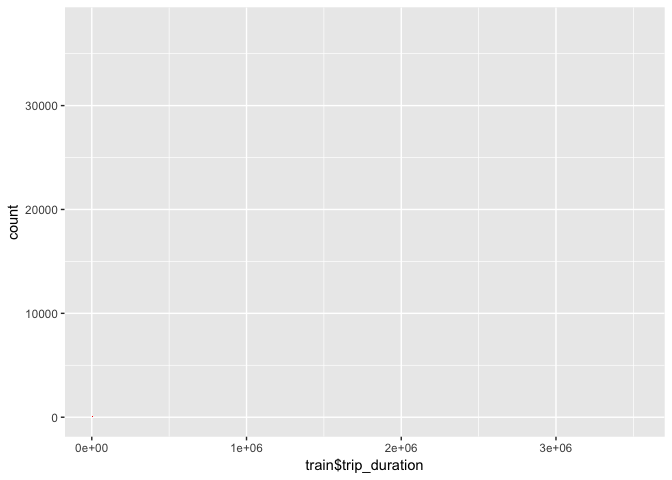

Visualizing very less number of trips in end of January
-------------------------------------------------------

``` r
train %>% filter(pickup_datetime>ymd("2016-01-20") & pickup_datetime<ymd("2016-02-10")) %>% ggplot(aes(pickup_datetime))+geom_histogram(fill="blue",bins=100)
```

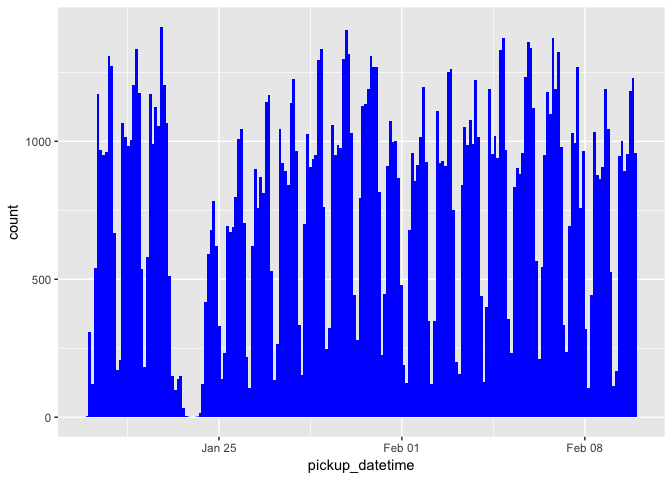

Grouping by passenger count
---------------------------

``` r
train %>% group_by(passenger_count) %>% count() %>% ggplot(aes(passenger_count,n,fill=passenger_count))+geom_col()
```

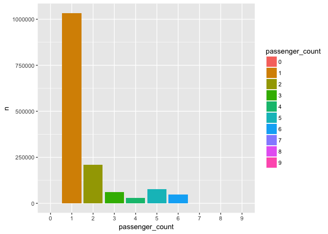

Number of trips by day of week
------------------------------

``` r
train %>% group_by(ww=wday(pickup_datetime)) %>% count() %>% ggplot(aes(ww,n))+geom_point(size=3) + labs(x="Day of week", y="Number of pickups")  
```

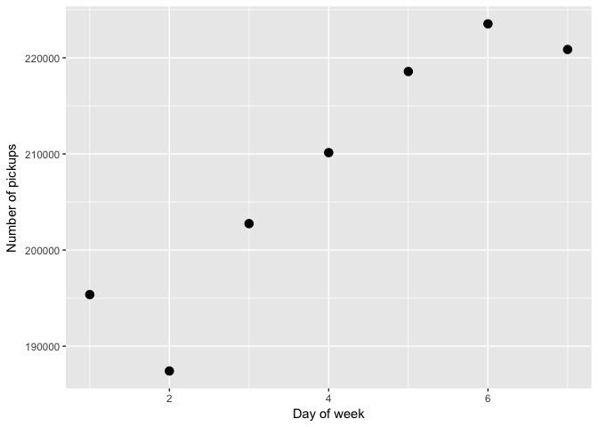

Number of pickups by hour of day
--------------------------------

``` r
train %>% group_by(hh=hour(pickup_datetime),vendor_id) %>% count() %>% ggplot(aes(hh,n,color=vendor_id))+geom_point(size=3)+labs(x="Hour of day", y="Number of pickups")  
```

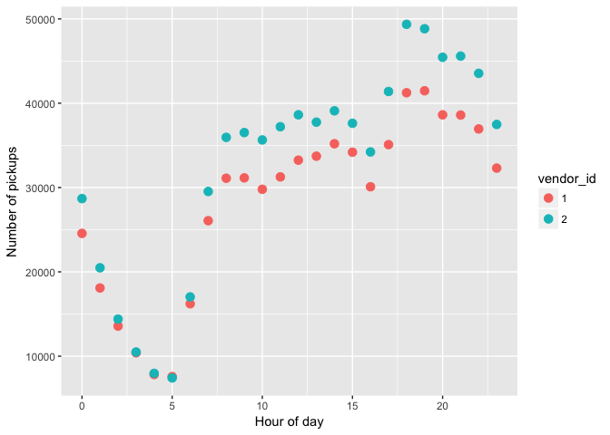 \#\# Passenger count

``` r
train %>% group_by(passenger_count) %>% count() %>% ggplot(aes(passenger_count,n))+geom_col()
```

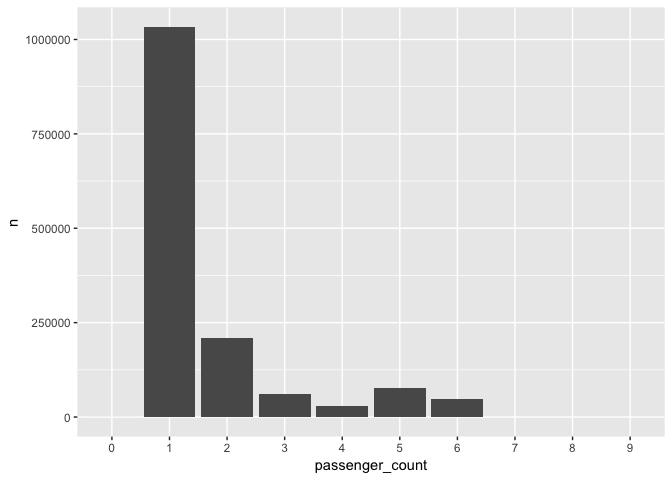

Number of journeys corresponding to hour of day per month
---------------------------------------------------------

``` r
train %>% mutate(hour_pickup=hour(pickup_datetime),month_pickup=factor(month(pickup_datetime,label=TRUE))) %>% group_by(hour_pickup,month_pickup) %>% count() %>% ggplot(aes(hour_pickup,n,color=month_pickup))+geom_line(size=1)+labs(x="hour of the day", y="count") 
```


Number of journeys corresponding to hour of day corresponding to day of week
----------------------------------------------------------------------------

``` r
train %>% mutate(hour_pickup=hour(pickup_datetime),weekday_pickup=factor(wday(pickup_datetime,label=TRUE))) %>% group_by(hour_pickup,weekday_pickup) %>% count() %>% ggplot(aes(hour_pickup,n,color=weekday_pickup))+geom_line(size=1)+labs(x="hour of the day", y="count") 
```

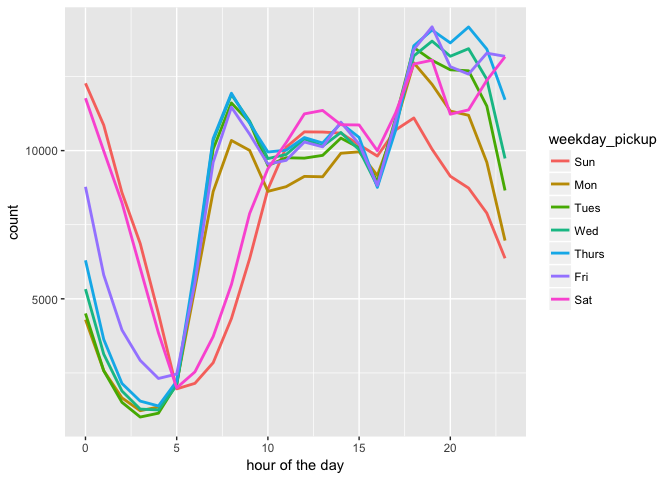

Median trip duration by day of week
-----------------------------------

``` r
train %>% mutate(weekday=wday(pickup_datetime,label=TRUE)) %>% group_by(weekday,vendor_id) %>% summarise(median_duration=median(trip_duration/60)) %>% ggplot(aes(weekday,median_duration,color=vendor_id))  + geom_point(size=4) + labs(x="Weekday",y="Median duration in minutes")
```

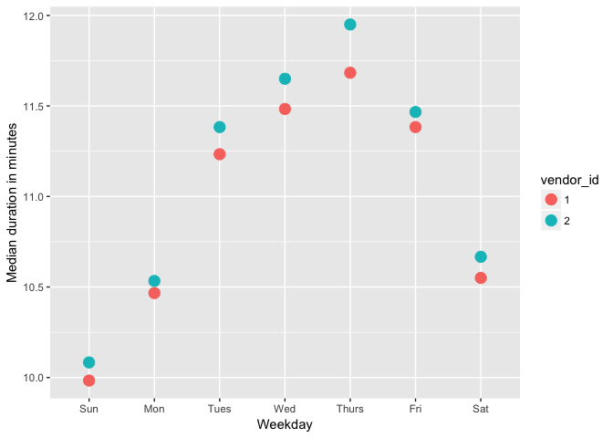

Median trip duration by hour of day
-----------------------------------

``` r
train %>% mutate(hour_day=hour(pickup_datetime)) %>% group_by(hour_day,vendor_id) %>% summarise(median_duration=median(trip_duration/60)) %>% ggplot(aes(hour_day,median_duration,color=vendor_id)) + geom_point(size=4) + labs(x="Hour of day",y="Median duration in minutes")
```

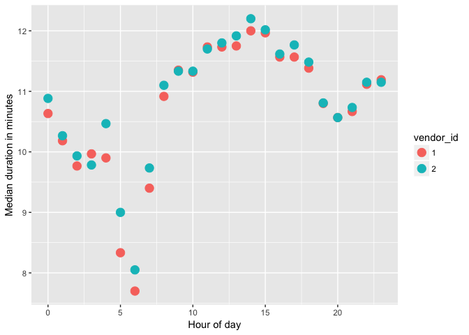

Plot between trip duration and distance traveled
------------------------------------------------

``` r
library('geosphere')
```

    ## Loading required package: sp

``` r
start_coord=train %>% select(pickup_longitude,pickup_latitude)
end_coord=train %>% select(dropoff_longitude,dropoff_latitude)

train$distance<-distCosine(start_coord,end_coord)

train %>% sample_n(5e4) %>% ggplot(aes(distance,trip_duration))+geom_point() +  scale_x_log10() +
  scale_y_log10() 
```

    ## Warning: Transformation introduced infinite values in continuous x-axis

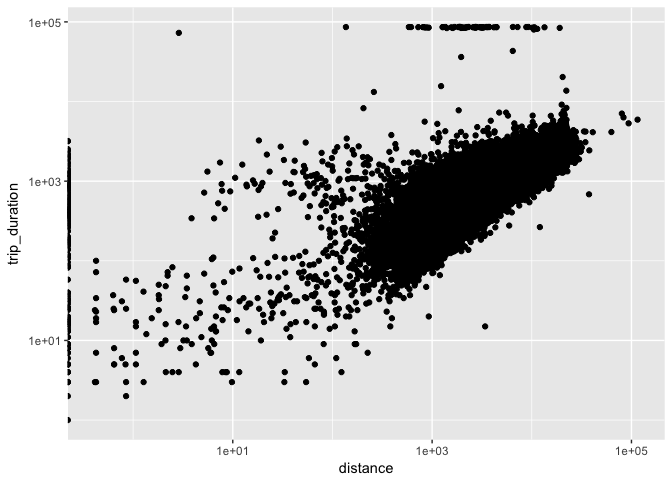

Speed with respect to day of week and hour of day
-------------------------------------------------

``` r
library('forcats')
train<- train %>% mutate(wday=wday(pickup_datetime, label = TRUE),
         wday = fct_relevel(wday, c("Mon", "Tues", "Wed", "Thurs", "Fri", "Sat", "Sun")),
         hour = hour(pickup_datetime),
         speed=distance/trip_duration *3.6)

train %>% group_by(wday,hour) %>% summarise(median_spd=median(speed)) %>% ggplot(aes(wday,hour,fill=median_spd))+geom_tile()+ scale_fill_distiller(palette = "Spectral") 
```

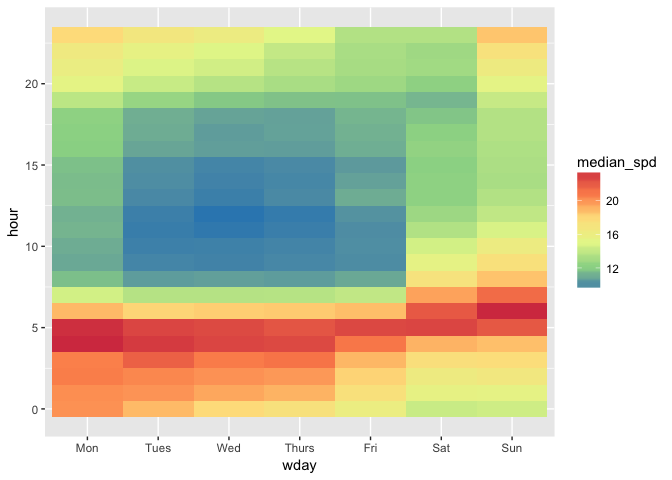

Add a new chunk by clicking the *Insert Chunk* button on the toolbar or by pressing *Cmd+Option+I*.

When you save the notebook, an HTML file containing the code and output will be saved alongside it (click the *Preview* button or press *Cmd+Shift+K* to preview the HTML file).
