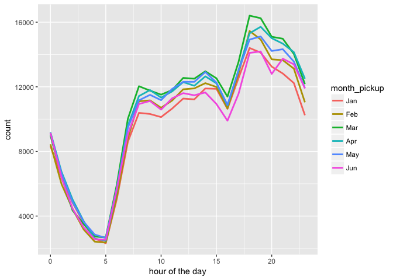

NYC analysis
================

This is an [R Markdown](http://rmarkdown.rstudio.com) Notebook. When you execute code within the notebook, the results appear beneath the code.

Try executing this chunk by clicking the *Run* button within the chunk or by placing your cursor inside it and pressing *Cmd+Shift+Enter*.

Loading libraries
-----------------

``` r
library('ggplot2')
library('tibble')
library('dplyr')
```

    ## 
    ## Attaching package: 'dplyr'

    ## The following objects are masked from 'package:stats':
    ## 
    ##     filter, lag

    ## The following objects are masked from 'package:base':
    ## 
    ##     intersect, setdiff, setequal, union

``` r
library('data.table')
```

    ## -------------------------------------------------------------------------

    ## data.table + dplyr code now lives in dtplyr.
    ## Please library(dtplyr)!

    ## -------------------------------------------------------------------------

    ## 
    ## Attaching package: 'data.table'

    ## The following objects are masked from 'package:dplyr':
    ## 
    ##     between, first, last

``` r
library('lubridate')
```

    ## 
    ## Attaching package: 'lubridate'

    ## The following objects are masked from 'package:data.table':
    ## 
    ##     hour, isoweek, mday, minute, month, quarter, second, wday,
    ##     week, yday, year

    ## The following object is masked from 'package:base':
    ## 
    ##     date

``` r
library('leaflet')
```

Input data
----------

``` r
train<-as_tibble(fread('nyc_data/train.csv'))
```

    ## 
    Read 9.6% of 1458644 rows
    Read 20.6% of 1458644 rows
    Read 30.2% of 1458644 rows
    Read 38.4% of 1458644 rows
    Read 49.4% of 1458644 rows
    Read 63.1% of 1458644 rows
    Read 73.4% of 1458644 rows
    Read 80.2% of 1458644 rows
    Read 98.7% of 1458644 rows
    Read 1458644 rows and 11 (of 11) columns from 0.187 GB file in 00:00:13

``` r
test<-as_tibble(fread('nyc_data/test.csv'))
```

    ## 
    Read 20.8% of 625134 rows
    Read 70.4% of 625134 rows
    Read 92.8% of 625134 rows
    Read 625134 rows and 9 (of 9) columns from 0.066 GB file in 00:00:06

``` r
summary(train)
```

    ##       id              vendor_id     pickup_datetime    dropoff_datetime  
    ##  Length:1458644     Min.   :1.000   Length:1458644     Length:1458644    
    ##  Class :character   1st Qu.:1.000   Class :character   Class :character  
    ##  Mode  :character   Median :2.000   Mode  :character   Mode  :character  
    ##                     Mean   :1.535                                        
    ##                     3rd Qu.:2.000                                        
    ##                     Max.   :2.000                                        
    ##  passenger_count pickup_longitude  pickup_latitude dropoff_longitude
    ##  Min.   :0.000   Min.   :-121.93   Min.   :34.36   Min.   :-121.93  
    ##  1st Qu.:1.000   1st Qu.: -73.99   1st Qu.:40.74   1st Qu.: -73.99  
    ##  Median :1.000   Median : -73.98   Median :40.75   Median : -73.98  
    ##  Mean   :1.665   Mean   : -73.97   Mean   :40.75   Mean   : -73.97  
    ##  3rd Qu.:2.000   3rd Qu.: -73.97   3rd Qu.:40.77   3rd Qu.: -73.96  
    ##  Max.   :9.000   Max.   : -61.34   Max.   :51.88   Max.   : -61.34  
    ##  dropoff_latitude store_and_fwd_flag trip_duration    
    ##  Min.   :32.18    Length:1458644     Min.   :      1  
    ##  1st Qu.:40.74    Class :character   1st Qu.:    397  
    ##  Median :40.75    Mode  :character   Median :    662  
    ##  Mean   :40.75                       Mean   :    959  
    ##  3rd Qu.:40.77                       3rd Qu.:   1075  
    ##  Max.   :43.92                       Max.   :3526282

Changing some features into factor form and making consistent date time formats
-------------------------------------------------------------------------------

``` r
train<-train %>% mutate(pickup_datetime=ymd_hms(pickup_datetime), dropoff_datetime=ymd_hms(dropoff_datetime), vendor_id=factor(vendor_id), passenger_count=factor(passenger_count))
```

    ## Warning in as.POSIXlt.POSIXct(x, tz): unknown timezone 'zone/tz/2017c.1.0/
    ## zoneinfo/America/Denver'

Subset of pickup points on map
------------------------------

``` r
#train$pickup_latitude=as.numeric(as.character(train$pickup_latitude))
#train$pickup_longitude=as.numeric(as.character(train$pickup_longitude))
mymap<-leaflet(data=sample_n(train,5000))
mymap<-addTiles(mymap)
mymap<- addCircleMarkers(mymap, ~ pickup_longitude, ~ pickup_latitude, radius=1, color='red')
mymap
```

<!--html_preserve-->

<script type="application/json" data-for="htmlwidget-3c22bed82e764868a8ad">{"x":{"options":{"crs":{"crsClass":"L.CRS.EPSG3857","code":null,"proj4def":null,"projectedBounds":null,"options":{}}},"calls":[{"method":"addTiles","args":["//{s}.tile.openstreetmap.org/{z}/{x}/{y}.png",null,null,{"minZoom":0,"maxZoom":18,"maxNativeZoom":null,"tileSize":256,"subdomains":"abc","errorTileUrl":"","tms":false,"continuousWorld":false,"noWrap":false,"zoomOffset":0,"zoomReverse":false,"opacity":1,"zIndex":null,"unloadInvisibleTiles":null,"updateWhenIdle":null,"detectRetina":false,"reuseTiles":false,"attribution":"&copy; <a href=\"http://openstreetmap.org\">OpenStreetMap\u003c/a> contributors, <a href=\"http://creativecommons.org/licenses/by-sa/2.0/\">CC-BY-SA\u003c/a>"}]},{"method":"addCircleMarkers","args":[[40.7982406616211,40.7499580383301,40.7685928344727,40.7817115783691,40.7657203674316,40.7193984985352,40.7603149414062,40.7367706298828,40.8108596801758,40.7430114746094,40.747745513916,40.7623558044434,40.7633094787598,40.773323059082,40.759578704834,40.7472915649414,40.7656593322754,40.7677040100098,40.7740859985352,40.761890411377,40.7654800415039,40.8081817626953,40.7627792358398,40.7621803283691,40.7304306030273,40.6773643493652,40.6454124450684,40.7522163391113,40.759765625,40.734992980957,40.8045349121094,40.7615623474121,40.6939468383789,40.7109375,40.7376937866211,40.749641418457,40.7767753601074,40.7547225952148,40.7212905883789,40.7591743469238,40.7841529846191,40.7717247009277,40.7869110107422,40.7585067749023,40.7610282897949,40.7535514831543,40.7633285522461,40.7598609924316,40.719841003418,40.7136497497559,40.7641906738281,40.7440147399902,40.7592849731445,40.7419204711914,40.7575836181641,40.7292747497559,40.7167015075684,40.7484092712402,40.7159996032715,40.7647933959961,40.7563896179199,40.7280616760254,40.749828338623,40.7273635864258,40.7720603942871,40.7598495483398,40.7584419250488,40.7568588256836,40.7519912719727,40.7585945129395,40.6705474853516,40.7626113891602,40.7314796447754,40.7606315612793,40.7566795349121,40.7655715942383,40.7242965698242,40.7278060913086,40.7058181762695,40.6446228027344,40.7238082885742,40.7581901550293,40.7851257324219,40.7307434082031,40.716739654541,40.7475700378418,40.7546424865723,40.7407302856445,40.7731285095215,40.7613487243652,40.7741279602051,40.7498626708984,40.7087707519531,40.7611694335938,40.7428359985352,40.7445602416992,40.7616500854492,40.7543601989746,40.7381858825684,40.7629051208496,40.7191543579102,40.7590637207031,40.7929039001465,40.7499198913574,40.73291015625,40.7617340087891,40.7013702392578,40.736385345459,40.7674751281738,40.7610893249512,40.7889709472656,40.7312240600586,40.7317695617676,40.7518463134766,40.7612266540527,40.7624702453613,40.7604904174805,40.7803382873535,40.7804107666016,40.7621154785156,40.7246437072754,40.7547187805176,40.747932434082,40.7587699890137,40.7612266540527,40.7601051330566,40.7346267700195,40.7761306762695,40.7209892272949,40.7652320861816,40.7796745300293,40.7135887145996,40.7639694213867,40.7507781982422,40.7530097961426,40.646411895752,40.75537109375,40.7743682861328,40.7743911743164,40.7555618286133,40.7589416503906,40.7407188415527,40.7644348144531,40.7499885559082,40.7856788635254,40.7347030639648,40.7646942138672,40.7414817810059,40.7740783691406,40.6901245117188,40.7474403381348,40.7212791442871,40.7655487060547,40.7222213745117,40.746150970459,40.7218589782715,40.7218704223633,40.7485618591309,40.7754364013672,40.7519607543945,40.7714157104492,40.6802558898926,40.771800994873,40.7727890014648,40.751033782959,40.757438659668,40.7580833435059,40.7228164672852,40.6733207702637,40.7763710021973,40.743408203125,40.7641792297363,40.7545547485352,40.7612380981445,40.7741737365723,40.7497901916504,40.7332611083984,40.7642478942871,40.7337875366211,40.7690505981445,40.7696952819824,40.773754119873,40.7575988769531,40.7935104370117,40.7359313964844,40.7333755493164,40.7277488708496,40.7484893798828,40.7146682739258,40.7562026977539,40.7644309997559,40.7873840332031,40.7533721923828,40.7353401184082,40.7591819763184,40.738597869873,40.7565383911133,40.7739906311035,40.7214660644531,40.7649459838867,40.7642974853516,40.7697257995605,40.8276710510254,40.6445732116699,40.740119934082,40.7877197265625,40.7644958496094,40.7474403381348,40.7683410644531,40.7600173950195,40.7661285400391,40.7776832580566,40.7656555175781,40.7948226928711,40.7299003601074,40.7653388977051,40.7621154785156,40.7547950744629,40.7438354492188,40.7624702453613,40.7597389221191,40.7743263244629,40.7699737548828,40.7519340515137,40.7379722595215,40.7621116638184,40.7734489440918,40.7443008422852,40.7722244262695,40.7487602233887,40.7776832580566,40.7328186035156,40.7605094909668,40.7476463317871,40.7641944885254,40.7597694396973,40.7131195068359,40.7481651306152,40.781852722168,40.7146759033203,40.7545928955078,40.7681350708008,40.7841720581055,40.7392616271973,40.7312202453613,40.7629508972168,40.7453193664551,40.7741470336914,40.7475738525391,40.721321105957,40.763801574707,40.7394523620605,40.7273902893066,40.7628288269043,40.7148094177246,40.7653312683105,40.7602005004883,40.7486419677734,40.7563781738281,40.7527122497559,40.743579864502,40.7322616577148,40.7516632080078,40.7513008117676,40.7459907531738,40.7789535522461,40.7184715270996,40.7426567077637,40.6777000427246,40.7865333557129,40.7175102233887,40.7453308105469,40.7306861877441,40.7382583618164,40.7591400146484,40.7187652587891,40.759822845459,40.7599983215332,40.7449989318848,40.7407493591309,40.734546661377,40.7568778991699,40.7696685791016,40.7598037719727,40.7287216186523,40.7673301696777,40.7641410827637,40.7223129272461,40.7374572753906,40.7670669555664,40.7512016296387,40.7510681152344,40.8027305603027,40.7349624633789,40.7492904663086,40.7826194763184,40.7143630981445,40.7631034851074,40.7731056213379,40.787109375,40.7209892272949,40.7385597229004,40.7055130004883,40.7455101013184,40.723747253418,40.7484016418457,40.7436904907227,40.799072265625,40.7722549438477,40.7501411437988,40.7300186157227,40.7439804077148,40.7785682678223,40.7302093505859,40.7408485412598,40.7410202026367,40.6413612365723,40.7859153747559,40.7263793945312,40.7755889892578,40.7741012573242,40.7472152709961,40.644832611084,40.7625503540039,40.7784118652344,40.7791709899902,40.7360954284668,40.7651519775391,40.7285308837891,40.7374267578125,40.7130889892578,40.7770805358887,40.7740821838379,40.7171058654785,40.7429466247559,40.714958190918,40.7849960327148,40.7582550048828,40.7312698364258,40.801570892334,40.7688369750977,40.7598915100098,40.7855224609375,40.7867012023926,40.7699966430664,40.6466827392578,40.780948638916,40.6715812683105,40.7550888061523,40.7159004211426,40.7597465515137,40.7570037841797,40.745059967041,40.7840347290039,40.7316207885742,40.7437210083008,40.7571411132812,40.7613296508789,40.7313537597656,40.7796630859375,40.7455863952637,40.7890357971191,40.6702880859375,40.7500915527344,40.7683067321777,40.7759323120117,40.7585067749023,40.7612686157227,40.8001708984375,40.7807083129883,40.7639389038086,40.7275123596191,40.7789688110352,40.7487411499023,40.7072982788086,40.776554107666,40.7582626342773,40.768611907959,40.7405395507812,40.7529525756836,40.7343215942383,40.7706565856934,40.7490272521973,40.7642402648926,40.7266883850098,40.7594833374023,40.760498046875,40.7493057250977,40.7493209838867,40.7738265991211,40.7252502441406,40.7726821899414,40.7583274841309,40.7409362792969,40.7786712646484,40.7032012939453,40.7251663208008,40.7239112854004,40.7643241882324,40.7930908203125,40.7441902160645,40.7640914916992,40.7446098327637,40.7688217163086,40.7711601257324,40.7441329956055,40.7654151916504,40.7478904724121,40.768741607666,40.6486167907715,40.7259979248047,40.7497787475586,40.7666778564453,40.7611694335938,40.757495880127,40.7326736450195,40.7201080322266,40.7417984008789,40.7772407531738,40.7954635620117,40.7728233337402,40.7873382568359,40.7764167785645,40.7763977050781,40.7472267150879,40.7295837402344,40.7840118408203,40.74951171875,40.7689018249512,40.7965774536133,40.6435394287109,40.7365303039551,40.7730407714844,40.7271118164062,40.7445831298828,40.774600982666,40.748176574707,40.7403259277344,40.7653388977051,40.751781463623,40.7734489440918,40.7519645690918,40.7912330627441,40.7658309936523,40.759391784668,40.7500801086426,40.6469688415527,40.757381439209,40.7759399414062,40.7726211547852,40.7441520690918,40.7878799438477,40.7562599182129,40.7551765441895,40.7506484985352,40.740665435791,40.7474746704102,40.7663879394531,40.7491035461426,40.7413177490234,40.7645683288574,40.7836532592773,40.7418403625488,40.7575416564941,40.7322616577148,40.746639251709,40.7639389038086,40.7550964355469,40.762565612793,40.7594871520996,40.7740516662598,40.7634239196777,40.7420425415039,40.7220649719238,40.7933197021484,40.7504005432129,40.7795791625977,40.7473373413086,40.7414932250977,40.766284942627,40.7739105224609,40.7546043395996,40.7420463562012,40.7458190917969,40.7513084411621,40.7506942749023,40.7388763427734,40.756420135498,40.7502479553223,40.7030601501465,40.7654304504395,40.7826614379883,40.7936248779297,40.6447639465332,40.7283515930176,40.7660484313965,40.7779006958008,40.7830238342285,40.7545852661133,40.7177391052246,40.7111930847168,40.7650566101074,40.7630157470703,40.7472038269043,40.7040405273438,40.7833137512207,40.7644004821777,40.7558631896973,40.7585601806641,40.7474899291992,40.7514114379883,40.7163963317871,40.7658500671387,40.7209892272949,40.7966423034668,40.7905616760254,40.7716369628906,40.7528991699219,40.7631340026855,40.7341156005859,40.7650680541992,40.6940269470215,40.7493515014648,40.7293167114258,40.679012298584,40.7177314758301,40.7551651000977,40.7196197509766,40.7438621520996,40.7649612426758,40.6486854553223,40.7737503051758,40.7136726379395,40.7564315795898,40.735481262207,40.7521514892578,40.7891006469727,40.7384910583496,40.7728042602539,40.7457313537598,40.762996673584,40.7495918273926,40.7719306945801,40.7560882568359,40.7366409301758,40.7477188110352,40.7892837524414,40.7370491027832,40.7499389648438,40.8047409057617,40.6452484130859,40.7765007019043,40.7935905456543,40.7468338012695,40.7352752685547,40.7493705749512,40.7498817443848,40.7744407653809,40.7366943359375,40.7755432128906,40.7484016418457,40.755744934082,40.7340316772461,40.7691307067871,40.6446762084961,40.7768707275391,40.774600982666,40.7580795288086,40.7436256408691,40.7906227111816,40.6448440551758,40.7505226135254,40.7202110290527,40.7404594421387,40.7791481018066,40.7416191101074,40.7607002258301,40.7593994140625,40.7591133117676,40.7482681274414,40.6450462341309,40.7297592163086,40.7395210266113,40.7827033996582,40.7092704772949,40.740047454834,40.7836265563965,40.7457809448242,40.7140159606934,40.7772598266602,40.7619323730469,40.7382125854492,40.7695274353027,40.7671012878418,40.7510871887207,40.7926292419434,40.7274360656738,40.7666053771973,40.7389488220215,40.7536811828613,40.7738037109375,40.8189926147461,40.7458381652832,40.7487335205078,40.7516479492188,40.7797584533691,40.7499313354492,40.7748985290527,40.7549514770508,40.7283630371094,40.7682685852051,40.7214469909668,40.7066116333008,40.7908477783203,40.7298011779785,40.7297782897949,40.7667083740234,40.7799301147461,40.8056907653809,40.7719993591309,40.7612075805664,40.7394065856934,40.744270324707,40.7696647644043,40.7436294555664,40.7671318054199,40.7775344848633,40.7966995239258,40.7226409912109,40.7358055114746,40.744197845459,40.756046295166,40.7250862121582,40.7525520324707,40.7299308776855,40.792407989502,40.7644805908203,40.7231101989746,40.7031745910645,40.7978210449219,40.7243537902832,40.7356147766113,40.758960723877,40.7524490356445,40.7578086853027,40.7692184448242,40.7530975341797,40.7674140930176,40.7079200744629,40.7372360229492,40.7706718444824,40.7938652038574,40.8181343078613,40.7739944458008,40.7682914733887,40.6872863769531,40.7330360412598,40.8136291503906,40.677921295166,40.7891998291016,40.7438278198242,40.7339820861816,40.7464599609375,40.7652587890625,40.754035949707,40.7758483886719,40.7243537902832,40.7417221069336,40.7622184753418,40.7495193481445,40.776065826416,40.7341270446777,40.7417831420898,40.7574615478516,40.6799583435059,40.7771492004395,40.7555198669434,40.7285461425781,40.7517852783203,40.7593803405762,40.7564315795898,40.7208709716797,40.7784118652344,40.7505531311035,40.7396011352539,40.7225570678711,40.7797737121582,40.6564292907715,40.7641143798828,40.7580718994141,40.748950958252,40.7285575866699,40.7550354003906,40.7858200073242,40.7342643737793,40.78369140625,40.7567481994629,40.7326812744141,40.7417068481445,40.7791900634766,40.7375411987305,40.7790489196777,40.7302627563477,40.7843589782715,40.7554054260254,40.7196731567383,40.757209777832,40.7779502868652,40.7654838562012,40.7231025695801,40.7795448303223,40.7783660888672,40.7413139343262,40.7450714111328,40.7282905578613,40.7586479187012,40.7522010803223,40.7627487182617,40.7621536254883,40.6483192443848,40.7408638000488,40.7279205322266,40.7482414245605,40.7431297302246,40.757251739502,40.7766761779785,40.7712631225586,40.7501258850098,40.7676162719727,40.7353668212891,40.7558364868164,40.7627143859863,40.7670631408691,40.6487617492676,40.7412719726562,40.7328033447266,40.7655372619629,40.7548637390137,40.7755393981934,40.7469177246094,40.7337455749512,40.7320213317871,40.7332534790039,40.7462997436523,40.7563095092773,40.7615623474121,40.7112503051758,40.7595291137695,40.7393684387207,40.8250999450684,40.7510986328125,40.7685585021973,40.7517585754395,40.7134132385254,40.7398071289062,40.7588233947754,40.8092079162598,40.7568664550781,40.7509117126465,40.6470031738281,40.7718887329102,40.7848701477051,40.734203338623,40.7560768127441,40.7643051147461,40.7901840209961,40.7437438964844,40.774169921875,40.7223930358887,40.7412261962891,40.7677993774414,40.757251739502,40.7834053039551,40.7202033996582,40.7783279418945,40.7697296142578,40.7407035827637,40.7328605651855,40.7439498901367,40.745246887207,40.7747039794922,40.7590141296387,40.7644882202148,40.6666793823242,40.7557601928711,40.7418937683105,40.7075576782227,40.7270011901855,40.6454086303711,40.7801284790039,40.765193939209,40.7172050476074,40.7908210754395,40.7562599182129,40.7562828063965,40.747875213623,40.7485313415527,40.7646598815918,40.7337303161621,40.7461013793945,40.7619667053223,40.753345489502,40.7105903625488,40.773567199707,40.7741088867188,40.7249412536621,40.7391319274902,40.7374610900879,40.7338371276855,40.7793083190918,40.7540092468262,40.7745094299316,40.7639427185059,40.7603416442871,40.7504081726074,40.7648010253906,40.7756843566895,40.7689895629883,40.7572402954102,40.7208671569824,40.7225227355957,40.7431602478027,40.6446533203125,40.759765625,40.7733306884766,40.7522964477539,40.7024002075195,40.7236938476562,40.7910232543945,40.7470436096191,40.745849609375,40.7523422241211,40.767219543457,40.7215805053711,40.813720703125,40.7278900146484,40.7641487121582,40.75830078125,40.7572402954102,40.752986907959,40.7548484802246,40.7654228210449,40.7489051818848,40.7159881591797,40.6855697631836,40.7100028991699,40.7404098510742,40.7839317321777,40.7028388977051,40.7189674377441,40.7649078369141,40.7521514892578,40.7881240844727,40.7711906433105,40.7168312072754,40.7527046203613,40.7331504821777,40.7613143920898,40.7049560546875,40.7630386352539,40.7438316345215,40.7273559570312,40.7548446655273,40.7714309692383,40.742000579834,40.7574768066406,40.7115097045898,40.7544784545898,40.7889595031738,40.764347076416,40.7327766418457,40.7655067443848,40.731990814209,40.7557334899902,40.7810935974121,40.7499885559082,40.7538948059082,40.7626914978027,40.7606201171875,40.7438850402832,40.7661628723145,40.7338218688965,40.7674293518066,40.7352485656738,40.7630958557129,40.7505264282227,40.7336387634277,40.7175483703613,40.7641983032227,40.7638397216797,40.7412796020508,40.764045715332,40.7408714294434,40.7867088317871,40.7665977478027,40.800163269043,40.7647590637207,40.739990234375,40.7537498474121,40.6444969177246,40.7682304382324,40.7730140686035,40.7589950561523,40.7551307678223,40.775260925293,40.7708511352539,40.7636909484863,40.7875671386719,40.7828254699707,40.7229270935059,40.7254981994629,40.714038848877,40.7519645690918,40.7464752197266,40.6486587524414,40.7079200744629,40.7316589355469,40.772045135498,40.7315483093262,40.7566070556641,40.7522010803223,40.7639389038086,40.7468757629395,40.7489776611328,40.7454681396484,40.7564582824707,40.7379570007324,40.7562599182129,40.7777099609375,40.766040802002,40.7620391845703,40.7398986816406,40.7848281860352,40.7320022583008,40.765380859375,40.7204742431641,40.7110481262207,40.779598236084,40.7606048583984,40.7697601318359,40.7758941650391,40.7831001281738,40.763298034668,40.8136520385742,40.788818359375,40.744499206543,40.7568206787109,40.7516899108887,40.7468910217285,40.715259552002,40.7589912414551,40.744441986084,40.7797164916992,40.7438697814941,40.716121673584,40.7334632873535,40.7528915405273,40.8570289611816,40.77734375,40.7497596740723,40.7640342712402,40.7211952209473,40.7782783508301,40.7958068847656,40.7541694641113,40.7239532470703,40.7794380187988,40.7701110839844,40.7845802307129,40.7583274841309,40.7396125793457,40.7420883178711,40.7578926086426,40.7499618530273,40.7691078186035,40.7604484558105,40.750057220459,40.7208137512207,40.7463455200195,40.7585296630859,40.7802696228027,40.7559852600098,40.7920303344727,40.7444305419922,40.7304153442383,40.7511749267578,40.7584915161133,40.7794609069824,40.7869682312012,40.7309188842773,40.7403984069824,40.7900886535645,40.7455711364746,40.7257995605469,40.7582588195801,40.7187232971191,40.7574806213379,40.6753578186035,40.7709503173828,40.7041702270508,40.7640533447266,40.7180595397949,40.7426147460938,40.7627449035645,40.7409553527832,40.7660751342773,40.7487487792969,40.7697257995605,40.7741966247559,40.7248306274414,40.7688865661621,40.744758605957,40.74462890625,40.7445335388184,40.7563514709473,40.7592697143555,40.7419090270996,40.7552871704102,40.7426910400391,40.7981567382812,40.708568572998,40.7265396118164,40.7312164306641,40.7736015319824,40.7645225524902,40.7728385925293,40.7733383178711,40.7438659667969,40.7410469055176,40.7576217651367,40.8179397583008,40.7584648132324,40.7046279907227,40.730110168457,40.7447776794434,40.8037872314453,40.7747688293457,40.7663040161133,40.7528495788574,40.6688003540039,40.7606086730957,40.7503204345703,40.7510986328125,40.7658615112305,40.6417655944824,40.6453552246094,40.6453018188477,40.7945594787598,40.7803268432617,40.7052688598633,40.7174034118652,40.7532119750977,40.7527503967285,40.7204132080078,40.7535171508789,40.7690353393555,40.780158996582,40.7820625305176,40.7246284484863,40.7644233703613,40.7768287658691,40.7514533996582,40.7135314941406,40.7549285888672,40.7348747253418,40.7621955871582,40.788688659668,40.7502326965332,40.7290916442871,40.7595596313477,40.7645568847656,40.7068252563477,40.7548522949219,40.7504196166992,40.7741165161133,40.7616920471191,40.7413482666016,40.7797660827637,40.763801574707,40.7502708435059,40.7714767456055,40.7798614501953,40.7510414123535,40.7472190856934,40.7772789001465,40.7754707336426,40.7605285644531,40.7888298034668,40.7509956359863,40.6446762084961,40.7699012756348,40.744140625,40.7617835998535,40.7738838195801,40.742733001709,40.7313003540039,40.7412910461426,40.7586441040039,40.7523345947266,40.7534790039062,40.751350402832,40.7717094421387,40.7468795776367,40.7638549804688,40.7505226135254,40.851375579834,40.7500877380371,40.7589683532715,40.7761001586914,40.7289085388184,40.7659072875977,40.7572250366211,40.7719116210938,40.7328109741211,40.7270965576172,40.7558288574219,40.7582588195801,40.7986526489258,40.7472381591797,40.7684516906738,40.7791213989258,40.7749824523926,40.7721786499023,40.7552185058594,40.7149505615234,40.7738418579102,40.7221908569336,40.7717514038086,40.781078338623,40.7243690490723,40.7511863708496,40.770881652832,40.731632232666,40.7792358398438,40.6468391418457,40.7774963378906,40.752010345459,40.7855567932129,40.741039276123,40.7783813476562,40.7344856262207,40.7621688842773,40.7137603759766,40.7098731994629,40.7582817077637,40.745288848877,40.7154998779297,40.7579307556152,40.7504501342773,40.763500213623,40.7409172058105,40.7088165283203,40.7853012084961,40.7679138183594,40.7690315246582,40.7740631103516,40.7187728881836,40.7620506286621,40.7605400085449,40.7629165649414,40.7415504455566,40.7525482177734,40.750846862793,40.7603073120117,40.793098449707,40.7274436950684,40.7737655639648,40.7857818603516,40.7287292480469,40.7416648864746,40.6989784240723,40.7220191955566,40.7233619689941,40.7651863098145,40.7705307006836,40.780330657959,40.7272872924805,40.7210502624512,40.7324485778809,40.742790222168,40.7437133789062,40.7542304992676,40.7419357299805,40.7737503051758,40.7510643005371,40.64501953125,40.734302520752,40.7501068115234,40.77392578125,40.7942695617676,40.7274894714355,40.7530708312988,40.7591590881348,40.7793769836426,40.746036529541,40.7801094055176,40.7643051147461,40.7749214172363,40.7444381713867,40.7462387084961,40.715747833252,40.7645606994629,40.7569808959961,40.7610702514648,40.7709007263184,40.7511444091797,40.7583885192871,40.7430686950684,40.7741622924805,40.7718658447266,40.7054138183594,40.7246284484863,40.7948913574219,40.6454582214355,40.7207336425781,40.7664527893066,40.7445411682129,40.7462882995605,40.7565002441406,40.7779846191406,40.7511978149414,40.777271270752,40.7797241210938,40.7391891479492,40.7561912536621,40.7567710876465,40.7118301391602,40.7489318847656,40.7622833251953,40.7509803771973,40.7604446411133,40.7659606933594,40.7401084899902,40.7627487182617,40.7559814453125,40.7628974914551,40.7379188537598,40.7323913574219,40.7592468261719,40.7616996765137,40.7791213989258,40.737678527832,40.7618408203125,40.7609596252441,40.7624816894531,40.7309494018555,40.733283996582,40.7392501831055,40.7445373535156,40.7338981628418,40.7327461242676,40.7517395019531,40.7444763183594,40.7724800109863,40.7215309143066,40.7306098937988,40.7740783691406,40.7711715698242,40.7017517089844,40.7396621704102,40.7653846740723,40.7700424194336,40.7120552062988,40.7653732299805,40.7299995422363,40.8250503540039,40.7383232116699,40.7245216369629,40.7537002563477,40.7721366882324,40.7504844665527,40.765796661377,40.768913269043,40.7607116699219,40.7500610351562,40.7737846374512,40.7910194396973,40.7599601745605,40.797492980957,40.7698631286621,40.7627563476562,40.7711372375488,40.7643165588379,40.740406036377,40.7417068481445,40.7739715576172,40.7384185791016,40.7578544616699,40.7771224975586,40.7414627075195,40.7782173156738,40.7354431152344,40.7533760070801,40.764030456543,40.7370567321777,40.7492027282715,40.7632942199707,40.7540130615234,40.7615165710449,40.7501182556152,40.76708984375,40.7897338867188,40.7537002563477,40.7387886047363,40.8081855773926,40.7552947998047,40.7548789978027,40.6912422180176,40.7504806518555,40.7553977966309,40.7643203735352,40.6462936401367,40.749870300293,40.730640411377,40.7881889343262,40.7711715698242,40.7683563232422,40.7793006896973,40.7754402160645,40.7417449951172,40.7455215454102,40.7483863830566,40.7316017150879,40.7518005371094,40.7788009643555,40.7554588317871,40.7627258300781,40.7231521606445,40.7192764282227,40.7106590270996,40.7224464416504,40.7579917907715,40.7724342346191,40.7571754455566,40.7503433227539,40.7673492431641,40.7136688232422,40.7556571960449,40.8044891357422,40.7595520019531,40.7350959777832,40.7672882080078,40.7646255493164,40.7500953674316,40.770824432373,40.7438583374023,40.7613105773926,40.7572937011719,40.7165718078613,40.8167495727539,40.7633438110352,40.7642593383789,40.7464561462402,40.758129119873,40.7469100952148,40.7881393432617,40.7111358642578,40.7355155944824,40.7559585571289,40.7481231689453,40.7754211425781,40.7325668334961,40.769905090332,40.6909408569336,40.7754058837891,40.7415237426758,40.7501220703125,40.779956817627,40.7551345825195,40.7188301086426,40.7658081054688,40.6437568664551,40.7499084472656,40.7808609008789,40.7103958129883,40.728759765625,40.7577667236328,40.726261138916,40.7578887939453,40.8104400634766,40.7373886108398,40.7654418945312,40.7546806335449,40.7257194519043,40.644660949707,40.7388000488281,40.7757797241211,40.7486572265625,40.7665786743164,40.7897605895996,40.7610206604004,40.7881813049316,40.7473754882812,40.7704086303711,40.7543601989746,40.779598236084,40.7103004455566,40.6950225830078,40.7672576904297,40.7483177185059,40.756175994873,40.773738861084,40.7580413818359,40.7020988464355,40.7571449279785,40.7809410095215,40.7463989257812,40.7550506591797,40.7542495727539,40.7214508056641,40.74755859375,40.7693901062012,40.7558288574219,40.7486610412598,40.7669372558594,40.7321853637695,40.7792282104492,40.8096809387207,40.7381286621094,40.7520065307617,40.778980255127,40.7627258300781,40.725959777832,40.7505226135254,40.7714805603027,40.7606430053711,40.7699966430664,40.7647285461426,40.7762298583984,40.7234153747559,40.6854438781738,40.7521591186523,40.8054695129395,40.7300300598145,40.741340637207,40.7284736633301,40.7766952514648,40.7653579711914,40.7471008300781,40.7227783203125,40.7710189819336,40.7819900512695,40.7729187011719,40.7792663574219,40.8047409057617,40.7625007629395,40.7656211853027,40.7964401245117,40.7560195922852,40.7658271789551,40.7601203918457,40.7672805786133,40.7870292663574,40.7249450683594,40.7630996704102,40.7624015808105,40.7506484985352,40.7972793579102,40.7439918518066,40.7685585021973,40.7490386962891,40.7663917541504,40.7724227905273,40.7261238098145,40.797550201416,40.7396430969238,40.7628326416016,40.749195098877,40.7413291931152,40.7623138427734,40.7641868591309,40.7634391784668,40.7258186340332,40.7590255737305,40.776798248291,40.725643157959,40.7264595031738,40.7408218383789,40.7314910888672,40.7322616577148,40.7405433654785,40.7989082336426,40.7846984863281,40.7635269165039,40.7238006591797,40.7633209228516,40.7611885070801,40.7491455078125,40.7645416259766,40.7812080383301,40.7552337646484,40.7409019470215,40.7561378479004,40.7286605834961,40.7592544555664,40.7776260375977,40.7671165466309,40.7255859375,40.7105560302734,40.6453094482422,40.8152046203613,40.7594108581543,40.7625885009766,40.7612991333008,40.7412338256836,40.7685699462891,40.7352638244629,40.7417221069336,40.7475967407227,40.7783546447754,40.7706680297852,40.7048759460449,40.7420425415039,40.7187881469727,40.734260559082,40.7338676452637,40.7594566345215,40.7523803710938,40.7697715759277,40.768123626709,40.7527961730957,40.7316932678223,40.760383605957,40.779541015625,40.7526702880859,40.778190612793,40.7405738830566,40.7623710632324,40.7390060424805,40.7724418640137,40.7210006713867,40.7185668945312,40.7454833984375,40.8067932128906,40.7305297851562,40.7317390441895,40.7570686340332,40.7416114807129,40.7790374755859,40.793514251709,40.7465019226074,40.7629661560059,40.7334403991699,40.6479225158691,40.7527160644531,40.7514457702637,40.7501792907715,40.7031707763672,40.7724876403809,40.7739868164062,40.7629852294922,40.764331817627,40.7391471862793,40.7597503662109,40.760383605957,40.759033203125,40.7667198181152,40.7629814147949,40.8024215698242,40.7658309936523,40.7523307800293,40.780590057373,40.7627334594727,40.7666435241699,40.7190475463867,40.7568130493164,40.7216758728027,40.6421852111816,40.7732696533203,40.7551002502441,40.7530784606934,40.7701072692871,40.7730674743652,40.7191734313965,40.7452735900879,40.7563896179199,40.7741813659668,40.7591094970703,40.7367477416992,40.7659454345703,40.7645530700684,40.733829498291,40.6447715759277,40.7348937988281,40.7687606811523,40.75,40.7042808532715,40.7811660766602,40.7503356933594,40.7660636901855,40.7575035095215,40.7650413513184,40.7928276062012,40.7461853027344,40.7767524719238,40.747241973877,40.7611465454102,40.7710762023926,40.7770881652832,40.7689247131348,40.7486305236816,40.7856712341309,40.7911071777344,40.7806701660156,40.7774276733398,40.7560501098633,40.7788505554199,40.7558097839355,40.7710494995117,40.6453742980957,40.7365608215332,40.7808418273926,40.7468528747559,40.7422485351562,40.7827682495117,40.7498474121094,40.7540435791016,40.7429504394531,40.7384719848633,40.7505226135254,40.7506408691406,40.7660217285156,40.7434768676758,40.7575798034668,40.7687339782715,40.7594375610352,40.779182434082,40.7372016906738,40.7218894958496,40.7437400817871,40.7234916687012,40.7160987854004,40.7557334899902,40.7602081298828,40.7556991577148,40.7059555053711,40.7423934936523,40.7595291137695,40.744083404541,40.719123840332,40.764331817627,40.720703125,40.7719764709473,40.7686538696289,40.7696228027344,40.7524337768555,40.7420616149902,40.7547340393066,40.7944488525391,40.7406349182129,40.7389793395996,40.7354354858398,40.7220611572266,40.7586288452148,40.7164192199707,40.764087677002,40.7688217163086,40.7428741455078,40.761833190918,40.7690696716309,40.7551002502441,40.7954330444336,40.6742897033691,40.7605438232422,40.7522659301758,40.7570495605469,40.7926216125488,40.7461967468262,40.7687568664551,40.748119354248,40.7438812255859,40.767261505127,40.7245712280273,40.645133972168,40.8005638122559,40.7295112609863,40.7520599365234,40.7737274169922,40.705005645752,40.7341613769531,40.7458610534668,40.739387512207,40.7500267028809,40.7063636779785,40.7563514709473,40.7362213134766,40.8028869628906,40.752513885498,40.7643928527832,40.7509536743164,40.7475166320801,40.7961387634277,40.7511520385742,40.7544898986816,40.742488861084,40.7680320739746,40.7654685974121,40.7494506835938,40.775318145752,40.7549324035645,40.7549324035645,40.7498092651367,40.7788581848145,40.7688217163086,40.7865409851074,40.6449317932129,40.7632484436035,40.7592582702637,40.7750396728516,40.7387886047363,40.7018585205078,40.7515830993652,40.7626838684082,40.7692489624023,40.7164611816406,40.7516937255859,40.7494697570801,40.7455291748047,40.7538719177246,40.7483253479004,40.742790222168,40.7632217407227,40.7577095031738,40.7588157653809,40.7578582763672,40.7504196166992,40.7189292907715,40.7603187561035,40.7659072875977,40.7508392333984,40.7826461791992,40.7235488891602,40.7840309143066,40.7720794677734,40.7652473449707,40.764087677002,40.7688217163086,40.7679138183594,40.7660865783691,40.7511863708496,40.7651634216309,40.7297286987305,40.7684059143066,40.7611312866211,40.7327499389648,40.7568778991699,40.7880020141602,40.7439651489258,40.7439918518066,40.733512878418,40.7631721496582,40.7328453063965,40.7573318481445,40.7325286865234,40.7872657775879,40.7381134033203,40.7581520080566,40.7428703308105,40.7883491516113,40.7379188537598,40.7145919799805,40.7831115722656,40.740608215332,40.773738861084,40.757640838623,40.7225799560547,40.759349822998,40.7740707397461,40.7470245361328,40.7567901611328,40.7466239929199,40.7801818847656,40.7819709777832,40.7661094665527,40.762149810791,40.754940032959,40.7237205505371,40.7560577392578,40.7514915466309,40.7513389587402,40.7500534057617,40.7626419067383,40.7659187316895,40.7743988037109,40.7597503662109,40.7492370605469,40.7733421325684,40.7719802856445,40.7360687255859,40.7817687988281,40.7024421691895,40.7267150878906,40.7606773376465,40.6972694396973,40.7651519775391,40.812801361084,40.7740516662598,40.7749481201172,40.76123046875,40.7217483520508,40.7688102722168,40.727180480957,40.7739105224609,40.7627182006836,40.7620697021484,40.7968711853027,40.7468872070312,40.7567481994629,40.8143005371094,40.7253646850586,40.7477340698242,40.7979736328125,40.7577514648438,40.793586730957,40.7648277282715,40.7080268859863,40.7823600769043,40.7569580078125,40.7202110290527,40.7294082641602,40.6444969177246,40.729907989502,40.7071151733398,40.7097816467285,40.7594985961914,40.7306632995605,40.7207298278809,40.7296409606934,40.7628517150879,40.7355155944824,40.7724418640137,40.7826690673828,40.745548248291,40.7449073791504,40.7526016235352,40.7570190429688,40.7824554443359,40.7580986022949,40.7624893188477,40.7287063598633,40.7377510070801,40.7295608520508,40.7711944580078,40.7442321777344,40.725269317627,40.7541656494141,40.724983215332,40.7908592224121,40.7348785400391,40.7411155700684,40.7500457763672,40.7335548400879,40.7376937866211,40.7526588439941,40.7835464477539,40.7585983276367,40.7205009460449,40.7383117675781,40.7516632080078,40.7420768737793,40.7685356140137,40.7362823486328,40.7763214111328,40.7628364562988,40.7773628234863,40.7031288146973,40.7568511962891,40.6760673522949,40.7520599365234,40.7460746765137,40.7814254760742,40.720588684082,40.7211990356445,40.7563171386719,40.7708053588867,40.7651405334473,40.7271537780762,40.7463607788086,40.7907409667969,40.777400970459,40.7604637145996,40.7837715148926,40.7242813110352,40.7504692077637,40.7277412414551,40.783878326416,40.7388801574707,40.7467613220215,40.7585411071777,40.779670715332,40.7412796020508,40.7849998474121,40.7741317749023,40.745361328125,40.7738265991211,40.760986328125,40.7556610107422,40.7536735534668,40.7380638122559,40.790771484375,40.734447479248,40.743968963623,40.7422904968262,40.7740020751953,40.7587928771973,40.7341537475586,40.7740745544434,40.7966690063477,40.7507438659668,40.7194137573242,40.7676086425781,40.7185478210449,40.7489852905273,40.776309967041,40.7521667480469,40.7142791748047,40.763111114502,40.7455406188965,40.7413215637207,40.7075386047363,40.7591209411621,40.7579689025879,40.7586555480957,40.6435050964355,40.7338638305664,40.7807312011719,40.7403984069824,40.8017311096191,40.7491035461426,40.7471046447754,40.7562217712402,40.6454010009766,40.8188667297363,40.7881813049316,40.7446060180664,40.7324600219727,40.7814788818359,40.7528114318848,40.7215423583984,40.7199516296387,40.7628898620605,40.6698112487793,40.737720489502,40.7279167175293,40.7743606567383,40.770938873291,40.7470664978027,40.7569351196289,40.7374382019043,40.7597503662109,40.724781036377,40.7784576416016,40.7472534179688,40.7201728820801,40.7583084106445,40.7640075683594,40.7277183532715,40.8033828735352,40.7516708374023,40.7447967529297,40.7569808959961,40.7428398132324,40.7572708129883,40.7699584960938,40.7559661865234,40.7482109069824,40.7422294616699,40.7549285888672,40.729663848877,40.758129119873,40.7652015686035,40.7750434875488,40.6453018188477,40.7514762878418,40.709602355957,40.7932205200195,40.7329063415527,40.7505798339844,40.7251281738281,40.7441864013672,40.7309722900391,40.7715339660645,40.7025413513184,40.7512283325195,40.7573928833008,40.756778717041,40.7713317871094,40.6439514160156,40.7610397338867,40.7377586364746,40.7692108154297,40.7419242858887,40.7616157531738,40.7659149169922,40.7176361083984,40.7704544067383,40.7570533752441,40.7371673583984,40.7406768798828,40.7396659851074,40.7688674926758,40.769962310791,40.7627182006836,40.7972564697266,40.7671813964844,40.7828063964844,40.7872085571289,40.7694778442383,40.7736015319824,40.7665748596191,40.7640533447266,40.7448844909668,40.7563018798828,40.7623291015625,40.7491798400879,40.7849807739258,40.7575988769531,40.645076751709,40.7576942443848,40.799560546875,40.7598114013672,40.7698783874512,40.711799621582,40.7409591674805,40.6447830200195,40.7173728942871,40.7734870910645,40.7481575012207,40.7797508239746,40.7392387390137,40.7602996826172,40.7729148864746,40.756290435791,40.7718772888184,40.737964630127,40.7832336425781,40.7806358337402,40.7567749023438,40.7410469055176,40.7744102478027,40.7259902954102,40.7609596252441,40.7569885253906,40.766674041748,40.7579917907715,40.7546844482422,40.801700592041,40.7208786010742,40.7241516113281,40.7698860168457,40.7891044616699,40.7776641845703,40.7723960876465,40.7558403015137,40.7738800048828,40.7592887878418,40.8036880493164,40.7456817626953,40.7484512329102,40.7483558654785,40.7487106323242,40.7769546508789,40.7589454650879,40.7640228271484,40.7141151428223,40.7407379150391,40.7444915771484,40.7961006164551,40.7675285339355,40.7639389038086,40.734073638916,40.7380142211914,40.7691497802734,40.7705421447754,40.7679748535156,40.7288208007812,40.6447448730469,40.7565803527832,40.7592086791992,40.7292938232422,40.7353897094727,40.7340927124023,40.8199272155762,40.7388458251953,40.7470092773438,40.7299728393555,40.7417449951172,40.712100982666,40.7257881164551,40.7978210449219,40.7409896850586,40.7162475585938,40.7451591491699,40.7773513793945,40.7576065063477,40.7539215087891,40.7651138305664,40.7604637145996,40.7802314758301,40.73486328125,40.7744789123535,40.7505683898926,40.7476081848145,40.7441215515137,40.769100189209,40.7339019775391,40.784252166748,40.7409057617188,40.7329406738281,40.7413482666016,40.7649383544922,40.7610893249512,40.7650756835938,40.759838104248,40.7649383544922,40.6447219848633,40.7500648498535,40.7341194152832,40.7290992736816,40.7633590698242,40.8091087341309,40.7386283874512,40.7733612060547,40.7570152282715,40.7532081604004,40.7503509521484,40.739875793457,40.7142715454102,40.7539405822754,40.747859954834,40.7302780151367,40.7024726867676,40.7398223876953,40.7617301940918,40.7808990478516,40.766414642334,40.7633476257324,40.734260559082,40.7139663696289,40.748119354248,40.7742309570312,40.735725402832,40.7775535583496,40.7340660095215,40.7640991210938,40.7873268127441,40.7408638000488,40.7167510986328,40.7836418151855,40.7739753723145,40.7989921569824,40.7375640869141,40.7642936706543,40.7499771118164,40.7661666870117,40.7190589904785,40.7457885742188,40.7071418762207,40.7849960327148,40.7608833312988,40.645336151123,40.7866554260254,40.7514724731445,40.7364158630371,40.7629165649414,40.7273216247559,40.7864875793457,40.7792587280273,40.7176780700684,40.7170944213867,40.7793769836426,40.7192344665527,40.7536125183105,40.7691764831543,40.7053604125977,40.746955871582,40.7926216125488,40.7582702636719,40.6444816589355,40.7553825378418,40.7788467407227,40.7164154052734,40.7686538696289,40.7080383300781,40.7272186279297,40.731819152832,40.7342491149902,40.7648086547852,40.7678756713867,40.7569046020508,40.7633514404297,40.7067642211914,40.7843856811523,40.7027168273926,40.6441192626953,40.750171661377,40.7423210144043,40.7311630249023,40.807991027832,40.7710037231445,40.7546005249023,40.7743835449219,40.7556838989258,40.7476043701172,40.7850875854492,40.7450904846191,40.7712135314941,40.7576065063477,40.7378845214844,40.7421531677246,40.7143898010254,40.7138023376465,40.7719192504883,40.7038688659668,40.7448883056641,40.7688407897949,40.7385559082031,40.744270324707,40.7800445556641,40.7243194580078,40.7741088867188,40.7659187316895,40.7756690979004,40.7294692993164,40.7292938232422,40.7643508911133,40.7807197570801,40.7260894775391,40.778076171875,40.7502593994141,40.7576599121094,40.7466506958008,40.7933120727539,40.7160186767578,40.7272605895996,40.7387390136719,40.7387619018555,40.7240219116211,40.796745300293,40.7614593505859,40.7708168029785,40.7621154785156,40.7920570373535,40.7517166137695,40.7309036254883,40.7588119506836,40.7605209350586,40.7448539733887,40.7573204040527,40.7527656555176,40.7126388549805,40.7511215209961,40.7606391906738,40.799129486084,40.7599563598633,40.7263717651367,40.7620086669922,40.731201171875,40.7705497741699,40.7270011901855,40.7217597961426,40.7242584228516,40.7423896789551,40.7507209777832,40.7569885253906,40.7099609375,40.7868804931641,40.7094802856445,40.740535736084,40.7248878479004,40.7863731384277,40.764476776123,40.7506103515625,40.7503890991211,40.795654296875,40.7546005249023,40.7566871643066,40.7202682495117,40.7662200927734,40.7863426208496,40.7255325317383,40.7587356567383,40.7892837524414,40.7095603942871,40.7618026733398,40.7336006164551,40.7471656799316,40.730899810791,40.7897605895996,40.7640113830566,40.7667579650879,40.7258415222168,40.7476463317871,40.7855644226074,40.7302093505859,40.749942779541,40.7309036254883,40.751651763916,40.7282104492188,40.7281455993652,40.7699851989746,40.7511291503906,40.7975120544434,40.7658042907715,40.648681640625,40.7563056945801,40.7470932006836,40.7369384765625,40.7675323486328,40.7426910400391,40.7697067260742,40.7414093017578,40.7387084960938,40.7584419250488,40.7881202697754,40.7572250366211,40.7384414672852,40.7461585998535,40.7247276306152,40.7644309997559,40.776237487793,40.7609901428223,40.7509384155273,40.7149848937988,40.7684745788574,40.7897834777832,40.7300262451172,40.7773780822754,40.7521018981934,40.7732276916504,40.7533721923828,40.736888885498,40.716968536377,40.727222442627,40.7471008300781,40.7330856323242,40.6468353271484,40.7304801940918,40.7140884399414,40.7609519958496,40.7759857177734,40.768180847168,40.7187118530273,40.750431060791,40.7074432373047,40.7561492919922,40.7201538085938,40.8042030334473,40.7402076721191,40.7474708557129,40.7742385864258,40.7567863464355,40.7430458068848,40.7481117248535,40.7489051818848,40.7738227844238,40.7207794189453,40.7490005493164,40.7645416259766,40.7092590332031,40.7076416015625,40.7444267272949,40.727180480957,40.7294464111328,40.8031120300293,40.7592010498047,40.7632904052734,40.7645378112793,40.7591896057129,40.7499084472656,40.7715873718262,40.7611694335938,40.761775970459,40.7356300354004,40.751636505127,40.7477111816406,40.7795562744141,40.7625999450684,40.7531318664551,40.7459182739258,40.7137870788574,40.6453704833984,40.7626762390137,40.7403945922852,40.7340469360352,40.7610282897949,40.7331581115723,40.7521209716797,40.7432518005371,40.7171974182129,40.7142524719238,40.7897872924805,40.7420196533203,40.7431182861328,40.7442321777344,40.7399215698242,40.7332916259766,40.7162170410156,40.7626419067383,40.7500457763672,40.7586212158203,40.7964706420898,40.7575492858887,40.7166404724121,40.7819557189941,40.7764320373535,40.7913017272949,40.7159080505371,40.746452331543,40.7942657470703,40.7435302734375,40.7614555358887,40.7451972961426,40.7703514099121,40.7392387390137,40.7565727233887,40.7657318115234,40.7681617736816,40.7570838928223,40.7630958557129,40.7521362304688,40.7699203491211,40.7312088012695,40.7601547241211,40.7858695983887,40.7336616516113,40.7652893066406,40.758861541748,40.7523498535156,40.7371864318848,40.7235794067383,40.7533531188965,40.7743263244629,40.749870300293,40.8058776855469,40.7339172363281,40.7595825195312,40.7512092590332,40.7495422363281,40.8029327392578,40.779224395752,40.7234230041504,40.7557144165039,40.7741203308105,40.7294006347656,40.791690826416,40.7490310668945,40.7790107727051,40.7630882263184,40.7512664794922,40.772029876709,40.7207107543945,40.7486152648926,40.7548332214355,40.7329063415527,40.763729095459,40.7142753601074,40.7858810424805,40.7924156188965,40.6457099914551,40.7595329284668,40.732105255127,40.775463104248,40.7501487731934,40.7788124084473,40.7328109741211,40.7626190185547,40.7778701782227,40.7246284484863,40.7330513000488,40.7193908691406,40.7865791320801,40.7745819091797,40.7503204345703,40.756649017334,40.7467918395996,40.7442283630371,40.7535858154297,40.7652893066406,40.7619705200195,40.7154197692871,40.7456398010254,40.7187271118164,40.7549858093262,40.7510108947754,40.7631187438965,40.7386665344238,40.7224311828613,40.7788047790527,40.7511024475098,40.7154006958008,40.7647323608398,40.7561340332031,40.7620811462402,40.7602081298828,40.7792129516602,40.7225112915039,40.7134628295898,40.7462310791016,40.7164916992188,40.7250633239746,40.7271156311035,40.7417907714844,40.7612075805664,40.7282218933105,40.644702911377,40.7769165039062,40.7443084716797,40.746639251709,40.7462005615234,40.7448387145996,40.7849617004395,40.7658729553223,40.7583923339844,40.7904205322266,40.7673606872559,40.7425575256348,40.6457557678223,40.7423782348633,40.7463989257812,40.7468299865723,40.6452331542969,40.7703971862793,40.7376174926758,40.7397651672363,40.7548789978027,40.7705497741699,40.7812309265137,40.7611885070801,40.7324981689453,40.7995376586914,40.7649421691895,40.7364730834961,40.7294960021973,40.7589378356934,40.7319488525391,40.7503890991211,40.7588577270508,40.70458984375,40.7552185058594,40.7814712524414,40.7195091247559,40.7628135681152,40.7663459777832,40.7470893859863,40.7505416870117,40.7782325744629,40.7655715942383,40.7770309448242,40.7611808776855,40.7236633300781,40.7616119384766,40.7734107971191,40.7276382446289,40.7457885742188,40.776237487793,40.7257843017578,40.7455673217773,40.7701644897461,40.7689018249512,40.7392463684082,40.7547454833984,40.7659034729004,40.7217750549316,40.7651023864746,40.7791061401367,40.7627563476562,40.7656478881836,40.7357902526855,40.7565269470215,40.7333984375,40.7533912658691,40.7300605773926,40.6954650878906,40.7481422424316,40.7368469238281,40.7255706787109,40.7518997192383,40.7565040588379,40.6944732666016,40.7094039916992,40.7333564758301,40.7371406555176,40.7334022521973,40.7457656860352,40.751033782959,40.752254486084,40.762279510498,40.752010345459,40.778865814209,40.7574195861816,40.7732238769531,40.7448959350586,40.787769317627,40.729850769043,40.7461166381836,40.775390625,40.7652587890625,40.7114143371582,40.7509002685547,40.756721496582,40.6799697875977,40.752498626709,40.8009490966797,40.7224807739258,40.7618865966797,40.752571105957,40.7501983642578,40.7344703674316,40.7657318115234,40.7557144165039,40.7409133911133,40.7554931640625,40.7708206176758,40.7786407470703,40.7556457519531,40.786491394043,40.7743988037109,40.7803802490234,40.7785415649414,40.733757019043,40.7764472961426,40.7852210998535,40.7610778808594,40.7698516845703,40.7740783691406,40.7215194702148,40.7587051391602,40.7532997131348,40.7592849731445,40.7498092651367,40.7197799682617,40.7894859313965,40.7589492797852,40.7383575439453,40.7287635803223,40.7321662902832,40.749568939209,40.7285385131836,40.7718658447266,40.7497329711914,40.7512893676758,40.7213249206543,40.7693901062012,40.7587013244629,40.734203338623,40.7472457885742,40.7464141845703,40.7703437805176,40.7053337097168,40.7878112792969,40.7907981872559,40.7445411682129,40.7550506591797,40.7808532714844,40.7374992370605,40.7593307495117,40.7100982666016,40.7614898681641,40.7710647583008,40.7832984924316,40.6436920166016,40.7736015319824,40.7492332458496,40.7181358337402,40.7707862854004,40.725715637207,40.718620300293,40.7290916442871,40.7257118225098,40.7561836242676,40.7502326965332,40.7436065673828,40.7024803161621,40.705493927002,40.7931289672852,40.7060394287109,40.8080101013184,40.740348815918,40.7252922058105,40.782657623291,40.6443023681641,40.7153053283691,40.7240715026855,40.7223587036133,40.7377014160156,40.7268257141113,40.7369384765625,40.7567520141602,40.6453514099121,40.7295608520508,40.8025588989258,40.7734680175781,40.7807502746582,40.7665786743164,40.708683013916,40.7344779968262,40.7700080871582,40.7432136535645,40.7809104919434,40.7789115905762,40.7666969299316,40.7336502075195,40.7757987976074,40.7566032409668,40.7605781555176,40.7275352478027,40.7466316223145,40.7290115356445,40.7329330444336,40.7773475646973,40.7698364257812,40.7823104858398,40.763858795166,40.7607383728027,40.7746963500977,40.7695007324219,40.7037696838379,40.744457244873,40.7227096557617,40.7737731933594,40.7380867004395,40.7541847229004,40.7592163085938,40.7194480895996,40.7709350585938,40.7503280639648,40.7317161560059,40.7268676757812,40.778018951416,40.7756385803223,40.7739601135254,40.7627334594727,40.7153472900391,40.7710990905762,40.7833557128906,40.7304267883301,40.7581596374512,40.773754119873,40.7757034301758,40.7697792053223,40.7504653930664,40.7692718505859,40.7909126281738,40.7706108093262,40.7819747924805,40.7557601928711,40.75830078125,40.7385139465332,40.7680397033691,40.7449645996094,40.7434158325195,40.7646789550781,40.7103881835938,40.764045715332,40.77197265625,40.7685508728027,40.7698707580566,40.7634315490723,40.7303314208984,40.784595489502,40.7444839477539,40.7454299926758,40.7729225158691,40.6988525390625,40.7442169189453,40.7354316711426,40.7633056640625,40.7737731933594,40.7501983642578,40.7988471984863,40.7256088256836,40.7787551879883,40.7485809326172,40.7522773742676,40.7349433898926,40.7662887573242,40.7925605773926,40.7672386169434,40.753246307373,40.7704544067383,40.7725791931152,40.7740936279297,40.7611427307129,40.7544784545898,40.7409133911133,40.6900177001953,40.7372093200684,40.7274780273438,40.7170181274414,40.702808380127,40.753116607666,40.7071990966797,40.762092590332,40.6842231750488,40.7562484741211,40.7790298461914,40.7639007568359,40.7632217407227,40.7583389282227,40.746883392334,40.7805938720703,40.7328605651855,40.7742309570312,40.7619972229004,40.7513198852539,40.7567901611328,40.7449607849121,40.7227592468262,40.727596282959,40.7730712890625,40.7501220703125,40.7069053649902,40.7766151428223,40.7559127807617,40.7608375549316,40.802417755127,40.7699813842773,40.7736511230469,40.757869720459,40.744987487793,40.7470626831055,40.7295608520508,40.7564353942871,40.7317161560059,40.6447639465332,40.7422409057617,40.7867088317871,40.7406196594238,40.7509613037109,40.7568664550781,40.7614326477051,40.7590065002441,40.7427406311035,40.7733993530273,40.7391586303711,40.6560211181641,40.746208190918,40.7654685974121,40.7378807067871,40.7622337341309,40.7602653503418,40.7780609130859,40.7391166687012,40.7315292358398,40.7494735717773,40.769645690918,40.7244338989258,40.7248191833496,40.7628936767578,40.7626991271973,40.7600898742676,40.7482528686523,40.734992980957,40.7472915649414,40.7414703369141,40.7411880493164,40.7497062683105,40.7768325805664,40.7637214660645,40.7527618408203,40.7701072692871,40.7558555603027,40.7637176513672,40.7581825256348,40.7597007751465,40.7682189941406,40.767936706543,40.7217063903809,40.7510299682617,40.7719612121582,40.7637786865234,40.7617111206055,40.7529411315918,40.7631912231445,40.789249420166,40.7579002380371,40.741340637207,40.77392578125,40.7862586975098,40.6437721252441,40.7634048461914,40.7562217712402,40.7788009643555,40.7575263977051,40.734203338623,40.6462593078613,40.7592811584473,40.7593040466309,40.7713088989258,40.7297744750977,40.7736167907715,40.7520790100098,40.7805442810059,40.7622566223145,40.7513771057129,40.7588157653809,40.7674102783203,40.7635231018066,40.641414642334,40.7519149780273,40.7248268127441,40.7645034790039,40.7427597045898,40.7795486450195,40.7572021484375,40.7385177612305,40.7489128112793,40.7872352600098,40.7514610290527,40.7277412414551,40.7624969482422,40.8004493713379,40.7253761291504,40.7463417053223,40.7585372924805,40.7424507141113,40.7244834899902,40.7422904968262,40.733039855957,40.7670021057129,40.6469116210938,40.7653198242188,40.7267265319824,40.7839088439941,40.6448020935059,40.7524070739746,40.7412643432617,40.7825202941895,40.7732124328613,40.7429275512695,40.7551307678223,40.7247467041016,40.7388229370117,40.7187957763672,40.7421417236328,40.7277526855469,40.7790374755859,40.7481842041016,40.768970489502,40.724178314209,40.7498474121094,40.744312286377,40.7730903625488,40.7382316589355,40.7592391967773,40.7453002929688,40.7305908203125,40.7846984863281,40.7807884216309,40.7565116882324,40.7629699707031,40.7739715576172,40.7509689331055,40.7403411865234,40.7530899047852,40.748722076416,40.7469673156738,40.7419013977051,40.7737236022949,40.7706489562988,40.8022575378418,40.7338905334473,40.7595901489258,40.7958717346191,40.8079833984375,40.7344207763672,40.7187271118164,40.7830924987793,40.7337493896484,40.7360382080078,40.7090606689453,40.643424987793,40.7209701538086,40.7697410583496,40.7181549072266,40.804126739502,40.7316398620605,40.7750701904297,40.8022994995117,40.7632713317871,40.7595100402832,40.7332534790039,40.7902908325195,40.7374687194824,40.7781105041504,40.7476043701172,40.7469596862793,40.7525482177734,40.7430801391602,40.7663192749023,40.7695007324219,40.7728691101074,40.7482986450195,40.7769432067871,40.7251968383789,40.7623901367188,40.7422714233398,40.7786064147949,40.7873382568359,40.7365036010742,40.7236938476562,40.763671875,40.7839736938477,40.7323837280273,40.7774696350098,40.7636299133301,40.7485618591309,40.8042640686035,40.7656860351562,40.7447814941406,40.7057723999023,40.7437591552734,40.7729797363281,40.7190399169922,40.7412033081055,40.7444953918457,40.7225914001465,40.743782043457,40.7768516540527,40.7191314697266,40.7657432556152,40.7383117675781,40.7491188049316,40.7543258666992,40.7375640869141,40.7523612976074,40.7773094177246,40.7779693603516,40.7645950317383,40.748291015625,40.7603607177734,40.7375717163086,40.7418937683105,40.7759094238281,40.742015838623,40.7463607788086,40.7749710083008,40.7416572570801,40.7295989990234,40.7243499755859,40.7393035888672,40.7730712890625,40.7473983764648,40.7419281005859,40.7920036315918,40.7557487487793,40.7564811706543,40.7575302124023,40.7523193359375,40.7519454956055,40.7581253051758,40.7629661560059,40.7755432128906,40.7401161193848,40.7582702636719,40.7195625305176,40.7448348999023,40.759765625,40.7575988769531,40.7651672363281,40.7463493347168,40.7353897094727,40.7537384033203,40.7224006652832,40.7174606323242,40.755012512207,40.7622032165527,40.7810516357422,40.7449111938477,40.767749786377,40.709716796875,40.7225189208984,40.742015838623,40.7358818054199,40.7360458374023,40.7092475891113,40.7472038269043,40.7183685302734,40.7511253356934,40.7807083129883,40.7491302490234,40.7550926208496,40.7578201293945,40.7642211914062,40.7834587097168,40.6447334289551,40.7770309448242,40.7610054016113,40.7365913391113,40.7416534423828,40.773983001709,40.7287216186523,40.7549667358398,40.7569580078125,40.770336151123,40.7231826782227,40.7451667785645,40.749870300293,40.7441787719727,40.7061614990234,40.7573623657227,40.7292633056641,40.7434387207031,40.7534217834473,40.7648963928223,40.7402153015137,40.7705116271973,40.6911811828613,40.7746810913086,40.6436538696289,40.7742576599121,40.7284049987793,40.7981109619141,40.7733764648438,40.7973594665527,40.7748794555664,40.7638626098633,40.7098693847656,40.7573623657227,40.7512474060059,40.7592926025391,40.7368698120117,40.7804870605469,40.7114791870117,40.7805938720703,40.7524566650391,40.7509689331055,40.7705497741699,40.7863388061523,40.7409744262695,40.7818145751953,40.7860832214355,40.7571868896484,40.7786102294922,40.7605590820312,40.7170524597168,40.7161827087402,40.7712211608887,40.7386856079102,40.7576065063477,40.7512168884277,40.7640953063965,40.7350959777832,40.720531463623,40.753490447998,40.7727394104004,40.7032470703125,40.73876953125,40.7400054931641,40.773567199707,40.7702293395996,40.7445487976074,40.7340965270996,40.7778129577637,40.7702102661133,40.8012771606445,40.7510795593262,40.7952880859375,40.7729301452637,40.805248260498,40.7549476623535,40.7385330200195,40.7781600952148,40.7713012695312,40.7703628540039,40.724048614502,40.7633895874023,40.7051658630371,40.7672653198242,40.7738075256348,40.7727813720703,40.7407112121582,40.7414512634277,40.7512435913086,40.7563171386719,40.7627754211426,40.7462501525879,40.6433639526367,40.7426490783691,40.7519607543945,40.7144813537598,40.7699699401855,40.7602920532227,40.7711410522461,40.720401763916,40.7633323669434,40.7464752197266,40.7525901794434,40.7235717773438,40.757209777832,40.7376708984375,40.7388305664062,40.7623558044434,40.7380180358887,40.7548828125,40.7377090454102,40.7607078552246,40.7592658996582,40.7383499145508,40.7717552185059,40.7395248413086,40.7723808288574,40.7677307128906,40.7294883728027,40.7510223388672,40.7260589599609,40.7293930053711,40.7241287231445,40.7216567993164,40.7380981445312,40.7566261291504,40.7547416687012,40.7209701538086,40.7711982727051,40.7333908081055,40.7862815856934,40.7436943054199,40.6926345825195,40.7590484619141,40.8264122009277,40.7807960510254,40.7825508117676,40.7914505004883,40.779468536377,40.7656288146973,40.7254791259766,40.770133972168,40.7470283508301,40.7793502807617,40.7616500854492,40.7708892822266,40.7336387634277,40.7689208984375,40.7701797485352,40.7739944458008,40.7809715270996,40.7200202941895,40.7850761413574,40.7561721801758,40.7512817382812,40.7249183654785,40.7568702697754,40.7649612426758,40.7460136413574,40.6434135437012,40.7174301147461,40.7777976989746,40.7345161437988,40.7600135803223,40.7507133483887,40.7506713867188,40.7552909851074,40.7291488647461,40.7541198730469,40.7738761901855,40.7513122558594,40.7503776550293,40.7212371826172,40.7604026794434,40.7651481628418,40.7807121276855,40.7799491882324,40.7420654296875,40.7672386169434,40.7669715881348,40.7816123962402,40.9037094116211,40.793140411377,40.7738342285156,40.725902557373,40.8031845092773,40.8037872314453,40.7558937072754,40.7374153137207,40.762939453125,40.7565307617188,40.7215385437012,40.8183097839355,40.7616806030273,40.7525787353516,40.7615356445312,40.778736114502,40.75830078125,40.7235794067383,40.6858940124512,40.7478981018066,40.76611328125,40.7566566467285,40.7298774719238,40.6955795288086,40.742317199707,40.7819938659668,40.7583465576172,40.7597503662109,40.6728363037109,40.7831916809082,40.7792816162109,40.7954711914062,40.750358581543,40.7496566772461,40.7708435058594,40.789909362793,40.7290687561035,40.7530136108398,40.7502059936523,40.7412567138672,40.7927665710449,40.7471809387207,40.7284889221191,40.7185554504395,40.7375297546387,40.6447296142578,40.7646675109863,40.7689971923828,40.7339782714844,40.764030456543,40.767032623291,40.7519683837891,40.7149353027344,40.7579345703125,40.722339630127,40.7572326660156,40.7670936584473,40.7798461914062,40.7458686828613,40.7645416259766,40.7107315063477,40.7485084533691,40.7733001708984,40.7091484069824,40.7885513305664,40.7140998840332,40.7502326965332,40.7285385131836,40.7639312744141,40.6883201599121,40.6445693969727,40.7662353515625,40.7407188415527,40.7823028564453,40.7585372924805,40.7321319580078,40.7438659667969,40.706428527832,40.7331314086914,40.7641868591309,40.7559432983398,40.7648468017578,40.7151222229004,40.7614936828613,40.7543144226074,40.7624969482422,40.75927734375,40.736946105957,40.7696533203125,40.6750907897949,40.798641204834,40.7558212280273,40.7386436462402,40.783935546875,40.7490692138672,40.7660598754883,40.7741394042969,40.7677688598633,40.7940483093262,40.7131843566895,40.7493362426758,40.7398452758789,40.7117652893066,40.7444114685059,40.761157989502,40.778003692627,40.7494773864746,40.7731590270996,40.7249717712402,40.7248992919922,40.6445655822754,40.7836685180664,40.6453666687012,40.7476196289062,40.7260284423828,40.755786895752,40.7509994506836,40.7928504943848,40.6931495666504,40.7811889648438,40.7259483337402,40.7614059448242,40.7148132324219,40.7621078491211,40.7446517944336,40.7142601013184,40.7823715209961,40.7802391052246,40.7158012390137,40.7637481689453,40.7752990722656,40.7297554016113,40.7225112915039,40.7792816162109,40.7420196533203,40.7557716369629,40.7980995178223,40.7588500976562,40.7172508239746,40.7548599243164,40.7227096557617,40.7928199768066,40.7795753479004,40.7261505126953,40.8144798278809,40.7804908752441,40.7555122375488,40.7482986450195,40.7238578796387,40.7556304931641,40.7421493530273,40.7213020324707,40.7667198181152,40.7612533569336,40.7517623901367,40.7593612670898,40.7561340332031,40.7372093200684,40.756103515625,40.7928199768066,40.7751235961914,40.7192535400391,40.7548599243164,40.7430191040039,40.7491569519043,40.752513885498,40.790397644043,40.7509803771973,40.758861541748,40.765380859375,40.7311325073242,40.7864799499512,40.7519950866699,40.7603454589844,40.7476844787598,40.764591217041,40.7838973999023,40.7359771728516,40.7538986206055,40.7771034240723,40.7713813781738,40.7781715393066,40.7737770080566,40.7544441223145,40.7357215881348,40.8035354614258,40.780216217041,40.7336311340332,40.7827606201172,40.7799797058105,40.7706718444824,40.7854766845703,40.7740325927734,40.7510681152344,40.7565383911133,40.7578926086426,40.7671813964844,40.7589302062988,40.7083511352539,40.7571182250977,40.7680168151855,40.7123680114746,40.7472915649414,40.736328125,40.7698287963867,40.7321128845215,40.756290435791,40.7502136230469,40.756103515625,40.7222213745117,40.7306594848633,40.7653160095215,40.7662696838379,40.7655601501465,40.7567977905273,40.7204475402832,40.7452621459961,40.778076171875,40.7487182617188,40.755989074707,40.644775390625,40.7705612182617,40.771240234375,40.7682304382324,40.7354278564453,40.7809944152832,40.7290153503418,40.7404174804688,40.7625350952148,40.7416534423828,40.7704887390137,40.752124786377,40.7449035644531,40.7282905578613,40.7292594909668,40.7698974609375,40.7523384094238,40.7446327209473,40.7721786499023,40.7793579101562,40.7498397827148,40.7498588562012,40.7258415222168,40.7556381225586,40.7341804504395,40.7501602172852,40.7273788452148,40.7272415161133,40.7542190551758,40.7829742431641,40.7657508850098,40.8536071777344,40.7486114501953,40.7781753540039,40.7331657409668,40.7579612731934,40.7790489196777,40.733154296875,40.771183013916,40.726001739502,40.7215881347656,40.7372245788574,40.7249336242676,40.7515754699707,40.7561111450195,40.7578544616699,40.7478446960449,40.7690544128418,40.7568092346191,40.7534408569336,40.7510299682617,40.7738800048828,40.7427940368652,40.7580032348633,40.8082008361816,40.7344207763672,40.7876510620117,40.8001899719238,40.7560615539551,40.7626686096191,40.7625312805176,40.7480621337891,40.7297286987305,40.72265625,40.7901420593262,40.7431106567383,40.8134002685547,40.7948379516602,40.775089263916,40.7503700256348,40.7928161621094,40.7680892944336,40.7350234985352,40.7285423278809,40.7253189086914,40.8013534545898,40.7526550292969,40.7386589050293,40.7860221862793,40.7626838684082,40.7574081420898,40.7944183349609,40.7699699401855,40.7455825805664,40.7750434875488,40.7508583068848,40.7075042724609,40.7328987121582,40.7203903198242,40.7592010498047,40.751350402832,40.7494583129883,40.786979675293,40.7357482910156,40.7590103149414,40.7470283508301,40.749698638916,40.7862968444824,40.7558441162109,40.7347869873047,40.7425765991211,40.7363929748535,40.751579284668,40.7752456665039,40.7206420898438,40.8343162536621,40.7456855773926,40.7645378112793,40.7671699523926,40.778636932373,40.7552070617676,40.7611122131348,40.6446495056152,40.7315902709961,40.7578735351562,40.7929267883301,40.7225074768066,40.7692565917969,40.7646789550781,40.7067413330078,40.7143745422363,40.7734375,40.7628784179688,40.7276916503906,40.752498626709,40.7686614990234,40.7768707275391,40.7112083435059,40.7543067932129,40.7584686279297,40.7288513183594,40.7485809326172,40.7662200927734,40.7661437988281,40.7450561523438,40.7926750183105,40.7801971435547,40.7608337402344,40.7210159301758,40.7912101745605,40.7613716125488,40.7825088500977,40.8130111694336,40.6895408630371,40.7563514709473,40.7499771118164,40.7522087097168,40.740665435791,40.7798500061035,40.7665405273438,40.7474822998047,40.7676963806152,40.7433586120605,40.7592506408691,40.6437835693359,40.7246284484863,40.7503700256348,40.7742309570312,40.803581237793,40.7609786987305,40.7551345825195,40.7837715148926,40.7025146484375,40.7565650939941,40.7115325927734,40.7312774658203,40.7368583679199,40.7731132507324,40.7251625061035,40.7535209655762,40.8004684448242,40.7752304077148,40.7045402526855,40.7566032409668,40.7719802856445,40.7352638244629,40.7498207092285,40.7577209472656,40.7663078308105,40.7363166809082,40.7372589111328,40.7698554992676,40.7559585571289,40.7647705078125,40.7673416137695,40.7638931274414,40.7674674987793,40.7698059082031,40.7567901611328,40.7336273193359,40.7407684326172,40.7078704833984,40.756721496582,40.7238883972168,40.7173385620117,40.7647857666016,40.7241973876953,40.756721496582,40.7781181335449,40.7828407287598,40.778751373291,40.7734565734863,40.719841003418,40.745979309082,40.757152557373,40.775691986084,40.778148651123,40.7326889038086,40.7430686950684,40.7576904296875,40.7557182312012,40.785774230957,40.7295913696289,40.7383651733398,40.7559280395508,40.7546615600586,40.7754287719727,40.729190826416,40.770679473877,40.7712745666504,40.772403717041,40.7324600219727,40.7356414794922,40.7276306152344,40.764518737793,40.7553749084473,40.7709884643555,40.7641983032227,40.7557678222656,40.7727508544922,40.7714729309082,40.7627105712891,40.7608909606934,40.7558517456055,40.7552680969238,40.7786483764648,40.7800025939941,40.7648468017578,40.7785301208496,40.7654037475586,40.7458801269531,40.7931251525879,40.644100189209,40.7558212280273,40.7493057250977,40.768611907959,40.7654876708984,40.7521209716797,40.762752532959,40.7790451049805,40.7604103088379,40.7647666931152,40.773754119873,40.7539482116699,40.7778701782227,40.7596664428711,40.7322387695312,40.8328018188477,40.7653961181641,40.7274856567383,40.7223815917969,40.7416496276855,40.7617378234863,40.7709083557129,40.7505683898926,40.767936706543,40.7444725036621,40.7440986633301,40.7658882141113,40.7423973083496,40.7560539245605,40.790470123291,40.7958221435547,40.7577438354492,40.7304649353027,40.7703628540039,40.7155570983887,40.7233657836914,40.7417144775391,40.7287101745605,40.7836570739746,40.7380332946777,40.7387275695801,40.7831382751465,40.7480583190918,40.7752227783203,40.7863159179688,40.7517509460449,40.7919692993164,40.7587661743164,40.7476768493652,40.7938613891602,40.7217903137207,40.7504806518555,40.7703475952148,40.7629165649414,40.7362632751465,40.8096313476562,40.7092590332031,40.7822303771973,40.7192535400391,40.7499809265137,40.7636833190918,40.7094268798828,40.7735900878906,40.7550315856934,40.7821922302246,40.7611389160156,40.728874206543,40.7634811401367,40.7343063354492,40.7460823059082,40.7541084289551,40.7247123718262,40.778980255127,40.7679405212402,40.7244453430176,40.7630462646484,40.7573928833008,40.6446266174316,40.7591781616211,40.7605133056641,40.7744140625,40.7271766662598,40.7564811706543,40.7444915771484,40.755012512207,40.748592376709,40.7376556396484,40.6470565795898,40.6485939025879,40.720100402832,40.7451095581055,40.7627792358398,40.7182197570801,40.7577056884766,40.7775726318359,40.7401885986328,40.7913475036621,40.7492332458496,40.7752838134766,40.7660026550293,40.7783355712891,40.7517738342285,40.7713928222656,40.7385063171387,40.7641143798828,40.6887893676758,40.750129699707,40.7692337036133,40.7771530151367,40.7348136901855,40.7535209655762,40.7782707214355,40.732048034668,40.7555847167969,40.6446075439453,40.7772827148438,40.7514686584473,40.7579193115234,40.7745819091797,40.7205047607422,40.7737655639648,40.7568817138672,40.7544021606445,40.7486763000488,40.6468849182129,40.772632598877,40.7336769104004,40.7705345153809,40.7452735900879,40.7301864624023,40.7504501342773,40.7312088012695,40.7358703613281,40.7473411560059,40.7560691833496,40.7178688049316,40.7622909545898,40.7674369812012,40.6445732116699,40.7608604431152,40.7303123474121,40.7743263244629,40.7722816467285,40.7198295593262,40.7506065368652,40.7592315673828,40.7493782043457,40.6872901916504,40.7520408630371,40.7102928161621,40.758861541748,40.7509269714355,40.7863464355469,40.7514305114746,40.7886390686035,40.7509956359863,40.7480697631836,40.7419166564941,40.7827224731445,40.7736625671387,40.6886901855469,40.7845802307129,40.7274284362793,40.7424621582031,40.7074279785156,40.7665824890137,40.7467765808105,40.7535781860352,40.7616844177246,40.7534217834473,40.756160736084,40.8058204650879,40.7698402404785,40.7701873779297,40.7311058044434,40.7643432617188,40.7695655822754,40.7628364562988,40.7224006652832,40.7814903259277,40.7392539978027,40.7085151672363,40.7502517700195,40.7348785400391,40.7561988830566,40.740119934082,40.7755737304688,40.7751159667969,40.7457122802734,40.7482681274414,40.7226181030273,40.7743225097656,40.7666015625,40.7159805297852,40.7645721435547,40.7440605163574,40.7659683227539,40.7619590759277,40.7616729736328,40.7278823852539,40.7616081237793,40.7068481445312,40.7445259094238,40.7614288330078,40.7654647827148,40.7789993286133,40.7416038513184,40.7383766174316,40.7796173095703,40.7933044433594,40.7798461914062,40.7561569213867,40.6957206726074,40.7439918518066,40.644847869873,40.7617988586426,40.7602386474609,40.7650604248047,40.7589416503906,40.7702941894531,40.7338218688965,40.7558975219727,40.7500648498535,40.8036422729492,40.772087097168,40.755241394043,40.7484588623047,40.7600555419922,40.757381439209,40.7768478393555,40.7589454650879,40.736572265625,40.7778015136719,40.764289855957,40.7148704528809,40.7219161987305,40.7779159545898,40.7515754699707,40.7466278076172,40.7378883361816,40.7860336303711,40.7134323120117,40.7631568908691,40.740665435791,40.7355804443359,40.7719497680664,40.7624893188477,40.7383193969727,40.7488861083984,40.7764587402344,40.765739440918,40.7602424621582,40.7376327514648,40.756950378418,40.7385902404785,40.7472686767578,40.7487449645996,40.7364959716797,40.7420425415039,40.7351493835449,40.7650604248047,40.7731704711914,40.7345085144043,40.7508201599121,40.779670715332,40.7383193969727,40.7385406494141,40.7513465881348,40.7591285705566,40.7412414550781,40.6472396850586,40.7384910583496,40.7499656677246,40.7950248718262,40.7754516601562,40.7380409240723,40.7474098205566,40.7322082519531,40.7633056640625,40.7010040283203,40.7461013793945,40.7581253051758,40.7768859863281,40.750617980957,40.7859039306641,40.7446365356445,40.738597869873,40.7589492797852,40.7190017700195,40.7448577880859,40.8198127746582,40.7777557373047,40.7318000793457,40.744140625,40.7568092346191,40.7422142028809,40.7773094177246,40.792106628418,40.7558555603027,40.8302803039551,40.7653007507324,40.7767524719238,40.7161064147949,40.7476806640625,40.7611541748047,40.7575607299805,40.7044372558594,40.7314109802246,40.7615585327148,40.7457466125488,40.7894096374512,40.7682418823242,40.7444076538086,40.7492027282715,40.7465171813965,40.776798248291,40.7673797607422,40.743221282959,40.782829284668,40.7497596740723,40.77880859375,40.7556304931641,40.758171081543,40.7806816101074,40.7500534057617,40.7246017456055,40.7782707214355,40.761360168457,40.7495307922363,40.7542114257812,40.7165412902832,40.7683258056641,40.7617607116699,40.7253913879395,40.6467475891113,40.7262077331543,40.743968963623,40.7267608642578,40.7687149047852,40.7765693664551,40.7751502990723,40.7666625976562,40.774055480957,40.7124519348145,40.7418899536133,40.7191314697266,40.7892112731934,40.7636108398438,40.8072204589844,40.7601013183594,40.7252388000488,40.784496307373,40.7423553466797,40.7523536682129,40.7323303222656,40.7422027587891,40.7570610046387,40.7376289367676,40.7675666809082,40.7525405883789,40.6531028747559,40.7746925354004,40.7602386474609,40.7286834716797,40.8081932067871,40.764045715332,40.8051567077637,40.7508583068848,40.7607154846191,40.751163482666,40.7257957458496,40.7378883361816,40.7973937988281,40.7723960876465,40.7576065063477,40.7640609741211,40.7048645019531,40.7270278930664,40.7453842163086,40.7741508483887,40.7698631286621,40.7603759765625,40.7860488891602,40.7273979187012,40.7697525024414,40.7621116638184,40.7203369140625,40.7357978820801,40.7556114196777,40.7820892333984,40.7599067687988,40.7554779052734,40.7639617919922,40.7597808837891,40.7525367736816,40.7576141357422,40.7556495666504,40.7675094604492,40.7256202697754,40.7669677734375,40.7718086242676,40.7369995117188,40.7261352539062,40.7316055297852,40.7420463562012,40.8021011352539,40.7677536010742,40.7535667419434,40.7239418029785,40.7646865844727,40.7967338562012,40.7619209289551,40.7384796142578,40.7495079040527,40.7659683227539,40.6447906494141,40.7606506347656,40.7417106628418,40.7913513183594,40.7237586975098,40.7472190856934,40.8150291442871,40.7920341491699,40.731876373291,40.7754898071289,40.7625999450684,40.7418022155762,40.748607635498,40.7195930480957,40.7494850158691,40.7187042236328,40.7676277160645,40.7236213684082,40.751823425293,40.7746505737305,40.7277793884277,40.7868614196777,40.7442588806152,40.7317733764648,40.7455062866211,40.7564392089844,40.7720413208008,40.6418113708496,40.7558479309082,40.7693214416504,40.7321891784668,40.7579612731934,40.7594985961914,40.7370986938477,40.7499504089355,40.7817344665527,40.7303123474121,40.7697601318359,40.7648582458496,40.7623405456543,40.7461776733398,40.7568588256836,40.7740745544434,40.6988983154297,40.7560348510742,40.7233695983887,40.7550773620605,40.778190612793,40.7522964477539,40.7615585327148,40.7575798034668,40.7344207763672,40.7024002075195,40.6451683044434,40.786190032959,40.7175674438477,40.7679061889648,40.7504577636719,40.758113861084,40.7245559692383,40.7489013671875,40.6437225341797,40.7289657592773,40.799617767334,40.727840423584,40.727668762207,40.7833938598633,40.7575416564941,40.7416839599609,40.7426567077637,40.758228302002,40.7376403808594,40.7497940063477,40.7722587585449,40.7632369995117,40.7433090209961,40.7437591552734,40.7408332824707,40.7446098327637,40.7691230773926,40.7516593933105,40.7384033203125,40.7022972106934,40.757625579834,40.7054710388184,40.7242813110352,40.764591217041,40.7622299194336,40.7450866699219,40.7779159545898,40.7660713195801,40.7753067016602,40.7793083190918,40.7784004211426,40.7824935913086,40.6453857421875,40.7379608154297,40.8370208740234,40.7338905334473,40.7741508483887,40.7411918640137,40.7394218444824,40.7696266174316,40.7659301757812,40.780891418457,40.7580757141113,40.7454109191895,40.7809715270996,40.7625770568848,40.7440757751465,40.7582092285156,40.7434959411621,40.7877006530762,40.7310104370117,40.7792930603027,40.7785186767578,40.7272415161133,40.7302436828613,40.7194328308105,40.7500915527344,40.7550010681152,40.7479629516602,40.7696418762207,40.768856048584,40.7402381896973,40.7393417358398,40.646240234375,40.7089958190918,40.7607307434082,40.7560234069824,40.7577590942383,40.7628555297852,40.7406883239746,40.7705116271973,40.7614898681641,40.7515029907227,40.7647895812988,40.7932891845703,40.7435302734375,40.7511596679688,40.7481117248535,40.7749137878418,40.7642211914062,40.7849731445312,40.7728691101074,40.7640991210938,40.7232322692871,40.7653846740723,40.751781463623,40.746955871582,40.7740211486816,40.7461700439453,40.7611808776855,40.6444206237793,40.7562713623047,40.760570526123,40.7105903625488,40.7565612792969,40.7347869873047,40.7096710205078,40.7581062316895,40.7687835693359,40.7544937133789,40.7627639770508,40.7739868164062,40.7417068481445,40.7143821716309,40.7427406311035,40.7836303710938,40.7311515808105,40.7519226074219,40.7573776245117,40.7447967529297,40.7768440246582,40.734992980957,40.7037391662598,40.6403961181641,40.7507705688477,40.6452522277832,40.7892456054688,40.7571105957031,40.7433204650879,40.7681503295898,40.7222633361816,40.7278785705566,40.7328987121582,40.7285461425781,40.7412261962891,40.7792816162109,40.7426338195801,40.7620697021484,40.7515411376953,40.7568702697754,40.7923622131348,40.744010925293,40.7581787109375,40.7741317749023,40.6808128356934,40.763614654541,40.7798881530762,40.7562065124512,40.7650680541992,40.7550048828125,40.7627296447754,40.7513809204102,40.7334632873535,40.7847328186035,40.7769737243652,40.7473602294922,40.7470397949219,40.7925338745117,40.786060333252,40.7193717956543,40.7632293701172,40.7733154296875,40.7375984191895,40.7055244445801,40.7701988220215,40.796199798584,40.8031196594238,40.7455101013184,40.773738861084,40.7807197570801,40.7713317871094,40.7330894470215,40.7561225891113,40.7559356689453,40.7207832336426,40.6447601318359,40.7725105285645,40.7315788269043,40.7561836242676,40.7723999023438,40.7683906555176,40.7442512512207,40.686149597168,40.7193984985352,40.7712097167969,40.7187995910645,40.7501754760742,40.7290458679199,40.7423934936523,40.7403297424316,40.7697601318359,40.7798614501953,40.7324066162109,40.7273063659668,40.7604293823242,40.7678909301758,40.715576171875,40.7393188476562,40.7229614257812,40.7584075927734,40.7629814147949,40.7533302307129,40.7742233276367,40.769660949707,40.7461395263672,40.7727890014648,40.7346153259277,40.7116889953613,40.7497863769531,40.7213897705078,40.7417182922363,40.751049041748,40.7848854064941,40.7542686462402,40.7940330505371,40.764404296875,40.7641906738281,40.8199577331543,40.6471672058105,40.7623672485352,40.7511901855469,40.7720489501953,40.7789115905762,40.761833190918,40.7895088195801,40.7347831726074,40.7636833190918,40.7627258300781,40.7505111694336,40.7279319763184,40.7629585266113,40.7558364868164,40.7665100097656,40.6895713806152,40.7720909118652,40.7278060913086,40.7493591308594,40.7502517700195,40.7196884155273,40.7427215576172,40.7978210449219,40.7954139709473,40.7365951538086,40.7737312316895,40.7311325073242,40.713191986084,40.7132186889648,40.7373199462891,40.7793312072754,40.7425155639648,40.6903762817383,40.7571601867676,40.7854499816895,40.7608413696289,40.7135391235352,40.7818603515625,40.7401351928711,40.7551383972168,40.7692108154297,40.7469100952148,40.7347564697266,40.7504043579102,40.7328300476074,40.7671089172363,40.7463340759277,40.7776832580566,40.7036743164062,40.7631683349609,40.7776985168457,40.7203407287598,40.7383651733398,40.8142776489258,40.7524147033691,40.7829933166504,40.6790428161621,40.7377815246582,40.7393836975098,40.7378120422363,40.7476577758789,40.7406883239746,40.738353729248,40.7588424682617,40.7625274658203,40.7587013244629,40.7403907775879,40.7064208984375,40.7714881896973,40.7720985412598,40.7558708190918,40.740047454834,40.7164497375488,40.7617988586426,40.7642669677734,40.7692184448242,40.7654609680176,40.7852096557617,40.7580184936523,40.7339363098145,40.7273597717285,40.762752532959,40.7852172851562,40.746940612793,40.6461296081543,40.7679901123047,40.7207450866699,40.7644119262695,40.746280670166,40.713737487793,40.7335166931152,40.7697334289551,40.7414474487305,40.7699813842773,40.7537002563477,40.75048828125,40.7728118896484,40.7527046203613,40.7697601318359,40.7340888977051,40.7615280151367,40.7807312011719,40.7318420410156,40.7853698730469,40.7471694946289,40.7154388427734,40.7509651184082,40.765926361084,40.7159652709961,40.7025947570801,40.7689056396484,40.7782516479492,40.7495307922363,40.7713241577148,40.7583198547363,40.7195816040039,40.75537109375,40.7190093994141,40.7338562011719,40.6929588317871,40.7132606506348,40.7891731262207,40.7694625854492,40.7401351928711,40.7646331787109,40.7128219604492,40.7433967590332,40.7831916809082,40.7608757019043,40.7561874389648,40.7708549499512,40.7761688232422,40.7993011474609,40.7303810119629,40.7478294372559,40.7539978027344,40.7465324401855,40.7401123046875,40.7661209106445,40.7963790893555,40.7443313598633,40.7449722290039,40.7735786437988,40.7711296081543,40.7662086486816,40.7748107910156,40.760440826416,40.7569923400879,40.7466316223145,40.7661209106445,40.752067565918,40.7671813964844,40.7256851196289,40.7412261962891,40.7688598632812,40.7563438415527,40.7399253845215,40.7564544677734,40.7761268615723,40.7392921447754,40.7324104309082,40.7273292541504,40.7549858093262,40.7798118591309,40.7046966552734,40.7316818237305,40.7508316040039,40.7142791748047,40.7581405639648,40.7499084472656,40.7250099182129,40.7965469360352,40.7392692565918,40.7641677856445,40.7876510620117,40.720386505127,40.7236404418945,40.644702911377,40.7380867004395,40.7618293762207,40.7419776916504,40.7852020263672,40.7355804443359,40.7455558776855,40.7426795959473,40.7600517272949,40.7826957702637,40.7407913208008,40.7696990966797,40.7773246765137,40.7601089477539,40.7330513000488,40.7246017456055,40.7508506774902,40.7321090698242,40.7967681884766,40.7809982299805,40.7728385925293,40.7335395812988,40.7766799926758,40.7759590148926,40.718822479248,40.7686882019043,40.7517967224121,40.7556190490723,40.7311706542969,40.7831687927246,40.7214813232422,40.7740325927734,40.7398567199707,40.7827987670898,40.7439613342285,40.7818794250488,40.7388381958008,40.749870300293,40.771915435791,40.749927520752,40.7750396728516,40.7646102905273,40.749755859375,40.7288055419922,40.8174667358398,40.7701721191406,40.7488098144531,40.8085784912109,40.7775611877441,40.7587432861328,40.7519683837891,40.7537078857422,40.7750816345215,40.7737426757812,40.7732086181641,40.7797813415527,40.7523727416992,40.7679481506348,40.7437782287598,40.7556762695312,40.7698974609375,40.6970405578613,40.7559509277344,40.7540283203125,40.773120880127,40.7530326843262,40.7322998046875,40.7187881469727,40.7221984863281,40.7764434814453,40.7934226989746,40.7620582580566,40.7466773986816,40.8157196044922,40.7757148742676,40.8026275634766,40.7188491821289,40.739372253418,40.7621231079102,40.755931854248,40.7993202209473,40.7510261535645,40.7418174743652,40.7789878845215,40.7932395935059,40.7739562988281,40.7537651062012,40.7417182922363,40.7697067260742,40.7702522277832,40.6461791992188,40.7641906738281,40.719165802002,40.7439575195312,40.7747001647949,40.7499732971191,40.76416015625,40.7445602416992,40.7421684265137,40.7150840759277,40.7581214904785,40.7434196472168,40.7221870422363,40.7452201843262,40.7078056335449,40.7266387939453,40.7546081542969,40.7578353881836,40.7664222717285,40.766529083252,40.7526664733887,40.7121162414551,40.7594757080078,40.7328224182129,40.7195434570312,40.7385292053223,40.7740631103516,40.7732315063477,40.7498893737793,40.7553672790527,40.7936897277832,40.7532997131348,40.7421417236328,40.7519493103027,40.7736663818359,40.7478446960449,40.769588470459,40.7316017150879,40.7086791992188,40.7442359924316,40.737247467041,40.7049407958984,40.7290573120117,40.7106552124023,40.760311126709,40.7632179260254,40.7506484985352,40.7470474243164,40.7740936279297,40.7578926086426,40.644660949707,40.6788101196289,40.7713813781738,40.7374382019043,40.7907943725586,40.7826843261719,40.7394485473633,40.8104820251465,40.7679061889648,40.757007598877,40.7317810058594,40.7549362182617,40.7732429504395,40.7453384399414,40.7527122497559,40.7492713928223,40.7434196472168,40.7465744018555,40.7516250610352,40.7509002685547,40.7542304992676,40.7743988037109,40.7391929626465,40.7084197998047,40.7926902770996,40.7329711914062,40.7522811889648,40.7605400085449,40.7135734558105,40.7224311828613,40.7788162231445,40.7892532348633,40.7613716125488,40.7387161254883,40.7815132141113,40.7356605529785,40.7604446411133,40.7212829589844,40.7332534790039,40.7798233032227,40.7647285461426,40.7816200256348,40.7732124328613,40.7567977905273,40.7317314147949,40.7567520141602,40.7475700378418,40.7532653808594,40.7413482666016,40.7630004882812,40.7507476806641,40.6479873657227,40.7735061645508,40.8042068481445,40.7945137023926,40.7419509887695,40.7366943359375,40.7824592590332,40.7939338684082,40.7760734558105,40.7990531921387,40.7633514404297,40.7481384277344,40.7272415161133,40.7191390991211,40.7661819458008,40.7687492370605,40.7688293457031,40.7399368286133,40.7597198486328,40.7551002502441,40.7453002929688,40.765510559082,40.7632102966309,40.6447257995605,40.7833023071289,40.7547454833984,40.7653427124023,40.7189979553223,40.791690826416,40.7647819519043,40.7613754272461,40.7940216064453,40.7505378723145,40.748950958252,40.7782402038574,40.7796745300293,40.7472953796387,40.8137130737305,40.7346725463867,40.732967376709,40.6874389648438,40.744140625,40.7394561767578,40.7324905395508,40.7632637023926,40.7561988830566,40.7511901855469,40.7830581665039,40.7405090332031,40.7755355834961,40.7736778259277,40.7178039550781,40.7604103088379,40.7467384338379,40.7538414001465,40.8013610839844,40.7552375793457,40.7283172607422,40.7807655334473,40.7598495483398,40.8039283752441,40.7441902160645,40.7507667541504,40.7336730957031,40.7238121032715,40.774772644043,40.7375602722168,40.7382011413574,40.7419090270996,40.7596435546875,40.7492866516113,40.7593612670898,40.7360610961914,40.7301139831543,40.7597961425781,40.7186851501465,40.7690963745117,40.7518005371094,40.7416496276855,40.7953262329102,40.7643890380859,40.7426834106445,40.7665176391602,40.7493515014648,40.761043548584,40.7394142150879,40.724479675293,40.7734107971191,40.7263946533203,40.7804908752441,40.7689056396484,40.7380981445312,40.7054290771484,40.7381706237793,40.7741775512695,40.7847213745117,40.7109642028809,40.7349395751953,40.7588996887207,40.7727699279785,40.7548484802246,40.7701263427734,40.7842864990234,40.7554626464844,40.7705535888672,40.7364616394043,40.7519683837891,40.7599449157715,40.7437515258789,40.7464179992676,40.7321510314941,40.7676887512207,40.7423515319824,40.7575798034668,40.7369804382324,40.7496452331543,40.7144050598145,40.7315292358398,40.769603729248,40.7297401428223,40.7988586425781,40.779956817627,40.7774200439453,40.7643814086914,40.7483100891113,40.7877731323242,40.751106262207,40.7103233337402,40.7397727966309,40.7354583740234,40.7070083618164,40.7612380981445,40.7682609558105,40.7582397460938,40.8070602416992,40.7135696411133,40.7511787414551,40.7618217468262,40.7986106872559,40.7840309143066,40.7093048095703,40.7806167602539,40.7742347717285,40.7589721679688,40.7511672973633,40.8233985900879,40.7448692321777,40.7740287780762,40.6968994140625,40.7311553955078,40.7631416320801,40.7706298828125,40.7337608337402,40.7771492004395,40.7551307678223,40.757495880127,40.7567939758301,40.7054405212402,40.7858200073242,40.7372817993164,40.7743453979492,40.7375946044922,40.7582855224609,40.6486778259277,40.7474746704102,40.7510070800781,40.7310066223145,40.7508850097656,40.7577362060547,40.7642250061035,40.7277297973633,40.7819137573242,40.7427940368652,40.7369117736816,40.7802200317383,40.7665138244629,40.772518157959,40.7650909423828,40.774341583252,40.7321281433105,40.761833190918,40.7425689697266,40.7742576599121,40.767391204834,40.7760238647461,40.7651786804199,40.7705116271973,40.759838104248,40.7218360900879,40.7637176513672,40.7718887329102,40.7498435974121,40.762809753418,40.7442398071289,40.7444381713867,40.7697792053223,40.755054473877,40.7450714111328,40.7550010681152,40.738338470459,40.7390289306641,40.8094749450684,40.7521057128906,40.7638854980469,40.7510070800781,40.7608985900879,40.7273292541504,40.7439231872559,40.7104911804199,40.760009765625,40.7605285644531,40.7428588867188,40.7453498840332,40.7594299316406,40.7403182983398,40.7751083374023,40.7462425231934],[-73.9419479370117,-74.0025253295898,-73.958610534668,-73.9602432250977,-73.9546966552734,-74.0088119506836,-73.9948043823242,-74.0056457519531,-73.9630813598633,-73.9772567749023,-73.9810104370117,-73.9763641357422,-73.9825134277344,-73.9580917358398,-73.980598449707,-73.9968414306641,-73.9762573242188,-73.9621429443359,-73.9813079833984,-73.9778900146484,-73.9681930541992,-73.9639205932617,-73.9678573608398,-73.9601821899414,-73.9932327270508,-73.9734725952148,-73.7767715454102,-73.9775238037109,-73.9706268310547,-73.9975204467773,-73.9669952392578,-73.9821624755859,-73.9936599731445,-74.0159912109375,-73.9965667724609,-73.9912109375,-73.9555816650391,-73.98486328125,-73.989128112793,-73.9921875,-73.9472579956055,-73.9532318115234,-73.9778594970703,-73.9768981933594,-73.9851455688477,-73.9694290161133,-73.9722671508789,-73.9705581665039,-74.0001449584961,-73.9988708496094,-73.9544296264648,-73.9874496459961,-73.9752807617188,-74.004768371582,-73.9780807495117,-73.9893417358398,-74.0131301879883,-73.9737701416016,-74.007080078125,-73.982421875,-73.9788284301758,-73.994987487793,-73.9768829345703,-74.0071334838867,-73.959831237793,-73.9618072509766,-73.9857025146484,-73.982536315918,-73.9736175537109,-73.9889297485352,-73.9910125732422,-73.9743881225586,-74.0033111572266,-73.9876937866211,-73.9645538330078,-73.9834365844727,-73.9927444458008,-74.0070495605469,-74.0066375732422,-73.7821426391602,-73.9851303100586,-73.9705200195312,-73.9488067626953,-73.9890594482422,-73.9978179931641,-73.973991394043,-73.9957275390625,-73.9789123535156,-73.989372253418,-73.9638824462891,-73.8730163574219,-73.991096496582,-74.0074157714844,-73.9852981567383,-74.0038604736328,-73.9852676391602,-73.9977951049805,-73.9720077514648,-74.0089492797852,-73.9756088256836,-74.0054931640625,-73.9922790527344,-73.9751815795898,-73.9876556396484,-73.989990234375,-73.9635848999023,-73.9393310546875,-73.9870147705078,-73.9704971313477,-73.9872970581055,-73.966911315918,-73.9826354980469,-74.0013275146484,-73.9787521362305,-73.9853439331055,-73.9598617553711,-73.9873275756836,-73.9802551269531,-73.9819107055664,-73.9784240722656,-73.9784774780273,-73.9755859375,-74.0037155151367,-73.9800796508789,-73.9236526489258,-73.9661636352539,-73.9909515380859,-73.9797134399414,-73.9976119995117,-73.9179000854492,-73.9556503295898,-74.0139923095703,-73.9773025512695,-73.9803771972656,-73.9927291870117,-73.7900009155273,-73.9927062988281,-73.9848556518555,-73.9824981689453,-73.9708404541016,-73.9834289550781,-73.9859619140625,-73.9720458984375,-73.9915466308594,-73.9561920166016,-74.0000457763672,-73.9685668945312,-73.9967956542969,-73.8731689453125,-73.994255065918,-73.9809417724609,-73.9883346557617,-73.9797668457031,-73.9859390258789,-73.9863662719727,-73.9937286376953,-73.9874725341797,-73.9888076782227,-73.9822463989258,-74.0049591064453,-73.963752746582,-73.9968032836914,-73.9611511230469,-73.9462203979492,-73.9908676147461,-73.974006652832,-73.9664154052734,-73.9981307983398,-73.989387512207,-73.955940246582,-73.9818572998047,-73.9883804321289,-73.9992446899414,-73.9853668212891,-73.8733596801758,-73.9876937866211,-73.9812622070312,-73.9959106445312,-73.9866943359375,-73.9819412231445,-73.9668884277344,-73.8752822875977,-73.9747772216797,-73.9672088623047,-74.0050811767578,-73.9811096191406,-74.003059387207,-73.9883804321289,-73.9909820556641,-73.9704818725586,-73.9809417724609,-73.9679794311523,-73.9774551391602,-73.9939498901367,-73.9864883422852,-73.9879150390625,-73.9805908203125,-73.872917175293,-74.0013275146484,-73.9877777099609,-73.9739608764648,-73.9807891845703,-73.9384765625,-73.7820434570312,-74.0033569335938,-73.9713668823242,-73.9874877929688,-73.9811325073242,-73.9818115234375,-73.9843215942383,-73.9543380737305,-73.9519882202148,-73.9909973144531,-73.9445266723633,-73.9888000488281,-73.9658966064453,-73.9859085083008,-73.9779586791992,-73.9898300170898,-73.9684524536133,-73.9878845214844,-73.9636688232422,-73.8634185791016,-73.9771575927734,-73.988151550293,-73.9932403564453,-73.9662551879883,-73.9854202270508,-73.9823226928711,-73.9920120239258,-73.9589004516602,-74.007438659668,-74.0027465820312,-73.9848709106445,-73.9617309570312,-73.9917984008789,-74.009521484375,-73.9850692749023,-73.9792938232422,-74.0155563354492,-73.9656066894531,-73.9817352294922,-73.9543914794922,-73.9876403808594,-74.0012588500977,-73.9684371948242,-73.9804916381836,-73.8746109008789,-73.9738006591797,-73.9881973266602,-73.9734191894531,-74.0093383789062,-74.0011291503906,-73.982177734375,-74.0153045654297,-73.9609146118164,-73.9696273803711,-73.9885635375977,-73.9902954101562,-73.9749069213867,-73.9861068725586,-73.9899673461914,-74.0012130737305,-73.9942474365234,-73.9935150146484,-73.9819564819336,-74.0008697509766,-73.974250793457,-73.9727630615234,-73.9779968261719,-73.9389038085938,-73.9910354614258,-73.9985656738281,-74.0094680786133,-73.9725189208984,-74.0053100585938,-73.9960021972656,-73.9884414672852,-73.9986267089844,-74.0050582885742,-73.9898834228516,-73.9901733398438,-73.9627456665039,-73.9809494018555,-74.0001525878906,-73.9957885742188,-73.955436706543,-73.9869689941406,-74.0006103515625,-73.9899520874023,-73.9941787719727,-73.9404296875,-73.9567718505859,-73.9908676147461,-73.9914627075195,-73.9555282592773,-74.0146789550781,-73.9930114746094,-73.9783020019531,-73.9752655029297,-73.9780807495117,-73.9938735961914,-74.0170974731445,-73.9778518676758,-73.9925384521484,-73.989128112793,-73.9878158569336,-73.936279296875,-73.9790344238281,-73.9942855834961,-73.99951171875,-73.9917907714844,-73.9775085449219,-73.994758605957,-73.9837188720703,-73.988151550293,-73.7888565063477,-73.9705352783203,-73.9917297363281,-73.9802322387695,-73.8730087280273,-74.004524230957,-73.7817916870117,-73.9679183959961,-73.9820404052734,-73.9811706542969,-73.9893493652344,-73.9794769287109,-73.9855880737305,-73.9968185424805,-73.9900588989258,-73.9432373046875,-73.8730316162109,-74.0062255859375,-73.9181442260742,-73.9925308227539,-73.9790496826172,-73.9772338867188,-73.9920501708984,-73.9604873657227,-73.8631057739258,-73.9876556396484,-73.9775390625,-73.9503326416016,-73.8632202148438,-73.7787246704102,-73.97705078125,-73.7106323242188,-73.9796371459961,-74.0132598876953,-73.9729156494141,-73.9784927368164,-73.9887924194336,-73.9545974731445,-74.0007781982422,-73.979621887207,-74.0011901855469,-73.9636306762695,-73.9887237548828,-73.955696105957,-74.0056076049805,-73.9486999511719,-73.9884490966797,-73.9782791137695,-73.9612503051758,-73.9874725341797,-73.9748840332031,-73.9868392944336,-73.9696655273438,-73.9796981811523,-73.955810546875,-73.9932708740234,-73.9626007080078,-73.980110168457,-74.0046005249023,-73.9577255249023,-73.9647827148438,-73.9873580932617,-73.9862518310547,-73.9967269897461,-73.9803848266602,-73.9662322998047,-73.9995574951172,-73.9755020141602,-73.9962463378906,-73.9812316894531,-73.9795761108398,-73.9800872802734,-73.9915542602539,-73.8709259033203,-73.9961700439453,-73.9464797973633,-73.9775161743164,-74.0016784667969,-73.9562072753906,-74.0105819702148,-73.9948806762695,-73.9926223754883,-73.9794692993164,-73.9407806396484,-73.9919509887695,-73.9689712524414,-73.9872665405273,-73.8627777099609,-73.9816131591797,-73.9873428344727,-73.9875717163086,-73.9850006103516,-73.8627624511719,-73.7833557128906,-74.0091934204102,-73.9749984741211,-73.9791259765625,-73.9751510620117,-73.9667205810547,-73.9875030517578,-73.9788589477539,-73.9872665405273,-73.9789123535156,-73.9358673095703,-73.9496002197266,-73.9743270874023,-73.9482192993164,-73.9761734008789,-73.8889007568359,-73.9865417480469,-73.9584884643555,-73.9881057739258,-73.9523239135742,-73.9706115722656,-73.7894973754883,-73.9948120117188,-73.9784774780273,-73.9997787475586,-73.989013671875,-73.9634246826172,-73.9803314208984,-74.0059585571289,-73.9577255249023,-73.9761428833008,-73.9816284179688,-73.9796829223633,-73.9532623291016,-73.9765930175781,-73.9805603027344,-73.9912567138672,-73.7898941040039,-73.9899978637695,-73.9531173706055,-73.960693359375,-73.9895324707031,-73.9709930419922,-73.9670562744141,-73.9681625366211,-73.9909286499023,-73.9902420043945,-73.9854965209961,-73.9958801269531,-73.9800109863281,-73.9932556152344,-73.9696578979492,-73.9742584228516,-73.993766784668,-73.9713897705078,-73.9963684082031,-73.9814605712891,-73.9811325073242,-73.9752578735352,-73.9888763427734,-73.9806137084961,-73.8744201660156,-73.9652557373047,-74.0007019042969,-74.0041656494141,-73.9730072021484,-73.991081237793,-73.9845886230469,-73.9930801391602,-74.0072708129883,-73.9538192749023,-73.8736038208008,-73.9878387451172,-73.9894485473633,-73.9953079223633,-74.0059432983398,-73.9689483642578,-73.9875259399414,-73.9900207519531,-73.978515625,-74.0142593383789,-73.9680786132812,-73.9555511474609,-73.9725799560547,-73.7770690917969,-74.001823425293,-73.9833374023438,-73.9747924804688,-73.9739227294922,-73.965705871582,-73.9950714111328,-74.0159301757812,-73.9667129516602,-73.9686279296875,-73.9972915649414,-74.0092391967773,-73.9590682983398,-73.9870986938477,-73.9619293212891,-73.9706649780273,-73.9850311279297,-73.9756088256836,-73.996208190918,-73.9718170166016,-73.9870986938477,-73.9255828857422,-73.9474105834961,-73.9503021240234,-73.9727630615234,-73.9829559326172,-74.0085601806641,-73.9723129272461,-73.9833908081055,-73.9722366333008,-73.9872283935547,-74.0055236816406,-73.9894866943359,-73.9848937988281,-73.9986801147461,-73.9950790405273,-73.9578857421875,-73.7833862304688,-73.8709869384766,-74.0105209350586,-73.9916076660156,-73.9856109619141,-73.9734191894531,-73.9546966552734,-73.9833450317383,-73.9552841186523,-73.9953765869141,-73.962646484375,-73.9909973144531,-73.9560012817383,-73.990608215332,-73.9891128540039,-73.992919921875,-73.9806137084961,-73.9779968261719,-73.9715576171875,-73.9550170898438,-73.7768707275391,-73.9557037353516,-73.9670104980469,-73.9900665283203,-73.9857025146484,-73.991584777832,-74.0026245117188,-73.9611434936523,-73.9844131469727,-73.954460144043,-74.0059814453125,-73.9736557006836,-74.0062484741211,-73.9516525268555,-73.7819442749023,-73.9592437744141,-73.9771881103516,-73.9772720336914,-73.9209976196289,-73.9749526977539,-73.7817153930664,-73.9946975708008,-73.9881820678711,-73.9946441650391,-73.9470901489258,-73.9536895751953,-73.9844284057617,-73.9842834472656,-73.9851684570312,-73.9818801879883,-73.7822799682617,-74.0021896362305,-73.9941482543945,-73.9730682373047,-74.0020446777344,-73.979362487793,-73.9799880981445,-73.9821014404297,-73.9975967407227,-73.9890213012695,-73.925537109375,-73.9838180541992,-73.8635864257812,-73.9816818237305,-73.9941482543945,-73.9641418457031,-74.0006256103516,-73.9602432250977,-73.9832534790039,-73.9810333251953,-73.8709106445312,-73.9448165893555,-73.9884567260742,-73.9889907836914,-73.9707870483398,-73.9460678100586,-73.9882354736328,-73.9540481567383,-73.9794998168945,-73.9909057617188,-73.982177734375,-73.9889602661133,-74.0075988769531,-73.9720230102539,-73.9896621704102,-73.9806823730469,-73.9627990722656,-73.9591903686523,-73.9657669067383,-73.9561080932617,-73.9995956420898,-74.0088653564453,-73.9763336181641,-73.9810791015625,-73.9817199707031,-73.9900512695312,-73.9829483032227,-73.9720916748047,-73.9980316162109,-73.9858856201172,-73.9918670654297,-73.9904327392578,-73.9992904663086,-73.9793319702148,-73.9914474487305,-73.9679870605469,-73.9827194213867,-73.9957733154297,-74.0113296508789,-73.94873046875,-73.9846801757812,-74.0060806274414,-73.9709091186523,-73.9707565307617,-73.9820098876953,-73.9649276733398,-73.969612121582,-73.9800872802734,-74.0035934448242,-73.9907073974609,-73.9600296020508,-73.9724349975586,-73.9275665283203,-73.9515914916992,-73.9821395874023,-73.995719909668,-74.0040740966797,-73.9561462402344,-73.9825973510742,-73.9548721313477,-73.9836959838867,-73.9993209838867,-73.9842071533203,-73.9826049804688,-73.9724502563477,-73.9625854492188,-73.9982528686523,-74.004508972168,-73.9746398925781,-73.9817962646484,-73.9580230712891,-73.9910049438477,-73.9940719604492,-73.973258972168,-73.9992904663086,-73.9890518188477,-73.9681167602539,-74.0048370361328,-73.9861602783203,-73.9858169555664,-73.9834060668945,-73.9937896728516,-73.974494934082,-73.9753494262695,-73.9887466430664,-73.9970779418945,-73.9578018188477,-73.7943115234375,-73.9021072387695,-74.0009002685547,-73.9959106445312,-73.9878234863281,-73.9656219482422,-73.9802398681641,-73.989860534668,-73.9526824951172,-73.9723815917969,-73.9955062866211,-73.9935531616211,-73.9448547363281,-73.9968032836914,-73.9622802734375,-73.9996948242188,-73.9774703979492,-73.9713134765625,-73.9866409301758,-73.9680023193359,-73.9439926147461,-73.981803894043,-74.0030822753906,-73.9534606933594,-73.9527587890625,-74.0079116821289,-73.9870223999023,-73.9818878173828,-73.988883972168,-73.9786758422852,-73.9814147949219,-73.9718475341797,-73.7855072021484,-74.0052261352539,-73.9882736206055,-73.9849014282227,-73.9844360351562,-73.982292175293,-73.9574737548828,-73.9658050537109,-73.9915466308594,-73.9532852172852,-73.9794540405273,-73.9704818725586,-73.9783706665039,-73.9938812255859,-73.7835388183594,-73.9883270263672,-73.9815063476562,-73.9677810668945,-73.9755172729492,-73.9562606811523,-73.9864807128906,-73.9807434082031,-73.9912490844727,-73.9951095581055,-73.9914093017578,-73.9902038574219,-73.9866638183594,-74.0101089477539,-73.991813659668,-74.0079727172852,-73.9478302001953,-73.9944305419922,-73.9820022583008,-73.9941329956055,-74.0044708251953,-73.9855728149414,-73.9679336547852,-73.962646484375,-73.9899139404297,-74.0054397583008,-73.7897338867188,-73.9530334472656,-73.969367980957,-74.002555847168,-73.9832077026367,-73.9767150878906,-73.9749526977539,-73.979606628418,-73.8727874755859,-73.9971313476562,-74.0081787109375,-73.9641952514648,-73.9935073852539,-73.9708251953125,-73.9895858764648,-73.95166015625,-73.8634567260742,-74.0049514770508,-73.9942626953125,-74.0028533935547,-73.984992980957,-73.9540939331055,-73.9922409057617,-73.9769592285156,-73.9817657470703,-73.9868621826172,-73.9849319458008,-74.004035949707,-74.0033569335938,-73.7766876220703,-73.9472274780273,-73.9661407470703,-74.0061111450195,-73.9691162109375,-73.9644317626953,-73.9728164672852,-73.9863433837891,-73.9779815673828,-73.9831695556641,-74.002067565918,-74.0006484985352,-73.971305847168,-73.9960250854492,-74.0092620849609,-73.9552459716797,-73.8729934692383,-74.0025177001953,-73.9955215454102,-74.005744934082,-73.9807510375977,-73.9507827758789,-73.8993682861328,-73.9633712768555,-73.9798278808594,-73.9613876342773,-73.9696350097656,-73.9843368530273,-73.9830703735352,-73.9654388427734,-73.9705047607422,-73.9880065917969,-74.0081558227539,-73.9822235107422,-73.7818222045898,-73.973747253418,-73.9625473022461,-73.9934692382812,-74.0128555297852,-73.9846038818359,-73.9744491577148,-73.9813461303711,-73.9781646728516,-73.9781646728516,-73.9624404907227,-73.9884490966797,-73.9560623168945,-73.9911422729492,-73.9587631225586,-74.0001449584961,-74.0009231567383,-73.970085144043,-73.9738464355469,-73.9550628662109,-73.9967422485352,-74.0154800415039,-73.9913024902344,-74.0102310180664,-73.8957366943359,-73.9504623413086,-73.9945526123047,-74.0000381469727,-73.9724197387695,-73.9934463500977,-73.9786148071289,-73.9596176147461,-73.9891052246094,-73.9668045043945,-74.0031204223633,-73.9866409301758,-74.0162582397461,-73.9824295043945,-73.9835968017578,-73.9795608520508,-73.9755401611328,-73.9498291015625,-73.9892807006836,-73.9887313842773,-74.0100173950195,-73.9658737182617,-73.9668197631836,-73.9645462036133,-73.993766784668,-73.9260101318359,-73.9963684082031,-73.9819869995117,-73.9564437866211,-73.9903335571289,-73.9917831420898,-73.9851150512695,-73.9981384277344,-74.0080795288086,-73.9698638916016,-74.0062789916992,-73.9551010131836,-73.990234375,-73.9742813110352,-73.9765014648438,-74.0028533935547,-73.9857711791992,-73.9736480712891,-73.9764022827148,-73.9868240356445,-73.9736480712891,-74.0076217651367,-73.9684677124023,-73.9868011474609,-73.9583587646484,-73.9725875854492,-73.9910278320312,-73.9921722412109,-73.7821426391602,-73.9821701049805,-73.9823989868164,-73.9957885742188,-73.9840469360352,-73.9475402832031,-73.9085388183594,-73.9851150512695,-73.9772720336914,-73.9778366088867,-73.9873046875,-73.9965972900391,-73.9899978637695,-73.9704055786133,-73.9838714599609,-73.783447265625,-73.9398498535156,-74.0009002685547,-73.9525680541992,-73.9890594482422,-73.9924087524414,-73.9783325195312,-73.9811935424805,-73.9836044311523,-73.9921798706055,-73.9035110473633,-73.9897842407227,-73.9877548217773,-73.990592956543,-73.9459533691406,-73.9818801879883,-73.9602432250977,-73.9987564086914,-73.9697418212891,-73.9880294799805,-73.9822235107422,-73.9938659667969,-74.0106811523438,-73.9557876586914,-73.9876556396484,-73.8635787963867,-73.9531326293945,-73.9552536010742,-73.9855728149414,-73.9599914550781,-73.9702758789062,-74.0024490356445,-73.9828186035156,-73.9748764038086,-73.9815826416016,-73.992301940918,-73.9922790527344,-73.9282608032227,-73.9771957397461,-74.0063095092773,-74.013069152832,-73.9995956420898,-73.9967422485352,-73.9356155395508,-73.9783554077148,-73.9913787841797,-73.9735412597656,-73.9878616333008,-73.9851379394531,-73.9723892211914,-73.9835433959961,-74.0024032592773,-73.9578170776367,-73.9605865478516,-73.9810180664062,-73.9600830078125,-73.982536315918,-73.9893493652344,-73.9654541015625,-73.9918365478516,-73.9818878173828,-73.9793472290039,-73.9950256347656,-73.9880294799805,-73.9776916503906,-73.9657897949219,-73.9615097045898,-73.9716262817383,-73.9736480712891,-73.9854888916016,-74.0045394897461,-73.9941558837891,-73.9862899780273,-73.9574279785156,-73.9535369873047,-73.9914779663086,-74.0078277587891,-73.9699249267578,-73.9910659790039,-73.9984283447266,-73.9626922607422,-73.9903411865234,-73.9780044555664,-73.9877090454102,-73.9681167602539,-74.0114212036133,-73.9773712158203,-73.9577941894531,-73.9922714233398,-73.9808959960938,-73.9904327392578,-73.9546432495117,-73.9884414672852,-73.982307434082,-73.9513549804688,-73.9843444824219,-73.8630905151367,-74.0062561035156,-73.9970550537109,-73.9874954223633,-73.990348815918,-73.9847183227539,-73.9899826049805,-73.972900390625,-73.9848251342773,-73.9636993408203,-74.0154113769531,-73.9918975830078,-73.979118347168,-73.9554824829102,-73.9548721313477,-73.9494094848633,-73.9553070068359,-73.9814682006836,-73.9754333496094,-73.989372253418,-73.9454116821289,-73.9698333740234,-74.0144500732422,-74.00048828125,-73.9807510375977,-73.9633483886719,-73.9843521118164,-73.9522933959961,-73.9819641113281,-73.9799346923828,-73.9676513671875,-73.9714050292969,-73.9828414916992,-73.95751953125,-73.7882080078125,-73.7766571044922,-73.7766571044922,-73.9665374755859,-73.9528045654297,-74.0172119140625,-74.0145950317383,-73.9853668212891,-73.9751968383789,-73.9966201782227,-73.9693374633789,-73.9696960449219,-73.9531326293945,-73.9580078125,-73.9986801147461,-73.9870300292969,-73.9554977416992,-73.9939041137695,-74.0139465332031,-73.9865951538086,-73.9797210693359,-73.9749450683594,-73.9553527832031,-73.9945449829102,-73.9853134155273,-73.9704742431641,-73.9662094116211,-74.0040283203125,-73.9915466308594,-73.968620300293,-73.8745269775391,-73.9999008178711,-74.0072784423828,-73.9735412597656,-73.9760284423828,-73.9771194458008,-73.9594039916992,-73.9502868652344,-73.9906005859375,-73.9932403564453,-73.9570846557617,-73.960563659668,-73.9822387695312,-73.9762496948242,-73.9942245483398,-73.782112121582,-73.8632583618164,-73.9875793457031,-73.9749984741211,-73.8728561401367,-73.9929351806641,-74.0013427734375,-73.9535369873047,-73.9869079589844,-73.9734954833984,-73.9776840209961,-73.9740676879883,-73.9828720092773,-74.0008850097656,-73.9280166625977,-73.9714202880859,-73.9351348876953,-73.9913635253906,-73.9936676025391,-73.9797973632812,-73.9939498901367,-73.9653854370117,-73.9780883789062,-73.9821395874023,-74.000129699707,-73.9999465942383,-73.990852355957,-73.9196166992188,-73.9690551757812,-74.0010986328125,-73.9821701049805,-73.9589996337891,-73.963249206543,-73.9827117919922,-73.9839096069336,-74.0077667236328,-73.8730773925781,-73.9857635498047,-73.9648971557617,-73.9565963745117,-73.99072265625,-73.9741821289062,-73.9538650512695,-74.0010528564453,-73.977424621582,-73.7898406982422,-73.9521179199219,-73.986328125,-73.949821472168,-74.005126953125,-73.9818115234375,-73.9897537231445,-73.9792098999023,-74.0138778686523,-74.011589050293,-73.9713134765625,-73.9850997924805,-73.9646606445312,-74.0009689331055,-73.9910736083984,-73.9888534545898,-73.9858474731445,-74.0106506347656,-73.9577484130859,-73.9815444946289,-73.9654235839844,-73.8729782104492,-73.9883422851562,-73.9862747192383,-74.0028305053711,-73.971923828125,-73.9934768676758,-73.9724273681641,-73.9982528686523,-73.9619979858398,-73.9729766845703,-73.993766784668,-73.9811859130859,-73.9801254272461,-73.9994506835938,-74.0012054443359,-73.9569549560547,-73.9973526000977,-73.9824981689453,-73.9796676635742,-73.9621505737305,-73.9815673828125,-73.9886627197266,-73.9974365234375,-73.9990692138672,-74.0041427612305,-73.9837036132812,-73.9873580932617,-74.0045166015625,-73.9819793701172,-73.9757843017578,-73.78662109375,-73.9990844726562,-73.9775161743164,-73.9823913574219,-73.9739685058594,-74.0031433105469,-73.992790222168,-73.9700393676758,-73.9881820678711,-73.977897644043,-73.9591751098633,-73.9557495117188,-73.9587707519531,-73.9960021972656,-73.9977493286133,-73.9515991210938,-73.9881820678711,-73.9898529052734,-73.9868927001953,-73.987419128418,-73.983024597168,-73.9724502563477,-73.9743728637695,-73.8728942871094,-73.9467315673828,-74.0087432861328,-73.9784240722656,-73.9717178344727,-73.7768020629883,-74.0099334716797,-73.9783935546875,-73.9759216308594,-73.9819259643555,-73.9644927978516,-73.9545135498047,-74.0068969726562,-73.9614639282227,-73.9781646728516,-74.0013275146484,-73.9904479980469,-73.9904022216797,-74.0111083984375,-73.9820327758789,-73.9681701660156,-73.9906539916992,-73.9643707275391,-73.9717788696289,-73.9865188598633,-73.9821395874023,-73.9753952026367,-73.9832763671875,-74.0001983642578,-73.9967422485352,-73.9758377075195,-73.9795532226562,-73.9883804321289,-74.0004043579102,-73.9602966308594,-73.9716262817383,-73.9599380493164,-73.9829864501953,-73.9898376464844,-74.0080413818359,-74.0061416625977,-73.9864501953125,-73.9997482299805,-74.004280090332,-73.9811630249023,-73.9820327758789,-73.9974899291992,-74.0089797973633,-73.9518203735352,-73.9822082519531,-73.9895629882812,-73.9951400756836,-73.9913177490234,-73.9804840087891,-74.0100555419922,-73.9548721313477,-74.0004425048828,-73.916618347168,-74.0096435546875,-74.0044708251953,-73.967643737793,-73.9592056274414,-73.9718627929688,-73.9655609130859,-73.9521484375,-73.9695434570312,-73.9911880493164,-73.8708572387695,-73.9743423461914,-73.9797821044922,-73.9696044921875,-73.8634338378906,-73.9679260253906,-73.9819946289062,-73.9811401367188,-74.0021514892578,-73.9853439331055,-73.8744506835938,-73.9998397827148,-73.9893646240234,-73.9521713256836,-73.9876556396484,-73.9544372558594,-73.9897613525391,-73.9879302978516,-73.9800186157227,-73.9902267456055,-73.9729385375977,-73.973388671875,-73.9850234985352,-73.9978332519531,-73.9921188354492,-73.9846878051758,-73.9756317138672,-73.9763717651367,-73.9851379394531,-73.96435546875,-73.9833221435547,-73.9951629638672,-73.9819946289062,-73.9810409545898,-73.9730224609375,-73.9805068969727,-73.7840728759766,-73.9879379272461,-73.9952163696289,-73.9763107299805,-73.9269485473633,-73.9824066162109,-73.9548263549805,-73.9819793701172,-74.0046997070312,-73.9782104492188,-74.0060043334961,-74.0009994506836,-73.9776229858398,-73.9813919067383,-73.9868392944336,-73.9613418579102,-73.9856567382812,-73.9908294677734,-73.9545593261719,-73.9973602294922,-73.9776000976562,-73.9668350219727,-73.9853973388672,-73.9743423461914,-73.9824066162109,-73.9984664916992,-73.9861145019531,-73.9626922607422,-73.9732055664062,-74.0018997192383,-73.9815216064453,-73.9687423706055,-73.9911346435547,-73.9565582275391,-73.987907409668,-73.9640426635742,-73.9899444580078,-73.9884719848633,-73.9428176879883,-73.9965667724609,-73.9805679321289,-73.9856033325195,-73.9892425537109,-73.9773178100586,-73.9765701293945,-74.0158843994141,-73.9808807373047,-73.983268737793,-74.0047607421875,-73.9823532104492,-73.9935836791992,-73.9608688354492,-73.996696472168,-73.9565353393555,-73.9935607910156,-73.9788284301758,-73.9531936645508,-73.975944519043,-73.9906311035156,-73.9866333007812,-73.7897186279297,-73.9912033081055,-73.9814071655273,-74.0057373046875,-74.0111999511719,-73.9634094238281,-73.9944839477539,-73.9794540405273,-73.962272644043,-73.9812927246094,-73.9659042358398,-73.9717102050781,-73.9837112426758,-73.7819290161133,-73.9911804199219,-73.9822082519531,-73.9886169433594,-73.9672927856445,-73.9738616943359,-73.9870223999023,-73.9744720458984,-73.9767837524414,-73.9623413085938,-73.999382019043,-73.9558792114258,-74.0095062255859,-73.9833145141602,-73.9548110961914,-73.9926528930664,-74.0018081665039,-73.9560317993164,-73.9838333129883,-74.0109939575195,-73.9899139404297,-73.981330871582,-73.985725402832,-73.9803619384766,-73.9866790771484,-73.9890594482422,-73.9447326660156,-73.9599761962891,-73.9945220947266,-73.9926452636719,-73.9566497802734,-73.9843521118164,-73.9624938964844,-73.9591369628906,-74.0041732788086,-73.9770889282227,-73.9621505737305,-73.9597854614258,-73.9895401000977,-74.001350402832,-73.9506530761719,-73.9838562011719,-73.8633880615234,-73.9824447631836,-73.9479675292969,-73.9886016845703,-73.9913101196289,-73.9932327270508,-73.9655685424805,-73.9928817749023,-73.9834213256836,-73.9877395629883,-73.9825744628906,-73.9794845581055,-73.9729537963867,-73.9884338378906,-73.9638900756836,-73.9490203857422,-73.9858169555664,-73.9817047119141,-73.966423034668,-73.970458984375,-73.9576034545898,-73.9382019042969,-73.9647216796875,-73.9628829956055,-73.9833679199219,-73.9861068725586,-73.9563827514648,-73.9958038330078,-73.9716110229492,-73.9682235717773,-73.9739990234375,-73.9697570800781,-73.9793930053711,-73.9677734375,-73.9834060668945,-73.9819717407227,-73.9824066162109,-74.0091323852539,-73.9712982177734,-74.0081253051758,-73.9741897583008,-73.9924774169922,-73.9938888549805,-73.9581985473633,-73.9826507568359,-73.9720077514648,-73.9919357299805,-73.9623031616211,-73.9493865966797,-73.9898300170898,-74.0089569091797,-73.9867935180664,-73.9828262329102,-73.9925689697266,-73.9790573120117,-73.9361801147461,-73.9772720336914,-73.9888916015625,-74.0033569335938,-73.9673614501953,-73.9752807617188,-73.9923706054688,-73.9665069580078,-73.9490661621094,-73.9806747436523,-74.0075836181641,-73.9904632568359,-73.984489440918,-73.9653930664062,-73.9548568725586,-73.9863052368164,-73.9967956542969,-73.7932510375977,-73.780403137207,-73.9401626586914,-73.9668731689453,-73.9742965698242,-73.9868011474609,-73.988525390625,-73.9818267822266,-73.9899291992188,-73.9976043701172,-73.9784774780273,-73.9499969482422,-73.9683227539062,-74.0075073242188,-73.9968795776367,-74.00927734375,-73.9992294311523,-73.9807052612305,-73.9871520996094,-73.9779052734375,-73.9584732055664,-73.9853286743164,-73.9760208129883,-74.0008163452148,-74.0029220581055,-73.9534759521484,-73.9397125244141,-73.9583282470703,-73.9982299804688,-73.9742965698242,-73.9832763671875,-73.9804840087891,-74.0040283203125,-73.9904556274414,-73.9944686889648,-73.964973449707,-74.0000228881836,-73.9853515625,-73.9821395874023,-73.978141784668,-73.977653503418,-73.9707641601562,-73.9775466918945,-73.9782333374023,-74.0029830932617,-73.7810134887695,-73.9800262451172,-73.9759826660156,-73.9768981933594,-74.0144500732422,-73.9825057983398,-73.9485321044922,-73.9742050170898,-73.9687042236328,-74.009147644043,-73.9751205444336,-73.9758071899414,-73.9939651489258,-73.9830932617188,-73.9826965332031,-73.9679183959961,-73.9573822021484,-73.9754486083984,-73.9799575805664,-73.9823150634766,-73.9631042480469,-74.010139465332,-73.9826431274414,-73.9874572753906,-73.7889022827148,-73.9824981689453,-73.9878158569336,-73.9666290283203,-73.8633575439453,-73.9665985107422,-73.9967346191406,-73.9869537353516,-73.9935836791992,-73.8732528686523,-73.9810409545898,-73.9928359985352,-73.9872283935547,-73.9774932861328,-74.0065612792969,-73.7818908691406,-73.9880752563477,-73.862922668457,-73.9916229248047,-73.9483795166016,-73.9760131835938,-73.9916839599609,-73.9574432373047,-73.9810485839844,-73.98095703125,-73.9407730102539,-73.9777679443359,-73.9524765014648,-73.974250793457,-73.9988861083984,-73.9679565429688,-73.9636306762695,-73.9611358642578,-73.9731903076172,-73.9781646728516,-73.9651336669922,-73.9527206420898,-73.9547653198242,-73.9729537963867,-73.953857421875,-73.9836578369141,-73.9638900756836,-73.7767486572266,-73.9788818359375,-73.98388671875,-73.9907150268555,-73.980339050293,-73.948112487793,-73.9918212890625,-73.9744338989258,-73.9927215576172,-73.9733734130859,-73.9787445068359,-73.990852355957,-73.9546432495117,-73.9849090576172,-73.985954284668,-73.8627700805664,-73.9619674682617,-73.9560317993164,-73.9782333374023,-73.9972152709961,-73.9733123779297,-73.9907608032227,-74.0073165893555,-73.9818420410156,-73.9837265014648,-73.9706802368164,-74.0098342895508,-73.9956130981445,-73.9721069335938,-74.0068588256836,-74.0052108764648,-73.9646224975586,-73.990234375,-73.949821472168,-73.987434387207,-73.9607315063477,-73.9933929443359,-73.9894256591797,-73.9772491455078,-73.9738998413086,-74.0055313110352,-73.9994277954102,-73.9944152832031,-73.9853820800781,-74.0001068115234,-74.0068511962891,-73.955924987793,-73.9610977172852,-74.0002365112305,-73.9992370605469,-73.8627777099609,-73.9870986938477,-73.965705871582,-73.9852752685547,-73.9873886108398,-73.9756088256836,-73.9782333374023,-73.8441619873047,-73.9715423583984,-73.99267578125,-73.9849090576172,-73.9766235351562,-73.9625701904297,-73.9934768676758,-73.7767868041992,-73.9658813476562,-74.0021286010742,-73.9773635864258,-73.8709716796875,-74.0162124633789,-73.9954605102539,-74.0018539428711,-73.9800796508789,-73.9913177490234,-74.0093688964844,-73.9891738891602,-73.9871520996094,-73.9565124511719,-73.9704284667969,-73.9808349609375,-73.9941635131836,-73.9738693237305,-73.9687423706055,-73.9780807495117,-73.9655838012695,-74.0041732788086,-73.9642791748047,-73.9876251220703,-73.9837112426758,-73.9586181640625,-73.9727554321289,-73.9843139648438,-73.9832077026367,-73.9545135498047,-73.8626861572266,-73.9780883789062,-73.7814102172852,-73.959228515625,-73.9769134521484,-73.9632263183594,-73.9772872924805,-73.9828414916992,-73.9763488769531,-73.967887878418,-73.9674987792969,-74.0101089477539,-73.9936370849609,-73.9798126220703,-73.9782180786133,-73.9885482788086,-73.9883499145508,-73.9869384765625,-73.9766159057617,-73.9780502319336,-73.9887084960938,-73.9853591918945,-73.9867630004883,-73.9889068603516,-73.9802932739258,-73.9798355102539,-73.9869995117188,-73.9786987304688,-73.9984970092773,-73.9777297973633,-73.9561920166016,-73.9616928100586,-73.9558334350586,-73.8625030517578,-73.9590148925781,-73.9816741943359,-73.9981155395508,-73.9768295288086,-74.0006942749023,-73.9820404052734,-73.9608688354492,-73.9960403442383,-73.9926147460938,-73.9765930175781,-73.9239883422852,-73.9994888305664,-74.0029449462891,-73.9653625488281,-74.0001220703125,-73.9932327270508,-73.9818115234375,-73.9717178344727,-73.9999237060547,-73.9762954711914,-73.9921417236328,-73.9524688720703,-74.0082473754883,-73.9912261962891,-73.9743194580078,-73.896598815918,-73.8709335327148,-73.9753036499023,-73.9830017089844,-73.9869003295898,-73.8730926513672,-73.9791717529297,-73.9899673461914,-73.9940795898438,-73.9551086425781,-73.9758682250977,-73.9675216674805,-73.9497680664062,-73.9711837768555,-73.9969100952148,-73.9934997558594,-73.9938888549805,-73.9781723022461,-73.9913024902344,-73.9859924316406,-73.9904556274414,-73.9640121459961,-73.9952011108398,-73.9840469360352,-73.9817810058594,-73.9560317993164,-73.985107421875,-73.9809036254883,-74.0124282836914,-73.9945983886719,-73.9715728759766,-73.9360656738281,-73.9550247192383,-73.956672668457,-73.8730316162109,-73.9611434936523,-73.9870452880859,-73.9892044067383,-73.9850463867188,-73.9797592163086,-73.8728485107422,-73.9656524658203,-73.9599685668945,-73.9378204345703,-74.0015335083008,-73.9936981201172,-73.9596481323242,-73.9971694946289,-73.987174987793,-73.9637680053711,-73.9936370849609,-73.9516448974609,-73.9707489013672,-74.0154571533203,-73.9762878417969,-73.9640579223633,-73.9892120361328,-73.9778900146484,-73.7824783325195,-73.9892959594727,-74.0092315673828,-74.0115127563477,-73.9805297851562,-73.9808883666992,-74.0050582885742,-73.981086730957,-73.975227355957,-73.9982147216797,-73.9585494995117,-73.9480819702148,-73.9782180786133,-73.9826202392578,-73.9650802612305,-73.9752197265625,-73.9484786987305,-73.966552734375,-73.9699401855469,-74.0026473999023,-73.9879989624023,-73.9809875488281,-73.982048034668,-73.9731063842773,-73.9921035766602,-73.9785461425781,-73.9952621459961,-73.9726181030273,-73.9799041748047,-74.0015258789062,-74.0024719238281,-73.987663269043,-73.9810333251953,-73.9781188964844,-73.9781494140625,-73.9850540161133,-73.9883117675781,-73.9856414794922,-74.0076751708984,-73.9933853149414,-73.9678802490234,-73.989143371582,-73.9821090698242,-73.9627532958984,-73.9572296142578,-74.0117797851562,-73.9712829589844,-73.974250793457,-73.9936294555664,-73.9945907592773,-73.9541320800781,-74.0051422119141,-73.9936065673828,-73.9619827270508,-73.9598007202148,-73.9657363891602,-73.9855728149414,-73.986328125,-73.9749526977539,-73.946159362793,-73.9847717285156,-73.9797668457031,-73.9926300048828,-73.9783401489258,-74.0068969726562,-73.9586563110352,-73.9771118164062,-73.9860305786133,-73.9710464477539,-73.9554672241211,-73.9875411987305,-73.9771728515625,-73.8747711181641,-73.9756088256836,-73.9622116088867,-73.9708251953125,-73.9975662231445,-73.9745330810547,-73.9837493896484,-73.9423675537109,-73.989616394043,-73.9765701293945,-74.0064697265625,-73.9820022583008,-73.9856262207031,-73.9832992553711,-73.981071472168,-73.9703063964844,-73.9745101928711,-74.0051956176758,-73.9596481323242,-73.9906311035156,-73.9923858642578,-73.9496231079102,-73.9931793212891,-74.0134582519531,-73.9595718383789,-73.9909973144531,-73.9877624511719,-74.0041580200195,-73.9837188720703,-73.9889450073242,-73.9925231933594,-73.7896270751953,-73.9806442260742,-73.9813537597656,-73.9960098266602,-73.9491119384766,-73.990478515625,-74.0076751708984,-73.9753189086914,-73.7766418457031,-73.9561386108398,-73.9766387939453,-73.9758529663086,-74.0035629272461,-73.9564208984375,-73.9732131958008,-73.9884948730469,-73.8399276733398,-73.9719619750977,-73.989143371582,-73.9838104248047,-74.0019378662109,-73.9632949829102,-73.9872436523438,-73.9814376831055,-73.9640502929688,-73.9970703125,-73.9849700927734,-73.9951400756836,-73.961067199707,-73.9740982055664,-73.9929885864258,-73.9817504882812,-73.9668426513672,-74.003044128418,-73.9673385620117,-73.9709014892578,-73.980712890625,-73.9838790893555,-73.9584197998047,-73.9750747680664,-73.9574813842773,-73.9703598022461,-73.9765548706055,-73.9850006103516,-73.9104919433594,-74.0049667358398,-73.9709930419922,-73.9723892211914,-73.9590454101562,-73.7767944335938,-73.9446563720703,-74.0115432739258,-73.9487228393555,-73.9912109375,-74.0055999755859,-73.9780044555664,-73.9838714599609,-73.9918365478516,-73.9503326416016,-74.0142364501953,-73.9713516235352,-73.9899291992188,-73.9698181152344,-73.9473495483398,-73.7903747558594,-73.9989395141602,-73.9882431030273,-73.8629531860352,-73.9749755859375,-73.9647750854492,-73.9655227661133,-74.0056991577148,-73.9572372436523,-73.9785232543945,-73.9885787963867,-74.0056610107422,-74.0025100708008,-73.8627624511719,-73.8638763427734,-73.9662704467773,-73.9718017578125,-73.9625549316406,-73.9573745727539,-73.9776763916016,-73.9842987060547,-73.9550857543945,-73.9631500244141,-73.9724807739258,-73.9976272583008,-73.9914703369141,-73.9655914306641,-73.9917678833008,-73.9557342529297,-73.9907073974609,-73.7809829711914,-73.9690933227539,-73.9684448242188,-73.9739532470703,-73.8636856079102,-74.0068359375,-73.987663269043,-73.7817687988281,-73.9582443237305,-73.9639587402344,-73.9763412475586,-73.9817428588867,-74.0064315795898,-73.9673385620117,-73.9626541137695,-73.9834136962891,-73.9818954467773,-74.00927734375,-73.9529495239258,-73.9762496948242,-73.971549987793,-74.0052795410156,-73.9822692871094,-74.000602722168,-73.9693222045898,-73.9826736450195,-73.9865493774414,-73.9777526855469,-73.968017578125,-73.9677200317383,-73.9887771606445,-73.9509506225586,-73.968864440918,-73.9702072143555,-73.9787902832031,-73.9589157104492,-73.975471496582,-73.8711700439453,-73.9595718383789,-73.9558944702148,-74.005744934082,-73.9924163818359,-73.9710159301758,-73.9922561645508,-73.9822769165039,-73.9817276000977,-73.9589767456055,-73.9558181762695,-73.9941711425781,-74.0028610229492,-73.9707489013672,-73.9623870849609,-73.9669342041016,-73.9996337890625,-73.9984664916992,-73.9694519042969,-73.9570236206055,-73.9662246704102,-73.984375,-73.7821731567383,-73.9701538085938,-73.9623107910156,-73.9841461181641,-73.9920654296875,-74.0025634765625,-73.9550476074219,-73.9829483032227,-73.9815826416016,-73.9835891723633,-74.0009384155273,-73.9659881591797,-73.9776611328125,-73.969482421875,-73.9857482910156,-74.0448760986328,-73.9908676147461,-73.9613189697266,-73.974739074707,-73.972297668457,-73.9578857421875,-73.9644546508789,-73.9594192504883,-73.9944763183594,-73.957878112793,-73.9945373535156,-73.9853591918945,-73.9855804443359,-73.8630218505859,-74.0026168823242,-73.9585113525391,-73.9877243041992,-73.9752578735352,-73.9813537597656,-73.9642181396484,-73.9907073974609,-73.9769515991211,-73.9917984008789,-73.9690093994141,-73.7822036743164,-73.9729461669922,-73.9775314331055,-73.9921112060547,-73.9711074829102,-73.9519882202148,-73.9826354980469,-73.9548950195312,-73.997932434082,-73.9790420532227,-73.9873428344727,-74.0023803710938,-74.0115280151367,-73.988151550293,-73.9891128540039,-73.9804077148438,-74.0129013061523,-73.9853515625,-73.9846038818359,-73.9726867675781,-73.9835052490234,-73.9715270996094,-73.9893417358398,-74.0150680541992,-74.0038528442383,-73.8730010986328,-73.9930648803711,-73.9751815795898,-73.9867248535156,-73.9823684692383,-73.9539413452148,-74.0076675415039,-74.0091934204102,-73.9544525146484,-73.8734130859375,-73.9630432128906,-73.9928665161133,-73.980827331543,-73.9912796020508,-73.9537200927734,-73.9894256591797,-73.9864883422852,-74.009162902832,-73.9686050415039,-73.97509765625,-73.7766799926758,-73.9723739624023,-73.9740295410156,-74.0068817138672,-73.9716339111328,-73.9936676025391,-73.9719696044922,-73.9621810913086,-74.0105972290039,-74.0144805908203,-73.9447021484375,-74.0087585449219,-73.9786224365234,-73.982307434082,-74.0071029663086,-73.9898834228516,-73.9670867919922,-73.966194152832,-73.7825012207031,-73.97119140625,-73.9557800292969,-73.9963607788086,-73.8629150390625,-74.0129089355469,-73.9934616088867,-74.0007934570312,-73.9805221557617,-73.9699935913086,-73.9661712646484,-73.9826736450195,-73.9623184204102,-74.0107345581055,-73.9553451538086,-74.0116882324219,-73.7903442382812,-73.9914016723633,-74.0043487548828,-73.9921264648438,-73.9639663696289,-73.9592666625977,-73.9735107421875,-73.9812088012695,-73.9902496337891,-74.0044174194336,-73.9493713378906,-73.9725570678711,-73.9563903808594,-73.961555480957,-73.9846420288086,-73.983268737793,-73.9458923339844,-74.0140380859375,-73.9821319580078,-74.0096130371094,-73.9315872192383,-73.9553756713867,-73.9833602905273,-73.9955978393555,-73.9563827514648,-73.9962615966797,-73.872932434082,-73.9765319824219,-73.9533843994141,-73.9964981079102,-73.9933853149414,-73.9921035766602,-73.9815521240234,-73.9914169311523,-73.9500274658203,-73.9909210205078,-73.9672088623047,-74.0016326904297,-73.9709854125977,-74.0152282714844,-73.9995193481445,-73.9873886108398,-73.9850616455078,-73.9805145263672,-73.9379425048828,-73.9843444824219,-73.9680480957031,-73.9997482299805,-73.9773101806641,-73.9736099243164,-74.0010375976562,-73.9923706054688,-73.9757690429688,-73.9988861083984,-73.9894485473633,-73.9815521240234,-74.0094680786133,-73.9942932128906,-73.9810409545898,-73.9611129760742,-73.9883346557617,-73.9914703369141,-73.9601821899414,-74.0012664794922,-73.9626922607422,-74.0072326660156,-73.9889602661133,-73.995735168457,-73.9931335449219,-73.9875717163086,-73.9700164794922,-73.7273483276367,-73.952880859375,-74.0149230957031,-73.9859924316406,-73.9840850830078,-73.9779586791992,-73.9785308837891,-73.9909057617188,-73.9947128295898,-73.9479141235352,-73.9655380249023,-73.9900970458984,-73.989013671875,-73.9673233032227,-73.9569473266602,-73.9877700805664,-73.9813003540039,-73.9739074707031,-74.0136566162109,-73.9742050170898,-74.0062103271484,-73.983528137207,-73.9889602661133,-73.9663009643555,-73.9885101318359,-73.9866104125977,-73.9866409301758,-73.9844284057617,-73.9695358276367,-73.9895553588867,-73.9914855957031,-74.0064849853516,-73.9860992431641,-74.0001525878906,-73.9849014282227,-73.8633422851562,-73.991096496582,-73.967903137207,-73.9908142089844,-73.7836532592773,-73.9831314086914,-73.9850082397461,-73.9846115112305,-73.9685363769531,-73.9784927368164,-73.8635940551758,-73.9897613525391,-73.9996795654297,-73.9851150512695,-73.974723815918,-73.9941024780273,-73.9917526245117,-73.982063293457,-73.9972610473633,-73.9850082397461,-73.9642486572266,-73.9754257202148,-73.9772796630859,-74.013298034668,-73.9555511474609,-73.9733200073242,-73.8613967895508,-73.9786758422852,-73.976806640625,-73.966423034668,-73.9748306274414,-73.9932403564453,-73.9565124511719,-73.9840774536133,-73.9970779418945,-73.9999618530273,-73.7901840209961,-74.0019149780273,-73.9496612548828,-73.9905548095703,-73.9762725830078,-73.9560699462891,-73.9891815185547,-73.9946517944336,-74.0048522949219,-73.9757385253906,-73.998291015625,-73.9666290283203,-74.005744934082,-73.9739303588867,-73.9888305664062,-73.9751052856445,-74.0043869018555,-73.9918670654297,-73.9777297973633,-73.8708724975586,-73.9380874633789,-73.9797134399414,-73.9687194824219,-74.009407043457,-74.0038909912109,-73.9834213256836,-73.993049621582,-73.9839630126953,-73.9638519287109,-73.9649505615234,-73.9815979003906,-73.9616394042969,-73.981086730957,-73.9728622436523,-73.9819946289062,-73.9794235229492,-73.9824829101562,-73.9896087646484,-73.990119934082,-74.0004653930664,-73.9503707885742,-73.9680099487305,-73.9702377319336,-73.9778823852539,-74.0090026855469,-73.7766723632812,-73.959846496582,-73.9864883422852,-73.999267578125,-73.9690399169922,-74.0064086914062,-73.9706192016602,-73.9882507324219,-73.9913330078125,-74.0152587890625,-73.9751663208008,-73.9748764038086,-73.9516372680664,-73.987663269043,-73.9897079467773,-73.9997634887695,-74.0043869018555,-73.9831924438477,-73.993537902832,-73.9694213867188,-73.9724731445312,-73.975471496582,-74.0061340332031,-73.9536743164062,-73.9527435302734,-73.9687347412109,-74.0072250366211,-73.9818267822266,-73.9665069580078,-73.9937515258789,-73.9645080566406,-73.982795715332,-73.9666137695312,-73.9911880493164,-73.9893112182617,-73.9947052001953,-73.9648132324219,-73.9742736816406,-73.9892654418945,-73.9818954467773,-73.966796875,-73.982795715332,-73.9802322387695,-73.9764022827148,-73.9887084960938,-73.9875869750977,-73.9935760498047,-73.9732894897461,-73.9889297485352,-73.9882278442383,-73.9783477783203,-73.8730010986328,-73.9914703369141,-73.9543991088867,-74.0025024414062,-73.9917449951172,-74.0045776367188,-73.9775695800781,-73.9678344726562,-73.9534301757812,-73.9886932373047,-73.8837432861328,-73.8744964599609,-73.9900054931641,-73.9687423706055,-74.0032501220703,-73.962272644043,-73.9849700927734,-73.9941024780273,-73.9610061645508,-73.9466018676758,-73.9887237548828,-73.9798431396484,-73.9748306274414,-73.9856872558594,-74.0088195800781,-73.9568862915039,-73.9677047729492,-73.776741027832,-73.9765701293945,-74.003776550293,-73.9629745483398,-73.9915313720703,-73.954231262207,-73.9998397827148,-73.9595413208008,-73.9568252563477,-73.9921798706055,-73.9846801757812,-73.9995574951172,-73.9523696899414,-73.9570617675781,-73.9912033081055,-73.9897537231445,-73.9822692871094,-73.9732818603516,-73.9785766601562,-73.9806518554688,-73.9662933349609,-74.0131072998047,-73.9033279418945,-73.9926376342773,-73.9777145385742,-73.9942474365234,-73.969596862793,-73.9918594360352,-73.9863204956055,-73.9581909179688,-73.9868545532227,-74.0091323852539,-73.9819793701172,-73.9613189697266,-73.9900436401367,-73.9596633911133,-73.9508514404297,-73.9875564575195,-73.9784545898438,-73.9775390625,-74.010871887207,-73.9921340942383,-73.9841766357422,-74.0032806396484,-73.9829940795898,-74.0029296875,-73.7819366455078,-73.9891586303711,-73.9749450683594,-73.9934616088867,-74.0014953613281,-73.9911422729492,-73.9540481567383,-73.9530334472656,-73.9647979736328,-73.9730072021484,-73.9647369384766,-73.9843597412109,-73.7767791748047,-73.9954833984375,-74.0015335083008,-73.9814071655273,-73.7767486572266,-73.9644088745117,-73.9900283813477,-73.9948272705078,-73.9990692138672,-73.9563827514648,-73.9567108154297,-73.9709548950195,-74.0037536621094,-73.9590530395508,-73.9808502197266,-73.9888763427734,-74.0067520141602,-73.9863510131836,-74.0008163452148,-73.9773864746094,-73.9747848510742,-74.0078964233398,-73.9853439331055,-73.9600524902344,-74.0021286010742,-73.9857482910156,-73.9631652832031,-73.9837265014648,-74.0032501220703,-73.956428527832,-73.9802856445312,-73.9495315551758,-73.9748306274414,-74.0035247802734,-73.966423034668,-73.8709335327148,-74.0009918212891,-73.9843444824219,-73.9762573242188,-74.0007247924805,-73.9945907592773,-73.9685668945312,-73.862678527832,-73.9896469116211,-73.977783203125,-73.95751953125,-73.9871520996094,-73.9748992919922,-73.9508743286133,-73.9682388305664,-73.9837265014648,-74.0014953613281,-73.9976043701172,-74.0063095092773,-73.9804077148438,-73.9894180297852,-73.9957275390625,-73.9867553710938,-73.9905548095703,-73.9967269897461,-73.9765777587891,-73.9727478027344,-73.9837951660156,-74.0166625976562,-73.9955673217773,-74.0051956176758,-74.0041732788086,-73.9824752807617,-73.9919281005859,-73.9782104492188,-73.9823837280273,-73.9776306152344,-73.9540481567383,-73.9749984741211,-73.9515228271484,-73.9951171875,-73.9711837768555,-74.0067825317383,-73.9860610961914,-73.9607772827148,-73.9838256835938,-74.0160217285156,-73.9941177368164,-73.9643249511719,-73.984375,-73.9779663085938,-73.9691925048828,-73.988639831543,-73.9792404174805,-73.978271484375,-73.9919815063477,-74.0023803710938,-73.9575500488281,-73.9813766479492,-74.0052490234375,-73.9681396484375,-73.9531173706055,-73.9625701904297,-73.9728546142578,-73.9528274536133,-73.9635925292969,-73.9814376831055,-73.9781494140625,-73.9886322021484,-73.962272644043,-73.9804611206055,-73.9842224121094,-73.9547805786133,-73.8729858398438,-74.0045318603516,-73.9745025634766,-73.9666366577148,-73.9810333251953,-73.9932403564453,-73.9872894287109,-73.9737091064453,-73.984619140625,-73.9838027954102,-73.9953079223633,-73.998779296875,-73.9917526245117,-73.9999771118164,-73.9653549194336,-73.9836883544922,-73.9940643310547,-73.8441848754883,-73.9844665527344,-73.9814529418945,-73.9992294311523,-73.9895248413086,-73.984001159668,-73.9905624389648,-74.0136337280273,-73.9446258544922,-73.9748611450195,-73.9890289306641,-73.9794692993164,-73.9495162963867,-74.0048904418945,-73.9869689941406,-74.0146789550781,-73.98193359375,-73.9813766479492,-73.9782409667969,-73.7902755737305,-73.9642944335938,-74.0031890869141,-74.0058212280273,-73.9539108276367,-73.991943359375,-73.9879684448242,-74.0011978149414,-74.0056076049805,-73.9790802001953,-73.9831695556641,-73.9209594726562,-74.0123443603516,-74.0082397460938,-73.972785949707,-74.0059814453125,-73.9641265869141,-73.9820938110352,-73.9965133666992,-73.9510192871094,-73.7905120849609,-73.9927520751953,-74.0009613037109,-74.0081787109375,-73.9777984619141,-73.9830932617188,-73.9930877685547,-73.9900512695312,-73.7766799926758,-73.9809494018555,-73.9676208496094,-73.9842834472656,-73.981559753418,-73.9868698120117,-74.0025100708008,-73.9987182617188,-73.961181640625,-73.9889907836914,-73.9567413330078,-73.9622955322266,-73.9903945922852,-74.0063400268555,-73.9625396728516,-73.9773025512695,-73.976448059082,-74.0010147094727,-73.9936294555664,-73.9887313842773,-73.9901962280273,-73.9547424316406,-73.8637771606445,-73.9477005004883,-73.9885635375977,-73.989990234375,-73.9587936401367,-73.9629516601562,-74.0071868896484,-74.0029220581055,-73.9829940795898,-73.9598159790039,-74.004280090332,-73.9423599243164,-73.9724884033203,-73.9942474365234,-73.9570159912109,-73.9916534423828,-73.99755859375,-73.9891738891602,-73.9565277099609,-73.9502563476562,-73.9484634399414,-73.9677886962891,-74.0094833374023,-73.9500503540039,-73.9550323486328,-73.9900054931641,-73.9776382446289,-73.8709030151367,-73.9563674926758,-73.8635711669922,-73.9872970581055,-73.982780456543,-73.9690856933594,-73.9569396972656,-73.9757843017578,-73.9730911254883,-73.9923400878906,-73.9878768920898,-73.968132019043,-73.9829711914062,-73.9967956542969,-73.9840621948242,-74.0055999755859,-73.9778289794922,-73.9608001708984,-73.9656295776367,-73.9879913330078,-73.9794311523438,-74.0046310424805,-73.9808044433594,-74.006477355957,-73.9966583251953,-73.9552688598633,-73.9941635131836,-73.9913024902344,-73.9898986816406,-73.9765701293945,-73.8709106445312,-74.0024032592773,-73.9421920776367,-74.0055770874023,-73.9860153198242,-74.0033187866211,-73.9931564331055,-73.998664855957,-73.9542846679688,-73.9523696899414,-73.9880142211914,-73.9811935424805,-73.9645309448242,-73.9651031494141,-73.8745727539062,-73.975341796875,-73.9776382446289,-74.007568359375,-73.9906387329102,-73.9885330200195,-74.0011215209961,-74.0062484741211,-74.011833190918,-73.9789276123047,-74.0044174194336,-73.9787902832031,-73.9779357910156,-73.9727554321289,-73.9508514404297,-73.9735412597656,-73.9926834106445,-73.9663009643555,-74.0010452270508,-73.9588317871094,-74.0000915527344,-73.8729019165039,-73.9658203125,-73.9904937744141,-73.9717712402344,-73.9851379394531,-73.9876480102539,-74.0032043457031,-73.9817886352539,-73.9792404174805,-74.0020599365234,-73.9526138305664,-73.9721603393555,-73.983528137207,-73.9370269775391,-73.9576110839844,-73.8708267211914,-73.9821548461914,-73.9771118164062,-73.9856109619141,-74.0049362182617,-73.9727554321289,-73.9915008544922,-73.781852722168,-74.0007629394531,-73.9683074951172,-73.9875335693359,-73.9746398925781,-73.9743118286133,-73.9940567016602,-73.9793014526367,-74.0042114257812,-73.9487991333008,-74.0029983520508,-73.8074569702148,-73.9799499511719,-73.9534378051758,-73.9905548095703,-73.9935455322266,-73.9801788330078,-73.9783477783203,-73.9897155761719,-74.0011520385742,-73.97705078125,-73.9893417358398,-74.0019912719727,-74.0076904296875,-73.9969329833984,-73.9699325561523,-73.9843826293945,-73.9925537109375,-73.9912796020508,-74.0043487548828,-73.989387512207,-73.9941024780273,-73.9909744262695,-73.949348449707,-73.9563751220703,-73.9789581298828,-73.9819488525391,-73.9683380126953,-73.9813079833984,-73.9688949584961,-73.9917907714844,-73.982048034668,-73.9617691040039,-73.9934616088867,-73.9804992675781,-73.9863739013672,-73.9622497558594,-73.9790420532227,-73.9748153686523,-73.9784164428711,-73.9665374755859,-73.9968566894531,-73.9048004150391,-73.9545822143555,-73.9718017578125,-73.7897567749023,-73.9786682128906,-73.983512878418,-73.9450149536133,-73.9727630615234,-74.0083999633789,-73.780632019043,-73.9729385375977,-73.982292175293,-73.8676071166992,-73.9930648803711,-73.9556198120117,-73.9753494262695,-73.9569244384766,-73.9899215698242,-74.0029296875,-73.985107421875,-73.9530181884766,-73.9714126586914,-73.788200378418,-73.9789886474609,-73.9942626953125,-73.9873123168945,-73.9802780151367,-73.9534530639648,-73.9817581176758,-73.9883346557617,-73.9922332763672,-73.9417572021484,-73.9939498901367,-73.9909133911133,-73.9744033813477,-73.9694442749023,-73.9958419799805,-74.0015640258789,-73.9857482910156,-73.9853363037109,-73.992546081543,-73.9836883544922,-74.0002899169922,-73.9536743164062,-73.7900238037109,-73.9548187255859,-73.9998016357422,-73.9524383544922,-73.7942657470703,-73.9934387207031,-73.9982604980469,-73.9804763793945,-73.9507904052734,-73.9771499633789,-73.971809387207,-73.9984130859375,-74.0049438476562,-73.9935531616211,-73.9839019775391,-74.0074005126953,-73.9779052734375,-73.9925994873047,-73.9632339477539,-73.9788360595703,-73.9811782836914,-73.9734344482422,-73.9582748413086,-73.998908996582,-73.972770690918,-74.0022048950195,-73.9804077148438,-73.9520645141602,-73.956657409668,-73.9938812255859,-73.9740982055664,-73.9485473632812,-73.9942169189453,-74.0080795288086,-73.9892501831055,-73.9848556518555,-73.9963989257812,-73.9852142333984,-73.8708343505859,-73.9799957275391,-73.9677429199219,-73.98681640625,-73.9717407226562,-73.9325561523438,-73.9641342163086,-73.9839401245117,-73.9883193969727,-73.9743499755859,-74.0066299438477,-73.979133605957,-74.0054321289062,-73.7898559570312,-73.9937133789062,-73.9607849121094,-73.9856414794922,-73.9670028686523,-73.9912719726562,-73.9478225708008,-73.9494400024414,-73.9965972900391,-73.9889907836914,-73.9873275756836,-73.9657897949219,-73.9780426025391,-73.9545364379883,-73.9882354736328,-73.890022277832,-73.9780807495117,-74.0074615478516,-73.9831695556641,-73.9647979736328,-73.9820938110352,-73.9842834472656,-73.986457824707,-73.994743347168,-73.9788055419922,-73.9913101196289,-73.9543228149414,-73.9447708129883,-74.0011596679688,-73.9966659545898,-73.9674606323242,-73.9586181640625,-74.0035781860352,-73.9596405029297,-73.9734802246094,-74.006217956543,-73.9667282104492,-73.9588317871094,-73.9887771606445,-74.005500793457,-73.9922561645508,-73.9546813964844,-73.9893035888672,-73.9857864379883,-73.9758911132812,-73.9870758056641,-73.9891128540039,-73.9634399414062,-73.9965972900391,-73.9717636108398,-73.9775619506836,-73.988166809082,-73.9887542724609,-74.0039215087891,-73.9674530029297,-73.9635314941406,-73.9455184936523,-73.9766235351562,-73.9782180786133,-73.9889526367188,-73.9915008544922,-74.0073471069336,-73.9472198486328,-74.0046310424805,-73.9797744750977,-73.9537963867188,-74.0043258666992,-74.0020217895508,-73.9981536865234,-73.9895782470703,-73.9823989868164,-73.9831008911133,-73.9934005737305,-73.9720001220703,-73.9859085083008,-73.9738159179688,-73.9736175537109,-73.9897766113281,-73.9750213623047,-73.9777374267578,-73.9654693603516,-73.9584808349609,-74.0057754516602,-73.9749221801758,-74.0067901611328,-73.9949417114258,-73.9808120727539,-73.9605102539062,-73.971549987793,-73.9943389892578,-73.9942016601562,-73.9778671264648,-73.9932403564453,-74.0073089599609,-73.9729690551758,-73.978759765625,-73.9568023681641,-73.9886627197266,-73.8653106689453,-74.0116500854492,-73.9931716918945,-73.9807205200195,-73.9551315307617,-73.9851455688477,-74.0054702758789,-73.9769287109375,-73.9906463623047,-73.9939727783203,-73.9585647583008,-73.9878768920898,-73.9684982299805,-73.9858474731445,-73.9959564208984,-73.9507293701172,-73.7818603515625,-73.9490509033203,-73.98486328125,-73.981819152832,-73.981071472168,-73.8732833862305,-73.9875335693359,-73.9764862060547,-73.9899291992188,-73.9877624511719,-73.990348815918,-73.9787445068359,-73.9854965209961,-74.0066299438477,-74.0094985961914,-73.9814071655273,-73.9841384887695,-73.994270324707,-74.0261077880859,-73.9698104858398,-74.0075607299805,-73.9881057739258,-73.9978179931641,-73.9541320800781,-73.7896728515625,-73.981071472168,-73.9956130981445,-73.9638137817383,-73.8704223632812,-73.9713897705078,-73.9630279541016,-73.9680709838867,-74.0137557983398,-73.9697341918945,-73.9743194580078,-73.9797439575195,-74.0020904541016,-73.9622955322266,-74.0154800415039,-73.9581680297852,-73.9779815673828,-73.9808349609375,-73.9819412231445,-73.9724426269531,-74.0011215209961,-73.9756393432617,-73.9800109863281,-73.9823608398438,-73.9780426025391,-73.977897644043,-74.000846862793,-74.0089797973633,-73.9679107666016,-73.9919815063477,-73.9893341064453,-73.9808120727539,-73.9668731689453,-73.9975967407227,-74.0050582885742,-73.9772186279297,-73.9815902709961,-74.0111694335938,-74.0021896362305,-74.0059967041016,-73.981315612793,-73.9512405395508,-73.9990844726562,-73.989860534668,-73.974853515625,-73.9926376342773,-73.9652786254883,-73.9902572631836,-73.9734497070312,-73.9641189575195,-73.9620971679688,-74.0002136230469,-73.9833068847656,-73.9607238769531,-73.9633941650391,-73.8651580810547,-73.9935913085938,-73.9814987182617,-74.0171966552734,-73.9937744140625,-73.9561614990234,-73.9198913574219,-74.0048141479492,-73.981330871582,-73.977912902832,-73.9881057739258,-73.9716186523438,-73.9903793334961,-73.7901000976562,-73.9845199584961,-73.9785003662109,-74.0095520019531,-73.9575881958008,-73.983772277832,-73.9642105102539,-73.9895324707031,-73.9746627807617,-73.9842224121094,-73.9774627685547,-73.9912185668945,-73.9818267822266,-74.0082168579102,-74.0081787109375,-73.9665908813477,-73.9838256835938,-73.9738616943359,-73.9926986694336,-73.9705963134766,-73.9927673339844,-74.0038223266602,-73.9828186035156,-73.9886627197266,-73.960563659668,-73.9807662963867,-73.9871673583984,-73.990592956543,-73.9835891723633,-73.9840850830078,-73.9960708618164,-73.9972076416016,-73.9879379272461,-73.9978179931641,-73.9737319946289,-74.0005569458008,-73.9597015380859,-73.9958114624023,-73.9722518920898,-73.9891891479492,-73.9910202026367,-73.9896621704102,-73.9393081665039,-73.9608306884766,-73.9533462524414,-73.9756011962891,-73.9479522705078,-73.9751739501953,-73.9919738769531,-73.9915237426758,-73.9771194458008,-73.9555206298828,-73.9662322998047,-73.9641265869141,-74.0030364990234,-73.9521713256836,-73.9899673461914,-73.8744735717773,-73.960807800293,-74.0028762817383,-73.9537124633789,-73.9908065795898,-73.9827499389648,-73.998649597168,-73.9900741577148,-73.9842147827148,-73.9780426025391,-73.7897567749023,-73.9953384399414,-73.9819564819336,-73.9999160766602,-73.9759826660156,-73.9683609008789,-73.9741516113281,-73.9792022705078,-73.9841766357422,-73.9718933105469,-73.9521026611328,-73.9762191772461,-73.9718017578125,-73.9974822998047,-73.9758758544922,-73.9267807006836,-73.9496612548828,-73.9567718505859,-73.9810333251953,-73.9623565673828,-73.9791107177734,-73.9721527099609,-73.8070297241211,-73.9674072265625,-73.9822998046875,-73.9962310791016,-73.9637222290039,-73.9378890991211,-73.9911422729492,-73.9909133911133,-73.9714736938477,-73.9673690795898,-73.9974822998047,-73.9607315063477,-73.9709930419922,-73.9791488647461,-73.9664001464844,-73.9624786376953,-73.9925155639648,-73.9854278564453,-73.9730987548828,-74.0041275024414,-73.9674606323242,-73.9730911254883,-74.0022048950195,-73.9673385620117,-73.9969177246094,-73.9455795288086,-73.9767837524414,-73.9953918457031,-73.9872894287109,-73.9528121948242,-73.9539566040039,-73.9711303710938,-73.9912414550781,-73.9916381835938,-73.9818801879883,-73.9697418212891,-73.981201171875,-73.9877243041992,-73.9911270141602,-74.0055923461914,-73.9750289916992,-73.9739227294922,-73.9910049438477,-73.9547653198242,-73.9926300048828,-73.781982421875,-73.9645233154297,-73.9630584716797,-74.0084533691406,-73.9616241455078,-73.9536819458008,-73.9733657836914,-74.0161590576172,-73.9822006225586,-73.9863891601562,-73.9970779418945,-73.9878997802734,-73.9616546630859,-73.9779586791992,-73.9619445800781,-74.0091400146484,-73.9847793579102,-73.9575271606445,-74.0149612426758,-73.9780578613281,-74.0066986083984,-73.9723129272461,-73.9924697875977,-73.9745254516602,-73.9804916381836,-73.7822875976562,-73.9834747314453,-74.0054702758789,-73.9556045532227,-73.9632568359375,-73.9958419799805,-73.9733581542969,-74.0056533813477,-73.9870452880859,-73.9731979370117,-73.9908447265625,-73.9665679931641,-74.007926940918,-73.9997329711914,-73.9919662475586,-73.9962997436523,-73.9961318969727,-73.9885559082031,-73.8637313842773,-73.9633483886719,-73.959716796875,-73.9748840332031,-74.0064163208008,-73.9542999267578,-73.9766616821289,-73.9715576171875,-73.8730316162109,-73.9837188720703,-73.9720916748047,-74.0138931274414,-73.9775009155273,-73.9951324462891,-74.0081939697266,-73.9991683959961,-73.935676574707,-73.9515533447266,-73.9796752929688,-73.9600219726562,-73.9872741699219,-73.9943237304688,-73.7820663452148,-73.9803085327148,-73.7766418457031,-73.9951934814453,-73.99462890625,-73.9815063476562,-73.986213684082,-73.9675216674805,-73.9692077636719,-73.9492721557617,-73.9919662475586,-73.9692916870117,-74.0140991210938,-73.982048034668,-73.9812164306641,-74.0115737915039,-73.9714965820312,-73.9469680786133,-74.009895324707,-73.9737701416016,-73.959342956543,-73.9869766235352,-73.9864730834961,-73.9447479248047,-73.9933624267578,-73.9877166748047,-73.9463806152344,-73.98876953125,-74.0108642578125,-73.9773788452148,-73.9871368408203,-73.9673309326172,-73.9533538818359,-73.9961318969727,-73.9555435180664,-73.9814300537109,-73.9932098388672,-73.9960708618164,-73.9961471557617,-74.0022735595703,-73.9806671142578,-73.9946899414062,-73.9570159912109,-73.9708862304688,-73.9853897094727,-73.9725570678711,-73.9940643310547,-73.9843597412109,-73.9922714233398,-73.9407272338867,-73.9610290527344,-74.0124664306641,-73.9773788452148,-73.9926376342773,-73.9775543212891,-73.9779968261719,-73.9692993164062,-73.9869537353516,-73.9838562011719,-73.9548034667969,-73.98583984375,-73.9547348022461,-73.9935913085938,-73.9820251464844,-73.9922866821289,-73.9642791748047,-73.9798126220703,-74.0059051513672,-73.9693756103516,-73.9782485961914,-73.9793930053711,-73.9781036376953,-73.8708419799805,-73.9841918945312,-73.9968948364258,-73.9487533569336,-73.9568786621094,-73.9950561523438,-73.9574508666992,-73.9551467895508,-73.9538269042969,-73.9497375488281,-73.8745803833008,-73.9903335571289,-73.9789199829102,-73.9891357421875,-73.959587097168,-73.962516784668,-74.0048599243164,-73.9670486450195,-73.9660949707031,-73.9944152832031,-73.9813766479492,-74.0083084106445,-73.9917526245117,-73.9912719726562,-73.9907608032227,-73.9917526245117,-73.9717407226562,-73.9917297363281,-74.0017013549805,-73.9701843261719,-73.9830780029297,-73.97607421875,-73.972297668457,-73.9967727661133,-73.9828567504883,-73.9820175170898,-73.9755325317383,-73.9643402099609,-73.7817535400391,-73.9480285644531,-73.9596405029297,-73.9822692871094,-73.9940719604492,-73.9814147949219,-73.9922103881836,-73.9947738647461,-73.9970932006836,-74.0069198608398,-73.8654098510742,-73.9779357910156,-73.9851608276367,-73.9907913208008,-74.0024566650391,-73.8637771606445,-73.9779510498047,-73.9853134155273,-73.9672317504883,-73.9535980224609,-73.9916000366211,-73.981575012207,-74.0083084106445,-73.9945983886719,-73.9897613525391,-74.0024490356445,-74.0072174072266,-73.9854888916016,-73.9658432006836,-73.9594497680664,-73.9543991088867,-73.9374084472656,-73.9887008666992,-73.956672668457,-74.0074234008789,-73.9650421142578,-73.9623489379883,-73.9870758056641,-73.9823532104492,-73.9946975708008,-73.9876937866211,-73.9928817749023,-73.9971466064453,-73.9761047363281,-73.9909439086914,-73.9662551879883,-74.0039672851562,-73.8631210327148,-73.9984588623047,-73.9725341796875,-73.9939041137695,-73.8731079101562,-73.9964752197266,-73.9780578613281,-73.9601974487305,-73.980339050293,-73.9749526977539,-73.9679870605469,-73.983154296875,-73.9678421020508,-73.974479675293,-73.9816207885742,-73.9905014038086,-73.9980239868164,-73.9752197265625,-73.9801177978516,-73.9563064575195,-73.9718246459961,-73.9588775634766,-73.9872894287109,-73.9714889526367,-73.9958419799805,-73.9933547973633,-73.9996109008789,-73.9955902099609,-73.9476852416992,-73.9859085083008,-73.9875411987305,-73.9508666992188,-73.9657974243164,-73.9630813598633,-73.9721832275391,-73.9822006225586,-73.9866027832031,-73.9630966186523,-73.9825820922852,-74.0170822143555,-74.0001602172852,-73.9881210327148,-73.9813461303711,-73.9903030395508,-73.9911499023438,-73.9776916503906,-73.9937591552734,-73.9899673461914,-73.9973373413086,-73.9916000366211,-73.9723510742188,-73.9874038696289,-73.9900588989258,-73.984504699707,-74.0057907104492,-73.9803237915039,-73.9536285400391,-74.008544921875,-73.9447937011719,-73.978141784668,-73.9706649780273,-73.9537124633789,-73.9863586425781,-73.9735260009766,-73.9908218383789,-73.7822418212891,-73.9883880615234,-73.9717864990234,-73.974723815918,-73.9872207641602,-73.9695739746094,-73.9819030761719,-74.0087280273438,-73.9902114868164,-73.9816055297852,-73.9596862792969,-73.9926452636719,-73.967643737793,-73.9653015136719,-73.9639587402344,-74.0161819458008,-73.978385925293,-73.9659271240234,-74.0072937011719,-73.9730072021484,-73.9868698120117,-73.9910125732422,-73.9784698486328,-73.9437484741211,-73.9528121948242,-73.9732437133789,-73.9936599731445,-73.9740982055664,-73.9861297607422,-73.980827331543,-73.9566421508789,-73.992073059082,-73.9904098510742,-73.9933853149414,-73.9736175537109,-74.008674621582,-73.9769058227539,-73.9963531494141,-73.9828643798828,-73.9820175170898,-73.9843368530273,-73.9731826782227,-73.7896347045898,-73.9987869262695,-73.9713363647461,-73.9630966186523,-73.9560089111328,-73.9861907958984,-73.872673034668,-73.9544677734375,-73.9910659790039,-73.9887161254883,-74.0157775878906,-74.0011978149414,-74.0009994506836,-73.8854827880859,-73.9877014160156,-73.9707870483398,-73.9620513916016,-73.9634628295898,-74.0094451904297,-73.9900665283203,-73.9820938110352,-73.9910278320312,-73.9773101806641,-73.9852981567383,-73.96728515625,-74.0009765625,-73.9883575439453,-73.9669494628906,-73.9906387329102,-73.9825592041016,-73.9545135498047,-73.9621047973633,-73.9546051025391,-73.9880676269531,-73.9942474365234,-73.9877395629883,-74.0054626464844,-74.0159225463867,-73.9788589477539,-73.9794692993164,-73.9990310668945,-73.9954986572266,-73.9989242553711,-73.9853820800781,-73.9822006225586,-73.9805450439453,-73.9537734985352,-73.9812927246094,-73.9622268676758,-73.9883575439453,-73.9794387817383,-73.9565887451172,-73.9803466796875,-73.9845581054688,-74.0077819824219,-73.9694976806641,-73.9647216796875,-73.9787292480469,-73.9781646728516,-73.9894256591797,-73.9788513183594,-73.9790420532227,-73.9648666381836,-73.9901351928711,-73.9569931030273,-73.9614562988281,-73.9823455810547,-73.9876708984375,-74.0060958862305,-73.9942398071289,-73.8855895996094,-73.9757537841797,-73.9507675170898,-73.9789123535156,-73.9791564941406,-73.9823989868164,-73.9503707885742,-73.9681091308594,-73.9714202880859,-73.988395690918,-73.9872055053711,-73.9602966308594,-73.9471054077148,-73.9580001831055,-73.9627304077148,-73.9809112548828,-73.9943618774414,-73.9456634521484,-73.7835311889648,-73.9871520996094,-73.9753875732422,-73.9870681762695,-73.954833984375,-73.982307434082,-73.9743270874023,-73.9554061889648,-74.0028991699219,-73.9830093383789,-73.9558486938477,-73.9785766601562,-73.9821624755859,-73.9700698852539,-74.0005416870117,-73.9318695068359,-73.9716186523438,-74.0053024291992,-73.9861221313477,-73.9937896728516,-73.9707870483398,-73.9870529174805,-73.9808120727539,-73.9897003173828,-73.9873504638672,-73.9739990234375,-73.9760360717773,-73.9930801391602,-73.9910278320312,-73.9655914306641,-73.9729232788086,-73.9751586914062,-74.0025787353516,-73.9542770385742,-74.0075988769531,-73.997444152832,-73.9975280761719,-73.9879989624023,-73.9817047119141,-73.9921493530273,-74.0056991577148,-73.9747009277344,-73.9885787963867,-73.9821166992188,-73.9760284423828,-73.9753875732422,-73.9756469726562,-73.9706954956055,-73.973876953125,-73.966552734375,-73.9873886108398,-73.9906234741211,-73.9623794555664,-73.9856567382812,-73.9847946166992,-73.9599914550781,-74.0101318359375,-73.9484558105469,-73.9974594116211,-74.0064010620117,-73.9734420776367,-74.0148544311523,-73.9890365600586,-73.9844284057617,-73.957893371582,-73.9906387329102,-73.9768981933594,-73.9673156738281,-73.9899520874023,-73.9882965087891,-73.9350967407227,-73.9843673706055,-73.9601364135742,-73.9679336547852,-73.9930648803711,-73.9699554443359,-73.9934387207031,-73.7824249267578,-73.965446472168,-73.959831237793,-73.9482421875,-74.0005187988281,-73.9787673950195,-73.9952545166016,-73.9655838012695,-73.9959716796875,-73.9960479736328,-73.7902221679688,-73.7832794189453,-73.9872436523438,-73.9956588745117,-73.9741516113281,-74.0057678222656,-73.9857025146484,-73.9466323852539,-73.9844665527344,-73.981086730957,-73.9882965087891,-73.9537811279297,-73.9767227172852,-73.9544372558594,-73.9708251953125,-73.9820175170898,-73.9884948730469,-73.9541168212891,-73.9658966064453,-73.991340637207,-73.9609298706055,-73.9523162841797,-73.9945373535156,-73.9782943725586,-73.9526443481445,-74.0035400390625,-73.9796905517578,-73.781852722168,-73.9485244750977,-73.9824829101562,-73.9892578125,-73.9832077026367,-73.9880676269531,-73.9547729492188,-73.9742202758789,-73.9864044189453,-73.9888381958008,-73.7901000976562,-73.952995300293,-74.0021133422852,-73.9539947509766,-73.9532012939453,-74.0048065185547,-73.9870910644531,-73.9887008666992,-73.9873199462891,-73.9896240234375,-73.9728698730469,-74.0146255493164,-73.9861221313477,-73.9532241821289,-73.7822799682617,-73.9836273193359,-73.9834213256836,-73.9615097045898,-73.9651107788086,-74.001594543457,-73.9753189086914,-73.9680633544922,-73.9777069091797,-73.9900131225586,-74.0045471191406,-74.0095367431641,-73.9923095703125,-73.9941558837891,-73.9456176757812,-73.9797515869141,-73.9551315307617,-73.9940643310547,-73.976448059082,-73.9808502197266,-73.9702529907227,-73.9662246704102,-73.9890213012695,-73.9561309814453,-73.993537902832,-73.9870147705078,-74.0044860839844,-73.9691009521484,-73.9713668823242,-73.996467590332,-73.982780456543,-73.9857025146484,-73.9712524414062,-73.9528579711914,-73.9600830078125,-73.8645172119141,-73.9887847900391,-73.9540939331055,-73.951774597168,-73.9781875610352,-73.9868774414062,-73.9601669311523,-73.9827423095703,-73.9580993652344,-73.9945373535156,-73.9904022216797,-73.9761962890625,-74.0058364868164,-73.9599761962891,-73.9478988647461,-73.9801788330078,-73.9477691650391,-74.0064926147461,-73.9631500244141,-73.979133605957,-74.0085754394531,-73.9767379760742,-73.9924011230469,-73.9572448730469,-73.9973526000977,-73.9684600830078,-73.9932098388672,-73.9993057250977,-74.0120544433594,-74.0065612792969,-73.9749755859375,-73.9875717163086,-73.9581832885742,-74.0010833740234,-73.99609375,-73.9876480102539,-73.9746246337891,-73.9818954467773,-73.9676284790039,-73.9206771850586,-73.9877471923828,-73.7817001342773,-73.9783782958984,-73.9875335693359,-73.9721755981445,-73.9756393432617,-73.9236755371094,-74.002082824707,-73.9707183837891,-73.9919052124023,-73.9672088623047,-73.9560775756836,-73.9713592529297,-73.9496536254883,-73.9696502685547,-73.9756011962891,-73.9554061889648,-73.9624710083008,-74.0012435913086,-73.9786071777344,-73.9713134765625,-74.0148391723633,-73.991943359375,-73.9822387695312,-73.9761505126953,-73.9917907714844,-73.9881134033203,-73.976318359375,-74.0137329101562,-73.9829177856445,-74.0020751953125,-74.0016021728516,-73.9561309814453,-73.9784317016602,-73.9857330322266,-73.9958267211914,-73.9643096923828,-73.9575500488281,-73.9780654907227,-73.9971618652344,-73.9897232055664,-73.9918365478516,-73.98095703125,-73.9757537841797,-73.997444152832,-73.9933166503906,-73.979621887207,-73.9763336181641,-73.9644775390625,-73.9863662719727,-73.9809722900391,-73.9474716186523,-73.9877395629883,-73.9855270385742,-73.9764785766602,-73.9727554321289,-74.0015029907227,-73.7901382446289,-73.9827270507812,-73.9916229248047,-73.9505233764648,-73.9534759521484,-73.9887619018555,-73.9813079833984,-73.980583190918,-73.9692230224609,-73.9421005249023,-73.9839172363281,-73.981575012207,-73.9595489501953,-73.98388671875,-73.951057434082,-73.9916458129883,-74.003662109375,-73.9850311279297,-73.9946517944336,-73.9887542724609,-73.960075378418,-73.9512710571289,-74.0065765380859,-73.9839630126953,-73.993782043457,-73.9826965332031,-73.9824371337891,-73.9682083129883,-73.9750289916992,-73.9477615356445,-73.957763671875,-73.9891204833984,-74.0089263916016,-73.98681640625,-73.9979553222656,-73.9865875244141,-74.0072937011719,-73.9885787963867,-73.9866333007812,-73.9944076538086,-73.9737777709961,-73.9652862548828,-73.9966049194336,-73.9802627563477,-73.9913711547852,-73.9824447631836,-73.9862289428711,-73.9770812988281,-73.953010559082,-73.936408996582,-73.9860610961914,-73.9230804443359,-73.9709396362305,-73.9570999145508,-74.0081939697266,-73.9924087524414,-73.9483871459961,-73.9993667602539,-73.9921417236328,-73.9731521606445,-73.9497909545898,-73.9584808349609,-73.9663772583008,-73.9868392944336,-73.7905502319336,-73.9943771362305,-73.9835662841797,-73.9998092651367,-73.9585876464844,-73.9526519775391,-73.9453964233398,-73.9260559082031,-73.8744735717773,-73.992301940918,-74.0039138793945,-73.9767990112305,-73.9547500610352,-73.9590301513672,-73.9533386230469,-73.9599304199219,-73.9953002929688,-73.9736404418945,-73.9992752075195,-73.9899063110352,-74.0004196166992,-73.9743423461914,-73.9854125976562,-73.9968414306641,-73.9531021118164,-73.9779586791992,-73.8068084716797,-73.9824066162109,-73.9723052978516,-74.0001525878906,-73.9452819824219,-73.9693450927734,-73.9599914550781,-73.9909133911133,-73.9834899902344,-73.9941101074219,-74.0038146972656,-73.9924468994141,-73.9697189331055,-73.982177734375,-73.96728515625,-73.954231262207,-74.0054702758789,-73.9857025146484,-73.9946899414062,-73.872688293457,-73.9516906738281,-73.9952087402344,-73.948974609375,-73.9950866699219,-73.8637008666992,-73.9659423828125,-74.0051651000977,-73.9852142333984,-73.9756317138672,-73.9716796875,-73.9648132324219,-73.9732971191406,-73.9540939331055,-73.9738464355469,-73.9789123535156,-73.9865570068359,-73.9677963256836,-73.9534606933594,-74.0039978027344,-73.9818801879883,-73.9900512695312,-73.9784927368164,-73.983642578125,-74.0010223388672,-73.9780807495117,-73.934211730957,-73.9811553955078,-73.9889907836914,-73.9945602416992,-73.9955062866211,-73.9379730224609,-73.9737167358398,-73.9993743896484,-73.9909286499023,-73.9573364257812,-73.7817077636719,-73.9821090698242,-73.9938430786133,-73.9741592407227,-73.9821929931641,-74.0043869018555,-73.9588623046875,-73.9735794067383,-74.0009231567383,-73.9602661132812,-73.9342803955078,-73.9938583374023,-73.9779357910156,-73.999755859375,-73.9916763305664,-73.9567718505859,-73.9534454345703,-74.0005798339844,-73.9765090942383,-73.9570922851562,-73.9852066040039,-73.9776306152344,-73.9954452514648,-74.0009918212891,-73.9868469238281,-73.9923477172852,-73.9901733398438,-73.787727355957,-73.9677047729492,-73.9690551757812,-73.9850387573242,-73.9890899658203,-73.9652786254883,-73.9887084960938,-73.9907684326172,-73.9810256958008,-73.9925689697266,-73.9544830322266,-73.9821929931641,-73.9791564941406,-73.981803894043,-73.9699935913086,-73.8730010986328,-73.992317199707,-73.9901733398438,-74.0050811767578,-73.9680786132812,-73.9521865844727,-73.9733123779297,-73.9795913696289,-73.9766464233398,-74.0061798095703,-74.0129470825195,-73.7768096923828,-73.9509963989258,-74.0003128051758,-73.9828262329102,-73.9750213623047,-73.96337890625,-73.9803619384766,-74.0067901611328,-73.7902679443359,-73.9813919067383,-73.9701461791992,-73.9945831298828,-74.0036392211914,-73.9505081176758,-73.9690551757812,-73.9749298095703,-73.9869842529297,-73.9842300415039,-73.9837646484375,-73.9878158569336,-73.8763198852539,-73.982780456543,-73.996208190918,-73.9766235351562,-74.005241394043,-73.9792938232422,-73.8628005981445,-73.9708709716797,-73.9840545654297,-74.0128860473633,-73.9759140014648,-74.0098724365234,-73.9974975585938,-73.9727630615234,-73.9601364135742,-73.9915771484375,-73.9518890380859,-73.9870071411133,-73.9836730957031,-73.950798034668,-73.9817657470703,-73.9806900024414,-73.7766876220703,-73.9923706054688,-73.9428405761719,-73.9994277954102,-73.945426940918,-73.981086730957,-73.9898681640625,-73.96484375,-73.9816665649414,-73.9727020263672,-73.9602966308594,-73.9848556518555,-73.9609375,-73.9664916992188,-73.9251556396484,-73.9769515991211,-73.9861297607422,-73.976806640625,-74.0087432861328,-73.9447860717773,-73.9453277587891,-73.9937973022461,-74.0003051757812,-74.0018005371094,-73.9914703369141,-73.9878234863281,-73.9849014282227,-73.9607696533203,-73.9924697875977,-73.998046875,-73.98828125,-73.7902908325195,-74.0172500610352,-73.9873580932617,-73.9909133911133,-73.9693069458008,-73.9712066650391,-74.0048980712891,-73.9626235961914,-73.9779663085938,-73.9710083007812,-73.9917297363281,-73.9405670166016,-73.9798583984375,-73.9940872192383,-73.9928970336914,-73.9886474609375,-73.9886627197266,-73.9537963867188,-73.9582901000977,-73.9648208618164,-73.9824295043945,-73.9640197753906,-73.9791412353516,-73.9814682006836,-73.9816818237305,-73.977668762207,-73.9996948242188,-73.7825546264648,-73.9942016601562,-73.9875259399414,-74.0092010498047,-73.9730377197266,-73.9795150756836,-74.0096664428711,-73.9707717895508,-73.9871978759766,-73.9839401245117,-73.9678344726562,-73.9486312866211,-73.9936752319336,-73.9972457885742,-74.0041275024414,-73.9799423217773,-74.0068206787109,-73.9769668579102,-73.9758224487305,-73.9987564086914,-73.9466094970703,-74.0061569213867,-74.0071563720703,-74.0116500854492,-73.990348815918,-73.7766265869141,-73.9741287231445,-73.9858703613281,-73.9217987060547,-73.9858474731445,-73.991813659668,-73.984130859375,-74.0073699951172,-73.9985733032227,-73.9897232055664,-73.9507904052734,-73.992790222168,-73.9831008911133,-73.9804382324219,-73.9902572631836,-73.9679794311523,-73.9994735717773,-73.9773864746094,-73.948486328125,-73.9837875366211,-73.9724578857422,-73.9574584960938,-73.9908142089844,-73.9780731201172,-73.9840393066406,-73.9772872924805,-73.99072265625,-73.9802551269531,-73.9735717773438,-73.9596328735352,-73.9866790771484,-73.9964218139648,-73.9731750488281,-73.9521331787109,-74.0042190551758,-73.996711730957,-73.9492340087891,-74.0045394897461,-74.0084533691406,-73.9914932250977,-73.9634628295898,-73.9446258544922,-73.9807205200195,-73.8708114624023,-73.9814834594727,-73.9565505981445,-73.9912185668945,-73.9707412719727,-73.9726486206055,-74.009880065918,-73.7818069458008,-73.9821624755859,-73.9855804443359,-73.9909057617188,-73.9607772827148,-73.9658355712891,-73.9955368041992,-73.9963302612305,-73.9901580810547,-73.9812698364258,-73.9898681640625,-73.9912719726562,-73.9919891357422,-73.9914932250977,-73.9817962646484,-73.9602279663086,-73.9842681884766,-73.9877471923828,-73.9935684204102,-73.9674301147461,-73.9663391113281,-74.0043716430664,-73.9911499023438,-73.997428894043,-73.9811553955078,-73.9713439941406,-73.9704513549805,-73.9889297485352,-73.9647903442383,-73.9886932373047,-73.9822845458984,-74.0048751831055,-74.0158615112305,-73.9797744750977,-74.0065231323242,-74.0043334960938,-73.9802780151367,-73.9538345336914,-73.9880676269531,-73.9513778686523,-73.9688034057617,-73.9811325073242,-73.9553527832031,-73.7799377441406,-73.9788360595703,-74.0062408447266,-73.9825134277344,-73.9814910888672,-73.9903717041016,-73.9788970947266,-73.9999771118164,-73.9733200073242,-73.9678192138672,-73.9911270141602,-73.9910354614258,-73.9676895141602,-73.9838104248047,-73.9530181884766,-73.9551849365234,-73.9528274536133,-73.9851989746094,-73.9922485351562,-73.9719009399414,-74.0051956176758,-73.9927368164062,-73.9603271484375,-73.9654083251953,-73.9889373779297,-73.9578628540039,-74.0067749023438,-73.9584350585938,-73.9583740234375,-73.9886169433594,-73.9622421264648,-74.0005798339844,-73.9663467407227,-73.9896850585938,-73.9299392700195,-73.9946365356445,-74.0033340454102,-73.975700378418,-73.9858779907227,-73.9725799560547,-73.9817276000977,-73.9770965576172,-73.9862213134766,-74.0022888183594,-74.0000534057617,-73.9899826049805,-73.9715957641602,-73.9545059204102,-73.9575271606445,-73.9772186279297,-73.9611282348633,-74.0051345825195,-73.9877777099609,-73.9595031738281,-73.993766784668,-73.9477691650391,-73.9956207275391,-73.9934539794922,-74.0067443847656,-73.9921798706055,-73.9784469604492,-73.9860076904297,-74.0039672851562,-73.9597244262695,-73.9716339111328,-73.9923248291016,-74.0078735351562,-74.0160217285156,-73.9821472167969,-73.9790878295898,-73.9702682495117,-73.9823379516602,-74.0109634399414,-73.9864044189453,-73.9584503173828,-73.9650726318359,-73.9875793457031,-73.9695510864258,-73.9774703979492,-73.9884948730469,-73.9795684814453,-73.9740905761719,-73.9691772460938,-74.0047149658203,-73.776969909668,-73.9529495239258,-74.0100860595703,-73.9583740234375,-73.977783203125,-74.009033203125,-74.002799987793,-73.9905624389648,-73.9812927246094,-73.8640594482422,-73.9695434570312,-73.9941864013672,-73.9465179443359,-73.9933471679688,-73.8630752563477,-73.9887390136719,-73.9878540039062,-73.9590454101562,-74.0009155273438,-73.9496154785156,-73.9932403564453,-74.0140609741211,-73.9942932128906,-73.9909591674805,-74.0072631835938,-74.0126876831055,-73.9521560668945,-73.9455032348633,-73.9916305541992,-73.9615097045898,-73.9817199707031,-74.0102310180664,-73.987419128418,-73.990119934082,-74.0062637329102,-73.9928894042969,-73.9983367919922,-73.9758148193359,-73.9827194213867,-73.9946670532227,-73.9816055297852,-74.0137786865234,-73.9817657470703,-73.9709167480469,-73.9609375,-73.9873733520508,-73.9570999145508,-73.963981628418,-73.6762161254883,-74.0068588256836,-73.9892883300781,-73.9739532470703,-74.0051651000977,-73.9907531738281,-73.9544982910156,-73.9723205566406,-73.979377746582,-73.9808654785156,-73.8706588745117,-73.9042510986328,-73.9651565551758,-73.9911117553711,-73.9794464111328,-73.9900741577148,-73.9818420410156,-73.9792785644531,-73.9704971313477,-73.9624938964844,-73.977668762207,-73.9815521240234,-73.9822235107422,-73.9835662841797,-73.9915542602539,-73.9905319213867,-73.9580230712891,-73.9924545288086,-73.9966583251953,-73.9934921264648,-73.9684143066406,-73.9474105834961,-74.0094528198242,-74.0041580200195,-73.9827499389648,-74.0152969360352,-73.9709396362305,-73.9914779663086,-73.9902420043945,-73.9723052978516,-74.0029296875,-73.9810028076172,-73.9751129150391,-73.999755859375,-73.9966506958008,-73.7818069458008,-73.9998931884766,-73.9746017456055,-73.9901580810547,-73.9805297851562,-73.9939422607422,-73.9571075439453,-73.9892272949219,-73.9761047363281,-73.9482116699219,-74.0075912475586,-73.863525390625,-73.9442520141602,-73.9715118408203,-73.9899597167969,-73.9956283569336,-73.9943771362305,-74.0037536621094,-73.9683380126953,-73.9812393188477,-73.9817123413086,-73.9808807373047,-73.9894714355469,-73.9560317993164,-73.9882278442383,-73.9524078369141,-73.9768218994141,-73.9875411987305,-73.9860153198242,-73.9571990966797,-73.9934997558594,-73.9850616455078,-73.9988784790039,-73.9534606933594,-73.9924392700195,-73.9809494018555,-73.9829483032227,-73.991340637207,-73.9473495483398,-73.9915542602539,-73.9505462646484,-73.9918899536133,-73.9785842895508,-73.9902725219727,-73.9422225952148,-73.991455078125,-73.9884185791016,-73.9366607666016,-73.9829711914062,-73.9815139770508,-73.9783630371094,-73.9814300537109,-73.9610977172852,-73.8709335327148,-73.9601898193359,-73.9596862792969,-73.9779663085938,-73.9829177856445,-73.9795074462891,-73.9978713989258,-73.9514236450195,-73.9932403564453,-73.978889465332,-73.885139465332,-73.8853912353516,-73.9701538085938,-74.0076370239258,-74.0101852416992,-74.0035781860352,-73.9600296020508,-73.9744186401367,-73.9936370849609,-74.0014877319336,-73.9472579956055,-73.956901550293,-73.9676055908203,-73.9924163818359,-74.0079727172852,-73.9788055419922,-73.9905395507812,-73.9685974121094,-73.9785614013672,-73.9853363037109,-73.9685440063477,-73.9674072265625,-73.8729629516602,-73.9925308227539,-73.9853439331055,-73.8631820678711,-73.962158203125,-73.7904281616211,-73.9790802001953,-73.990234375,-73.9733581542969,-73.9821929931641,-73.991455078125,-73.9811782836914,-73.9790954589844,-73.99169921875,-73.9922027587891,-73.9688568115234,-73.9768981933594,-74.0096130371094,-73.9908599853516,-74.0109786987305,-73.9772567749023,-73.9777297973633,-73.9690704345703,-73.9820175170898,-73.8948593139648,-73.9919509887695,-74.0102081298828,-73.9882431030273,-74.003288269043,-74.0043258666992,-74.0035629272461,-73.8744888305664,-73.8856811523438,-73.9963607788086,-73.9789047241211,-73.9725036621094,-73.9777679443359,-73.9845428466797,-73.9885101318359,-73.9458236694336,-73.9894638061523,-73.9834136962891,-73.9823608398438,-74.0027236938477,-73.9841232299805,-73.9966735839844,-74.0154113769531,-73.9841995239258,-74.0155715942383,-73.9593658447266,-73.9625854492188,-73.9956588745117,-73.9859771728516,-73.9887466430664,-73.9826431274414,-73.7818832397461,-73.9757080078125,-73.9802474975586,-73.9970092773438,-73.969123840332,-73.9786605834961,-73.9913787841797,-73.9622268676758,-73.9642105102539,-73.9718627929688,-74.0033493041992,-73.9683532714844,-73.9782409667969,-73.9911422729492,-73.9903182983398,-73.9816131591797,-73.9848022460938,-73.9817504882812,-73.9909133911133,-73.9907989501953,-73.9776229858398,-73.9810333251953,-73.9870529174805,-74.0168075561523,-73.9677581787109,-73.9813766479492,-73.9742126464844,-73.9795227050781,-74.0110931396484,-73.9869384765625,-73.9508972167969,-73.954704284668,-73.9825057983398,-73.9853439331055,-73.9586944580078,-73.9940567016602,-73.9897232055664,-73.9840927124023,-74.0060958862305,-73.9843139648438,-73.9642486572266,-73.9847183227539,-73.9825057983398,-73.9720230102539,-73.9822311401367,-73.9886932373047,-73.9941101074219,-73.9723663330078,-74.0013046264648,-73.9742279052734,-73.9746017456055,-73.7857666015625,-73.9813919067383,-73.9667510986328,-73.9664154052734,-74.0054702758789,-73.9816207885742,-73.982780456543,-73.9668502807617,-73.9611892700195,-73.9666976928711,-73.967643737793,-73.9846267700195,-73.9854965209961,-74.0015869140625,-73.9832763671875,-73.9847946166992,-73.9654693603516,-73.9762649536133,-73.9878768920898,-73.9763717651367,-73.9982604980469,-73.9757766723633,-73.9823608398438,-73.7818069458008,-73.9819259643555,-73.9777069091797,-73.97021484375,-74.0023193359375,-73.9531402587891,-73.9704666137695,-73.9851837158203,-73.9721832275391,-73.9717712402344,-73.9742279052734,-73.9545288085938,-73.9733352661133,-73.9814605712891,-73.9566497802734,-73.9987487792969,-74.0071105957031,-73.9899978637695,-73.9252166748047,-73.9843444824219,-73.9911956787109,-73.9649505615234,-73.9905471801758,-73.9941329956055,-73.9531173706055,-73.996337890625,-73.9534149169922,-73.9836730957031,-74.0074768066406,-73.9947891235352,-73.9898986816406,-73.9691009521484,-73.9599075317383,-73.9914093017578,-73.9848403930664,-73.9727096557617,-73.9840621948242,-73.9670333862305,-73.99609375,-73.9785690307617,-73.9994430541992,-73.9851684570312,-73.9842758178711,-73.9840545654297,-74.0045166015625,-73.9971694946289,-73.9702835083008,-73.9916458129883,-73.9958801269531,-74.0059509277344,-74.0068206787109,-73.970329284668,-73.9899597167969,-73.9812545776367,-74.0048522949219,-73.9973678588867,-73.9714889526367,-73.9613876342773,-73.9928817749023,-73.965217590332,-73.9881973266602,-73.9814224243164,-73.989860534668,-73.9936141967773,-73.9543228149414,-73.9893569946289,-73.9765014648438,-73.864143371582,-73.9990615844727,-74.0066757202148,-74.0082244873047,-73.9631805419922,-73.9811935424805,-74.0159454345703,-74.0061798095703,-73.9675979614258,-73.9556198120117,-73.9715347290039,-73.9572677612305,-73.9736480712891,-73.9684524536133,-73.953857421875,-73.9849395751953,-73.9735946655273,-73.968132019043,-73.988395690918,-73.9775848388672,-73.9820175170898,-73.9808502197266,-73.9995727539062,-74.0008010864258,-73.9844284057617,-73.9954528808594,-74.0155944824219,-74.0078277587891,-73.8632888793945,-73.9912414550781,-73.9684600830078,-73.9565582275391,-73.9572525024414,-73.9958267211914,-73.9864120483398,-73.9745941162109,-73.9939880371094,-73.792854309082,-73.998779296875,-73.9943237304688,-74.0163803100586,-73.9998550415039,-73.95263671875,-73.9812164306641,-73.9419021606445,-74.0117034912109,-73.9941329956055,-73.9709625244141,-73.9687271118164,-73.9524765014648,-74.0152206420898,-73.981559753418,-73.8732604980469,-73.9889373779297,-73.9941635131836,-73.9528503417969,-73.9871826171875,-73.9823760986328,-73.9912261962891,-73.982177734375,-73.9816360473633,-73.9878692626953,-74.0061569213867,-73.9520874023438,-73.9681930541992,-73.982177734375,-73.9884262084961,-74.017219543457,-73.9725799560547,-73.9927368164062,-73.9823913574219,-73.9810180664062,-73.9727249145508,-73.7835006713867,-73.9866256713867,-73.9942855834961,-73.9918823242188,-73.9683990478516,-73.9664077758789,-73.9544677734375,-74.0016403198242,-73.9597854614258,-74.0002517700195,-73.8773803710938,-73.9602355957031,-73.9782562255859,-73.9556503295898,-73.9876937866211,-73.9635238647461,-73.9856567382812,-73.9837112426758,-73.9539031982422,-73.8731002807617,-73.9936676025391,-73.9761657714844,-73.9638977050781,-73.9616088867188,-73.9843826293945,-73.9856109619141,-73.9887924194336,-73.9793395996094,-73.9726028442383,-73.9653778076172,-73.9764938354492,-73.9875030517578,-73.9805221557617,-73.9874954223633,-73.9826431274414,-73.9683837890625,-73.9775009155273,-74.0033187866211,-73.9379806518555,-73.9896392822266,-73.9670791625977,-73.9453659057617,-73.9758987426758,-74.0055236816406,-73.9233474731445,-74.0163803100586,-73.9861526489258,-73.9645462036133,-73.9924697875977,-73.9909286499023,-73.9592208862305,-74.0078430175781,-73.9537811279297,-74.0010681152344],1,null,null,{"lineCap":null,"lineJoin":null,"clickable":true,"pointerEvents":null,"className":"","stroke":true,"color":"red","weight":5,"opacity":0.5,"fill":true,"fillColor":"red","fillOpacity":0.2,"dashArray":null},null,null,null,null,null,null,null]}],"limits":{"lat":[40.6403961181641,40.9037094116211],"lng":[-74.0448760986328,-73.6762161254883]}},"evals":[],"jsHooks":[]}</script>
<!--/html_preserve-->
``` r
  ggplot(train,aes(train$trip_duration)) +
  geom_histogram(fill = "red",binwidth =25)
```


Visualizing very less number of trips in end of January
-------------------------------------------------------

``` r
train %>% filter(pickup_datetime>ymd("2016-01-20") & pickup_datetime<ymd("2016-02-10")) %>% ggplot(aes(pickup_datetime))+geom_histogram(fill="blue",bins=100)
```


Grouping by passenger count
---------------------------

``` r
train %>% group_by(passenger_count) %>% count() %>% ggplot(aes(passenger_count,n,fill=passenger_count))+geom_col()
```


Number of trips by day of week
------------------------------

``` r
train %>% group_by(ww=wday(pickup_datetime)) %>% count() %>% ggplot(aes(ww,n))+geom_point(size=3) + labs(x="Day of week", y="Number of pickups")  
```


Number of pickups by hour of day
--------------------------------

``` r
train %>% group_by(hh=hour(pickup_datetime),vendor_id) %>% count() %>% ggplot(aes(hh,n,color=vendor_id))+geom_point(size=3)+labs(x="Hour of day", y="Number of pickups")  
```

 \#\# Passenger count

``` r
train %>% group_by(passenger_count) %>% count() %>% ggplot(aes(passenger_count,n))+geom_col()
```


``` r
train %>% mutate(hour_pickup=hour(pickup_datetime),month_pickup=factor(month(pickup_datetime,label=TRUE))) %>% group_by(hour_pickup,month_pickup) %>% count() %>% ggplot(aes(hour_pickup,n,color=month_pickup))+geom_line(size=1)+labs(x="hour of the day", y="count") 
```



``` r
train %>% mutate(hour_pickup=hour(pickup_datetime),weekday_pickup=factor(wday(pickup_datetime,label=TRUE))) %>% group_by(hour_pickup,weekday_pickup) %>% count() %>% ggplot(aes(hour_pickup,n,color=weekday_pickup))+geom_line(size=1)+labs(x="hour of the day", y="count") 
```


Add a new chunk by clicking the *Insert Chunk* button on the toolbar or by pressing *Cmd+Option+I*.

When you save the notebook, an HTML file containing the code and output will be saved alongside it (click the *Preview* button or press *Cmd+Shift+K* to preview the HTML file).
